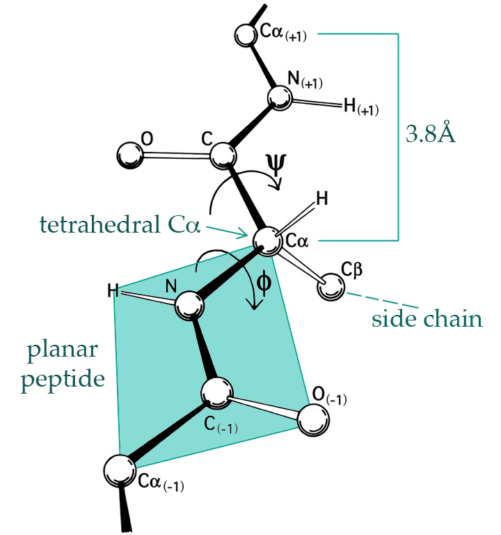
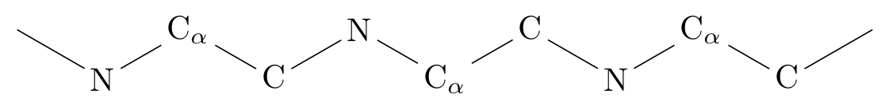

# Introduction {#intro}

```{r extra, include=FALSE}
source("CSwR_extra.R")
library(ggplot2)
library("magrittr")
knitr::opts_chunk$set(cache = TRUE, dev.args = list(bg = 'transparent'), 
                      fig.align = "center", fig.pos="h", cache.lazy = TRUE,
                      out.width = "70%")
theme_replace(plot.background = element_rect(fill = NA, color = NA))
```

```{r error_hook, cache=FALSE, echo=FALSE}
library(knitr)
hook_error = knit_hooks$get('error')
knit_hooks$set(error = function(x, options) {
  x <- strwrap(x)
  hook_error(x, options)
})
```

Computational statistics is about turning theory and methods into algorithms and 
actual numerical computations with data. It is about solving real computational
problems that arise when we visualize, analyze and model data. 

Computational statistics is not a single coherent topic but rather a large 
number of vaguely related computational techniques that we use in statistics. 
This short book is in no way attempting to be comprehensive. 
Instead, a few selected statistical topics are 
treated in some detail with the intention that good computational practice
can be learned from these topics and transferred to other parts of statistics
as needed. Though the topics are arguably fundamental, they reflect the 
knowledge and interests of the author, and different topics could clearly have 
been chosen.

The demarcation line between statistical methodology and computational statistics 
is also blurred. Most methodology involves mathematical formulas and even 
algorithms for computing estimates and other statistics of interest from data,
or for evaluating probabilities or integrals numerically or via simulations. 
The viewpoint taken in this book is that the transition from methodology to 
computational statistics happens when the methodology is to be implemented, 
that is, when formulas, algorithms and pseudo code are transformed into actual 
code and statistical software. It is during this transition that a number of 
practical challenges reveal themselves, such as actual run time and 
memory usage, the limitations of finite precision arithmetic, and the practical 
value of suboptimal or approximate but sufficiently accurate solutions.

Statistical software development also requires some basic software engineering 
skills and knowledge of the most common programming paradigms. Implementing a 
single algorithm for a specific problem is one thing, but developing a piece of
statistical software for others to use is something quite different. This book 
is *not* an introduction to statistical software development as such, but the 
process of developing good software plays a prominent role. Thus solutions 
are not presented as code that magically manifests itself, but code is 
developed and analyzed in cycles that resemble how real software 
development takes place. 

There is a notable practical and experimental component to software 
development. However important theoretical considerations are regarding 
correctness and complexity of algorithms, say, the actual code has to strike 
a balance between generality, readability, efficiency, accuracy, ease of usage 
and ease 
of development among other things. Finding a good balance requires that 
one is able to reason about benefits and deficiencies of different 
implementations. It is a major point of this book that such reasoning should
rely on experiments and empirical facts and not speculations. 

R and RStudio is used throughout, and the reader is expected to have some 
basic knowledge of R programming. While RStudio is not a requirement for 
most of the book, it is a recommendable IDE (integrated development environment)
for R, which offers a convenient framework for developing, benchmarking, 
profiling, testing, documenting and experimenting with statistical software.
The excellent book [Advanced R](http://adv-r.had.co.nz) by Hadley Wickham
is recommended as a 
companion book covering R programming in detail. In fact, direct references 
to that book are given whenever further explanations on e.g. functional 
programming or object oriented programming in R are required. 

This book is organized into three parts on *smoothing*, *Monte Carlo methods*
and *optimization*. Each part is introduced in the following
three sections to give the reader an overview of the topics covered, how they 
are related to each other and how they are related to some main trends and 
challenges in contemporary computational statistics. In this introduction, 
several R functions from various packages are used to illustrate how smoothing,
simulation of random variables and optimization play roles in statistics. 
If you have no intention of moving beyond the role of a data analyst that rely 
on already implemented solutions, you can stop reading after the introduction. 
The remaining part of the book is about
the development of such solutions at a deeper level and not how to use 
high-level interfaces to the plethora of already existing implementations.

## Smoothing {#intro-smooth}

Smoothing is a descriptive statistical tool for summarizing data, a practical 
visualization technique, as well as a nonparametric estimation methodology.
The basic idea is that data is representative of an underlying distribution 
with some smoothness properties, and we would like to approximate or 
estimate this underlying distribution from data. 

There are two related but slightly different approaches. Either we attempt to estimate 
a smooth density of the observed variables, or we attempt to estimate a smooth 
conditional density of one variable given others. The latter can in principle
be done by computing the conditional density from a smooth estimate of the 
joint distribution. Thus it appears that we really just need a way of 
computing smooth density estimates. In practice it may, however, be better 
to solve the conditional smoothing problem directly instead of solving a 
strictly more complicated problem. This is particularly so, if 
the conditioning variables are fixed e.g. by a design, or if our main interest is 
in the conditional mean or median, say, and not the entire conditional distribution. 
Conditional smoothing is dealt with in Chapter \@ref(bivariate).

In this introduction we focus on the univariate case, where there really only 
is one problem: smooth density estimation. Moreover, this is a very 
basic problem, and one viewpoint is that we simply need to "smooth out 
the jumps of the histogram". Indeed, it does not need to be made more 
sophisticated than that! Humans are able to do this quite well using just 
a pen and a printed histogram, but it is a bit more complicated to automatize 
such a smoothing procedure. Moreover, an automatized procedure is likely
to need calibration to yield a good tradeoff between smoothness
and data fit. This is again something that humans can do quite well
by eyeballing visualizations, but that approach does not scale, 
neither in terms of the number of density estimates we want to consider, 
nor in terms of going from univariate to multivariate densities. 

If we want to really discuss how a smoothing 
procedure works not just as a heuristic but also as an estimator of an 
underlying density, it is necessary to formalize how to quantify 
the performance of the procedure. This increases the level of 
mathematical sophistication, but it allows us to discuss optimality, and 
it lets us develop fully automatized procedures that do not rely on human 
calibration. While human inspection of visualizations is always a good 
idea, computational statistics is also about offloading humans from all 
computational tasks that can be automatized. This is true for smoothing 
as well, hence the need for automatic and robust smoothing 
procedures that produce well calibrated results with a minimum of human effort. 

### Angle distributions in proteins {#intro-angles}

We will illustrate smoothing using a small data set on angles formed between 
two subsequent peptide planes in 3D protein structures. This data set is selected
because the angle distributions are multimodal and slightly non-standard, and 
these properties are well suited for illustrating fundamental considerations 
regarding smooth density estimation in practice.

(ref:psiphicap) The 3D structure of proteins is largely given by the $\phi$- and $\psi$-angles of the peptide planes. (By [Dcrjsr](https://commons.wikimedia.org/wiki/File%3APhiPsi_drawing_with_plane_and_labels.jpg), [CC BY 3.0](http://creativecommons.org/licenses/by/3.0) via Wikimedia Commons.)

```{r phipsiangles, echo=FALSE, fig.cap="(ref:psiphicap)",  out.width="40%", fig.pos="h" }

```

```{r phipsiLoad, include=FALSE}
phipsi <- read.csv("data/phipsi.csv")
phipsi[, c("phi", "psi")] <- pi * phipsi[, c("phi", "psi")] / 180
```

A protein is a large molecule consisting of a backbone with carbon and nitrogen 
atoms arranged sequentially:
```{r backbone, echo=FALSE, out.width="70%", fig.pos="h"}

```

A hydrogen atom binds to each nitrogen (N) and an oxygen atom binds to each 
carbon without the $\alpha$ subscript (C), see Figure \@ref(fig:phipsiangles), 
and such four atoms form together what is known as a peptide bond between two 
alpha-carbon atoms (C$_{\alpha}$). Each C$_{\alpha}$ atom binds a hydrogen 
atom and an amino acid *side chain*. There are 20 
naturally occurring amino acids in genetically encoded proteins,
each having a three letter code (such as Gly for Glycine, Pro for Proline, etc.).
The protein will typically form a complicated 3D structure determined by the 
amino acids, which in turn determine the $\phi$- and the $\psi$-angles between 
the peptide planes as shown on Figure \@ref(fig:phipsiangles).

We will consider a small data set, `phipsi`, of experimentally determined angles from a 
single protein, the human protein [1HMP](https://www.rcsb.org/structure/1HMP), 
which is composed of two chains (denoted A and B). Figure \@ref(fig:1HMP) shows 
the 3D structure of the protein.

```{r phipsiShow, dependson="phipsiLoad"}
head(phipsi)
```

```{r 1HMP, echo=FALSE, fig.cap="The 3D structure of the atoms constituting the protein 1HMP. The colors indicate the two different chains.", out.width="30%", fig.pos="h"}
knitr::include_graphics("figures/1HMP.png")
```

We can use base R functions such as `hist` and `density` to visualize the 
marginal distributions of the two angles.  

(ref:phipsiDenscap) Histograms equipped with a rug plot and smoothed density estimate (red line) of the distribution of $\phi$-angles (left) and $\psi$-angles (right).

```{r phipsiDens, fig.cap="(ref:phipsiDenscap)", fig.show="hold", out.width="49%", dependson="phipsiLoad", fig.pos="h"}
hist(phipsi$phi, prob = TRUE)
rug(phipsi$phi)
density(phipsi$phi) %>% 
  lines(col = "red", lwd = 2)
hist(phipsi$psi, prob = TRUE)
rug(phipsi$psi)
density(phipsi$psi) %>% 
  lines(col = "red", lwd = 2)
```

The smooth red density curve shown in Figure \@ref(fig:phipsiDens) can be thought 
of as a smooth version of a histogram. It is surprisingly difficult to find 
automatic smoothing procedures that perform uniformly 
well -- it is even quite difficult to automatically select the number and 
positions of the breaks used for histograms. This is one of the important 
points that is taken up in this book: how to implement good default choices 
of various *tuning parameters* that are required by any smoothing procedure. 

### Using ggplot2

It is also possible to use `ggplot2` to achieve similar results. 

(ref:phipsiggplotcap) Histograms and density estimates of $\phi$-angles (left) and $\psi$-angles (right) made with ggplot2.

```{r phipsiggplot, fig.cap="(ref:phipsiggplotcap)", fig.show="hold", out.width="49%", dependson="phipsiLoad", fig.pos="h"}
library(ggplot2)
ggplot(phipsi, aes(x = phi)) + 
  geom_histogram(aes(y = ..density..), bins = 13) + 
  geom_density(col = "red", size = 1) + geom_rug()
ggplot(phipsi, aes(x = psi)) + 
  geom_histogram(aes(y = ..density..), bins = 13) + 
  geom_density(col = "red", size = 1) + geom_rug()
```

Histograms produced by ggplot2 have a non adaptive default number of bins equal 
to 30 (number of breaks equal to 31), which is different from `hist` that uses
[Sturges' formula](https://en.wikipedia.org/wiki/Histogram#Sturges'_formula)
$$\text{number of breaks} = \lceil \log_2(n) + 1 \rceil$$
with $n$ the number of samples in the data set. In addition, this number is 
further modified by
the function `pretty` that generates "nice" breaks, which results in 14 breaks
for the angle data. For easier comparison, the number of bins used by 
`geom_histogram` above is set to 13, though it should be 
noticed that the breaks are not chosen in exactly the 
same way by `geom_histogram` and `hist`. Automatic and data adaptive bin 
selection is difficult, and `geom_histogram` implements a simple and fixed, but 
likely suboptimal, default while notifying the user that this default choice 
can be improved by setting `binwidth`. 

For the density, `geom_density` actually relies on the `density` function and its 
default choices of how and how much to smooth. Thus the figure 
may have a slightly different appearance, but the estimated density obtained by
`geom_density` is identical to the one obtained by `density`. 

### Changing the defaults

Note that the range of the angle data is known to be $(-\pi, \pi]$, which neither
the histogram nor the density smoother take advantage of. The `pretty` function, 
for instance, chooses breaks in $-3$ and $3$, which results in the two extreme 
bars in the histogram to be misleading. Note also that for the $\psi$-angle 
it appears that the defaults result in oversmoothing of the density 
estimate. That is, the density is more 
smoothed out than the data (and the histogram) appears to support. 

To obtain different -- and perhaps better -- results, we can try to change some
of the defaults of the histogram and density functions. The two most important 
defaults to consider are the *bandwidth* and the *kernel*.
Postponing the mathematics to Chapter \@ref(density), the kernel controls how 
neighboring data points are weighted relatively to each other, and the 
bandwidth controls the size of neighborhoods. A bandwidth can be specified 
manually as a specific numerical value, but for a fully automatic procedure, 
it is selected by a bandwidth selection algorithm. The `density` default 
is a rather simplistic algorithm known as Silverman's rule-of-thumb. 

(ref:psiDenscap) Histograms and various density estimates for the $\psi$-angles.
The colors indicate different choices of bandwidth adjustments using the 
otherwise default bandwidth selection (left) and different choices of kernels 
using Sheather-Jones bandwidth selection (right).

```{r psiDens, fig.cap="(ref:psiDenscap)", fig.show="hold", out.width="49%", dependson="phipsiLoad", fig.pos="h"}
hist(phipsi$psi, breaks = seq(-pi, pi, length.out = 15), prob = TRUE)
rug(phipsi$psi)
density(phipsi$psi, adjust = 1, cut = 0) %>% 
  lines(col = "red", lwd = 2)
density(phipsi$psi, adjust = 0.5, cut = 0) %>% 
  lines(col = "blue", lwd = 2)
density(phipsi$psi, adjust = 2, cut = 0) %>% 
  lines(col = "purple", lwd = 2)
hist(phipsi$psi, breaks = seq(-pi, pi, length.out = 15), prob = TRUE)
rug(phipsi$psi)
density(phipsi$psi, bw = "SJ", cut = 0) %>% ## Default kernel is "gaussian"
  lines(col = "red", lwd = 2)
density(phipsi$psi, kernel = "epanechnikov", bw = "SJ", cut = 0) %>% 
  lines(col = "blue", lwd = 2)
density(phipsi$psi, kernel = "rectangular", bw = "SJ", cut = 0) %>% 
  lines(col = "purple", lwd = 2)
```


Figure 
\@ref(fig:psiDens) shows examples of several different density estimates 
that can be obtained by changing the defaults of `density`. The breaks for 
the histogram have also been chosen manually to make sure that they match 
the range of the data. Note, in particular, that Sheather-Jones bandwidth 
selection appears to work better than the default for this example. This is generally the 
case for multimodal distributions, where the default tends to oversmooth. 
Note also that the choice of bandwidth is far more consequential than
the choice of kernel, the latter mostly affecting how wiggly the density 
estimate is locally. 

It should be noted that defaults arise as 
a combination of historically sensible choices and backward compatibility. Thought
should go into choosing a good, robust default, but once a default is chosen, 
it should not be changed haphazardly, as this might break existing code. That is 
why not all defaults used in R are by today's standards the best known 
choices. You see this argument made in the documentation of `density` regarding the 
default for bandwidth selection, where Sheather-Jones is suggested as a 
better default than the current, but for compatibility reasons Silverman's 
rule-of-thumb is the default and is likely to remain being so. 

### Multivariate methods {#multivariate-smoothing}

This section provides a single illustration of how to use the 
bivariate kernel smoother `kde2d` from the MASS package
for bivariate density estimation of the $(\phi, \psi)$-angle distribution. 
A scatter plot of $\phi$ and $\psi$ angles is known as a [Ramachandran plot](https://en.wikipedia.org/wiki/Ramachandran_plot), and it provides
a classical and important way of visualizing local structural 
constraints of proteins in structural biochemistry. The density estimate
can be understood as an estimate of the distribution of $(\phi, \psi)$-angles
in naturally occuring proteins from the small sample of angles in our 
data set. 

```{r multDensPackages, message=FALSE}
library(MASS) ## kde2d
```

We compute the density estimate in a grid of size 100 by 100 using a bandwidth 
of 2 and using the `kde2d` function that uses a bivariate normal kernel. 

```{r denshat, dependson="phipsiload"}
denshat <- kde2d(phipsi$phi, phipsi$psi, h = 2, n = 100)
```

```{r manip, dependson="denshat"}
denshat <- data.frame(
  cbind(denshat$x, 
        rep(denshat$y, each = length(denshat$x)), 
        as.vector(denshat$z))
)
```

```{r bidens, dependson=c("manip", "phipsiload")}
colnames(denshat) <- c("phi", "psi", "dens")
p <- ggplot(denshat, aes(phi, psi)) +
  geom_tile(aes(fill = dens), alpha = 0.5) +
  geom_contour(aes(z = sqrt(dens))) + 
  geom_point(data = phipsi, aes(fill = NULL)) +
  scale_fill_gradient(low = "white", high = "darkblue", trans = "sqrt")
```

We then recompute the density estimate in the same grid of size using 
the smaller bandwidth of 0.5.

```{r denshat2, dependson="phipsiload"}
denshat <- kde2d(phipsi$phi, phipsi$psi, h = 0.5, n = 100)
```

```{r bidens2, echo = FALSE, fig.cap="Bivariate density estimates of protein backbone angles using a bivariate Gaussian kernel with bandwiths $2$ (left) and $0.5$ (right).", dependson=c("denshat2", "phipsiload"), dev='png', dpi=144, out.width="49%", fig.show='hold'}
p 
<<manip>>
<<bidens>>  
p
```

The Ramachandran plot in Figure \@ref(fig:bidens2) shows how structural constraints
of a protein, such as steric effects, induces a non-standard bivariate distribution
of $(\phi, \psi)$-angles. 

### Large scale smoothing

With small data sets of less than 10,000 data points, say, univariate 
smooth density estimation requires a very modest amount of computation. That is true 
even with rather naive implementations of the standard methods. The R function
`density` is implemented using a number of computational tricks like 
binning and the fast Fourier transform, and it can compute density 
estimates with a million data points (around 8 MB) within a fraction of a second. 

It is
unclear if we ever need truly large scale *univariate* density 
estimation with terabytes of data points, say. If we have that amount of 
(heterogeneous) data it is likely that we are better off breaking the data down
into smaller and more homogeneous groups. That is, we should turn a big data computation
into a large number of small data computations. That does not remove the 
computational challenge but it does diminish it somewhat e.g. by parallelization. 

Deng and Wickham did a review in 2011 on [Density estimation in R](http://www2.cs.uh.edu/~ceick/7362/T2-4.pdf),
where they assessed the performance of a number of R packages including the 
`density` function. The [KernSmooth](https://cran.r-project.org/web/packages/KernSmooth/index.html)
package was singled out in terms of speed as well as accuracy
for computing *smooth* density estimates with `density` performing quite well too. (Histograms 
are non-smooth density estimates and generally faster to compute).
The assessment was based on using defaults for the different packages, which is meaningful 
in the sense of representing the 
performance that the occasional user will experience. It is, however,
also an evaluation of the combination of default choices and the implementation, 
and as different packages rely on e.g. different bandwidth selection algorithms,
this assessment is not the complete story. The `bkde` function from the KernSmooth 
package, as well as  `density`, are solid choices, but 
the point is that performance assessment is a multifaceted problem.

To be a little more specific about the computational complexity of density 
estimators, suppose that we have $n$ data points and want to evaluate the 
density in $m$ points. A naive implementation of kernel smoothing,
Section \@ref(kernel-density), has $O(mn)$ time complexity, while 
a naive implementation of the best bandwidth selection algorithms have
$O(n^2)$ time complexity. As a simple rule-of-thumb, anything beyond $O(n)$
will not scale to very large data sets. A quadratic time complexity for bandwidth 
selection will, in particular, be a serious bottleneck. Kernel smoothing 
illustrates perfectly that a literal implementation of the mathematics behind 
a statistical method may not always be computationally viable. Even 
the $O(mn)$ time complexity may be quite a bottleneck as it reflects 
$mn$ kernel evaluations, each being potentially a computationally 
relatively expensive operation.

The binning trick, with the number of bins set to $m$, is a grouping of the data 
points into $m$ sets of neighbor points (bins) with each bin 
representing the points in the bin via a single point and a weight. If $m \ll n$, 
this can reduce the time complexity substantially to $O(m^2) + O(n)$. The fast 
Fourier transform may reduce the $O(m^2)$ term even further to $O(m\log(m))$. 
Some approximations are involved, and it is of importance
to carefully evaluate the tradeoff between time and memory complexity on one
side and accuracy on the other side. 

Multivariate smoothing is a different story. While it is possible to 
generalize the basic ideas of univariate density esimation to arbitrary dimensions, the 
[curse-of-dimensionality](https://en.wikipedia.org/wiki/Curse_of_dimensionality)
hits unconstrained smoothing hard -- statistically as well as 
computationally. Multivariate smoothing is therefore still an active research 
area developing computationally tractable and novel ways of fitting smooth 
densities or conditional densities to multivariate
or even high-dimensional data. A key technique is to make structural 
assumptions to alleviate the challenge of a large dimension, but there are many
different assumptions possible, which makes the body of methods and theory 
richer and the practical choices much more difficult. 

## Monte Carlo Methods

### Univariate von Mises distributions {#vM}

The angles considered in Section \@ref(intro-smooth) take values in the interval
$(-\pi, \pi]$. The [von Mises distribution](https://en.wikipedia.org/wiki/Von_Mises_distribution#Moments) 
on this interval is given by the density 

$$f(x) = \frac{1}{\varphi(\theta)} e^{\theta_1 \cos(x) + \theta_2 \sin(x)}$$

for $\theta = (\theta_1, \theta_2)^T \in \mathbb{R}^2$. A common 
alternative parametrization is obtained by introducing
$\kappa = \|\theta\|_2 = \sqrt{\theta_1^2 + \theta_2^2}$, and 
(whenever $\kappa \neq 0$)
$\nu = \theta / \kappa = (\cos(\mu), \sin(\mu))^T$ for $\mu \in (-\pi, \pi]$. 
Using the $(\kappa, \mu)$-parametrization the density becomes  
$$f(x) = \frac{1}{\varphi(\kappa \nu)} e^{\kappa \cos(x - \mu)}.$$
The former parametrization in terms of
$\theta$ is, however, the canonical 
parametrization of the family of distributions as an exponential family, which 
is particularly useful for various likelihood estimation algorithms. 
The normalization constant 

\begin{align*}
\varphi(\kappa \nu) & = \int_{-\pi}^\pi e^{\kappa \cos(x - \mu)}\mathrm{d} x \\
& = 2 \pi \int_{0}^{1} e^{\kappa \cos(\pi x)}\mathrm{d} x = 2 \pi I_0(\kappa) 
\end{align*}

is given in terms of the [modified Bessel function](http://mathworld.wolfram.com/ModifiedBesselFunctionoftheFirstKind.html) 
$I_0$. We can easily compute and plot the density using R's `besselI` implementation of 
the modified Bessel function. 

(ref:vMdenscap) Density for the von Mises distribution with parameters 
$\kappa = 1$ and $\nu = 0$ (black), $\kappa = 2$ and $\nu = 1$ (red),
and $\kappa = 0.5$ and $\nu = - 1.5$ (blue).

```{r vonMisesDens, fig.cap="(ref:vMdenscap)"}
phi <- function(k) 2 * pi * besselI(k, 0)
curve(exp(cos(x)) / phi(1), -pi, pi, 
      lwd = 2, ylab = "density", ylim = c(0, 0.52))
curve(exp(2 * cos(x - 1)) / phi(2), -pi, pi,
      col = "red", lwd = 2, add = TRUE)
curve(exp(0.5 * cos(x + 1.5)) / phi(0.5), -pi, pi, 
      col = "blue", lwd = 2, add = TRUE)
```

It is not entirely obvious how we should go about simulating data points
from the von Mises distribution. It will be demonstrated in Section 
\@ref(reject-samp) how to implement a *rejection sampler*, which is one 
useful algorithm for simulating samples from a distribution with a density. 

In this section we simply use the `rmovMF` function from the `movMF` package,
which implements a few functions for working with (finite mixtures of) von 
Mises distributions, and even the general von [Mises-Fisher distributions](https://en.wikipedia.org/wiki/Von_Mises–Fisher_distribution)
that are generalizations of the von Mises distribution to $p$-dimensional 
unit spheres.

```{r simvM}
library("movMF")
xy <- rmovMF(500, 0.5 * c(cos(-1.5), sin(-1.5)))
## rmovMF represents samples as elements on the unit circle
x <- acos(xy[, 1]) * sign(xy[, 2])
```

(ref:vMdatacap) Histogram of `r length(x)` simulated data points from a von Mises distribution with 
parameters $\kappa = 0.5$ and $\nu = - 1.5$. A smoothed density estimate (red) 
and the true density (blue) are added to the plot.

```{r vMdata, fig.cap="(ref:vMdatacap)", dependson=c("vonMisesDens", "simvM"), fig.pos="h"}
hist(x, breaks = seq(-pi, pi, length.out = 15), prob = TRUE)
rug(x)
density(x, bw = "SJ", cut = 0) %>% lines(col = "red", lwd = 2)
curve(exp(0.5 * cos(x + 1.5)) / phi(0.5), -pi, pi, 
      col = "blue", lwd = 2, add = TRUE)
```

### Mixtures of von Mises distributions

The von Mises distributions are unimodal distributions on $(-\pi, \pi]$. Thus to 
find a good model of the bimodal angle data, say, we have do move beyond these 
distributions. A standard approach for constructing multimodal distributions 
is as *mixtures* of unimodal distributions. A mixture of two von Mises distributions
can be constructed by flipping a (biased) coin to decide which of the two 
distributions to sample from. We will use the exponential family parametrization
in the following.

```{r simmixvM}
thetaA <- c(3.5, -2)
thetaB <- c(-4.5, 4)
alpha <- 0.55 ## Probability of von Mises distribution A
## The sample function implements the "coin flips"
u <- sample(c(1, 0), 500, replace = TRUE, prob = c(alpha, 1 - alpha))
xy <- rmovMF(500, thetaA) * u + rmovMF(500, thetaB) * (1 - u)
x <- acos(xy[, 1]) * sign(xy[, 2])
```

The `rmovMF` actually implements simulation from a mixture distribution 
directly, thus there is no need to construct the "coin flips" explicitly.

```{r simmixvMalt}
theta <- rbind(thetaA, thetaB)
xy <- rmovMF(length(x), theta, c(alpha, 1 - alpha))
x_alt <- acos(xy[, 1]) * sign(xy[, 2])
```

To compare the simulated data with two mixture components to the model and 
a smoothed density, we implement an R function that computes the density 
for an angle argument using the function `dmovMF` that takes a unit circle 
argument.

```{r vMdens}
dvM <- function(x, theta, alpha) {
  xx <- cbind(cos(x), sin(x))
  dmovMF(xx, theta, c(alpha, 1 - alpha)) / (2 * pi)
}
```

Note that `dmovMF` uses normalized [spherical measure](https://en.wikipedia.org/wiki/Spherical_measure) 
on the unit circle as reference
measure, thus the need for the $2\pi$ division if we want the result to be 
comparable to histograms and density estimates that use Lebesgue measure on
$(-\pi, \pi]$ as the reference measure. 

(ref:mixvMdatacap) Histograms of `r length(x)` simulated data points from a mixture 
of two von Mises distributions using either the explicit construction of the mixture 
(left) or the functionality in `rmovMF` to simulate mixtures directly (right). 
A smoothed density estimate (red) and the true density (blue) are added to the plot.

```{r mixvMdata, fig.cap="(ref:mixvMdatacap)",  fig.show="hold", out.width="49%", dependson=c("simmixvM", "simmixvMalt", "vMdens"), fig.pos="h"}
hist(x, breaks = seq(-pi, pi, length.out = 15), 
     prob = TRUE, ylim = c(0, 0.5))
rug(x)
density(x, bw = "SJ", cut = 0) %>% lines(col = "red", lwd = 2)
curve(dvM(x, theta, alpha), -pi, pi, col = "blue", lwd = 2, add = TRUE)
hist(x_alt, breaks = seq(-pi, pi, length.out = 15), 
     prob = TRUE, ylim = c(0, 0.5))
rug(x_alt)
density(x_alt, bw = "SJ", cut = 0) %>% lines(col = "red", lwd = 2)
curve(dvM(x, theta, alpha), -pi, pi, col = "blue", lwd = 2, add = TRUE)
```

Simulation of data from a distribution finds many applications. The technique 
is widely used whenever we want to investigate a statistical methodology in 
terms of its frequentistic performance under various data sampling models, and
simulation is a tool of fundamental importance for 
the practical application of Bayesian statistical methods. Another important 
application is as a tool for computing approximations of integrals. This 
is usually called Monte Carlo integration and is a form of numerical 
integration. Computing probabilities or distribution functions, say,
are notable examples of integrals, and we consider here the computation of 
the probability of the interval $(0, 1)$ for the above mixture of two von Mises 
distributions. 

It is straightforward to compute this probability via Monte Carlo integration 
as a simple average. Note that we will use a large number of samples, 
50,000 in this case, of simulated angles for this computation. Increasing 
the number even further will make the result more accurate. Chapter \@ref(mci) 
deals with the assessment of the accuracy of Monte Carlo integrals, and how 
this random error can be estimated, bounded and minimized. 

```{r vMMCint, dependson=c("simmixvM", "simmixvMalt")}
xy <- rmovMF(50000, theta, c(alpha, 1 - alpha))
x <- acos(xy[, 1]) * sign(xy[, 2])
mean(x > 0 & x < 1)  ## Estimate of the probability of the interval (0, 1)
```

The probability above could, of course, be expressed using the 
distribution function of the mixture of von Mises distributions, which 
in turn can be computed in terms of integrals of von Mises densities.
Specifically, the probability is 
$$p = \frac{\alpha}{\varphi(\theta_A)} \int_0^1 e^{\theta_{A, 1} \cos(x) + \theta_{A, 2} \sin(x)} \mathrm{d} x +  
\frac{1 - \alpha}{\varphi(\theta_B)} \int_0^1 e^{\theta_{B, 1} \cos(x) + \theta_{B, 2} \sin(x)} \mathrm{d} x,$$
but these integrals do not have a simple analytic representation -- just as the 
distribution function of the von Mises distribution doesn't have a simple analytic 
expression. Thus the computation of the probability requires numerical 
computation of the integrals. 

The R function `integrate` can be used for numerical integration of univariate 
functions using standard numerical integration techniques. We can thus 
compute the probability by integrating the density of the mixture, 
as implemented above as the R function `dvM`. Note the arguments passed 
to `integrate` below. The first argument is the density function, then follows
the lower and the upper limits of the integration, and then follows additional 
arguments to the density -- in this case parameter values.

```{r vMint}
integrate(dvM, 0, 1, theta = theta, alpha = alpha)
```

The `integrate` function in R is an interface to a couple of classical 
[QUADPACK](https://en.wikipedia.org/wiki/QUADPACK) Fortran routines for 
numerical integration via [adaptive quadrature](https://en.wikipedia.org/wiki/Adaptive_quadrature).
Specifically, the computations rely on approximations of the form 
$$\int_a^b f(x) \mathrm{d} x \simeq \sum_i w_i f(x_i)$$
for certain *grid points* $x_i$ and weights $w_i$, which are computed using 
[Gauss-Kronrod quadrature](https://en.wikipedia.org/wiki/Gauss–Kronrod_quadrature_formula). 
This method provides an estimate of the approximation error in addition to 
the numerical approximation of the integral itself. 

It is noteworthy that `integrate` as a function implemented in R 
takes another function, in this case the density `dvM`, as an argument. R
is a [functional programming language](http://adv-r.had.co.nz/Functional-programming.html)
and functions are [first-class citizens](https://en.wikipedia.org/wiki/First-class_function).
This implies, for instance, that functions can be passed as arguments to other 
functions using a variable name -- just like any other variable can be passed 
as an argument to a function. In the parlance of functional programming, 
`integrate` is a [functional](http://adv-r.had.co.nz/Functionals.html#functionals-math):
a higher-order function that takes a function as argument and returns a 
numerical value. It is a main theme of this book how to 
make good use of functional (and object oriented) programming features in R
to write clear, expressive and modular code without sacrificing computational 
efficiency.

Returning to the specific problem of the computation of an integral, we may ask 
what the purpose of Monte Carlo integration is? Apparently we can 
just do numerical integration using e.g. `integrate`. There are at least two 
reasons why Monte Carlo integration is sometimes preferable. First, it is straightforward
to implement and often works quite well for multivariate and even high-dimensional 
integrals, whereas grid-based numerical integration schemes scale poorly with 
the dimension. Second, it does not require that we have an analytic representation 
of the density. It is common in statistical applications that we are interested
in the distribution of a statistic, which is a complicated transformation of 
data, and whose density is difficult or impossible to find analytically. Yet if 
we can just simulate data, we can simulate from the distribution of the statistic, 
and we can then use Monte Carlo integration to compute whatever 
probability or integral w.r.t. the distribution of the statistic that we are 
interested in. 

## Optimization

This section illustrates how a mixture of von Mises distributions to the 
angel data using the EM-algorithm as implemented in the R package movMF.

### The EM-algorithm

The `movMF` function implements the EM-algorithm for mixtures of von Mises 
distributions. Note again that the `movMF` 
package works with data as elements on the unit circle instead of as angles, 
whence the angle data must be transformed using cos and sin. 

```{r vMfit, collapse=TRUE, dependson=c("phipsiLoad")}
psi_circle <- cbind(cos(phipsi$psi), sin(phipsi$psi))
vM_fit <- movMF(psi_circle, 2, 
                control = list(verbose = TRUE, maxiter = 10, start = "S"))
```

We can compare the fitted model to the data using the density function
as implemented above and the parameters estimated by the EM-algorithm.

```{r vMfitHist, dependson=c("phipsiLoad", "vMfit")}
hist(phipsi$psi, breaks = seq(-pi, pi, length.out = 15), prob = TRUE)
rug(phipsi$psi)
density(phipsi$psi, bw = "SJ", cut = 0) %>% 
  lines(col = "red", lwd = 2)
curve(dvM(x, vM_fit$theta, vM_fit$alpha[1]), -pi, pi, 
      add = TRUE, col = "blue", lwd = 2)
```

## Exercises

### R training exercises {-}

```{exercise, numerics}
Explain the result of evaluating the following R expression. 
```

```{r ex-numerics}
(0.1 + 0.1 + 0.1) > 0.3

```


```{exercise, filter-function}
Write a function that takes a numeric vector `x` and a threshold value `h` 
as arguments and returns the vector of all values in `x` greater than `h`.
Test the function on `seq(0, 1, 0.1)` with threshold 0.3. Have the example 
from Exercise \@ref(exr:numerics) in mind.

```
  
  
```{exercise, special-values}
Investigate how your function from Exercise \@ref(exr:filter-function) 
treats missing values (`NA`), infinite values
(`Inf` and `-Inf`) and the special value "Not a Number" (`NaN`). Rewrite your
function (if necessary) to exclude all or some of such values from `x`.

*Hint: The functions `is.na`, `is.nan` and `is.finite` are useful.* 

```


### Histograms with non-equidistant breaks {-}

The following three exercises will use a data set consisting of measurements from objects 
outside of our galaxy including infered emissions. We will focus on the variable 
F12, which is the total 12 micron band flux density.


```{r infrared-read}
infrared <- read.table("data/infrared.txt", header = TRUE)
F12 <- infrared$F12
```


The purpose of this exercise is two-fold. First, you will get familiar with the 
data and see how different choices of visualizations using histograms can affect 
your interpretation of the data. Second, you will learn more about how to write 
functions in R and gain a better understanding of how they work.


```{exercise, plotHist}
Plot a histogram of `log(F12)` using the default value of the argument `breaks`. Experiment with alternative values of `breaks`. 

```


```{exercise, myBreaks}
Write your own function, called `myBreaks`, which takes two arguments, `x` (a vector) and `h` (a positive integer). Let `h` have default value `5`. The function should first sort
`x` into increasing order and then return the vector that: starts with the smallest entry in `x`;
contains every $h$th unique entry from the sorted `x`; ends with the largest entry in `x`.  

For example, if `h = 2` and `x = c(1, 3, 2, 5, 10, 11, 1, 1, 3)` the function should return `c(1, 3, 10, 11)`. To see this, first sort `x`, which gives the vector `c(1, 1, 1, 2, 3, 3, 5, 10, 11)`, whose unique 
values are `c(1, 2, 3, 5, 10, 11)`. Every second unique entry is `c(1, 3, 10)`, and then the largest entry `11` is concatenated.

*Hint: The functions `sort` and `unique` can be useful.* 
  
Use your function to construct *breakpoints* for the histogram for different values of `h`, and compare with the histograms obtained in Exercise \@ref(exr:plotHist).  

```


```{exercise, myBreaks-advanced}
If there are no ties in the data set, the function above will produce breakpoints 
with `h` observations in the interval between two consecutive breakpoints 
(except the last two perhaps). If there are ties, the function will by construction 
return unique breakpoints, but there may be 
more than `h` observations in some intervals. 

*The intention is now to rewrite `myBreaks` so that if possible each interval 
contains `h` observations.*

Modify the `myBreaks` function with this intention and so that is has the 
following properties:

* All breakpoints must be unique.
* The range of the breakpoints must cover the range of `x`.
* For two subsequent breakpoints, $a$ and $b$, there must be at least `h` observations in the interval $(a,b]$, provided `h < length(x)`. (With the exception that for the first two breakpoints, the interval is $[a,b]$.)

```

### Functions and functional programming {-}

The following four exercises build on having implemented a function that 
computes breakpoints for a histogram either as in 
Exercise \@ref(exr:myBreaks) or as in Exercise \@ref(exr:myBreaks-advanced).
The purpose of the exercises is to explore various features of the R language
related to functions and using R as a functional programming language. 

```{exercise, myHist}
Write a function called `myHist`, which takes a single argument `h` and plots a 
histogram of `log(F12)` using your function. Extend 
the implementation so that any additional argument specified when calling `myHist` 
is passed on to `hist`. Investigate and explain what happens when executing 
the following function calls.
```

```{r, eval = FALSE}
myHist()
myHist(h = 5, freq = TRUE)
myHist(h = 0)
```

Finally, what happens if you remove that data from the global environment and 
call `myHist` subsequently? 

```{exercise, myHist-env}
What is the environment of `myHist`? Change it to a new environment, and assign 
(using the function `assign`) the data to a 
variable with an appropriate name in that environment. Once this is done, 
check what now happens when calling `myHist` after
the data is removed from the global environment. 

```

```{exercise, myHist-funfact}
Write a function that takes an argument `x` (the data) and 
returns a function, where the returned function 
takes an argument `h` (just as `myHist`) and plots a histogram (just as `myHist`). 
Because the return value is a function, we may refer to the function 
as a [function factory](https://adv-r.hadley.nz/function-factories.html). 

What is the environment of the function created by the function factory? What 
is in the environment? 
Does it have any effect when calling the function whether the data is altered 
or removed from the global environment? 

```

```{exercise, }
Evaluate the following function call:

```

```{r, eval = FALSE}
tmp <- myHist(10, plot = FALSE)
```

What is the type and class of `tmp`? What happens when `plot(tmp, col = "red")` 
is executed? How can you find help on what `plot` does with an 
object of this class? Specifically, how do you find the documentation for the 
argument `col`, which is not an argument of `plot`?
