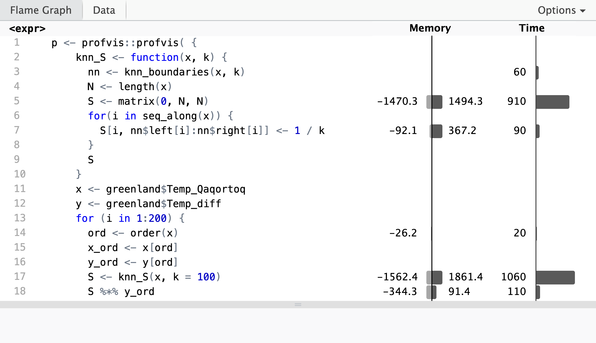

# Scatterplot smoothing {#bivariate}

This chapter is on the estimation of a smooth relation between a real valued 
variable $Y$ an another variable $X$. We will mostly consider $X$ to be
real valued as well, in which case a first impression of their
relation is obtained from data $(x_1, y_1), \ldots, (x_N, y_N)$ by a
*scatterplot*\index{scatterplot} of $y_i$ against $x_i$. Our aim is essentially
to smooth the relation that the scatterplot shows, hence the term "scatterplot
smoothing".

We will throughout this chapter use a temperature dataset from Greenland.
The raw data is available from the site 
[SW Greenland temperature data](https://crudata.uea.ac.uk/cru/data/greenland/),
but data is also included in the CSwR package. See, in addition,
@Vinther:2006. 

```{r greenland-data, message=FALSE}
head(greenland)
```

The `greenland` dataset contains monthly average temperatures in degrees
Celsius from 1873 to 2013 in Nuuk and Qaqortoq, a town south of Nuuk in Greenland. The last column 
contains the temperature difference (temperature in Nuuk minus temperature in 
Qaqortoq). We plot the temperature difference ($Y$) against the temperature in 
Qaqortoq ($X$). 

(ref:NuukQaqortoq) Monthly temperature difference between Nuuk and Qaqortoq plottet against the temperature in Qaqortoq. The dashed horizontal line is the average temperature difference.

```{r Nuuk-Qaqortoq, dependson="greenland-data", message=FALSE, warning=FALSE, fig.cap='(ref:NuukQaqortoq)'}
p_greenland <- ggplot(greenland, aes(Temp_Qaqortoq, Temp_diff)) + 
  geom_point(shape = 16, alpha = 0.3) + 
  xlab("Temperature Qaqortoq") +
  ylab("Temperature difference") +
  geom_line(aes(y = mean(Temp_diff)), linetype = 2, linewidth = 1)
p_greenland
```


The scatterplot in Figure \@ref(fig:Nuuk-Qaqortoq) shows that the temperature 
in Nuuk is about $2{\ }^{\circ}\mathrm{C}$ lower than in Qaqortoq on average,
but that there are local variations. When it is warm, the temperature difference 
is smaller, but when it is about $0{\ }^{\circ}\mathrm{C}$ in Qaqortoq, the 
difference is larger. A scatterplot smoother should capture such 
local variations. 

Throughout this chapter we focus on estimation of (aspects of) the
conditional distribution of $Y$ given $X$. Thus the variables
are treated asymmetrically. We will mostly consider estimation of the function

\[
f(x) = \E(Y \mid X = x),
\]

which is the conditional mean of $Y$ given $X = x$. For the temperature data, 
$f(x)$ is the mean temperature difference given that the temperature in 
Qaqortoq is $x {\ }^{\circ}\mathrm{C}$. The function $f$ can be used to predict 
the temperature in Nuuk as $x + f(x)$ in terms of the temperature $x$ in Qaqortoq. 
The dashed horizontal line in Figure \@ref(fig:Nuuk-Qaqortoq) is the 
simplest scatterplot smoother that assumes $f$ is constant. 

Another simple example of a scatterplot smoother is a straight line, which we
can fit using least squares. This is a useful smoother if $f(x)$
is approximately an affine function. Letting 

\[
\mathbf{X} = \left( \begin{array}{cc} 1 & x_1 \\ 1 & x_2 \\ \vdots & \vdots \\
1 & x_N \end{array} \right)
\]

denote the model matrix, the least squares straight line fit is given by 
$\hat{f}(x) = \hat{\beta}_0 + \hat{\beta}_1 x$ with 

\[
\left( \begin{array}{c} \hat{\beta}_0 \\ \hat{\beta}_1 \end{array} \right) =
(\mathbf{X}^T \mathbf{X})^{-1} \mathbf{X}^T \mathbf{y} 
= \left( \begin{array}{cc} N & \sum_{i=1}^N x_i \\ \sum_{i=1}^N x_i  & \sum_{i=1}^N x_i^2 \end{array} \right)^{-1} \left( \begin{array}{c} \sum_{i=1}^N y_i \\ \sum_{i=1}^N x_iy_i  \end{array} \right).
\]

The fitted values are denoted $\hat{f}_i = \hat{f}(x_i) = \hat{\beta}_0 + \hat{\beta}_1 x_i$, 
and we see that the vector of fitted values is given as 

\[
\hat{\mathbf{f}} = \mathbf{X}^T \left( \begin{array}{c} \hat{\beta}_0 \\ \hat{\beta}_1 \end{array} \right) 
=  \mathbf{X}^T (\mathbf{X}^T \mathbf{X})^{-1} \mathbf{X}^T \mathbf{y}.
\]

We often consider a scatterplot smoother as a mapping determined by the $x_i$-s
that map the observed values, $\mathbf{y}$, to the fitted (or predicted) values, 
$\hat{\mathbf{f}}$. Least squares defines such a mapping as given above. 
It is a linear mapping. Any smoother that, for fixed $x_i$-s, results in a 
linear mapping

\begin{equation} 
\mathbf{y} \mapsto \hat{\mathbf{f}} = \mathbf{S} \mathbf{y}
(\#eq:linear-smoother)
\end{equation}

of observed values to fitted values is called *a linear smoother*.\index{linear smoother}
The matrix $\mathbf{S}$, representing the linear map, is called the *smoother matrix*.
\index{smoother matrix} The least squares straight line smoother has smoother 
matrix $\mathbf{S} = \mathbf{X}^T (\mathbf{X}^T \mathbf{X})^{-1} \mathbf{X}^T$.

Some scatterplot smoothers are very easy to add to the ggplot2 objects via the 
`geom_smooth()` function, and two examples are demonstrated below. 

(ref:NuukQSmooth) Monthly temperature difference between Nuuk and Qaqortoq plottet against the temperature in Qaqortoq. The horizontal dashed line is the average temperature difference, and the straight line smoother (purple) and a spline smoother (blue) are added.

```{r Nuuk-QaqortoqSmooth, dependson="Nuuk-Qaqortoq", message=FALSE, warning=FALSE, fig.cap='(ref:NuukQSmooth)'}
p_greenland +
  geom_smooth(
    method = "lm", 
    formula = y ~ x,                 # The straight line smoother
    se = FALSE,
    color = "purple"
  ) +
   geom_smooth(
    method = "gam",                  
    formula = y ~ s(x, bs = "cr"),   # A spline smoother
    se = FALSE
  )
```

Figure \@ref(fig:Nuuk-Qaqortoq) shows the scatterplot of the temperature data 
with the straight line smoother and a spline smoother added. The spline smoother 
captures the nonlinear local variations from the horizontal line well.

## Nadaraya–Watson kernel smoothing

The straight line smoother obtained by least squares, as in Figure 
\@ref(fig:Nuuk-QaqortoqSmooth), is a *global* smoother. Two parameters are 
estimated to optimize a global measure of how well the line fits the data.
It does not capture the local variations in the data well. The spline 
smoother included in Figure \@ref(fig:Nuuk-QaqortoqSmooth) can also be 
considered a global smoother but using a flexible model based on a basis expansion. We 
return to those smoothers in Section \@ref(splines). In this section we 
consider *local* smoothers.  

A local smoother focuses on fitting models in neighborhoods of the 
$x_i$-s. Supposing that $B_i$ is a neighborhood of $x_i$ 
for each $i = 1, \ldots, N$, a simple smoother is given by

\[
  \hat{f}_i = \frac{\sum_{j=1}^N y_j 1_{B_i}(x_j)}{\sum_{j=1}^N 1_{B_i}(x_j)}.
\]

That is, $\hat{f}_i$ is simply the average of the $y_j$-s for which the 
corresponding $x_j$-s fall in the neighborhood $B_i$ of $x_i$. This local 
smoother regards $f$ as approximately constant in the neighborhoods of 
the $x_i$-s. Note that $\hat{f}_i$ can be defined for $x_i$-values in a 
quite general space; they do not need to be real numbers, we just need a way to define what 
we mean by "neighborhood". 

In a metric space the natural 
choice of $B_i$ is the ball, $B(x_i, h)$, around $x_i$ with some radius $h$. 
In $\mathbb{R}$ with the usual metric (or even $\mathbb{R}^p$ equipped with any 
norm-induced metric) we have that  

\[
  1_{B(x_i, h)}(x) = 1_{B(0, 1)}\left(\frac{x - x_i}{h}\right),
\]

thus since $B(0, 1) = [-1, 1]$ in $\mathbb{R}$,

\[
  \hat{f}_i = \frac{\sum_{j=1}^N y_j 1_{[-1, 1]}\left(\frac{x_j - x_i}{h}\right)}{\sum_{l=1}^N 1_{[-1, 1]}\left(\frac{x_l - x_i}{h}\right)}.
\]

This nonparametric estimator of the conditional mean $f(x_i)$ 
is closely related to the kernel density estimator with the 
rectangular kernel, see Section \@ref(kernel-density), and just as for that 
estimator there is a natural generalization allowing for arbitrary kernels 
instead of the indicator function $1_{[-1, 1]}$. 

With $K : \mathbb{R} \mapsto \mathbb{R}$ a fixed kernel the corresponding
kernel smoother with bandwidth $h$ becomes 

\[
  \hat{f}_i = \frac{\sum_{j=1}^N y_j K\left(\frac{x_j - x_i}{h}\right)}{\sum_{l=1}^N K\left(\frac{x_l - x_i}{h}\right)}.
\]
  
This smoother is known as the Nadaraya–Watson kernel smoother or Nadaraya–Watson 
estimator. \index{Nadaraya–Watson kernel smoother} See Exercise \@ref(exr:NW) for an additional 
perspective based on bivariate kernel density estimation. 

The Nadaraya–Watson kernel smoother is a linear smoother with smoother 
matrix $\mathbf{S}$ with entries  

\[
  S_{ij} = \frac{K\left(\frac{x_j - x_i}{h}\right)}{\sum_{l=1}^N K\left(\frac{x_l - x_i}{h}\right)}.
\]


The Nadaraya–Watson kernel smoother can be implemented in much the same way 
as the kernel density estimator, and the runtime will inevitably scale 
like $O(N^2)$ unless we exploit special properties of the kernel or use 
approximation techniques. We implement the kernel smoother with the 
Gaussian kernel as a linear estimator and using the function `outer()`
to compute $\mathbf{S}$. 

```{r NW-kernel}
kern_smooth <- function(x, y, h) {
  K <- outer(x, x, function(x1, x2) exp(-(x1 - x2)^2 / (2 * h^2)))
  S <- K / rowSums(K)
  S %*% y
}
```

We can then apply kernel smoothing to the temperature data.

```{r , dependson=c("NW-kernel", "greenland-data")}
f_hat <- kern_smooth(
  greenland$Temp_Qaqortoq, 
  greenland$Temp_diff,
  h = 0.5
)
```


```{r , fig.cap = "Nadaraya–Watson kernel smoother of temperature difference between Nuuk and Qaqortoq computed using the smoother matrix and the Gaussian kernel with bandwidth 0.5."}
p_greenland + 
  geom_line(aes(y = f_hat), color = "blue", lwd = 1)
```


Basic kernel smoothing is also implemented in the 
`ksmooth()` function from the stats package. To test our implementation we 
compare the result on the temperature data to the result from 
`ksmooth()`. This is slightly tricky beause `ksmooth()` internally rescales the 
bandwidth to make the kernel have quartiles in $\pm 0.25 h$ (see `?ksmooth`).
For the Gaussian kernel the rescaling amounts to multiplying $h$ by the factor 
$0.3706506$.

```{r ksmooth-test, dependson=c("NW-kernel", "") }
f_hat_ksmooth <- ksmooth(
  greenland$Temp_Qaqortoq, 
  greenland$Temp_diff, 
  kernel = "normal",
  bandwidth = 0.5 /  0.3706506,  # ksmooth() rescales!
  x.points = greenland$Temp_Qaqortoq
)
ord <- order(greenland$Temp_Qaqortoq)
range(f_hat[ord] - f_hat_ksmooth$y)
```

The comparison shows that the differences are small but still of the order 
$10^{-5}$, which is larger than 
can be explained by rounding errors alone. In fact, `ksmooth()` truncates the 
tails of the Gaussian kernel to 0 beyond $4h$. This is where the kernel becomes 
less than $0.000335 \times K(0) = 0.000134$, which for practical purposes
is zero. The truncation explains the relatively 
large differences between the two implementations that should otherwise be equivalent. It is an 
example where the approximate solution computed by `ksmooth()` is acceptable 
because the truncation results in substantial reduction of runtime. 

## Leave-one-out cross-validation

Cross-validation was introduced in Section \@ref(cv) as a method for assessing 
the performance of a model. In the context of scatterplot smoothing, we can 
assess performance by measuring how well the model predicts *out-of-sample*.
That is, how well $y_i$ is predicted from $x_i$ 
for data points $(x_i, y_i)$ not in the dataset used for computing the smoother. 
In this section we focus on leave-one-out cross-validation where the prediction 
for each data point is based on a smoother using all other data but that point. 

In many cases a smoother has a natural definition of an out-of-sample
prediction, that is, how $\hat{f}(x)$ is computed for $x$ not 
in the data. If so, it is possible to define 

\[
  \hat{f}^{-i}_i = \hat{f}^{-i}(x_i)
\]

as the prediction at $x_i$ using the smoother computed from data 
with $(x_i, y_i)$ excluded. Formulas or methods for out-of-sample prediction do, 
however, generally depend on the specific smoother used. For a *linear* 
smoother with smoother matrix $\mathbf{S}$ we will *define* the 
leave-one-out prediction as

\[
  \hat{f}^{-i}_i = \sum_{j \neq i} \frac{S_{ij}y_j}{1 - S_{ii}}.
\]

This definition concurs with the out-of-sample predictor in $x_i$ for most linear 
smoothers, but this has to be verified case-by-case.

Using the definition above, the *leave-one-out cross-validation*
\index{leave-one out cross-validation} squared error criterion 
equals

\[
  \mathrm{LOOCV} = \frac{1}{N} \sum_{i=1}^N (y_i - \hat{f}^{-i}_i)^2 = 
\frac{1}{N} \sum_{i=1}^N \left(\frac{y_i - \hat{f}_i}{1 - S_{ii}}\right)^2.
\]

The important observation from the identity above is that $\mathrm{LOOCV}$
can be computed without actually computing all the $\hat{f}^{-i}_i$. 

We will illustrate the use of leave-one-out cross-validation for bandwidth 
selection for the kernel smoother. Note that the diagonal elements of the 
smoother matrix are given as 

\[
  S_{ii} = \frac{K(0)}{\sum_{l=1}^N K\left(\frac{x_l - x_i}{h}\right)}.
\]

The implementation below consists of two functions. One general function computes
$\mathrm{LOOCV}$ from the three ingredients: $\mathbf{y}$, $\hat{\mathbf{f}}$
and the vector of diagonal elements of $\mathbf{S}$. The `loocv_kern_smooth()` 
function, specific to kernel smoothing with the Gaussian kernel, applies the general 
function to a grid of bandwidth parameters. 

```{r LOOCV-kernel}
loocv_error <- function(y, f_hat, diag_S) {
  mean(((y - f_hat) / (1 - diag_S))^2) 
}

loocv_kern_smooth <- function(x, y, h) {
  logK <- outer(x, x, function(x1, x2) - (x1 - x2)^2 / 2)
  error <- function(h) {
     K <- exp(logK / h^2)
     S <- K / rowSums(K)
     loocv_error(y, S %*% y, diag(S))
  }
  sapply(h, error)
}
```

The implementation above can easily be made to work with any kernel and any 
sequence of $x$-s. Exercise \@ref(exr:Sdiag) explores how to exploit symmetry 
of the kernel and equidistance of the $x$-s for efficient computation of the 
smoother matrix as well as the diagonal elements of the smoother matrix. 

```{r Nuuk-kernel-loocv, fig.cap="The leave-one-out cross-validation criterion for the kernel smoother using the Gaussian kernel as a function of the bandwidth $h$.", dependson=c("LOOCV-kernel", "NuukData")}
hs <- seq(0.2, 3, 0.05)
CV <- loocv_kern_smooth(greenland$Temp_Qaqortoq, greenland$Temp_diff, hs)
h_opt <- hs[which.min(CV)]
f_hat_opt <- kern_smooth(greenland$Temp_Qaqortoq, greenland$Temp_diff, h_opt)
ggplot(mapping = aes(hs, CV)) + geom_point() +
  geom_vline(xintercept = h_opt, color = "red")
```

The optimal bandwith is `r h_opt`. We compute the resulting optimal smoother
and compare it to the smoother computed using `kern_smooth()`. 

```{r greenland-NN-opt, dependson=c("NuukData", "run-mean", "Nuuk-opt-kernel"), fig.cap = "Nadaraya–Watson kernel smoother of the annual average temperature in Nuuk for the optimal bandwidth using LOOCV (blue) compared to the $k$-nearest neighbor smoother with $k = 9$ (red).", warning=FALSE}
p_greenland + 
  geom_line(aes(y = f_hat_opt), color = "blue", linewidth = 1)
```

Figure \@ref(fig:greenland-NN-opt) shows the optimal kernel smoother. We note 
that the optimal bandwidth `r h_opt` results in a somewhat smoother curve than
the bandwidth `0.5` that we initially considered. 

## Gaussian processes

Though kernel smoothing is a quite intuitive local smoother, it is also *ad
hoc*. A more principled approach to smoothing is based on Gaussian processes,
which posits a model of the target function $f$ that we try to estimate. We
introduce in this section Gaussian processes as a framework that naturally leads
to linear smoothing, and we touch on some computational aspects. We also briefly
discuss how Gaussian processes leads to new ways of choosing kernels and tuning
parameters as well, but we leave the implementations as exercises. In Section
\@ref(kalman) we return to some computationally efficient Gaussian process
smoothers and their implementations in the context of time series.

The Gaussian process model supposes that the observed $x_i$-s are 
fixed, and it consists of a model of the vector $\mathbf{f} = (f(x_1), \ldots, f(x_N))$
and a conditional model of $Y_1, \ldots, Y_N$ given $\mathbf{f}$.
For simplicity, we suppose also in this section that $x_i \in \mathbb{R}$, 
but Gaussian processes could be defined on quite general spaces. 

The distribution of $\mathbf{f}$ is defined in terms of a 
[positive definite kernel function](https://en.wikipedia.org/wiki/Positive-definite_function_on_a_group)
$K : \mathbb{R} \to \mathbb{R}$. This is a function 
satisfying that the symmetric matrix $\mathbf{K}$ defined by 

\[
  \mathbf{K}_{i,j} = K(x_i - x_j)
\]

is positive semi-definite for any $x_1, \ldots, x_N$. 
For such a kernel we suppose that $\mathbf{f} \sim \mathcal{N}(m(\mathbf{x}), \mathbf{K})$
for some $m(\mathbf{x}) \in \mathbb{R}^N$. Note that this model specifies the 
covariance between the coordinates of $\mathbf{f}$ as 

\[
 \cov(f(x_i), f(x_j)) = K(x_i - x_j).
\]

The conditional distribution of $\mathbf{Y}$ given $\mathbf{f}$ is
also Gaussian,  

\[
\mathbf{Y} \mid \mathbf{f} \sim \mathcal{N}(\mathbf{f}, \sigma^2 I)
\]

with $\sigma^2 > 0$ the observation variance.

It follows that the joint distribution of $\mathbf{f}$ and $\mathbf{Y}$ is 
a multivariate Gaussian distribution,

\[
  (\mathbf{f}, \mathbf{Y}) \sim \mathcal{N}\left(\left(\begin{array}{c} m(\mathbf{x}) \\ m(\mathbf{x}) \end{array}\right),
\left(\begin{array}{cc} \mathbf{K} & \mathbf{K} \\ \mathbf{K} & \mathbf{K} + \sigma^2 I \end{array} \right) \right).
\]

Hence

\[
  \hat{\mathbf{f}} = E(\mathbf{f} \mid \mathbf{Y} = \mathbf{y}) = m(\mathbf{x}) + \mathbf{K} (\mathbf{K} + \sigma^2 I)^{-1} (\mathbf{y} - m(\mathbf{x})).
\]

If $m(\mathbf{x}) = 0$ the conditional mean is a linear smoother with smoother matrix

\begin{equation}
  \mathbf{S} = \mathbf{K} (\mathbf{K} + \sigma^2 I)^{-1} = (I + \sigma^2 \mathbf{K}^{-1} )^{-1}.
  (\#eq:Gauss-smoother)
\end{equation}

Since $m(\mathbf{x})$ is the mean of $\mathbf{Y}$, we can also estimate a non-zero $m(\mathbf{x})$.
Suppose $m(\mathbf{x}) \in L \subseteq \mathbb{R}^N$, where $L$ is a linear subspace of $\mathbb{R}^N$,
then if $P$ denotes the orthogonal projection onto $L$, $\hat{m}(\mathbf{x}) = P \mathbf{y}$ 
is the least squares estimate of $m(\mathbf{x})$. Plugging this estimate into the formula 
for the conditional mean gives the linear smoother 

\[
  \hat{\mathbf{f}} = \hat{m}(\mathbf{x}) + \mathbf{K} (\mathbf{K} + \sigma^2 I)^{-1} (\mathbf{y} - \hat{m}(\mathbf{x})) 
  = \underbrace{(\mathbf{K} (\mathbf{K} + \sigma^2 I)^{-1}(I - P) + P)}_{\mathbf{S}} \mathbf{y}.
\]

This is a linear smoother satisfying that $\mathbf{S} m(\mathbf{x}) = m(\mathbf{x})$. The 
simplest example is when $m(\mathbf{x})$ is assumed to have identical entries, 
in which case $\hat{m}(\mathbf{x}) = \overline{y} \mathbf{1}$, where 
$\overline{y} = \frac{1}{N} \sum_{i=1}^N y_i$. 

For the rest of this section we assume that $m(\mathbf{x}) = 0$, which in practice can 
be achieved by substracting an estimate of $m(\mathbf{x})$, as described above, and 
applying the Gaussian process smoother to the residuals. 

The [Neumann series](https://en.wikipedia.org/wiki/Neumann_series) then 
gives the approximation 

\begin{equation} 
\mathbf{S} = \mathbf{K} (\mathbf{K} + \sigma^2 I)^{-1} = 
(\sigma^2)^{-1} \mathbf{K}  + o((\sigma^2)^{-1}) \approx (\sigma^2)^{-1} \mathbf{K}
(\#eq:Neumann-approx)
\end{equation}

valid for large $\sigma^2$. In this case, the Gaussian process smoother is 
similar to Nadaraya–Watson kernel smoothing with kernel $K$, except for the 
row normalization. The main practical effect of the difference in row normalization 
is that the Gaussian process smoother shrinks the smoothed values toward zero. 
The larger $\sigma^2$ is, the more are the values shrunk. A related shrinkage 
effect is discussed in Section \@ref(smoothsplines) in the context of smoothing 
splines.

To compute the Gaussian process smoother we need to know
the observation variance $\sigma^2$ and the covariance matrix 
$\mathbf{K}$, which is determined entirely from the kernel function $K$ and 
the $x_i$-s. From this information we could compute the smoother matrix $\mathbf{S}$. 
However, to compute $\hat{\mathbf{f}}$ from the observation $\mathbf{y}$, 
then rather than computing $\mathbf{S}$, we can compute the smoother by the following 
two-step procedure 

* Solve the equation $(\mathbf{K} + \sigma^2 I) \tilde{\mathbf{y}} = \mathbf{y}$
* Compute $\hat{\mathbf{f}} = \mathbf{K} \tilde{\mathbf{y}}$.

The approximation \@ref(eq:Neumann-approx) shows that for large $\sigma^2$,
$\tilde{\mathbf{y}} \approx (\sigma^2)^{-1} \mathbf{y}$, and if we use this 
approximation, Gaussian process smoothing is computationally equivalent to 
Nadaraya-Watson kernel smoothing. But even including the pre-smoothing
step of first computing $\tilde{\mathbf{y}}$, the solution of the linear 
equation does
not change the runtime complexity, since we avoid the computationally expensive 
matrix inversion. 

Standard algorithms for solving the linear equation and for the matrix-vector 
multiplication have time complexity $O(N^2)$. Without additional structure 
on $\mathbf{K}$, Gaussian process smoothing scales with the sample size 
in the same way as Nadaraya-Watson kernel smoothing, 
and large scale applications would require approximations. 
In Section \@ref(kalman) we describe the Kalman smoother, where the 
kernel has special structure, and where the smoother can we computed 
with time complexity $O(N)$.

The Gaussian process approach specifies a fully generative model of 
$Y_1, \ldots, Y_N$. This can be exploited for choosing the kernel, 
including any parameters in the kernel, and the variance parameter $\sigma^2$.
Still supposing that $m(\mathbf{x}) = 0$, the marginal distribution of $\mathbf{Y}$ is
$\mathcal{N}(0, \mathbf{K} + \sigma^2 I)$, thus the marginal log-likelihood function is 

\[
\ell(\mathbf{K}, \sigma^2) =  - \frac{1}{2} \mathbf{y}^T (\mathbf{K} + \sigma^2 I)^{-1} \mathbf{y}
- \frac{1}{2}\log |\mathbf{K} + \sigma^2 I|
\]

where $|\mathbf{K} + \sigma^2 I|$ denotes the determinant of the matrix. Since 
$\mathbf{K}$ is determined by the kernel, we can maximize $\ell$ over kernel 
parameters and $\sigma^2$ to optimize how well the model fits the data. 
We will not pursue the details here, see Chapter 2 in [@Rasmussen:2006].
We note that maximizing $\ell$ is an alternative to choosing tuning parameters
to optimize predictive performance, e.g., via cross-validation. Exercise 
\@ref(exr:Gauss) explores the use of the marginal log-likelihood for 
choosing tuning parameters. 

## Nearest neighbor smoothers {#knn}

Kernel smoothers, whether derived from Gaussian processes or from *ad hoc*
arguments, use the kernel function $K$ to define locality in the $x$-space. The
way $K(x)$ decays toward $0$ as $x$ becomes large---possibly controlled by a
bandwidth parameter---determines how data points count toward the local weighted
averages. A disadvantage of this approach is that the estimator has high
variance in those parts of the $X$-space that contain no or few data points. For
real valued $X$, this is mostly a problem in the tails of the $X$-distribution.

To remedy the problem with a heterogeneous distribution of $X$-values, we can
define neighborhoods in a data adaptive way, e.g., in terms of the $k$-nearest neighbors.
This definition fixes the number of neighbors, $k$, instead of the size of the
neighborhood. The resulting smoother is still a linear smoother, somewhat
similar to the Nadaraya-Watson kernel smoother with the rectangular kernel, but
it is a bit more involved to determine the neighborhood of all the
data points---in particular if we want a runtime efficient implementation.

Mathematically, the $k$-nearest neighbor smoother in $x_i$ is defined as

\begin{equation}
  \hat{f}_i = \frac{1}{k} \sum_{j \in \mathcal{N}_i} y_j
  (\#eq:knn)
\end{equation}

where $\mathcal{N}_i$ is the set of indices for the $k$-nearest neighbors of 
$x_i$. For simplicity, we will also refer to the index set $\mathcal{N}_i$ as 
the neighborhood of $x_i$. This simple idea of averaging the $k$-nearest neighbors 
is actually very powerful. It works as long as the $X$-values lie in
a metric space, and by letting $k$ grow with $N$ it is possible to construct
consistent nonparametric estimators of $f(x) = E(Y \mid X= x)$ 
under minimal assumptions. With $X$-values in $\mathbb{R}^p$, say, Theorem 2
in [@Devroye:1994] gives a strong universal consistency result of $k$-nearest
neighbor smoothing assuming only that $\E|Y| < \infty$ and that $k/N \to 0$ and
$k/\log(N) \to \infty$. However, a practical problem is that $k$ must grow
slowly in high dimensions, and the estimator is not a panacea.

The main computational challenge is to find the neighborhood $\mathcal{N}_i$ for 
each $i$. A general solution is to compute all distances from 
$x_i$ to $x_j$ for $j = 1, \ldots, N$ and then (partially) sort these to find the 
$k$ smallest distances. This works for values in a general metric space---with 
a runtime that scales like $O(N^2)$. See Exercise \@ref(exr:knn-exer) for an 
implementation of the smoother matrix using this general approach. 

For values in $\mathbb{R}$, the total order of the real numbers implies that the 
neighborhoods are always of the form 

\[
  \mathcal{N}_i = \{\mathrm{left}_i, \mathrm{left}_i + 1, \ldots,  
  \mathrm{right}_i - 1,  \mathrm{right}_i\}
\]

where $\mathrm{left}_i \leq i \leq \mathrm{right}_i$ and 
$\mathrm{right}_i - \mathrm{left}_i + 1 = k$. We can, moreover, find these 
neighborhood boundaries, $\mathrm{left}_i$ and $\mathrm{right}_i$, 
by sorting the $x$-values and then starting from $\mathrm{left}_1 = 1$ 
and $\mathrm{right}_1 = \min\{k, N\}$ we can sequentially update the boundaries. 
This is implemented by the function `knn_boundaries()` below.

```{r knn-boundaries}
knn_boundaries <- function(x, k) {
  if (is.unsorted(x)) x <- sort(x)
  N <- length(x)
  left <- right <- numeric(N)
  l <- left[1] <- 1
  r <- right[1] <- min(k, N)
  for(i in seq_along(x)[-1]) {
    while (r + 1 <= N && x[i] - x[l] >= x[r + 1] - x[i]) {
      r <- r + 1
      l <- l + 1
    }
    left[i] <- l
    right[i] <- r
  }
  list(left = left, right = right)
}
```

The function first sorts the $x$-values if they are unsorted. Each step in the
sequential update is done using a while-loop. In this loop, the boundaries are
moved one position to the right as long as the current left boundary is further
from $x_i$ than the updated right boundary.

There is a subtle issue with ties.\index{ties!nearest neighbors} When multiple
$x$-values are identical, the neighborhoods $\mathcal{N}_i$, and thus their
boundaries, are not uniquely defined. There are several possibilities for
breaking ties, e.g., by randomization. This could be achieved by adding tiny
amounts of i.i.d. random noise to the $x_i$-s. In the implementation of
`knn_boundaries()` we implicitly let the `sort()` function determine how ties
are handled. Consequently, the order of the data points in the dataset can also
matter.

How ties are handled is mostly irrelevant for practical purposes---unless 
$X$ only takes values in a discrete subset of $\mathbb{R}$. But it
is a nuisance that results depend on such arbitrary details. This is
particularly so when we test our implementations, since we then need to make
sure that different implementations handle ties in exactly the same way.
For this reason, all implementations presented are based on `knn_boundaries()` to 
ensure that ties are handled identically. 

We first implement the computation of the smoother matrix for $k$-nearest neighbor 
smoothing. Note that `knn_boundaries()` sorts the $x_i$-s, hence the smoother 
matrix is computed after a reordering of the observations so that the $x_i$-s are 
sorted.

```{r knn-S, dependson="knn-boundaries"}
knn_S <- function(x, k) {
  nn <- knn_boundaries(x, k)
  N <- length(x)
  S <- matrix(0, N, N)
  for(i in seq_along(x)) {
      S[i, nn$left[i]:nn$right[i]] <- 1 / k
  }
  S
}
```

The function `knn_S()` first calls `knn_boundaries()` to determine the neighborhoods.
It then loops though the rows of $\mathbf{S}$ and fills the relevant segment of 
entries with $1/k$. Figure \@ref(fig:S-fig) visualizes the smoother matrix. We 
see that it is roughly, but not exactly, a band-diagonal matrix. This structure 
appears because the $x_i$-s are sorted. 

```{r S-fig, echo=FALSE, fig.cap="Full smoother matrix (left) for $k$-nearest neighbor smoothing with $k = 100$ and the 400 x 400 upper left part (right).", fig.show="hold", out.width="49%"}
S <- knn_S(greenland$Temp_Qaqortoq, k = 100)
library(Matrix)
image(Matrix(S))
image(Matrix(S[1:400, 1:400]))
```

We can then compute the smoother for the greenland temperature data and add 
it to the scatterplot. Figure \@ref(fig:knn-smooth) shows the result. We note 
that the smoother overall looks quite similar to the kernel smoother in Figure 
\@ref(fig:greenland-NN-opt), though it is somewhat more irregular. 


```{r knn-smooth, dependson=c("knn-S", "greenland-data", "Nuuk-Qaqortoq"), fig.cap="The $k$-nearest neighbor smoother (blue) with $k = 100$ added to the greenland temperature scatterplot."}
x <- greenland$Temp_Qaqortoq
y <- greenland$Temp_diff
ord <- order(x)
x_ord <- x[ord]
y_ord <- y[ord]
S <- knn_S(x, k = 100)
p_greenland + 
  geom_line(aes(x = x_ord, y = S %*% y_ord), color = "blue", lwd = 1)
```

Before we turn to optimization of the tuning parameter $k$, we will investigate 
our implementation of the kernel smoother in greater detail. We note, in particular,
that the smoother matrix is rather sparse, and computing and storing the full 
smoother matrix might not be the computationally most efficient solution. 

```{r knn-profile, echo=FALSE}
p <- profvis::profvis( {
    knn_S <- function(x, k) {
      nn <- knn_boundaries(x, k)
      N <- length(x)
      S <- matrix(0, N, N)
      for(i in seq_along(x)) {
        S[i, nn$left[i]:nn$right[i]] <- 1 / k
      }
      S
    }
    x <- greenland$Temp_Qaqortoq
    y <- greenland$Temp_diff
    for (i in 1:200) {
      ord <- order(x)
      x_ord <- x[ord]
      y_ord <- y[ord]
      S <- knn_S(x, k = 100)
      S %*% y_ord
    }
  }
)
```

```{r knn-profile-results, echo=FALSE, dependson="knn-profile", out.width="100%"}
setwd("./figures/")
htmlwidgets::saveWidget(p, "knn_profile.html")
setwd("..")
pagedown::chrome_print(
  "figures/knn_profile.html",
  format = "png",
  options = list(
    clip = list(x = 0L, y = 0L, width = 650L, height = 375L, scale = 4)
  ),
  extra_args = c("--window-size=650,750")
)

```

Profiling reveals that it is the construction of the smoother matrix that
takes most of the runtime, while the computation of the matrix-vector product, 
$\mathbf{S} \mathbf{y}$, in line 19 only takes about 10% of the total runtime. 
The profiling data shows that the computation of the neighborhood boundaries 
(line 4) is negligible, and that it is the creation of $N \times N$ zero-matrix 
in line 6 that dominates the runtime. Inspection of the flame graph in the 
[interactive HTML](figures/knn_profile.html) widget shows that the real culprit 
is the garbage collector, which is frequently triggered by the creation of 
the roughly 23 MB smoother matrix. Runtime is thus primarily spend on allocation 
and deallocation of memory. 

If we revisit \@ref(eq:knn), we see that we can rewrite the mean in terms 
of the neighborhood boundaries as 

\begin{equation}
  \hat{f}_i = \frac{1}{k} \sum_{j = \mathrm{left}_i}^{\mathrm{right}_i} y_j.
  (\#eq:knn2)
\end{equation}

This suggests that we can compute $k$-nearest neighbor smoothing without 
computing $\mathbf{S}$ but by sequentially computing means over 
segments of the data vector containing the $y_i$-s. This is implemented 
by the `knn_mean()` function below. 

```{r knn-mean, dependson="knn-boundaries"}
knn_mean <- function(x, y, k) {
  if (is.unsorted(x)) {
    ord <- order(x)
    x <- x[ord]
    y <- y[ord]
  }
  N <- length(x)
  y_sum <- numeric(N)
  nn <- knn_boundaries(x, k)
  for(i in seq_along(x)) {
      y_sum[i] <- sum(y[nn$left[i]:nn$right[i]])
  }
  data.frame(x = x, y = y_sum / k)
}
```

```{r knn-mean-test, dependson=c("knn-mean", "greenland-data")}
knn_greenland <- knn_mean(greenland$Temp_Qaqortoq, greenland$Temp_diff, k = 100)
range(knn_greenland$y - S %*% y_ord)
```

```{r knn, dependson="knn-boundaries"}
knn <- function(x, y, k) {
  if (is.unsorted(x)) {
    ord <- order(x)
    x <- x[ord]
    y <- y[ord]
  }
  N <- length(x)
  y_sum <- numeric(N)
  nn <- knn_boundaries(x, k)
  l <- nn$left[1]
  r <- nn$right[1]
  y_sum[1] <- sum(y[l:r])
  for(i in seq_along(x)[-1]) {
    diff <- 0    
    if (nn$right[i] > r) {
      diff <- sum(y[(r + 1):nn$right[i]] - y[l:(nn$left[i] - 1)])
    }
    y_sum[i] <- y_sum[i - 1] + diff
    l <- nn$left[i]
    r <- nn$right[i]
  }
  data.frame(x = x, y = y_sum / k)
}
```

```{r knn-test, dependson=c("knn", "knn-smooth", "greenland-data")}
knn_greenland <- knn(greenland$Temp_Qaqortoq, greenland$Temp_diff, k = 100)
range(knn_greenland$y - S %*% y_ord)
```

```{r knn-bench, dependson=c("knn", "knn-mean", "knn-S", "greenland-data")}
bench::mark(
  matrix = c(knn_S(x, k = 100) %*% y_ord),
  knn_mean = knn_mean(x, y, k = 100)$y,
  knn = knn(x, y, k = 100)$y
)
```

```{r knnBench, dependson=c("knn", "knn-mean", "knn-S"), echo=FALSE, warning=FALSE, message=FALSE}
knn_bench <- bench::press(
  N = 2^(6:13),  # 64 to 8192
  k = c(50, 500),
  {
    x <- rnorm(N)
    y <- rnorm(N)
    ord <- order(x)
    bench::mark(
      matrix = c(knn_S(x, k = k) %*% y[ord]),
      knn_mean = knn_mean(x, y, k = k)$y,
      knn = knn(x, y, k = k)$y,
      filter_gc = FALSE,
      min_iterations = 40
    )
  }
)
```


```{r knnBench-fig, echo=FALSE, dependson="knnBench", fig.cap="k-nearest neighbor benchmarks", out.width="100%", fig.height=4, fig.width=8}
dplyr::mutate(knn_bench, 
  expression = factor(
    attr(expression, "description"),
    levels = c("matrix", "knn_mean", "knn")
  ),
  k = factor(k, labels = paste("k:", sort(unique(k)))), 
  mean = sapply(time, mean)
) %>% 
  ggplot(aes(x = N, y = median, color = expression)) + 
  geom_line() + 
  geom_point() +
  geom_abline(intercept = -6,  slope = 1,  color = "gray", linetype = 2) + 
  geom_abline(intercept = -8.5,  slope = 2,  color = "gray", linetype = 5) + 
  scale_x_log10(breaks = 2^(seq(7, 13, 2))) + 
  bench::scale_y_bench_time(name = "Time", breaks = c(0.1, 1, 10, 100) * 10^{-3}) +
  scale_color_discrete("Function:") +
  facet_wrap("k") +
  theme(legend.position = "top")
```


```{r knn-loocv, dependson=c("knn", "LOOCV-kernel")}
loocv_knn <- function(x, y, k) {
  ord <- order(x)
  x <- x[ord]
  y <- y[ord]
  error <- function(k) {
     diag_S <- rep(1/k, length(x))
     f_hat <-  knn(x, y, k)
     loocv_error(f_hat$x, f_hat$y, diag_S)
  }
  sapply(k, error)
}
```

```{r knn-loocv-opt, dependson=c("knn-loocv", "greenland-data")}
ks <- seq(50, 1000, 5)
CV <- loocv_knn(greenland$Temp_Qaqortoq, greenland$Temp_diff, ks)
k_opt <- ks[which.min(CV)]
ggplot(mapping = aes(ks, CV)) + geom_point() +
  geom_vline(xintercept = k_opt, color = "red")
```

```{r knn-optimal-smooth, dependson=c("knn", "knn-loocv-opt", "Nuuk-Qaqortoq")}
knn_greenland_opt <- knn(
  greenland$Temp_Qaqortoq, 
  greenland$Temp_diff, 
  k = k_opt
)
p_greenland + 
  geom_line(data = knn_greenland_opt, aes(x, y), color = "blue", lwd = 1)
```


## Polynomial and spline expansions {#splines}

We return in this section to global models like the linear smoother 
in Section \@ref(bivariate). To make the models flexible, and thus better 
capable of adapting to local variation in the data, we define the models 
in terms of basis expansions. That is, we suppose that the function $f$ 
can be written as 

\[
  f = \sum_{i=1}^p \beta_i \varphi_i
\]

for basis functions $\varphi_1, \ldots, \varphi_p : \mathbb{R} \to \mathbb{R}$
and parameters $\beta_1, \ldots, \beta_p \in \mathbb{R}$. 

With $x_1, \ldots, x_N \in \mathbb{R}$ we define the $N \times p$ model matrix 
$\boldsymbol{\Phi}$ with entries 

\[
\Phi_{ij} = \varphi_j(x_i)
\]

Letting $f_i = f(x_i) = (\boldsymbol{\Phi} \beta)_i$ we can write the squared 
error loss function in terms of $\mathbf{f}$ as 

\[
L(\mathbf{f}) = \sum_{j=1}^N (y_j - f_i)^2 = (\mathbf{y} - \mathbf{f})^T (\mathbf{y} - \mathbf{f})^T 
= (\mathbf{y} - \boldsymbol{\Phi} \beta)^T (\mathbf{y} - \boldsymbol{\Phi} \beta).
\]

The least squares optimizer in terms of $\beta$ is given as 
$\hat{\beta} =  (\boldsymbol{\Phi}^T \boldsymbol{\Phi})^{-1} \boldsymbol{\Phi}^T \mathbf{y}$,
and in terms of $\mathbf{f}$ we have 

\[
\hat{\mathbf{f}} = \boldsymbol{\Phi} \hat{\beta} = \boldsymbol{\Phi} (\boldsymbol{\Phi}^T \boldsymbol{\Phi})^{-1} \boldsymbol{\Phi}^T \mathbf{y}.
\]

The smoother matrix $\mathbf{S} = \boldsymbol{\Phi} (\boldsymbol{\Phi}^T \boldsymbol{\Phi})^{-1} \boldsymbol{\Phi}^T$ is the orthogonal projection onto the subspace of $\mathbb{R}^N$ 
spanned by the columns of $\boldsymbol{\Phi}$. 


In [the previous section](#onb) orthogonality of basis functions played an 
important role for computing basis function expansions efficiently as well
as for the statistical assessment of estimated coefficients. This section 
will deal with bivariate smoothing via basis functions that are not 
necessarily orthogonal. 


### Polynomial expansions {#poly}

Degree 19 polynomial fitted to the temperature data.

EDIT

We also plot the monthly average temperature, $Y$, in Nuuk against 
the the monthly average temperature, $X$, in Qaqortoq---a town further south 
of Nuuk in greenland.

In the example shown in Figure \@ref(fig:Nuuk-QaqortoqSmooth) both the 
variables are random. We are in this case interested in how the temperature in 
Qaqortoq is predictive of the temperature in Nuuk. 

EDIT

We can extract the model matrix from the lm-object.

```{r greenland_model_matrix, dependson="NuukData"}
N <- nrow(greenland)
intercept <- rep(1/sqrt(N), N)  # To make intercept column have norm one
polylm <- lm(Temp_diff ~ intercept + poly(Temp_Qaqortoq, 15) - 1, data = greenland)
Phi <- model.matrix(polylm)
```


```{r model-matrix-fig, echo=FALSE, dependson=c("NuukData", "Nuuk_model_matrix"), fig.cap="The model matrix columns as functions", out.width="100%"}
XX <- Phi
colnames(XX) <- c("intercept", paste(rep("pol", 15), 1:15, sep = ""))
dplyr::bind_cols(Temperature = greenland$Temp_Qaqortoq, dplyr::as_tibble(XX)) %>% 
  tidyr::pivot_longer(-Temperature, names_to = "term", values_to = "value") %>% 
  dplyr::mutate(term = factor(term, levels = unique(term))) %>% 
  ggplot(aes(Temperature, value, color = term)) + 
  geom_line() + 
  facet_wrap(~ term) + 
  theme(legend.position="none") +
  coord_cartesian(ylim = c(-0.2, 0.2))
```

The model matrix is (almost) orthogonal, and estimation becomes quite simple. 
With an orthogonal model matrix the normal equation reduces to the estimate

\[
  \hat{\beta} = \Phi^T Y
\]

since $\Phi^T \Phi = I$. The predicted (or fitted) values are $\Phi \Phi^T Y$
with smoother matrix $\mathbf{S} = \Phi \Phi^T$ being a projection. 

```{r orthogonal_estimation, dependson=c("Nuuk_model_matrix", "NuukData")}
(t(Phi) %*% greenland$Temp_diff)[1:10, 1]
coef(polylm)[1:10]
```


With homogeneous variance 

\[  
  \hat{\beta}_i \overset{\text{approx}}{\sim} \mathcal{N}(\beta_i, \sigma^2),
\]

and for $\beta_i = 0$ we have $P(|\hat{\beta}_i| \geq 1.96\sigma) \approx 0.05.$

Thresholding:

```{r Nuuk_poly_threshold, echo=FALSE, dependson="Nuuk_model_matrix"}
sigmahat <- sqrt(sum(polylm$residuals^2) / polylm$df.residual)
ggplot(mapping = aes(x = 1:16, y = abs(coef(polylm)))) + 
  ylab(expression(paste("|", hat(beta), "|"))) + 
  xlab("") + geom_abline(intercept = 1.96 * sigmahat, slope = 0, color = "red", size = 1) +
  geom_point(size = 4) + 
  annotate(
    "text", 
    x = 1.5, 
    y = 1.96 * sigmahat + 2.5, 
    label = "1.96 * hat(sigma)",
    parse = TRUE
  )
```

```{r}
factor <- 1.96
selected_coef <- which(abs(coef(polylm)) > factor * sigmahat)
f_hat <- Phi[, selected_coef] %*% coef(polylm)[selected_coef]
p_greenland + 
  geom_smooth(
    method = "lm",
    formula = y ~ poly(x, 15),       # A polynomial smoother
    se = FALSE,
    color = "red"
  ) +
  geom_line(aes(y = f_hat), color = "blue", lwd = 1)
```

### Smoothing splines {#smoothsplines}

To motivate splines we briefly consider the following penalized least squares
criterion for finding a smooth approximation to bivariate data: minimize

\begin{equation}
L(f) = \sum_{i=1}^N (y_i - f(x_i))^2 + \lambda \|f''\|_2^2
(\#eq:spline-criterion)
\end{equation}

over all twice differentiable functions $f$. The first term is the standard 
squared error, and we can easily find a smooth function interpolating the 
$y$-values (if all the $x$-values are different), which will thus drive 
the squared error to 0. The squared 2-norm regularizes the minimization 
problem so that the minimizer finds a balance between interpolation and 
having a small second derivative (note that $\|f''\|_2 = 0$ if and only if $f$ is an 
affine function). The tuning parameter $\lambda$ controls this balance. 

It is possible to show that the minimizer of \@ref(eq:spline-criterion) is a 
[natural cubic spline](https://en.wikipedia.org/wiki/Spline_(mathematics)) with
*knots* in the data points $x_i$. That is, the spline is a $C^2$-function 
that equals a third degree polynomial in between the knots. At the knots,
the two polynomials that meet fit together up to the second derivative, but they 
may differ on the third derivative. That the solution is *natural* means 
that it has zero second and third derivative at and beyond the two boundary knots.

It is not particularly difficult to show that the space of natural cubic
splines is a vector space of dimension $N$ if all the $x$-values are different. 
It is therefore possible to find a basis of splines, $\varphi_1, \ldots, \varphi_N$, 
such that the $f$ that minimizes \@ref(eq:spline-criterion) is of the form

\[
  f = \sum_{i=1}^N \beta_i \varphi_i.
\]

What is remarkable about this is that the basis (and the finite dimensional
vector space it spans) does not depend upon the $y$-values. Though the 
optimization is over an infinite dimensional space, the penalization ensures
that the minimizer is always in the same finite dimensional space nomatter 
what $y_1, \ldots, y_N$ are. Moreover, since \@ref(eq:spline-criterion) is 
a quite natural criterion to minimize to find a smooth function fitting 
the bivariate data, splines appear as good candidates 
for producing such smooth fits. On top of that, splines have several 
computational advantages and are widely used. 

If we let $\hat{f}_i = \hat{f}(x_i)$ with $\hat{f}$ the minimizer of 
\@ref(eq:spline-criterion), we have in vector notation that 

\[
  \hat{\mathbf{f}} = \boldsymbol{\Phi}\hat{\beta}
\]

with $\boldsymbol{\Phi}_{ij} = \varphi_j(x_i)$. The minimizer 
can be found by observing that 

\begin{align}
 L(\mathbf{f}) & = (\mathbf{y} - \mathbf{f})^T (\mathbf{y} - \mathbf{f}) + \lambda \| f'' \|_2^2 \\
& = ( \mathbf{y} -  \boldsymbol{\Phi}\beta)^T (\mathbf{y} -  \boldsymbol{\Phi}\beta) + \lambda \beta^T \boldsymbol{\Omega} \beta
\end{align}

where 

\[
\boldsymbol{\Omega}_{ij} = \langle \varphi_i'', \varphi_j'' \rangle = 
\int  \varphi_i''(z) \varphi_j''(z) \mathrm{d}z.
\]

The matrix $\boldsymbol{\Omega}$ is positive semidefinite by construction, and 
we refer to it as the *penalty matrix*. It induces a seminorm on $\mathbb{R}^N$
so that we can express the seminorm, $\|f''\|_2$, of $f$ in terms of the 
parameters in the basis expansion using $\varphi_i.$ 


Minimizing $L(\mathbf{f})$ is a standard penalized least squares problem, whose solution 
in terms of the $\beta$-parameter is 

\[
  \hat{\beta} = (\boldsymbol{\Phi}^T \boldsymbol{\Phi} + \lambda \boldsymbol{\Omega})^{-1}\boldsymbol{\Phi}^T  \mathbf{y}
\]

and with resulting smoother

\[
  \hat{\mathbf{f}} = \underbrace{\boldsymbol{\Phi} ((\boldsymbol{\Phi}^T \boldsymbol{\Phi} + \lambda \boldsymbol{\Omega})^{-1}\boldsymbol{\Phi}^T}_{\mathbf{S}_{\lambda}} \mathbf{y}.
\]
  
This linear smoother with smoothing matrix $\mathbf{S}_{\lambda}$ based 
on natural cubic splines gives what is known as a
[smoothing spline](https://en.wikipedia.org/wiki/Smoothing_spline) that 
minimizes \@ref(eq:spline-criterion). 

We will pursue 
spline based smoothing by minimizing \@ref(eq:spline-criterion) but
using various B-spline bases that may have more or less than $N$ elements. 
For the linear algebra, it actually does not matter if we use a spline 
basis or any other basis---as long as
$\boldsymbol{\Phi}_{ij} = \varphi_j(x_i)$ and $\boldsymbol{\Omega}$ is 
given in terms of $\varphi''_i$ as above.

### Splines in R


Though some of the material of this section will apply to any choice of 
basis, we restrict attention to splines and consider almost 
exclusively the widely used B-splines (the "B" is for basis). 

The splines package in R implements some of the basic functions needed to work 
with splines. In particular, the `splineDesign()` function that computes evaluations
of B-splines and their derivatives.

```{r splines-package, cache=FALSE}
library(splines)
```

(ref:splineDesign) B-spline basis as computed by `splineDesign().

```{r splines, fig.cap='(ref:splineDesign)'}
# Note the specification of repeated boundary knots
knots <- c(0, 0, 0, seq(0, 1, 0.2), 1, 1, 1)
xx <- seq(0, 1, 0.005)
B_splines <- splineDesign(knots, xx)
matplot(xx, B_splines, type = "l", lty = 1)
```

The basis shown in Figure \@ref(fig:splines) is an example of a cubic B-spline
basis with the 11 inner knots $0, 0.1, \ldots, 0.9, 1$. The repeated 
boundary knots control how the spline basis behaves close to the boundaries
of the interval. This basis has 13 basis functions, not 11, and spans a 
larger space than the space of *natural* cubic splines. It is 
possible to compute a basis based on B-splines for the natural cubic splines
using the function `ns`, but for all practical purposes this is not 
important, and we will work exclusively with the B-spline basis itself. 

The computation of the penalty matrix $\boldsymbol{\Omega}$ constitutes a 
practical problem, but observing that $\varphi''_i$ is an affine 
function in between knots leads to a simple way of
computing $\boldsymbol{\Omega}_{ij}$. Letting $g_{ij} = \varphi''_i \varphi''_j$ 
it holds that $g_{ij}$ is quadratic between two consecutive knots $a$ and $b$, 
in which case 

\[
  \int_a^b g_{ij}(z) \mathrm{d}z = \frac{b - a}{6}\left(g_{ij}(a) + 4 g_{ij}\left(\frac{a + b}{2}\right) + g_{ij}(b)\right).
\]

This identity is behind [Simpson's rule](https://en.wikipedia.org/wiki/Simpson%27s_rule) 
for numerical integration, and the fact that this is an identity for quadratic 
polynomials, and not an approximation, means that Simpson's rule 
applied appropriately leads to exact computation of 
$\boldsymbol{\Omega}_{ij}$. All we need is the ability to evaluate 
$\varphi''_i$ at certain points, and `splineDesign()` can be used for that. 

```{r Omega-Simpson}
pen_mat <- function(inner_knots) {
  knots <- sort(c(rep(range(inner_knots), 3), inner_knots))
  d <- diff(inner_knots)  # The vector of knot differences; b - a 
  g_ab <- splineDesign(knots, inner_knots, derivs = 2) 
  knots_mid <- inner_knots[-length(inner_knots)] + d / 2
  g_ab_mid <- splineDesign(knots, knots_mid, derivs = 2)
  g_a <- g_ab[-nrow(g_ab), ]
  g_b <- g_ab[-1, ]
  (crossprod(d * g_a,  g_a) + 
      4 * crossprod(d * g_ab_mid, g_ab_mid) + 
      crossprod(d * g_b, g_b)) / 6 
}
```

It is laborious to write good tests of `pen_mat()`. We would have to work out a 
set of example matrices by other means, e.g. by hand. Alternatively, we can 
compare to a simpler numerical integration technique using Riemann sums. 

```{r Omega-test1, dependson="Omega-Simpson"}
spline_deriv <- splineDesign(
  c(0, 0, 0, 0, 0.5, 1, 1, 1, 1), 
  seq(0, 1, 1e-5), 
  derivs = 2
)
Omega_numeric <- crossprod(spline_deriv[-1, ]) * 1e-5  # Right Riemann sums
Omega <- pen_mat(c(0, 0.5, 1))
Omega_numeric / Omega
range((Omega_numeric - Omega) / (Omega + 0.001))  #  Relative error
```

And we should also test an example with non-equidistant knots. 

```{r Omega-test2, dependson="Omega-Simpson"}
spline_deriv <- splineDesign(
  c(0, 0, 0, 0, 0.2, 0.3, 0.5, 0.6, 0.65, 0.7, 1, 1, 1, 1), 
  seq(0, 1, 1e-5), 
  derivs = 2
)
Omega_numeric <- crossprod(spline_deriv[-1, ]) * 1e-5  # Right Riemann sums
Omega <- pen_mat(c(0, 0.2, 0.3, 0.5, 0.6, 0.65, 0.7, 1))
range((Omega_numeric - Omega) / (Omega + 0.001)) # Relative error
```

These examples indicate that `pen_mat()` computes $\boldsymbol{\Omega}$ correctly, 
in particular as increasing the Riemann sum precision by 
lowering the number $10^{-5}$ will decrease the relative error (not shown). 
Of course, correctness ultimately depends on `splineDesign()` computing 
the correct second derivatives, which hasn't been tested here.

We can also test how our implementation of smoothing splines works 
on data. We do this here by implementing the matrix-algebra directly 
for computing $\mathbf{S}_{\lambda} \mathbf{y}$.

```{r Nuuk-smooth-spline}
ord <- order(greenland$Temp_Qaqortoq)
x <- greenland$Temp_Qaqortoq[ord]
y <- greenland$Temp_diff[ord]
inner_knots <- unique(x)
Phi <- splineDesign(c(rep(range(inner_knots), 3), inner_knots), x)
Omega <- pen_mat(inner_knots)
smoother <- function(lambda) 
  Phi %*% solve(
    crossprod(Phi) + lambda * Omega, 
    t(Phi) %*% y
  )
p_greenland + 
  geom_line(aes(x = x, y = smoother(0.1)), color = "red", linewidth = 1) +      # Undersmooth
  geom_line(aes(x = x, y = smoother(100)), color = "blue", linewidth = 1) +     # Smooth
  geom_line(aes(x = x, y = smoother(100000)), color = "purple", linewidth = 1)  # Oversmooth
```

Smoothing splines can be computed using the R function `smooth.spline()` 
from the stats package. It is possible to manually specify the amount of 
smoothing using one of the arguments `lambda`, `spar` or `df` 
(the latter being the trace of the smoother matrix). However,
due to internal differences from the `splineDesign()` basis 
above, the `lambda` argument to `smooth.spline()` does not match the 
$\lambda$ parameter above. 

If the amount of smoothing is not manually set, `smooth.spline()` chooses 
$\lambda$ by *generalized cross validation* (GCV), which minimizes

\[
  \mathrm{GCV} = \sum_{i=1}^N \left(\frac{y_i - \hat{f}_i}{1 - \mathrm{df} / n}\right)^2,
\]

where 

\[
  \mathrm{df} = \mathrm{trace}(\mathbf{S}) = \sum_{i=1}^N S_{ii}.
\]
  
GCV corresponds to LOOCV with the diagonal entries, $S_{ii}$,
replaced by their average $\mathrm{df} / n$. The main reason for 
using GCV over LOOCV is that for some smoothers, such as the 
spline smoother, it is possible to compute the trace $\mathrm{df}$ easily 
without computing $\mathbf{S}$ or even its diagonal elements. 

To compare our results to `smooth.spline()` we optimize the GCV criterion. 
First we implement a function that computes GCV for a fixed value of $\lambda$.
Here the implementation is relying on computing the smoother matrix, but 
this is not the most efficient implementation. Section \@ref(efficient-splines)
provides a diagonalization of the smoother matrix jointly in the tuning 
parameters. This representation allows for efficient computation 
with splines, and it will become clear why it is not necessary to compute 
$\mathbf{S}$ or even its diagonal elements. The trace is nevertheless 
easily computable $\mathbf{S}$. 

```{r gcv-smooth-spline}
gcv <- function(lambda, y) {
  S <- Phi %*% solve(crossprod(Phi) + lambda * Omega, t(Phi))
  df <- sum(diag(S))  # The trace of the smoother matrix
  sum(((y - S %*% y) / (1 - df / length(y)))^2, na.rm = TRUE) 
}
```

Then we apply this function to a grid of $\lambda$-values and 
choose the value of $\lambda$ that minimizes GCV.

```{r Nuuk-spline-gcv, fig.cap="The generalized cross-validation criterion for smoothing splines as a function of the tuning parameter $\\lambda$.", dependson=c("gcv-smooth-spline", "NuukData")}
lambda <- seq(50, 250, 2)
GCV <- sapply(lambda, gcv, y = y)
lambda_opt <- lambda[which.min(GCV)]
ggplot(mapping = aes(lambda, GCV)) + geom_point() +
  geom_vline(xintercept = lambda_opt, color = "red")
```

Finally, we can visualize the resulting smoothing spline. 

```{r Nuuk-spline-opt, fig.cap="The smoothing spline that minimizes GCV over the tuning parameter $\\lambda$", dependson=c("Nuuk-spline-gcv", "NuukData")}
smooth_opt <- Phi %*% solve(
  crossprod(Phi) + lambda_opt * Omega, 
  t(Phi) %*% y
)
p_greenland + 
  geom_line(aes(x = x, y = smooth_opt), color = "blue", lwd = 1)
```

The smoothing spline that we found by minimizing GCV can be compared to 
the smoothing spline that `smooth.spline()` computes by minimizing GCV 
as well.

(ref:smoothspline) The smoothing spline that minimizes GCV as computed by `smooth.spline()`.

```{r Nuuk-spline-opt2, fig.cap='(ref:smoothspline)', dependson="NuukData"}
smooth_splines <- smooth.spline(
  greenland$Temp_Qaqortoq, 
  greenland$Temp_diff, 
  all.knots = TRUE        # Don't use heuristic
)  
range(smooth_splines$y - smooth_opt[!duplicated(x)])
p_greenland + 
  geom_line(data = data.frame(x = smooth_splines$x, y = smooth_splines$y), 
    aes(x, y), color = "blue", lwd = 1)
```

The differences between the smoothing spline computed by our implementation
and by `smooth.spline()` is hardly detectable visually, and they are at most 
of the order $10^{-3}$ as computed above. It is possible to further 
decrease the differences by finding the optimal value of $\lambda$ with a 
higher precision, but we will not pursue this here. 

### Efficient computation with splines {#efficient-splines}

Using the full B-spline basis with knots in every observation is computationally
heavy and from a practical viewpoint unnecessary. Smoothing using B-splines
is therefore often done using a knot-selection heuristic that selects much fewer 
knots than $n$, in particular if $n$ is large. This is also what `smooth.spline()` 
does unless `all.knots = TRUE`. The heuristic for selecting 
the number of knots is a bit complicated, but it is implemented in the function `.nknots.smspl()`, 
which can be inspected for details. Once the number of knots gets above 200 it
grows extremely slowly with $n$. With the number of knots selected,
a common heuristic for selecting their position is to use the quantiles of 
the distribution of the $x$-values. That is, with 9 knots, say, the knots
are positioned in the deciles (0.1-quantile, 0.2-quantile etc.). This is 
effectively also what `smooth.spline()` does, and this heuristic places most of 
the knots where we have most of the data points. 

Having implemented a knot-selection heuristic that results in $p$ B-spline 
basis functions, the matrix $\Phi$ will be $N \times p$, typically with $p < N$
and with $\Phi$ of full rank $p$. In this case we derive a way of computing the 
smoothing spline that is computationally more efficient and numerically more 
stable than relying on the matrix-algebraic solution above. This is particularly 
so when we need to compute the smoother for many different $\lambda$-s to optimize
the smoother. As we will show, we are
effectively computing a simultaneous diagonalization of the (symmetric) smoother
matrix $\mathbf{S}_{\lambda}$ for all values of $\lambda$. 

The matrix $\Phi$ has a singular value decomposition 

\[
  \Phi = \mathbf{U} D \mathbf{V}^T
\]

where $D$ is diagonal with entries $d_1 \geq d_2 \geq \ldots \geq d_p > 0$, 
$\mathbf{U}$ is $n \times p$, $\mathbf{V}$ is $p \times p$ and both are orthogonal matrices. 
This means that 

\[
  \mathbf{U}^T \mathbf{U} = \mathbf{V}^T \mathbf{V} = \mathbf{V} \mathbf{V}^T =  I
\]

is the $p \times p$ dimensional identity matrix. We find that 

\begin{align}
\mathbf{S}_{\lambda} & =  \mathbf{U}D\mathbf{V}^T(\mathbf{V}D^2\mathbf{V}^T + \lambda \boldsymbol{\Omega})^{-1}
\mathbf{V}D\mathbf{U}^T \\
& = \mathbf{U}D (D^2 + \lambda  \mathbf{V}^T \boldsymbol{\Omega} \mathbf{V})^{-1} D \mathbf{U}^T \\
& = \mathbf{U} (I + \lambda D^{-1} \mathbf{V}^T \boldsymbol{\Omega} \mathbf{V} D^{-1})^{-1} \mathbf{U}^T \\
& = \mathbf{U}(I + \lambda  \widetilde{\boldsymbol{\Omega}})^{-1} \mathbf{U}^T,
\end{align}

where 
$\widetilde{\boldsymbol{\Omega}} = D^{-1} \mathbf{V}^T \boldsymbol{\Omega} \mathbf{V} D^{-1}$ is 
a positive semidefinite $p \times p$ matrix. By diagonalization,

\[
  \widetilde{\boldsymbol{\Omega}} = \mathbf{W} \Gamma \mathbf{W}^T,
\]

where $\mathbf{W}$ is orthogonal and $\Gamma$ is a diagonal matrix with nonnegative 
values in the diagonal, and we find that 

\begin{align}
\mathbf{S}_{\lambda} & = \mathbf{U} \mathbf{W} (I + \lambda  \Gamma)^{-1}  \mathbf{W}^T  \mathbf{U}^T \\
& = \widetilde{\mathbf{U}}  (I + \lambda  \Gamma)^{-1} \widetilde{\mathbf{U}}^T
\end{align}

where $\widetilde{\mathbf{U}} = \mathbf{U} \mathbf{W}$ is an orthogonal 
$n \times p$ matrix.

The interpretation of this representation is as follows. 

* First, the coefficients, $\hat{\beta} = \widetilde{\mathbf{U}}^Ty$, are computed for 
expanding $y$ in the basis given by the columns of $\widetilde{\mathbf{U}}$. 
* Second, the $i$-th coefficient is shrunk towards 0,

\[
  \hat{\beta}_i(\lambda) = \frac{\hat{\beta}_i}{1 + \lambda \gamma_i}.
\]

* Third, the smoothed values, $\widetilde{\mathbf{U}} \hat{\beta}(\lambda)$, 
are computed as an expansion using the shrunken coefficients. 

Thus the smoother works by shrinking the coefficients toward zero in the orthonormal basis 
given by the columns of $\widetilde{\mathbf{U}}$. The coefficients corresponding to the 
largest eigenvalues $\gamma_i$ are shrunk relatively more toward zero 
than those corresponding to the small eigenvalues. The basis formed by the 
columns of $\widetilde{\mathbf{U}}$ is known as the Demmler-Reinsch basis 
with reference to [@Demmler:1975].

We implement the computation of the diagonalization for the Nuuk temperature 
data using $p = 20$ basis functions (18 inner knots) equidistantly distributed
over the range of the years for which we have data. 

```{r spline-diagonalization, dependson=c("NuukData", "Omega-Simpson")}
inner_knots <- seq(-15.8, 10.4, length.out = 18)
ord <- order(greenland$Temp_Qaqortoq)
x <- unique(greenland$Temp_Qaqortoq[ord])
Phi <- splineDesign(c(rep(range(inner_knots), 3), inner_knots), x)
Omega <- pen_mat(inner_knots)
Phi_svd <- svd(Phi)
Omega_tilde <- t(crossprod(Phi_svd$v, Omega %*% Phi_svd$v)) / Phi_svd$d
Omega_tilde <- t(Omega_tilde) / Phi_svd$d
# It is safer to use the numerical singular value decomposition ('svd()')
# for diagonalizing a positive semidefinite matrix than to use a 
# more general numerical diagonalization implementation such as 'eigen()'. 
Omega_tilde_svd <- svd(Omega_tilde)  
U_tilde <- Phi_svd$u %*% Omega_tilde_svd$u
```

```{r spline-gamma, dependson="spline-diagonalization", fig.cap="The eigenvalues $\\gamma_i$ that determine how much the different basis coefficients in the orthonormal spline expansion are shrunk toward zero. Left plot shows the eigenvalues, and the right plot shows the eigenvalues on a log-scale.", echo=FALSE, out.width="49%", fig.show='hold', fig.height=3, fig.width=4}
p <- ggplot(mapping = aes(1:20, Omega_tilde_svd$d)) + 
  geom_point() + xlab("i") + ylab("Eigenvalues") 
p
p + scale_y_log10() + ylab("")
```

```{r spline-basis, echo=FALSE, dependson=c("NuukData", "spline-diagonalization"), fig.cap="The columns of $\\widetilde{\\mathbf{U}}$  that consitute an orthonormal basis known as the Demmler-Reinsch basis for computing the spline based smoother.", out.width="100%"}
colnames(U_tilde) <- paste(rep("u", 20), 1:20, sep = "")
dplyr::bind_cols(Temperature = x, dplyr::as_tibble(U_tilde)) %>% 
  tidyr::pivot_longer(-Temperature, names_to = "term", values_to = "value") %>% 
  dplyr::mutate(term = factor(term, levels = unique(term))) %>% 
  ggplot(aes(Temperature, value, color = term)) + 
  geom_line() + 
  facet_wrap(~ term) + 
  theme(legend.position="none") + 
  ylab("")
```

We observe from Figures \@ref(fig:spline-gamma) and \@ref(fig:spline-basis) 
that there are two relatively large eigenvalues corresponding to the 
two basis functions with erratic behavior close to the boundaries, and there are 
two eigenvalues that are effectively zero corresponding to the two affine 
basis functions. In addition, the more oscillating the basis function is,
the larger is the corresponding eigenvalue, and the more is the corresponding
coefficient shrunk toward zero by the spline smoother. 

Observe also that 

\[
  \mathrm{df}(\lambda) = \mathrm{trace}(\mathbf{S}_\lambda) 
= \sum_{i=1}^p \frac{1}{1 + \lambda \gamma_i},
\]

which makes it possible to implement GCV without even computing the diagonal entries
of $\mathbf{S}_{\lambda}.$

## Exercises {#bivariate:ex}

### Nearest neighbors {-}

### Sparse matrices {-}

### Kernel estimators {-}

::: {.exercise #NW} 
Consider a bivariate dataset $(x_1, y_1), \ldots, (x_N, y_N)$ and let $K$ be a 
probability density with mean 0. Then 

\[
  \hat{f}(x, y) = \frac{1}{N h^2} \sum_{i=1}^N K\left(\frac{x - x_i}{h}\right) K\left(\frac{y - y_i}{h}\right)
\]

is a bivariate kernel density estimator of the joint density of $x$ and $y$. Show 
that the kernel density estimator 

\[
  \hat{f}_1(x) = \frac{1}{N h} \sum_{i=1}^N K\left(\frac{x - x_i}{h}\right)
\]
  is also the marginal distribution of $x$ under $\hat{f}$, and that the 
Nadaraya-Watson kernel smoother is the conditional expectation of $y$ 
  given $x$ under $\hat{f}$. 
:::


::: {.exercise #Sdiag} 
Suppose that $K$ is a symmetric kernel and the $x$-s are equidistant. Implement
a function that computes the smoother matrix using the `toeplitz()` function and 
$O(n)$ kernel evaluations, where $n$ is the number of data points. Implement also 
a function that computes the diagonal elements of the smoother matrix directly 
with runtime $O(n)$. *Hint: find inspiration in the implementation of the running
mean*.
:::


::: {.exercise #Gauss}
Use the Gaussian kernel with bandwidth parameter $h$. Implement the marginal log-likelihood 
for Gaussian processes as a function of $h$ and $\sigma^2$. Using the `greenland` data
and maximise $\ell$ as a function of $h$ and $\sigma^2$ over a grid. Compare the resulting 
Gaussian process smoother
with the optimal Nadaraya–Watson kernel smoother in Figure \@ref(fig:greenland-NN-opt).
:::


::: {.exercise #knn-exer}
Consider the following two functions, `k_smallest()` and `knn_S_outer()`. 
Explain how `knn_S_outer()` implements the computation of the smoother 
matrix for $k$-nearest neighbors.

```{r knn-outer, eval=FALSE}
k_smallest <- function(x, k) {
  xk <- sort(x, partial = k)[k]
  which(x <= xk)
}

knn_S_outer <- function(x, k) {
  D <- outer(x, x, function(x1, x2) abs(x2 - x1))
  N <- length(x)
  S <- matrix(0, N, N)
  for(i in 1:N) {
    k_indices <- k_smallest(D[i, ], k)[1:k]
    S[i, k_indices] <- 1 / k
  }
  S
}
```

Compare the implementation with `knn_S()`. Using the `greenland` data, 
explain any differences between the smoother matrix computed using either 
function. 
:::

