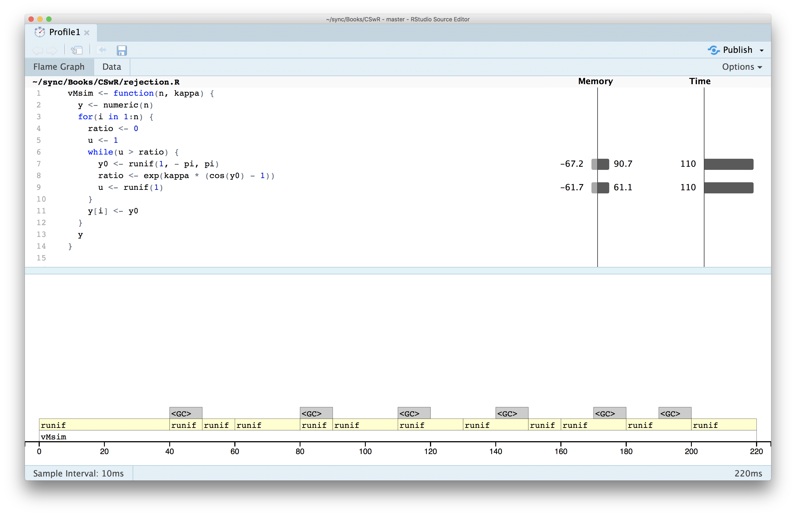

# Univariate random variables

This chapter will deal with algorithms for simulating observations from a 
distribution on $\mathbb{R}$ or any subset thereof. There can be several 
purposes of doing so, for instance:

* We want to investigate properties of the distribution.
* We want to simulate independent realizations of univariate random variables to 
investigate the distribution of a transformation.
* We want to use Monte Carlo integration to compute numerically an integral 
(which could be a probability). 

In this chapter the focus is on the simulation of a single random variable 
or an i.i.d. sequence of random variables primarily via various transformations 
of pseudo random numbers. The pseudo 
random numbers themselves being approximate simulations of i.i.d. random 
variables uniformly distributed on $(0, 1)$. 

## Pseudo random numbers

Most simulation algorithms are based on algorithms for generating 
*pseudo random* uniformly distributed variables on $(0, 1)$. They arise from 
deterministic integer sequences initiated by a *seed*.

In R you can get the same sequence by setting the seed.
```{r seed}
set.seed(27112015)
oldseed <- head(.Random.seed, 10)
tmp <- runif(1)
tmp
```

```{r newseed, dependson="seed"}
oldseed
head(.Random.seed, 10)
c(tmp, runif(1))
set.seed(27112015)
head(.Random.seed, 10)
oldseed  ## Same as current .Random.seed
runif(1) ## Same as tmp
```

It is a research field to develop pseudo random number generators, see `?RNG` 
in R for the algorithms available. 

The R default (v. 3.5.0) is the 32-bit *Mersenne Twister*, which generates integers 
in the range $$\{0, 1, \ldots, 2^{32} -1\}.$$
It has a long period and all combinations of consecutive integers up to dimension 623
occur equally often in a period. It also has good statistical properties.

Pseudo random numbers in $(0, 1)$ are returned by `runif` by division 
with $2^{32}$ and a fix to prevent the algorithm from returning 0. 

## Transformation techniques

If $T : \mathcal{Z} \to \mathbb{R}$ is a map and $Z \in \mathcal{Z}$ is a random 
variable we can sample, then we can sample $X = T(Z).$

```{theorem, inverse-distribution-function}
If $F^{\leftarrow} : (0,1) \mapsto \mathbb{R}$
is the (generalized) inverse of a distribution function and $U$ is uniformly distributed 
on $(0, 1)$ then the distribution of
$$F^{\leftarrow}(U)$$
has distribution function $F$.

```

The proof of Theorem \@ref(thm:inverse-distribution-function) can be found in many 
textbooks and will be skipped. It is easiest to use this theorem if 
we have an analytic formula for the inverse distribution function. But even 
in cases where we don't it might be useful for simulation anyway if we have
a very accurate approximation that is fast to evaluate. 

They [way R](https://github.com/wch/r-source/blob/af7f52f70101960861e5d995d3a4bec010bc89e6/src/nmath/snorm.c#L265) generates samples from $\mathcal{N}(0,1)$ is, in fact, based on 
Theorem \@ref(thm:inverse-distribution-function) and using a
[technical approximation](https://github.com/wch/r-source/blob/af7f52f70101960861e5d995d3a4bec010bc89e6/src/nmath/qnorm.c#L52) of $\Phi^{-1}$ via rational functions. 

### Sampling from a $t$-distribution 

Let $Z = (Y, W) \in \mathbb{R} \times (0, \infty)$ with $Z \sim \mathcal{N}(0, 1)$ and 
$W \sim \chi^2_k$ independent. 

Define $T : \mathbb{R} \times (0, \infty) \to \mathbb{R}$ by 
$$T(z,w) = \frac{z}{\sqrt{w/k}},$$
then 
$$X = T(Z, W) = \frac{Z}{\sqrt{W/k}} \sim t_k.$$

This is how R simulates from a $t$-distribution with $W$ generated from a 
gamma distribution with shape parameter $k / 2$ and scale parameter $2$.

## Rejection sampling {#reject-samp}

This section deals with a general algorithm for simulating variables 
from a distribution with density $f$. We call $f$ the target density 
and the corresponding distribution is called the target distribution. 
The idea is to simulate *proposals* from a different distribution 
with density $g$ (the proposal distribution) and then according to 
a criterion decide to accept or reject the proposals. It is assumed
throughout that the proposal density $g$ is a density fulfilling that 

\begin{equation}
g(x) = 0 \Rightarrow f(x) = 0.
(\#eq:gfnull)
\end{equation}

Let $Y_1, Y_2, \ldots$ be i.i.d. with density $g$ on $\mathbb{R}$ and $U_1, U_2, \ldots$ 
be i.i.d. uniformly distributed on $(0,1)$ and independent of the $Y_i$s. Define
$$T(\mathbf{Y}, \mathbf{U}) = Y_{\sigma}$$
with 
$$\sigma = \inf\{n \geq 1 \mid U_n \leq \alpha f(Y_n) / g(Y_n)\},$$
for $\alpha \in (0, 1]$ and $f$ a density. Rejection sampling then consists 
of simulating independent pairs $(Y_n, U_n)$ as long as we *reject* the 
proposals $Y_n$ sampled from $g$, 
that is, as long as 
$$U_n > \alpha f(Y_n) / g(Y_n).$$
The first time we *accept* a proposal is $\sigma$, and then we stop the 
sampling and return the proposal $Y_{\sigma}$. The result is, indeed, 
a sample from the distribution with density $f$ as the following theorem states. 


```{theorem, label="reject"}

If $\alpha f(y) \leq g(y)$ for all $y \in \mathbb{R}$ and $\alpha > 0$
then the distribution of $Y_{\sigma}$ has density $f$. 

```

```{proof} 
Note that $g$ automatically fulfills \@ref(eq:gfnull). The formal proof decomposes 
the event $(Y_{\sigma} \leq y)$ according to the value of $\sigma$ as follows

\begin{align}
P(Y_{\sigma} \leq y) & = \sum_{n = 1}^{\infty} P(Y_{n} \leq y, \ \sigma = n) \\
& = \sum_{n = 1}^{\infty} P(Y_{n} \leq y, \ U_n \leq \alpha f(Y_n) / g(Y_n)) P(\sigma > n - 1) \\
& = P(Y_{1} \leq y, \ U_1 \leq \alpha f(Y_1) / g(Y_1)) \sum_{n = 1}^{\infty} P(\sigma > n - 1).
\end{align}

By independence of the pairs $(Y_n, U_n)$ we find that
$$P(\sigma > n - 1) = p^{(n-1)}$$
where $p = P(U_1 > \alpha f(Y_1) / g(Y_1))$, and 
$$\sum_{n = 1}^{\infty} P(\sigma > n - 1) = \sum_{n = 1}^{\infty} p^{(n-1)} = \frac{1}{1 - p}.$$

We further find using Tonelli's theorem that 

\begin{align}
P(Y_{1} \leq y, \ U_1 \leq \alpha f(Y_1) / g(Y_1)) & = \int_{-\infty}^y \alpha \frac{f(z)}{g(z)} g(z) \mathrm{d}z \\
& = \alpha \int_{-\infty}^y f(z) \mathrm{d} z.
\end{align}

It also follows from this, by taking $y = \infty$, that $1 - p = \alpha$,
and we conclude that 
$$P(Y_{\sigma} \leq y) = \int_{-\infty}^y f(z) \mathrm{d} z,$$
and the density for the distribution of $Y_{\sigma}$ is, indeed, $f$. 

```

Note that if $\alpha f \leq g$ for *densities* $f$ and $g$, then 
$$\alpha = \int \alpha f(x) \mathrm{d}x \leq \int g(x) \mathrm{d}x = 1,$$
whence it follows automatically that $\alpha \leq 1$ whenever $\alpha f$ is 
dominated by $g$. The function $g/\alpha$ is called the *envelope* of $f$.
The tighter the envelope, the smaller is the probability of rejecting 
a sample from $g$, and this is quantified explicitly by $\alpha$ as $1 - \alpha$
is the rejection probability. Thus $\alpha$ should preferably be as close to 
one as possible. 

If $f(y) = c q(y)$ and $g(y) = d p(y)$ for (unknown) normalizing constants 
$c, d > 0$ and $\alpha' q \leq p$ for $\alpha' > 0$ then 
$$\underbrace{\left(\frac{\alpha' d}{c}\right)}_{= \alpha} \ f \leq g.$$
The constant $\alpha'$ may be larger than 1, but from the argument above
we know that $\alpha \leq 1$, and Theorem \@ref(thm:reject) gives that 
$Y_{\sigma}$ has distribution with density $f$. It appears that we need to 
compute the normalizing constants to implement rejection sampling. However, 
observe that
$$u \leq \frac{\alpha f(y)}{g(y)} \Leftrightarrow u \leq \frac{\alpha' q(y)}{p(y)},$$
whence rejection sampling can actually be implemented with knowledge 
of the unnormalized densities and $\alpha'$ only and without computing $c$ or $d$. 
This is one great advantage of rejection sampling, though we should 
note that when we don't know the normalizing constants, $\alpha'$ does not tell 
us anything about how tight the envelope is, and thus how small the rejection 
probability is.  

Given two functions $q$ and $p$, how do we then find $\alpha'$ so that 
$\alpha' q \leq p$? Consider the function 
$$y \mapsto \frac{p(y)}{q(y)}$$
for $q(y) > 0$. If this function is lower bounded by a value strictly larger than
zero, we can take 
$$\alpha' = \inf_{y: q(y) > 0} \frac{p(y)}{q(y)} > 0.$$
We can in practice often find this value by minimizing $p(y)/q(y)$. If 
the minimum is zero, there is no $\alpha'$, and $p$ cannot be 
used to construct an envelope. If the minimum is strictly positive
it is the best possible choice of $\alpha'$. 


### von Mises distribution {#vMsim}

Recall the [von Mises distribution](#vM) from Section \@ref(vM). It is a
distribution on $(-\pi, \pi]$ with density 
$$f(x) \propto e^{\kappa \cos(x - \mu)}$$
for parameters $\kappa > 0$ and $\mu \in (-\pi, \pi]$. Clearly, $\mu$ is a 
location parameter, and we fix $\mu = 0$ in the following. Simulating random variables 
with $\mu \neq 0$ can be achieved by (wrapped) translation of variables 
with $\mu = 0$. 

Thus the target density is $f(x)  \propto e^{\kappa \cos(x)}$. In this section
we will use the uniform distribution on $(-\pi, \pi)$ as proposal distribution.
It has constant density $g(x) = (2\pi)^{-1}$, but all we need is, in fact, that
$g(x) \propto 1$. Since $x \mapsto 1 / \exp(\kappa \cos(x)) = \exp(-\kappa \cos(x))$ attains its
minimum $\exp(-\kappa)$ for $x = 0$, we find that 
$$\alpha' e^{\kappa \cos(x)} = e^{\kappa(\cos(x) - 1)} \leq 1,$$
with $\alpha' = \exp(-\kappa)$. The rejection test of the 
proposal $Y \sim g$ can therefore be carried out 
by testing if a uniformly distributed random variable $U$ on $(0,1)$ 
satisfies
$$U > e^{\kappa(\cos(Y) - 1)}.$$

```{r vM-rejection}
vMsim_slow <- function(n, kappa) {
  y <- numeric(n)
  for(i in 1:n) {
    reject <- TRUE
    while(reject) {
      y0 <- runif(1, - pi, pi)
      u <- runif(1)
      reject <- u > exp(kappa * (cos(y0) - 1))
    }
    y[i] <- y0
  }
  y
}
```

```{r vMsim, fig.cap="(ref:vMsim)", dependson=c("vonMisesDens", "vM-rejection"), fig.pos="h", fig.show='hold', out.width="49%"}
f <- function(x, k) exp(k * cos(x)) / (2 * pi * besselI(k, 0))
x <- vMsim_slow(100000, 0.5)
hist(x, breaks = seq(-pi, pi, length.out = 20), prob = TRUE)
curve(f(x, 0.5), -pi, pi, col = "blue", lwd = 2, add = TRUE)
x <- vMsim_slow(100000, 2)
hist(x, breaks = seq(-pi, pi, length.out = 20), prob = TRUE)
curve(f(x, 2), -pi, pi, col = "blue", lwd = 2, add = TRUE)
```

(ref:vMsim) Histograms of `r format(length(x), big.mark = ",")` simulated data points 
from von Mises distributions with parameters $\kappa = 0.5$ (left) and 
$\kappa = 2$ (right). The true densities (blue) are added to the plots.

Figure \@ref(fig:vMsim) confirms that the implementation simulates
from the von Mises distribution. 

```{r vMsim-runtime, dependson="vM-rejection-fast", echo=2}
tmp <- vMsim_slow(100, kappa = 5)
system.time(vMsim_slow(100000, kappa = 5))
```

Though the implementation can easily simulate 100,000 variables in a couple of 
seconds, it might still be possible to improve it. To investigate what most 
of the run time is spent on we use the line profiling tool as implemented in 
the profvis package.

```{r profvis-vMsim, cache=FALSE, eval=FALSE}
library(profvis)
profvis(vMsim_slow(10000, 5))
```

```{r profvis-vMsim-image, out.width="90%", echo=FALSE}

```

The [profiling result](figures/vMsim-profile.html) shows that almost all the time 
is spent on simulating uniformly distributed random variables. It is, perhaps, 
expected that this should take some time, but that it takes so much more time 
than computing the ratio, say, used for the rejection test is a bit surprising. 
What might be even more surprising is the large amount of memory allocation
and deallocation associated with the simulation of the variables. 

The culprit is `runif` that has some overhead associated with each call.
The function performs much better if called once to return a vector than 
if called repeatedly as above to return just single numbers. We could 
rewrite the rejection sampler to make better use of `runif`, but it would 
make the code a bit more complicated because we don't know upfront 
how many uniform variables we need. This will introduce some bookkeeping 
that it is possible to abstract away from the implementation of any 
rejection sampler. Therefore we implement a generic
wrapper of the random number generator that will cache a suitable amount
of random variables. This function will take care of some bookkeeping 
and variables can then be extracted as needed. This also nicely 
illustrates a use of [closures and a function factory](http://adv-r.had.co.nz/Functional-programming.html#closures).


```{r RNG-stream}
rng_stream <- function(m, rng, ...) {
  args <- list(...)
  cache <- do.call(rng, c(m, args))
  j <- 0
  fact <- 1
  next_rn <- function(r = m) {
    j <<- j + 1
    if(j > m) {
      if(fact == 1 && r < m) fact <<- m / (m - r)
      m <<- floor(fact * (r + 1))
      cache <<- do.call(rng, c(m, args))
      j <<- 1
    }
    cache[j] 
  }
  next_rn
}
```


The implementation above is a function that returns a function. The returned
function, `next_rn`  comes with its own environment, where it stores the 
cached variables and extracts and returns one variable whenever called. 
It generates a new vector of random variables 
whenever it "runs out". The first time it does so, the function estimates a 
factor of how many variables is needed in total based on the argument `r`, and 
then it generates the estimated number of variables needed. This may be 
repeated a couple of times.

We can then reimplement `vMsim` using `rng_stream`. For later usage we add the 
possibility of printing out some tracing information.

```{r vM-rejection-fast, dependson="RNG-stream"}
vMsim <- function(n, kappa, trace = FALSE) {
  count <- 0
  y <- numeric(n)
  y0 <- rng_stream(n, runif, - pi, pi)
  u <- rng_stream(n, runif)
  for(i in 1:n) {
    reject <- TRUE
    while(reject) {
      count <- count + 1
      z <- y0(n - i)
      reject <- u(n - i) > exp(kappa * (cos(z) - 1))
    }
    y[i] <- z
  }
  if(trace)
    cat("kappa =", kappa, ":", (count - n)/ count, "\n")  ## Rejection frequency
  y
}
```

We should, of course, remember to test that the new implementation still 
generates variables from the von Mises distribution. 

```{r vMsim2, fig.cap="(ref:vMsim2)", dependson=c("vMsim", "vonMisesDens", "vM-rejection-fast"), fig.pos="h", fig.show='hold', out.width="49%"}
x <- vMsim(100000, 0.5)
hist(x, breaks = seq(-pi, pi, length.out = 20), prob = TRUE)
curve(f(x, 0.5), -pi, pi, col = "blue", lwd = 2, add = TRUE)
x <- vMsim(100000, 2)
hist(x, breaks = seq(-pi, pi, length.out = 20), prob = TRUE)
curve(f(x, 2), -pi, pi, col = "blue", lwd = 2, add = TRUE)
```

(ref:vMsim2) Histograms of `r format(length(x), big.mark = ",")` simulated data 
points from von Mises distributions with parameters $\kappa = 0.5$ (left) 
and $\kappa = 2$ (right), simulated using the fast implementation.

Then we can compare the run time of this new implementation to the 
run time of the first implementation. 

```{r vMsim-fast-runtime, dependson="vM-rejection-fast", echo=2}
tmp <- vMsim(100, kappa = 5)
system.time(vMsim(100000, kappa = 5))
```

As we see from the time estimate above, using a vectorized call of `runif` 
reduces the run time by a factor 4-5. It is possible to get a further factor 2-3 
run time improvement (not shown) by implementing the computations done by
`rng_stream` directly inside `vMsim`. However, we prioritize here to have 
modular code so that we can reuse `rng_stream` for other rejection samplers without 
repeating code. A pure R implementation based on a loop will never be able to 
compete with a C++ implementation anyway when the accept-reject step is such a
simple computation.

In fact, to write a pure R function that is run time efficient, we need to 
turn the entire rejection sampler into a vectorized computation. That is,
it is not just the generation of random numbers that need to be vectorized.
There is no way around some form of loop as we don't known upfront how many 
rejections there will be. We can, however, benefit from the ideas in `rng_stream` 
on how to estimate the fraction of acceptances from a first round, which can be 
used for subsequent simulations. This is done in the following fully 
vectorized R implementation.

```{r vM-rejection-vec}
vMsim_vec <- function(n, kappa) {
  fact <- 1
  j <- 1
  l <- 0  ## The number of accepted samples
  y <- list()
  while(l < n) {
    m <- floor(fact * (n - l))  ## is n the first time
    y0 <- runif(m, - pi, pi)
    u <- runif(m)
    accept <- u <= exp(kappa * (cos(y0) - 1))
    l <- l + sum(accept)
    y[[j]] <- y0[accept]
    j <- j + 1
    if(fact == 1) fact <- n / l
  }
  unlist(y)[1:n]
}
```

The implementation above incrementally grows a list, whose entries contain 
vectors of accepted samples. It is usually not advisable to dynamically 
grow objects (vectors or list), as this will lead to a lot of memory 
allocation, copying and deallocation. Thus it is better to initialize a vector
of the correct size upfront. In this particular case the list will only contain 
few entries, and it is inconsequential that it is grown dynamically. 

Finally, a C++ implementation via Rcpp is given below where the random variables are 
then again generated one at a time via the C-interface to R's random number 
generators. There is no (substantial) overhead of doing so in C++. 

```{Rcpp, vMsim-cpp}
#include <Rcpp.h>
using namespace Rcpp;
// [[Rcpp::export]]
NumericVector vMsim_cpp(int n, double kappa) {
  NumericVector y(n);
  double y0;
  bool reject;
  for(int i = 0; i < n; ++i) {
    do {
      y0 = R::runif(- M_PI, M_PI);
      reject = R::runif(0, 1) > exp(kappa * (cos(y0) - 1));
    } while(reject);
    y[i] = y0;
  }
  return y;
}
```

```{r vMsim3, fig.cap="(ref:vMsim3)", dependson=c("vMsim", "vonMisesDens", "vMsim-cpp", "vM-rejection-vec"), fig.pos="h", fig.show='hold', out.width="49%", echo = FALSE}
x <- vMsim_cpp(100000, 0.5)
hist(x, breaks = seq(-pi, pi, length.out = 20), prob = TRUE)
curve(f(x, 0.5), -pi, pi, col = "blue", lwd = 2, add = TRUE)
x <- vMsim_cpp(100000, 2)
hist(x, breaks = seq(-pi, pi, length.out = 20), prob = TRUE)
curve(f(x, 2), -pi, pi, col = "blue", lwd = 2, add = TRUE)
x <- vMsim_vec(100000, 0.5)
hist(x, breaks = seq(-pi, pi, length.out = 20), prob = TRUE)
curve(f(x, 0.5), -pi, pi, col = "blue", lwd = 2, add = TRUE)
x <- vMsim_vec(100000, 2)
hist(x, breaks = seq(-pi, pi, length.out = 20), prob = TRUE)
curve(f(x, 2), -pi, pi, col = "blue", lwd = 2, add = TRUE)
```

(ref:vMsim3) Histograms of `r format(length(x), big.mark = ",")` simulated data 
points from von Mises distributions with parameters $\kappa = 0.5$ (left) 
and $\kappa = 2$ (right), simulated using the Rcpp implementation (top) and 
the vectorized R implementation (bottom).

Figure \@ref(fig:vMsim3) shows the results from testing the C++ implementation
and the fast R implementation,
and confirms that the implementations do simulate from the von Mises distribution.
We conclude by measurering the run time of the implementations using 
`system.time` and a combined microbenchmark of all four different implementations.

```{r vMsim-cpp-runtime, dependson=c("vMsim-cpp", "vM-rejection-fast", "vM-rejection"), echo=c(1, 3)}
system.time(vMsim_cpp(100000, kappa = 5))
old_options <- options(digits = 3)
microbenchmark(
  vMsim_slow(1000, kappa = 5),
  vMsim(1000, kappa = 5),
  vMsim_cpp(1000, kappa = 5),
  vMsim_vec(1000, kappa = 5)
)
options(digits = old_options$digits)
```

The C++ implementation is only a factor 1.5 faster than the fully 
vectorized R implementation, while it is around a factor 15 faster 
than the loop-based `vMsim` and a factor 85 or so faster than the
first implementation `vMsim_slow`. Rejection sampling is a good example 
of an algorithm for which a naive loop-based R implementation
performs rather poorly in terms of run time, while a completely vectorized 
implementation is competitive with an Rcpp implementation.

### Gamma distribution

It may be possible to find a suitable envelope of the density for the 
gamma distribution on $(0, \infty)$, but it turns out that there is a 
very efficient rejection sampler of a non-standard distribution that 
can be transformed into a gamma distribution by a simple transformation. 

Let $t(y) = a(1 + by)^3$ for $y \in (-b^{-1}, \infty)$, then $t(Y) \sim \Gamma(r,1)$ if $r \geq 1$
and $Y$ has density 
$$f(y) \propto t(y)^{r-1}t'(y) e^{-t(y)} = e^{(r-1)\log t(y) + \log t'(y) - t(y)}.$$

[Proof: Use univariate density transformation theorem.]

The density $f$ will be the *target density* for a rejection sampler. 

With 
$$f(y) \propto e^{(r-1)\log t(y) + \log t'(y) - t(y)},$$
$a = r - 1/3$ and $b = 1/(3 \sqrt{a})$ 
$$f(y) \propto e^{a \log t(y)/a - t(y) + a \log a} \propto \underbrace{e^{a \log t(y)/a - t(y) + a}}_{q(y)}.$$

An analysis of $w(y) := - y^2/2 - \log q(y)$ shows that it is convex on $(-b^{-1}, \infty)$ 
and it attains its minimum in $0$ with $w(0) = 0$, whence 
$$q(y) \leq e^{-y^2/2}.$$
This gives us an envelope expressed in terms of unnormalized densities 
with $\alpha' = 1$. 

The implementation of a rejection sampler based on this analysis is relatively 
straightforward. The rejection sampler will simulate from the distribution 
with density $f$ by simulating from the Gaussian distribution (the envelope). 
For the rejection step we need to implement $q$. Finally, we also need 
to implement $t$ to transform the result from the rejection sampler to be 
gamma distributed. The rejection sampler is otherwise implemented as for 
the von Mises distribution. To investigate rejection probabilities below
we additionally implement the possibility of printing out some tracing 
information. 

```{r gammasim}
## r >= 1 
tfun <- function(y, a) {
  b <- 1 / (3 * sqrt(a))
  (y > -1/b) * a * (1 + b * y)^3  ## 0 when y <= -1/b
}

qfun <- function(y, r) {
  a <- r - 1/3
  tval <- tfun(y, a)
  exp(a * log(tval / a) - tval + a)
}

gammasim <- function(n, r, trace = FALSE) {
  count <- 0
  y <- numeric(n)
  y0 <- rng_stream(n, rnorm)
  u <- rng_stream(n, runif)
  for(i in 1:n) {
    reject <- TRUE
    while(reject) {
      count <- count + 1
      z <- y0(n - i)
      reject <- u(n - i) > qfun(z, r) * exp(z^2/2)
    }
    y[i] <- z
  }
  if(trace)
    cat("r =", r, ":", (count - n)/ count, "\n")  ## Rejection frequency
  tfun(y, r - 1/3)
}
```

We test the implementation by simulating 100000 values 
with parameters $r = 8$ as well as $r = 1$ and compare the resulting histograms 
to the respective theoretical densities. 

```{r gammaBench, echo=FALSE, dependson="gammasim", fig.pos="h", fig.show='hold', out.width="49%"}
y <- gammasim(1, 8)
y <- gammasim(100000, 8)
hist(y, freq = FALSE, ylim = c(0, 0.18), 
     main = "Simulated gamma distribution",
     xlab = "y")
curve(dgamma(x, 8), col = "blue", lwd = 2, add = TRUE)
y <- gammasim(100000, 1)
hist(y, freq = FALSE, ylim = c(0, 0.9), 
     main = "Simulated gamma distribution",
     xlab = "y")
curve(dgamma(x, 1), col = "blue", lwd = 2, add = TRUE)
```

Though this is only a simple and informal test, it indicates that the implementation
correctly simulates from the gamma distribution.

Rejection sampling can be computationally expensive if many samples are rejected. 
A very tight envelope will lead to fewer rejections, while a loose envelope will
lead to many rejections. Using the tracing option as implemented we obtain
estimates of the rejection probability and thus a quantification of
how tight the envelope is. 

```{r tracing, dependson="gammasim", results='hold'}
y <- gammasim(100000, 16, trace = TRUE)
y <- gammasim(100000, 8, trace = TRUE)
y <- gammasim(100000, 4, trace = TRUE)
y <- gammasim(100000, 1, trace = TRUE)
```

We observe that the rejection frequencies are small with $r = 1$ being the 
worst case with around 5% rejections. For the other cases the rejection 
frequencies are all below 1%, thus rejection is rare. 

A visual comparison of $q$ to the (unnormalized) Gaussian density also 
shows that the two (unnormalized) densities are very close except
in the tails where there is very little probability mass. 

```{r densComparison, fig.cap="Comparisons of the Gaussian proposal (red) and the target density (blue) used for eventually simulating gamma distributed variables via a transformation.", echo = FALSE, fig.show='hold', out.width="100%"}
par(mfcol = c(2, 2), mex = 0.7, cex = 0.6, font.main = 1)
curve(qfun(x, 1), - 3 * sqrt(1 - 1/3), 8, lwd = 1.5, 
      main = "Target and proposal densities, shape = 1", 
      col = "blue", ylab = "density", xlab = "y")
curve(exp(-x^2 / 2), add= TRUE, col = "red", lwd = 1.5)
curve(log(qfun(x, 2)), - 3 * sqrt(1 - 1/3), 8, lwd = 1.5, 
      col = "blue", ylab = "log-density", ylim = c(-20, 0), xlab = "y")
curve(-x^2 / 2, add= TRUE, col = "red", lwd = 1.5)
legend(-2.5, -4, c("q", "Gaussian"), 
       col = c("blue", "red"), 
       lwd = 1.5, 
       bty = "n", 
       y.intersp = 1.2)
curve(qfun(x, 8), - 3 * sqrt(8 - 1/3), 8, lwd = 1.5,
      main = "Target and proposal densities, shape = 8",
      col = "blue", ylab = "density", xlab = "y")
curve(exp(-x^2 / 2), add= TRUE, col = "red", lwd = 1.5)
curve(log(qfun(x, 8)), - 3 * sqrt(8 - 1/3), 8, lwd = 1.5, col = "blue", 
      ylab = "log-density", ylim = c(-20, 0), xlab = "y")
curve(-x^2 / 2, add= TRUE, col = "red", lwd = 1.5)
legend(-8.5, -1, c("q", "Gaussian"), 
       col = c("blue", "red"), 
       lwd = 1.5, 
       bty = "n", 
       y.intersp = 1.2)
```

## Adaptive envelopes {#adaptive}

A good envelope should be tight, meaning that $\alpha$ is close to one, 
it should be fast to simulate from and have a density that is 
fast to evaluate. It is not obvious how to find such an envelope 
for an arbitrary target density $f$. 

This section develops a general scheme for the construction of envelopes
for all [log-concave target densities](https://en.wikipedia.org/wiki/Logarithmically_concave_function#Log-concave_distributions). This is a special class of densities,
but it is not uncommon in practice. The scheme can also be extended to work 
for some densities that have combinations of log-concave and log-convex 
behaviors. The same idea used for constructing 
envelopes can be used to bound $f$ from below. The accept-reject step 
can then avoid many evaluations of $f$, which is beneficial if $f$ is 
computationally expensive to evaluate.

The key idea of the scheme is to bound the log-density by piecewise 
affine functions. This is particularly easy to do if the density 
is log-concave. The scheme leads to analytically manageable
formulas for the envelope, its corresponding distribution function and its 
inverse, and as a result it is fast to simulate proposals and 
compute the envelope as needed in the accept-reject step. 

The scheme requires the choice of a finite number of points to determine
the affine bounds. For any given choice of points the scheme adapts the 
envelope to the target density automatically. It is possible to implement 
a *fully* adaptive scheme that doesn't even require the choice of points
but initializes and updates the points dynamically as more and more rejection
samples are computed. In this section the focus is on the scheme with 
a given and fixed number of points. 

For a continuously differentiable, strictly positive and
log-concave target on an open interval $I \subseteq \mathbb{R}$ 
it holds that 
$$\log(f(x)) \leq \frac{f'(x_0)}{f(x_0)}(x - x_0) + \log(f(x_0))$$
for any $x, x_0 \in I$. 

Let $x_1 < x_2 < \ldots < x_{m} \in I$ and let $I_1, \ldots, I_m \subseteq I$ be 
intervals that form a partition of $I$ such that $x_i \in I_i$. Defining 
$$a_i = (\log(f(x_i)))' = \frac{f'(x_i)}{f(x_i)} \quad \text{and} \quad b_i = \log(f(x_i)) -  \alpha_i x_i$$
we find the upper bound 
$$\log(f(x)) \leq V(x) = \sum_{i=1}^m  (a_i x + b_i) 1_{I_i}(x),$$
or 
$$f(x) \leq e^{V(x)}.$$
Note that by the log-concavity of $f$, $a_1 \geq a_2 \geq \ldots \geq a_m$. 
The upper bound is integrable over $I$ if either $a_1 > 0$ and $a_m < 0$, 
or $a_m < 0$ and $I$ is bounded to the left, or $a_1 > 0$ and $I$ is bounded 
to the right. In any of these cases we define 
$$c = \int_I e^{V(x)} \mathrm{d} x < \infty$$
and $g(x) = c^{-1} \exp(V(x))$, and we find that with $\alpha = c^{-1}$ 
then $\alpha f \leq g$ and $g$ is an envelope of $f$. Note that it is
actually not necessary to compute $c$ (or $\alpha$) to implement the 
rejection step in the rejection sampler, but that $c$ is needed for the
simulating from $g$ as described below. We will assume in the following 
that $c < \infty$. 

The intervals $I_i$ have not been specified, and we could, in fact, implement 
rejection sampling with any choice of intervals fulfilling the conditions
above. But in the interest of maximizing 
$\alpha$ (minimizing $c$) and thus minimizing the rejection frequency, we
should choose $I_i$ so that $a_i x + b_i$ is minimal over $I_i$ among all the affine
upper bounds. This will result in the tightest envelope. This means 
that for $i = 1, \ldots, m - 1$,  $I_i = (z_{i-1}, z_i]$ with $z_i$ 
the point where $a_i x + b_i$ and $a_{i+1} x + b_{i+1}$ intersect. We find 
that the solution of 
$$a_i x + b_i = a_{i+1} x + b_{i+1}$$
is 
$$z_i = \frac{b_{i+1} - b_i}{a_i - a_{i+1}}$$
provided that $a_{i+1} > a_i$. The two extremes, $z_0$ and $z_m$, are chosen 
as the endpoints of $I$ and may be $- \infty$ and $+ \infty$, respectively. 

One way to simulate from such envelopes is by transformation
of uniform random variables by the inverse distribution function. 
It requires a little bookkeeping, but is otherwise straightforward.
Define for $x \in I_i$
$$F_i(x) = \int_{z_{i-1}}^x e^{a_i z + b_i} \mathrm{d} z,$$
and let $R_i = F_i(z_i)$. Then $c = \sum_{i=1}^m R_i$, and 
if we define $Q_i = \sum_{k=1}^{i} R_k$ for $i = 0, \ldots, m$
the inverse of the distribution function in $q$ is given as the solution of 
the equation
$$F_i(x) = cq - Q_{i-1}, \qquad Q_{i-1} < cq \leq Q_{i}.$$
That is, for a given $q \in (0, 1)$, first determine which interval 
$(Q_{i-1}, Q_{i}]$ that $c q$ falls into, and then solve the corresponding 
equation. Observe that when $a_i \neq 0$,
$$F_i(x) = \frac{1}{a_i}e^{b_i}\left(e^{a_i x} - e^{a_i z_{i-1}}\right).$$


### Beta distribution

To illustrate the envelope construction above for a simple log-concave 
density we consider the Beta distribution on $(0, 1)$ with shape parameters $\geq 1$.
This distribution has density 
$$f(x) \propto x^{\alpha - 1}(1-x)^{\beta - 1},$$
which is log-concave (when the shape parameters are greater than one). 
We implement the rejection sampling algorithm for this density with the adaptive 
envelope using two points.

```{r Beta-rejection}
Betasim <- function(n, x1, x2, alpha, beta) {
  lf <- function(x) (alpha - 1) * log(x) + (beta - 1) * log(1 - x) 
  lf_deriv <- function(x) (alpha - 1)/x - (beta - 1)/(1 - x)
  a1 <- lf_deriv(x1)
  a2 <- lf_deriv(x2)
  if(a1 == 0 || a2 == 0 || a1 - a2 == 0) 
    stop("\nThe implementation requires a_1 and a_2 different 
and both different from zero. Choose different values of x_1 and x_2.")
  b1 <- lf(x1) - a1 * x1
  b2 <- lf(x2) - a2 * x2
  z1 <- (b2 - b1) / (a1 - a2)
  Q1 <- exp(b1) * (exp(a1 * z1) - 1) / a1 
  c <- Q1 + exp(b2) * (exp(a2 * 1) - exp(a2 * z1)) / a2

  y <- numeric(n)
  uy <- rng_stream(n, runif)
  u <- rng_stream(n, runif)
  for(i in 1:n) {
    reject <- TRUE
    while(reject) {
      u0 <- c * uy(n - i)
      if(u0 < Q1) {
        z <- log(a1 * exp(-b1) * u0 + 1) / a1
        reject <- u(n - i) > exp(lf(z) - a1 * z - b1)
      } else {
        z <- log(a2 * exp(-b2) * (u0 - Q1) + exp(a2 * z1)) / a2
        reject <- u(n - i) > exp(lf(z) - a2 * z - b2)
      }
    }
    y[i] <- z
  }
  y
}
```

(ref:Beta-sim) Histograms of simulated variables from Beta distributions using 
the rejection sampler with the adaptive envelope based on log-concavity. The 
true density (blue) and the envelope (red) are added to the plots. 

```{r Beta-sim, echo=FALSE, fig.cap="(ref:Beta-sim)", dependson="Beta-rejection", fig.show='hold', out.width="100%"}
par(mfrow = c(2, 2), mex = 0.7, cex = 0.6, font.main = 1)
envelope <- function(x, x1, x2, alpha, beta) {
  lf <- function(x) (alpha - 1) * log(x) + (beta - 1) * log(1 - x) 
  lf_deriv <- function(x) (alpha - 1)/x - (beta - 1)/(1 - x)
  a1 <- lf_deriv(x1)
  a2 <- lf_deriv(x2)
  b1 <- lf(x1) - a1 * x1
  b2 <- lf(x2) - a2 * x2
  z1 <- (b2 - b1) / (a1 - a2)
  ifelse(x < z1, exp(a1 * x + b1), exp(a2 * x + b2))
}
  
hist(Betasim(100000, x1 = 0.3, x2 = 0.7, alpha = 4, beta = 2), 
     prob = TRUE, main = "", ylim = c(0, 3))
curve(x^3 * (1 - x) / beta(4, 2), col = "blue", lwd = 2, add = TRUE)
curve(envelope(x, x1 = 0.3, x2 = 0.7, alpha = 4, beta = 2) / beta(4, 2), 
      col = "red", lwd = 2, add = TRUE, n = 400)

hist(Betasim(100000, x1 = 0.3, x2 = 0.7, alpha = 1.8, beta = 2.4), 
     prob = TRUE, main = "", ylim = c(0, 3))
curve(x^0.8 * (1 - x)^1.4 / beta(1.8, 2.4), col = "blue", lwd = 2, add = TRUE)
curve(envelope(x, x1 = 0.3, x2 = 0.7, alpha = 1.8, beta = 2.4) / beta(1.8, 2.4), 
      col = "red", lwd = 2, add = TRUE, n = 400)

hist(Betasim(100000, x1 = 0.2, x2 = 0.5, alpha = 4, beta = 2), 
     prob = TRUE, main = "", ylim = c(0, 3))
curve(x^3 * (1 - x) / beta(4, 2), col = "blue", lwd = 2, add = TRUE)
curve(envelope(x, x1 = 0.2, x2 = 0.5, alpha = 4, beta = 2) / beta(4, 2), 
      col = "red", lwd = 2, add = TRUE, n = 400)

hist(Betasim(100000, x1 = 0.2, x2 = 0.5, alpha = 1.8, beta = 2.4), 
     prob = TRUE, main = "", ylim = c(0, 3))
curve(x^0.8 * (1 - x)^1.4 / beta(1.8, 2.4), col = "blue", lwd = 2, add = TRUE)
curve(envelope(x, x1 = 0.2, x2 = 0.5, alpha = 1.8, beta = 2.4) / beta(1.8, 2.4), 
      col = "red", lwd = 2, add = TRUE, n = 400)
```

Note that as a safeguard we implemented a test on the $a_i$s to check that 
the formulas used are actually meaningful, specifically that there are no
divisions by zero. 

```{r Beta-test, error=TRUE}
Betasim(1, x1 = 0.25, x2 = 0.75, alpha = 4, beta = 2)  
Betasim(1, x1 = 0.2, x2 = 0.75, alpha = 4, beta = 2)   
Betasim(1, x1 = 0.2, x2 = 0.8, alpha = 4, beta = 2)    
```


### von Mises distribution

The [von Mises rejection sampler](#vMsim) in Section \@ref(vMsim) used the 
uniform distribution as proposal distribution. As it turns out, the uniform 
density is not a particularly tight envelope. We illustrate this by 
studying the proportion of rejections for our previous implementation.

```{r vM-reject-freq, dependson="vM-rejection-fast", results='hold'}
y <- vMsim(10000, 0.1, trace = TRUE)
y <- vMsim(10000, 0.5, trace = TRUE)
y <- vMsim(10000, 2, trace = TRUE)
y <- vMsim(10000, 5, trace = TRUE)
```

The rejection frequency is high and increases with $\kappa$. For $\kappa = 5$
more than 80% of the proposals are rejected, and simulating $n = 10,000$ 
von Mises distributed variables thus requires the simulation of around $50,000$
variables from the proposal.

The von Mises density is, unfortunately, not log-concave on $(-\pi, \pi)$, 
but it is on $(-\pi/2, \pi/2)$. It is, furthermore, log-convex on $(-\pi, -\pi/2)$ 
as well as $(\pi/2, \pi)$, which implies that on these two intervals the 
log-density is below the corresponding chords. These chords can be 
pieced together with tangents to give an envelope. 


```{r vM-rejection-adaptive}
vMsim_adapt <- function(n, x1, x2, kappa, trace = FALSE) {
  lf <- function(x) kappa * cos(x) 
  lf_deriv <- function(x) - kappa * sin(x)
  a1 <- 2 * kappa / pi
  a2 <- lf_deriv(x1)
  a3 <- lf_deriv(x2)
  a4 <- - a1
  
  b1 <- kappa
  b2 <- lf(x1) - a2 * x1
  b3 <- lf(x2) - a3 * x2
  b4 <- kappa
  
  z0 <- -pi
  z1 <- -pi/2
  z2 <- (b3 - b2) / (a2 - a3)
  z3 <- pi/2
  z4 <- pi
  
  Q1 <- exp(b1) * (exp(a1 * z1) - exp(a1 * z0)) / a1 
  Q2 <- Q1 + exp(b2) * (exp(a2 * z2) - exp(a2 * z1)) / a2
  Q3 <- Q2 + exp(b3) * (exp(a3 * z3) - exp(a3 * z2)) / a3
  c <- Q3 + exp(b4) * (exp(a4 * z4) - exp(a4 * z3)) / a4
  
  count <- 0
  y <- numeric(n)
  uy <- rng_stream(n, runif)
  u <- rng_stream(n, runif)
  for(i in 1:n) {
    reject <- TRUE
    while(reject) {
      count <- count + 1
      u0 <- c * uy(n - i)
      if(u0 < Q1) {
        z <- log(a1 * exp(-b1) * u0 + exp(a1 * z0)) / a1
        reject <- u(n - i) > exp(lf(z) - a1 * z - b1)
      } else if(u0 < Q2) {
        z <- log(a2 * exp(-b2) * (u0 - Q1) + exp(a2 * z1)) / a2
        reject <- u(n - i) > exp(lf(z) - a2 * z - b2)
      } else if(u0 < Q3) {
        z <- log(a3 * exp(-b3) * (u0 - Q2) + exp(a3 * z2)) / a3
        reject <- u(n - i) > exp(lf(z) - a3 * z - b3)
      } else {
        z <- log(a4 * exp(-b4) * (u0 - Q3) + exp(a4 * z3)) / a4
        reject <- u(n - i) > exp(lf(z) - a4 * z - b4)
      }
    }
    y[i] <- z
  }
  if(trace)
    cat("kappa =", kappa, ", x1 =", x1, 
        ", x2 =", x2, ":", (count - n) / count, "\n")  
  y
}
```

(ref:vM-adaptive) Histograms of simulated variables from von Mises distributions 
using the rejection sampler with the adaptive envelope based on a combination 
of log-concavity and log-convexity. The true density (blue) and the envelope (red) 
are added to the plots. 

```{r vM-adaptive-test, fig.cap="(ref:vM-adaptive)", dependson="vM-rejection-adaptive", echo=FALSE, fig.show='hold', out.width="100%"}
par(mfrow = c(2, 2), mex = 0.7, cex = 0.6, font.main = 1)
envelope <- function(x, x1, x2, kappa) {
  lf <- function(x) kappa * cos(x) 
  lf_deriv <- function(x) - kappa * sin(x)
  a1 <- 2 * kappa / pi
  a2 <- lf_deriv(x1)
  a3 <- lf_deriv(x2)
  a4 <- - a1
  
  b1 <- kappa
  b2 <- lf(x1) - a2 * x1
  b3 <- lf(x2) - a3 * x2
  b4 <- kappa
  
  z0 <- -pi
  z1 <- -pi/2
  z2 <- (b3 - b2) / (a2 - a3)
  z3 <- pi/2
  z4 <- pi
  
  env <- numeric(length(x))
  i1 <- x < z1
  i2 <- x >= z1 & x < z2
  i3 <- x >= z2 & x < z3
  i4 <- x >= z3 
  
  env[i1] <- exp(a1 * x[i1] + b1)
  env[i2] <- exp(a2 * x[i2] + b2)
  env[i3] <- exp(a3 * x[i3] + b3)
  env[i4] <- exp(a4 * x[i4] + b4)
  
  env
}

y <- vMsim_adapt(100000, -0.4, 0.4, 5)
hist(y, breaks = seq(-pi, pi, length.out = 30), prob = TRUE, 
     main = expression(paste(kappa == 5, ", ", x[1] == -0.4, ", ", x[2] == 0.4)), ylim = c(0, 1.5))
curve(f(x, 5), -pi, pi, col = "blue", lwd = 2, add = TRUE, n = )
curve(envelope(x, -0.4, 0.4, 5) / (2 * pi * besselI(5, 0)), -pi, pi, col = "red", 
      lwd = 2, add = TRUE, n = 400)

y <- vMsim_adapt(100000, -1, 1, 2)
hist(y, breaks = seq(-pi, pi, length.out = 30), prob = TRUE,
     main = expression(paste(kappa == 2, ", ", x[1] == -1, ", ", x[2] == 1)), ylim = c(0, 1.5))
curve(f(x, 2), -pi, pi, col = "blue", lwd = 2, add = TRUE)
curve(envelope(x, -1, 1, 2) / (2 * pi * besselI(2, 0)), -pi, pi, col = "red", 
      lwd = 2, add = TRUE, n = 400)

y <- vMsim_adapt(100000, -0.1, 0.1, 5)
hist(y, breaks = seq(-pi, pi, length.out = 30), prob = TRUE, 
     main = expression(paste(kappa == 5, ", ", x[1] == -0.1, ", ", x[2] == 0.1)), ylim = c(0, 1.5))
curve(f(x, 5), -pi, pi, col = "blue", lwd = 2, add = TRUE, n = )
curve(envelope(x, -0.1, 0.1, 5) / (2 * pi * besselI(5, 0)), -pi, pi, col = "red", 
      lwd = 2, add = TRUE, n = 400)

y <- vMsim_adapt(100000, -0.4, 0.4, 2)
hist(y, breaks = seq(-pi, pi, length.out = 30), prob = TRUE,
     main = expression(paste(kappa == 2, ", ", x[1] == -0.4, ", ", x[2] == 0.4)), ylim = c(0, 1.5))
curve(f(x, 2), -pi, pi, col = "blue", lwd = 2, add = TRUE)
curve(envelope(x, -0.4, 0.4, 2) / (2 * pi * besselI(2, 0)), -pi, pi, col = "red", 
      lwd = 2, add = TRUE, n = 400)
```


```{r vM-adaptive-reject-test, dependson="vM-rejection-adaptive", results='hold'}
y <- vMsim_adapt(100000, -0.4, 0.4, 5, trace = TRUE)
y <- vMsim_adapt(100000, -1, 1, 2, trace = TRUE)
y <- vMsim_adapt(100000, -0.1, 0.1, 5, trace = TRUE)
y <- vMsim_adapt(100000, -0.4, 0.4, 2, trace = TRUE)
```

We see that compared to using the uniform density as envelope, these adaptive
envelopes are generally tighter and leads to fewer rejections. Even tighter 
envelopes are possible by using more than four intervals, but it is, of course,
always a good question how the added complexity and bookkeeping induced by 
using more advanced and adaptive envelopes affect run time. It is even a good question 
if our current adaptive implementation will outperform our first, and 
much simpler, implementation that used the uniform envelope. 

```{r vM-bench, dependson=c("vM-rejection-adaptive", "vM-rejection-fast"), echo=2}
old_options <- options(digits = 2)
microbenchmark(vMsim_adapt(100, -1, 1, 5),
               vMsim_adapt(100, -0.4, 0.4, 5),
               vMsim_adapt(100, -0.2, 0.2, 5),
               vMsim_adapt(100, -0.1, 0.1, 5),
               vMsim(100, 5),
               vMsim_vec(100, 5)
               )
options(digits = old_options$digits)

```

The results from the benchmark show that the adaptive implementation has 
run time comparable to using the uniform proposal. 
With $x_1 = -0.4$ and $x_2 = 0.4$ and $\kappa = 5$ 
we found above that the rejection frequency was about 20% with 
the adaptive envelope, while it was about 80% when using the uniform
envelope. A naive computation would thus suggest a speedup of a 
factor 4, but using the adaptive envelope there is actually only
a speedup of a factor 2. And the vectorized solution is still 
considerably faster. A completely vectorized solution using 
the adaptive envelope is possible, but it is not entirely 
straightforward how to implement the more complicated envelope 
efficiently, and it may be a better option in this case to implement
it using Rcpp. 

Even if either implementation can be improved further in terms of run time, 
it is an important point when comparing algorithms that we don't get too 
focused on surrogate performance quantities. The probability of rejection 
is a surrogate for actual run time, and it might be conceptually of interest 
to bring this probability down. But if it is at the expense of additional
computations it might not be worth the effort in terms of real run time. 

## Exercises

### Rejection sampling of Gaussian random variables {-}

This exercise is on rejection sampling from the Gaussian distribution by 
using the Laplace distribution as an envelope. Recall that the Laplace distribution has density 
$$g(x) = \frac{1}{2} e^{-|x|}$$
for $x \in \mathbb{R}$. 

Note that if $X$ and $Y$ are independent and exponentially distributed with mean one, then $X - Y$ has a Laplace 
distribution. This gives a way to easily sample from the Laplace distribution. 


```{exercise, reject-gaussian}
Implement rejection sampling from the standard Gaussian distribution with density 
$$f(x) = \frac{1}{\sqrt{2\pi}} e^{- x^2 / 2}$$
by simulating Laplace random variables as differences of exponentially distributed random variables. 
Test the implementation by computing the variance of the Gaussian distribution
as an MC estimate and by comparing directly with the Gaussian distribution using 
histograms and QQ-plots. 

```

```{exercise}
Implement simulation from the Laplace distribution by transforming a uniform random variable by 
the inverse distribution function. Use this method together with the rejection
sampler you implemented in Exercise \@ref(exr:reject-gaussian) 

```


**Note:** The Laplace distribution can be seen as a simple version of the 
adaptive envelopes suggested in Section \@ref(adaptive). 


