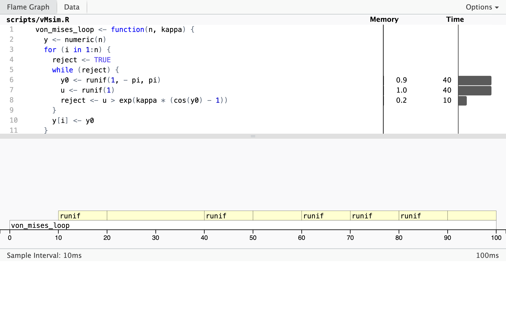

# Rejection sampling {#reject-samp}

This chapter deals with a general algorithm for simulating variables from a
distribution with density $f$. We call $f$ the target density and the
corresponding distribution is called the target distribution. The idea is to
simulate *proposals* from a different distribution with density $g$ (the
proposal distribution) and then according to a criterion decide to accept or
reject the proposals. One notable property of rejection sampling is that it only 
requires evaluation of ratios $f(x) / g(x)$ *up to a constant factor*, which 
means that we can implement rejection sampling even when we are not able to compute 
normalization constants for $f$ and $g$. 

The theory and resulting algorithm are quite general. The main
requirement is that the target and the proposal distribution have densities
w.r.t. the same reference measure. To use the algorithm in practice we also need
to be able to simulate from the proposal distribution. We first present the
general theory, and then we demonstrate how to implement rejection sampling for
some specific probability distributions on $\mathbb{R}$ with densities. In Section
\@ref(adaptive) we discuss a particular class of proposal distributions 
on $\mathbb{R}$ and how they can be adapted to some target distributions, 
notably when the target distribution has a log-concave density. Our 
examples will thus only deal with simulation from distributions on 
$\mathbb{R}$, but rejection sampling is used in practice for much more 
general distributions. 

## The general algorithm 

We let $f$ denote the target density and assume throughout that the proposal 
density $g$ fulfills that 

\begin{equation}
g(x) = 0 \Rightarrow f(x) = 0.
(\#eq:gfnull)
\end{equation}

We let $X_1, X_2, \ldots$ be i.i.d. with density $g$ on $\mathbb{R}$ and $U_1, U_2, \ldots$ 
be i.i.d. uniformly distributed on $(0,1)$ and independent of the $X_i$-s. The collection
of $X_i$-s is denoted $\mathbf{Y}$ and the collection of $U_i$-s is denoted 
$\mathbf{U}$. One perspective on rejection sampling is that it is a transformation 
technique, cf. Section \@ref(transform), that transforms $(\mathbf{Y}, \mathbf{U})$
to a single random variable with distribution having density $f$. To this end we 
define for $\alpha \in (0, 1]$

\[
\sigma = \inf\{n \geq 1 \mid U_n \leq \alpha f(X_n) / g(X_n)\},
\]

and in terms of $\sigma$ we define the transformation

\[
T(\mathbf{Y}, \mathbf{U}) = X_{\sigma}.
\]

For $X_{\sigma}$ to be well defined (and for rejection sampling to be an algorithm that 
stops eventually), we need $\sigma$ to be finite. It is part of the proof of 
Theorem \@ref(thm:reject) below that $\sigma$ is, indeed, finite. 

Rejection sampling is the algorithm that computes $X_{\sigma}$. The practical 
implementation consists of iteratively simulating independent pairs 
$(X_n, U_n)$ as long as we *reject* the proposals $X_n$ sampled from $g$, 
that is, as long as 

\[
U_n > \alpha f(X_n) / g(X_n).
\]

The number $\sigma$ is precisely the first time we *accept* a proposal, and 
then we stop the algorithm and return $X_{\sigma}$. That is, we return the 
proposal the first time it is accepted. The following theorem shows that 
$X_{\sigma}$ is, indeed, a sample from the target distribution with density $f$.

\vskip 5mm

::: {.theorem #reject}
If $\alpha f(x) \leq g(x)$ for all $y \in \mathbb{R}$ and $\alpha > 0$
then the distribution of $X_{\sigma}$ has density $f$. 
:::

::: {.proof .boxed} 
Note that the assumption $\alpha f(x) \leq g(x)$ for $\alpha > 0$ implies that $g$ 
  automatically fulfills \@ref(eq:gfnull). We first use Tonelli's theorem 
  to compute the probability

\begin{align}
\P(X_{1} \leq x, \ U_1 \leq \alpha f(X_1) / g(X_1)) & = \int_{-\infty}^x \alpha \frac{f(z)}{g(z)} g(z) \mathrm{d}z \\
& = \alpha \int_{-\infty}^x f(z) \mathrm{d} z.
\end{align}

Taking $x = \infty$ shows that $\alpha = \P(U_1 \leq \alpha f(X_1) / g(X_1))$ is 
the accept probability. 

We show that $\sigma$ is finite. To this end, since the pairs $(X_n, U_n)$ are i.i.d., 
observe that 

\[
  \P(\sigma > n - 1) = (1 - \alpha)^{(n-1)}
\]

where $1 - \alpha = \P(U_1 > \alpha f(X_1) / g(X_1)) < 1$ is the reject probability.
Hence  

\[
  \P(\sigma < \infty) = 1 - \lim_{n \to \infty} \P(\sigma > n - 1) 
  = 1 - \lim_{n \to \infty} (1 - \alpha)^{(n-1)} = 1,
\]

and $\sigma$ is, indeed, finite (with probability $1$). 

We can then find the distribution function for the distribution of $X_{\sigma}$ 
by decomposing the event $(X_{\sigma} \leq y)$ according to the value of $\sigma$,

\begin{align}
\P(X_{\sigma} \leq y) & = \sum_{n = 1}^{\infty} \P(X_{n} \leq y, \ \sigma = n) \\
& = \sum_{n = 1}^{\infty} \P(X_{n} \leq y, \ U_n \leq \alpha f(X_n) / g(X_n)) \P(\sigma > n - 1) \\
& = \P(X_{1} \leq y, \ U_1 \leq \alpha f(X_1) / g(X_1)) \sum_{n = 1}^{\infty} \P(\sigma > n - 1) \\
& = \alpha \int_{-\infty}^y f(z) \mathrm{d} z \sum_{n = 1}^{\infty} \P(\sigma > n - 1).
\end{align}
  
Observing that   

\[
  \sum_{n = 1}^{\infty} \P(\sigma > n - 1) = \sum_{n = 1}^{\infty} (1 - \alpha)^{(n-1)}  = \frac{1}{\alpha}
\] 

yields 

\[
\P(X_{\sigma} \leq x) = \int_{-\infty}^x f(z) \mathrm{d} z,
\]

and the density for the distribution of $X_{\sigma}$ is, indeed, $f$. 
:::


Note that when $\alpha f \leq g$ for *densities* $f$ and $g$, then 

\[
\alpha = \int \alpha f(x) \mathrm{d}x \leq \int g(x) \mathrm{d}x = 1,
\]

whence it follows automatically that $\alpha \leq 1$ whenever $\alpha f$ is 
dominated by $g$. The function $g/\alpha$ is called the *envelope* of $f$.\index{envelope}
The tighter the envelope, the smaller is the probability of rejecting 
a sample from $g$, and this is quantified explicitly by $\alpha$ as $1 - \alpha$
is the rejection probability. Thus $\alpha$ should preferably be as close to 
one as possible. 

If $f(x) = c q(x)$ and $g(x) = d p(x)$ for (unknown) normalizing constants 
$c, d > 0$ and $\alpha' q \leq p$ for $\alpha' > 0$ then 

\[
\underbrace{\left(\frac{\alpha' d}{c}\right)}_{= \alpha} \ f \leq g.
\]

The constant $\alpha'$ may be larger than 1, but from the argument above
we know that $\alpha \leq 1$, and Theorem \@ref(thm:reject) gives that 
$X_{\sigma}$ has distribution with density $f$. It appears that we need to 
compute the normalizing constants to implement rejection sampling. However, 
observe that

\[
u \leq \frac{\alpha f(x)}{g(x)} \Leftrightarrow u \leq \frac{\alpha' q(x)}{p(x)},
\]

whence rejection sampling can actually be implemented with knowledge 
of the unnormalized densities and $\alpha'$ only and without computing $c$ or $d$. 
This is one great advantage of rejection sampling. We should 
note, though, that when we do not know the normalizing constants, $\alpha'$ does not tell 
us much about how tight the envelope is, and thus how small the rejection 
probability is.  

Given two functions $q$ and $p$, how do we then find $\alpha'$ so that 
$\alpha' q \leq p$? Consider the function 

\[
x \mapsto \frac{p(x)}{q(x)}
\]

for $q(x) > 0$. If this function is lower bounded by a value strictly larger than
zero, we can take 

\[
\alpha' = \inf_{x: q(x) > 0} \frac{p(x)}{q(x)} > 0.
\]

We can in practice often find this value by minimizing $p(x)/q(x)$. If 
the minimum is zero, there is no $\alpha'$, and $p$ cannot be 
used to construct an envelope. If the minimum is strictly positive
it is the best possible choice of $\alpha'$. 


### Rejection sampling from the von Mises distribution {#vMsim}

Recall the [von Mises distribution](#vM) from Section \@ref(vM). It is a
distribution on $(-\pi, \pi]$ with density 

\[
f(x) \propto e^{\kappa \cos(x - \mu)}
\]

for parameters $\kappa > 0$ and $\mu \in (-\pi, \pi]$. The parameter $\mu$ is a 
location parameter, and we fix $\mu = 0$ in the following. Simulating random variables 
with $\mu \neq 0$ can be achieved by (wrapped) translation of variables 
with $\mu = 0$. 

The target density is thus $f(x)  \propto e^{\kappa \cos(x)}$. In this section
we will use the uniform distribution on $(-\pi, \pi)$ as proposal distribution.
It has constant density $g(x) = (2\pi)^{-1}$, but all we need is, in fact, that
$g(x) \propto 1$. Since 

\[
  x \mapsto 1 / \exp(\kappa \cos(x)) = \exp(-\kappa \cos(x))
\]

attains its minimum $\exp(-\kappa)$ for $x = 0$, we find that with $\alpha' = \exp(-\kappa)$,

\[
\alpha' e^{\kappa \cos(x)} = e^{\kappa(\cos(x) - 1)} \leq 1.
\]

The rejection test of the proposal $Y \sim g$ can therefore be carried out 
by testing if a uniformly distributed random variable $U$ on $(0,1)$ 
satisfies

\[
U > e^{\kappa(\cos(Y) - 1)}.
\]

We implement rejection sampling from the von Mises distribution with an 
outer for-loop over the number of samples we want, and an inner while-loop
that keeps sampling new proposals as long as they are rejected. 

```{r vM-rejection}
von_mises_loop <- function(N, kappa) {
  x <- numeric(N)
  for (i in 1:N) {
    reject <- TRUE
    while (reject) {
      x0 <- runif(1, - pi, pi)
      u <- runif(1)
      reject <- u > exp(kappa * (cos(x0) - 1))
    }
    x[i] <- x0
  }
  x
}
```

We then test the implementation by simulating a large number of variables 
for different values of the parameter $\kappa$ and compare the histograms 
to the corresponding theoretical densities. 

```{r vMsim, fig.cap="(ref:vMsim)", dependson=c("vonMisesDens", "vM-rejection"), fig.pos="h", fig.show='hold', out.width="49%", echo=1:4}
x1 <- von_mises_loop(100000, 0.5)
x2 <- von_mises_loop(100000, 2)
# Histograms of these samples should be compared to the density
dvm <- function(x, k) exp(k * cos(x)) / (2 * pi * besselI(k, 0))
hist(x1, breaks = seq(-pi, pi, length.out = 20), prob = TRUE)
curve(dvm(x, 0.5), -pi, pi, col = "blue", lwd = 2, add = TRUE)
hist(x2, breaks = seq(-pi, pi, length.out = 20), prob = TRUE)
curve(dvm(x, 2), -pi, pi, col = "blue", lwd = 2, add = TRUE)
```

(ref:vMsim) Histograms of `r format(length(x), big.mark = ",")` simulated data points from von Mises distributions with parameters $\kappa = 0.5$ (left) and $\kappa = 2$ (right). The true densities (blue) are added to the plots.

Figure \@ref(fig:vMsim) confirms that the implementation simulates
from the von Mises distribution. 

We then check how quickly the implementation can generate a large number of 
variables. 

```{r vMsim-runtime, dependson="vM-rejection-fast", echo=2}
tmp <- von_mises_loop(100, kappa = 5) # Force JIT
bench::system_time(von_mises_loop(100000, kappa = 5))
```

Though the implementation can easily simulate 100,000 variables in less than 
two seconds, it might still be possible to improve it. To investigate what most 
of the runtime is spent on we use the line profiling tool as implemented in 
the profvis package, see also Section \@ref(profiling).

```{r profvis-vMsim, echo = 3}
source("scripts/vMsim.R", keep.source = TRUE)
tmp <- von_mises_loop(100, 5) # Forces JIT

p <- profvis::profvis(von_mises_loop(20000, 5))
setwd("./figures/") # Hack to make saveWidget() clean up
htmlwidgets::saveWidget(p, "vMsim_profile.html")
setwd("..")
```

```{r profvis-vMsim-image, out.width="100%", echo=FALSE, dependson="profvis-vMsim"}
pagedown::chrome_print(
  "figures/vMsim_profile.html",
  format = "png",
  options = list(
    clip = list(x = 0L, y = 0L, width = 800L, height = 500L, scale = 4)
  ),
  extra_args = c("--window-size=800,500")
)

```

The [profiling result](figures/vMsim_profile.html) shows that almost all the time 
is spent on simulating uniformly distributed random variables. It is, perhaps, 
expected that this should take some time, but that it takes so much more time 
than computing the ratio, say, used for the rejection test is a bit surprising. 
What might be even more surprising is the large amount of memory allocation
and deallocation associated with the simulation of the variables. The flame 
graph above shows that this has also triggered calls to the the 
garbage collector (the `<GC>` in the flame graph).

The culprit is `runif()` that has some overhead associated with each call.
The function performs much better if called once to return a vector than 
if called repeatedly as above to return just single numbers. We could 
rewrite the rejection sampler to make better use of `runif()`, but it would 
make the code a bit more complicated because we do not know upfront 
how many uniform variables we need. Sections \@ref(function-factories) and 
\@ref(performance) in the appendix show how to implement caching via 
a function factory to mitigate the inefficiency of generating random 
numbers sequentially in R. We will not pursue that idea here but 
instead focus on a fully vectorized implementation. 

To write a runtime efficient R function we need to do more than just 
vectorize the generation of random numbers. We need to 
turn the entire rejection sampler into a vectorized computation.
As all computations required are easily vectorized, it is
straightforward to do so. 

```{r vM-rejection-vec-random}
von_mises_random <- function(N, kappa) {
  x0 <- runif(N, - pi, pi)
  u <- runif(N)
  accept <- u <= exp(kappa * (cos(x0) - 1))
  x0[accept]
}
```

The only downside of the implementation above is that it returns a 
random number of accepted samples instead of `n` samples. Since we do not 
know upfront how many rejections there will be, there is no way around a 
loop if we want to convert `von_mises_random()` into a function that returns 
a fixed number of samples. We will need to solve this problem for 
several other distributions, so we implement a general solution 
that can convert any sampler generating a random number of samples into 
a sampler that returns a fixed number of samples. 
The solution is a *function operator*, much like `Vectorize()`, 
that takes a function and returns a function.

The implementation below returns a sampler based on the function argument 
`rng`. The sampler repeatedly calls `rng()` while adapting the number of proposals 
after its first iteration by estimating the acceptance rate. The 
two arguments `fact` and `M_min` control the adaptation with 
defaults ensuring at least 100 proposals and otherwise 20% more
than estimated.
The implementation contains a few additional bells and whistles. First, 
the ellipses argument, `...`, is used, which captures all arguments to 
a function and in this case passes them on via the call `rng(M, ...)`. 
Second, for the sake of subsequent usages in Section \@ref(von-mises-distribution). 
we include the callback argument `cb`, see also Section \@ref(tracing).

```{r vM-rejection-vec, dependson="vM-rejection-vec-random"}
rng_vec <- function(rng, fact = 1.2, M_min = 100) {
  CSwR::force_all()
  function(N, ..., cb) {
    j <- 0
    l <- 0     # The number of accepted samples
    x <- list()
    while (l < N) {
      j <- j + 1
      # Adapt the number of proposals
      M <- floor(max(fact * (N - l), M_min))
      x[[j]] <- rng(M, ...)
      l <- l + length(x[[j]])
      if (!missing(cb)) cb() # Callback
      # Update 'fact' by estimated acceptance probability l / n
      if (j == 1) fact <- fact * N / l
    }
    unlist(x)[1:N]
  }
}

von_mises_vec <- rng_vec(von_mises_random)
```

The implementation incrementally grows a list, whose entries contain 
vectors of accepted samples. It is usually not bad practice to dynamically 
grow objects (vectors or list), as this will result in unnecessary memory 
allocation, copying and deallocation. Thus it is better to initialize a vector
of the correct size upfront. In this particular case the list will only contain 
relatively few entries, and it is inconsequential that it is grown dynamically. 

Finally, a C++ implementation via Rcpp is given below where the random variables are 
then again generated one at a time via the C-interface to R's random number 
generators. There is no (substantial) overhead of doing so in C++. 

```{Rcpp, vMsim-cpp}
#include <Rcpp.h>
using namespace Rcpp;
// [[Rcpp::export]]
NumericVector von_mises_cpp(int N, double kappa) {
  NumericVector x(N);
  double x0;
  bool reject;
  for(int i = 0; i < N; ++i) {
    do {
      x0 = R::runif(- M_PI, M_PI);
      reject = R::runif(0, 1) > exp(kappa * (cos(x0) - 1));
    } while(reject);
    x[i] = x0;
  }
  return x;
}
```

We can test the vectorized implementation as well as the C++ implementation by comparing 
simulated variables to the theoretical distribution as above. Here we present instead a 
test of whether they produce variables from the same distribution via a QQ-plot.
Figure \@ref(fig:vMsim3alt) shows QQ-plots of variables simulated by the Rccp implementation 
against variables simulated by the vectorized R implementation. The points fall 
roughly on a straight line with slope 1 and intercept 0, which 
confirms that the implementations simulate from the same distribution. 


```{r vMsim3, fig.cap="(ref:vMsim3)", dependson=c("vMsim", "vonMisesDens", "vMsim-cpp", "vM-rejection-vec"), fig.pos="h", fig.show='hold', out.width="49%", echo = FALSE, eval=FALSE}
x <- von_mises_cpp(100000, 0.5)
hist(x, breaks = seq(-pi, pi, length.out = 20), prob = TRUE)
curve(f(x, 0.5), -pi, pi, col = "blue", lwd = 2, add = TRUE)
x <- von_mises_cpp(100000, 2)
hist(x, breaks = seq(-pi, pi, length.out = 20), prob = TRUE)
curve(f(x, 2), -pi, pi, col = "blue", lwd = 2, add = TRUE)
x <- von_mises_vec(100000, 0.5)
hist(x, breaks = seq(-pi, pi, length.out = 20), prob = TRUE)
curve(f(x, 0.5), -pi, pi, col = "blue", lwd = 2, add = TRUE)
x <- von_mises_vec(100000, 2)
hist(x, breaks = seq(-pi, pi, length.out = 20), prob = TRUE)
curve(f(x, 2), -pi, pi, col = "blue", lwd = 2, add = TRUE)
```

(ref:vMsim3) Histograms of `r format(length(x), big.mark = ",")` simulated data points from von Mises distributions with parameters $\kappa = 0.5$ (left) and $\kappa = 2$ (right), simulated using the Rcpp implementation (top) and the fully vectorized R implementation (bottom).

```{r vMsim3alt, fig.cap="(ref:vMsim3alt)", dependson=c("vMsim", "vonMisesDens", "vMsim-cpp", "vM-rejection-vec"), fig.pos="h", fig.show='hold', out.width="49%", echo = FALSE}
x_cpp <- von_mises_cpp(2000, 0.5)
x_vec <- von_mises_vec(2000, 0.5)
qqplot(x_vec, x_cpp, pch = 16, col = rgb(0,0,0, alpha = 0.1), xlim = c(-pi, pi), ylim = c(-pi, pi))
abline(0, 1, col = "blue", lwd = 2)
x_cpp <- von_mises_cpp(2000, 2)
x_vec <- von_mises_vec(2000, 2)
qqplot(x_vec, x_cpp, pch = 16, col = rgb(0,0,0, alpha = 0.1), xlim = c(-pi, pi), ylim = c(-pi, pi))
abline(0, 1, col = "blue", lwd = 2)
```

(ref:vMsim3alt) QQ-plots of `r format(length(x_cpp), big.mark = ",")` simulated data points from von Mises distributions with parameters $\kappa = 0.5$ (left) and $\kappa = 2$ (right), simulated using either the Rcpp implementation or the vectorized R implementation.

We conclude this section by measuring the runtime for all three implementations 
of the von Mises rejection sampler using the `mark()` function from the bench package. 

```{r vMsim-cpp-runtime, dependson=c("vMsim-cpp", "vM-rejection-vec", "vM-rejection"), echo=2}
old_options <- options(digits = 3)
bench::mark(
  loop = von_mises_loop(1000, kappa = 5),
  vec = von_mises_vec(1000, kappa = 5),
  cpp = von_mises_cpp(1000, kappa = 5),
  check = FALSE,
  relative = TRUE
)
options(digits = old_options$digits)
```

The C++ implementation and the vectorized R implementation have about 
the same runtime, while the implementation in `von_mises_loop()`, using a for-loop in R, 
is a factor 70 or so slower than the two others. Rejection sampling is a good example 
of an algorithm for which a naive loop-based R implementation
performs rather poorly in terms of runtime, while a vectorized 
implementation is competitive with an Rcpp implementation.

### Rejection sampling from the gamma distribution {#gammasim}

The gamma distribution with shape parameter $r > 0$ has density

\[
  f_r(x) = \frac{1}{\Gamma(r)} x^{r - 1} e^{-x}, \qquad x > 0.
\]

It may be possible to find a suitable envelope of this density 
on $(0, \infty)$, but it turns out that there is a 
very efficient rejection sampler of a non-standard distribution that 
can be transformed into a gamma distribution by a simple transformation
if $r \geq 1$. 

Let $t(x) = a(1 + bx)^3$ for $x \in (-b^{-1}, \infty)$. If $r \geq 1$ and 
$X$ has density 

\[
  f(x) \propto t(x)^{r-1}t'(x) e^{-t(x)} = e^{(r-1)\log t(x) + \log t'(x) - t(x)}
\]

then $t(X)$ is gamma distributed with shape parameter $r \geq 1$ and density $f_r$.
The proof of this follows from a univariate change-of-variable,
but see also the original paper by @Marsaglia:2000, who proposed the rejection
sampler discussed in this section. The density $f$ will be the target density
for a rejection sampler using a standard Gaussian proposal distribution.

With 

\[
  f(x) \propto e^{(r-1)\log t(x) + \log t'(x) - t(x)},
\]

$a = r - 1/3$ and $b = 1/(3 \sqrt{a})$, 

\[
  f(x) \propto e^{a \log t(x)/a - t(x) + a \log a} \propto 
  \underbrace{e^{a \log t(x)/a - t(x) + a}}_{q(x)}.
\]

An analysis of $w(x) := - x^2/2 - \log q(x)$ shows that it is convex on $(-b^{-1}, \infty)$ 
and it attains its minimum in $0$ with $w(0) = 0$, whence 

\[
q(x) \leq e^{-x^2/2}.
\]

This gives us an envelope expressed in terms of unnormalized densities 
with $\alpha' = 1$. 

The implementation of a rejection sampler based on this analysis is relatively 
straightforward. The rejection sampler will simulate from the distribution 
with density $f$ by simulating from the Gaussian distribution (the envelope). 
For the rejection step we need to implement $q$. Finally, we also need 
to implement $t$ to transform the result from the rejection sampler to be 
gamma distributed. The rejection sampler is otherwise implemented as for 
the vectorized von Mises distribution except that we lower the argument 
`fact` from its default value `1.2` to `1.1`. 
By doing so the initial batch of proposals will be 10% larger than the 
desired sample size, and a second batch is rarely generated if the acceptance 
rate is above 91%. 

```{r gammasim}
t_fun <- function(x, a) {
  b <- 1 / (3 * sqrt(a))
  (x > -1 / b) * a * (1 + b * x)^3  # 0 when y <= -1/b
}

q_fun <- function(x, r) {
  a <- r - 1 / 3
  t_val <- t_fun(x, a)
  exp(a * log(t_val / a) - t_val + a)
}

# Recall that the shape parameter has to fulfill: r >= 1
gamma_random <- function(N, r) {
  x0 <- rnorm(N)
  u <- runif(N)
  accept <- u <= q_fun(x0, r) * exp(x0^2 / 2)
  x <- x0[accept]
  t_fun(x, r - 1 / 3)
}

gamma_vec <- rng_vec(gamma_random, fact = 1.1)
```

We test the implementation by simulating $100,000$ values 
with parameters $r = 8$ as well as $r = 1$ and compare the resulting histograms 
to the respective theoretical densities. 

```{r gammaBench, fig.cap="Histograms of simulated gamma distributed variables with shape parameters $r = 8$ (left) and $r = 1$ (right) with corresponding theoretical densities (blue).", echo=FALSE, dependson="gammasim", fig.pos="h", fig.show='hold', out.width="49%"}
x <- gamma_vec(100000, 8)
hist(x, freq = FALSE, ylim = c(0, 0.18), main = "", xlab = "y")
curve(dgamma(x, 8), col = "blue", lwd = 2, add = TRUE)
x <- gamma_vec(100000, 1)
hist(x, freq = FALSE, ylim = c(0, 0.9), main = "", xlab = "y")
curve(dgamma(x, 1), col = "blue", lwd = 2, add = TRUE)
```

This is a simple and informal test, but it does indicate that the implementation
correctly simulates from the gamma distribution.

Rejection sampling can be computationally expensive if many samples are rejected. 
A very tight envelope will lead to fewer rejections, while a loose envelope will
lead to many rejections. To investigate the acceptance rate we use the 
the callback argument with a tracer. The tracer computes an 
estimate of the acceptance rate from the first (and in most cases only)
iteration in the loop. 

```{r tracing, dependson="gammasim", results='hold'}
gamma_tracer <- tracer(
  "alpha",
  # alpha is the estimated acceptance rate
  expr = quote(alpha <- l / M)
)
y <- gamma_vec(100000, 16, cb = gamma_tracer$trace)
y <- gamma_vec(100000, 8, cb = gamma_tracer$trace)
y <- gamma_vec(100000, 4, cb = gamma_tracer$trace)
y <- gamma_vec(100000, 1, cb = gamma_tracer$trace)
```

We observe that the acceptance rates are large with $r = 1$ being the 
worst case but still with more than 95% acceptances. For the larger values of $r$, 
the acceptance rates are all above 99%, thus rejection is rare. 

To better understand why rejection is rare for this rejection sampler, we can 
visually compare $q$ to the unnormalized Gaussian density. Figure \@ref(fig:densComparison)
does so for $r = 1$ and $r = 8$, and it shows that the Gaussian density is a very 
tight envelope---even for $r = 1$. For $r = 8$ we can only really see a difference 
between the target and the envelope on the log-density scale, and these differences
are areas of the sample space where there is very little probability mass anyway.

```{r densComparison, fig.cap="Comparisons of the Gaussian proposal (red) and the target density (blue) used for simulating gamma distributed variables via a transformation for two different values of the shape parameter.", echo = FALSE, fig.show='hold', out.width="100%"}
par(mfcol = c(2, 2), mex = 0.7, cex = 0.6, font.main = 1)
curve(q_fun(x, 1), - 3 * sqrt(1 - 1 / 3), 8, lwd = 1.5,
      main = "Target and proposal densities, shape = 1",
      col = "blue", ylab = "density", xlab = "y")
curve(exp(-x^2 / 2), add = TRUE, col = "red", lwd = 1.5)
curve(log(q_fun(x, 2)), - 3 * sqrt(1 - 1 / 3), 8, lwd = 1.5,
      col = "blue", ylab = "log-density", ylim = c(-20, 0), xlab = "y")
curve(-x^2 / 2, add = TRUE, col = "red", lwd = 1.5)
legend(-2.5, -4, c("q", "Gaussian"),
       col = c("blue", "red"),
       lwd = 1.5,
       bty = "n",
       y.intersp = 1.2)
curve(q_fun(x, 8), - 3 * sqrt(8 - 1 / 3), 8, lwd = 1.5,
      main = "Target and proposal densities, shape = 8",
      col = "blue", ylab = "density", xlab = "y")
curve(exp(-x^2 / 2), add = TRUE, col = "red", lwd = 1.5)
curve(log(q_fun(x, 8)), - 3 * sqrt(8 - 1 / 3), 8, lwd = 1.5, col = "blue",
      ylab = "log-density", ylim = c(-20, 0), xlab = "y")
curve(-x^2 / 2, add = TRUE, col = "red", lwd = 1.5)
legend(-8.5, -1, c("q", "Gaussian"),
       col = c("blue", "red"),
       lwd = 1.5,
       bty = "n",
       y.intersp = 1.2)
```

```{r gamma_compare, echo=FALSE, eval=FALSE}
gamma_tracer
bench::system_time(rgamma(100000, 4))
bench::system_time(gamma_vec(100000, 4))
```

## Piecewise log-affine proposals {#adaptive}

A good proposal should have $\alpha$ close to one, it should be fast to simulate
from and have a density that is fast to evaluate. It is not obvious how to find
such an envelope for an arbitrary target density $f$.

This section develops a general scheme for the construction of proposal
distributions on $\mathbb{R}$ with piecewise log-affine densities. The scheme is
particularly useful for densities that are either log-concave or log-convex.
The scheme leads to analytically manageable
formulas for the envelope, its corresponding distribution function and its 
inverse, and as a result it is fast to simulate proposals from these distributions 
and evaluate the envelope as needed in the accept-reject step. 

The proposal densities will be defined on an open interval $I \subseteq \mathbb{R}$. 
Let 

\begin{align*}
  I_1 & = (z_0, z_1] \\
  I_2 &= (z_1, z_2] \\ 
   & \vdots \\
  I_m & = (z_{m-1}, z_m) 
\end{align*}

be non-empty subintervals of $I$ forming a partition of $I$. That is, we assume that 
$I = (z_0, z_m)$ and that $z_0 < z_1 < \ldots z_{m-1} < z_m$. Then endpoints 
$z_0$ and $z_m$ may be $- \infty$ and $+ \infty$, respectively. 
For $a_i, b_i \in \mathbb{R}$ for $i = 1, \ldots, m$ we define the piecewise 
affine function

\[
  V(x) = \sum_{i=1}^m  (a_i y + b_i) 1_{I_i}(x).
\]

If 

\begin{equation}
d = \int_I e^{V(x)} \mathrm{d} x < \infty
(\#eq:cfinite)
\end{equation}

then $g(x) = d^{-1}e^{V(x)}$ is a density for a probability distribution on 
the interval $I$, and this density is piecewise log-affine.\index{piecewise log-affine}
The integrability condition \@ref(eq:cfinite) holds if and only if

* either $0 < a_1$ and $a_m < 0$
* or $0 < a_1$ and $z_m < \infty$
* or $- \infty < z_0$ and $a_m < 0$
* or $- \infty < z_0$ and $z_m < \infty$.

The distribution function for such a probability distribution is given by 

\[
  G(x) = \frac{1}{d} \int_{z_0}^x e^{V(z)} \mathrm{d}z.
\]

To simulate from a distribution with piecewise log-affine density, we can use 
Theorem \@ref(thm:inverse-distribution-function) and transform uniformly 
distributed variables by the inverse distribution function. 
It requires a little bookkeeping, but is otherwise straightforward.
Define for $i = 1, \ldots, m$ the functions 

\[
  H_i(x) = \int_{z_{i-1}}^x e^{a_i z + b_i} \mathrm{d} z,
\]

and let $R_i = H_i(z_i)$ and $Q_i = \sum_{k=1}^{i} R_k$. 
Then $d = Q_m = \sum_{i=1}^m R_i$, and for $q \in (0, 1)$,
solving the equation $G(x) = q$ is equivalent to solving 
the equation 

\begin{equation}
  H_i(x) = dq - Q_{i-1}
  (\#eq:solveG)
\end{equation}

if $dq \in (Q_{i-1}, Q_{i}]$. That is, to compute $G^{-1}(q)$ we first 
determine $i$ such that $Q_{i-1} < dq \leq Q_{i}$, and then we solve 
\@ref(eq:solveG). To this end, note that for $a_i \neq 0$,

\[
  H_i(x) = \frac{1}{a_i}e^{b_i}\left(e^{a_i x} - e^{a_i z_{i-1}}\right).
\]

Using proposal distributions with piecewise log-affine densities requires that
we can verify the envelope condition, $\alpha f \leq g$. We give an example
where this condition follows from log-convexity of the target $f$, and in
Section \@ref(log-concave-dens) we give a systematic construction of envelopes
for *log-concave* targets. Recall that we do not need to know the normalizing
constant of $f$, nor do we need to compute the normalizing constant $d$ for the
piecewise log-affine proposal.


::: {.example #log-convex-density .boxed}
Consider the target density $f(x) \propto e^{x^2}$ for $x \in I = (0, 1)$.
This density is log-convex since $\log(e^{x^2}) = x^2$ is a convex function. 
For any $u < w$ in $(0, 1)$ the chord connecting 
$(u, u^2)$ and $(w, w^2)$ is always above the graph of $\log(e^{x^2})$ 
  due to convexity. That is,

\[
 e^{x^2} \leq e^{ax + b}  
\]

for $y \in [u, w]$ if $a$ and $b$ are chosen so that $au + b = u^2$ 
  and $aw + b = w^2$. 

Taking $z_0 = 0$ and $z_1 = 1$, it follows that a piecewise 
log-affine bound over all of $I = (0, 1)$ using the corresponding chord becomes 

\[
  e^{x^2} \leq e^{x}
\]

for $y \in (0, 1)$. 

Taking $z_0 = 0$, $z_1 = 1/2$ and $z_2 = 1$ a piecewise log-affine bound 
  using the chords for each of the intervals $(0, 1/2]$ and $(1/2, 1)$ becomes

\[
  e^{x^2} \leq e^{(x/2)1_{(0, 1/2]}(x) + (3x/2 - 1/2) 1_{(1/2, 1)}(x)}.
\]

This leads to a tighter envelope than using the bound $e^{x}$. By increasing 
the number of $z$-s we can make this envelope as tight as we want. This 
will lower the rejection probability but also increase the complexity of 
simulating from the proposal. 
:::


### Log-concave densities {#log-concave-dens}

In this section we give a systematic construction of piecewise log-affine 
proposal densities for [log-concave target densities](https://en.wikipedia.org/wiki/Logarithmically_concave_function#Log-concave_distributions),
which form a relatively large class of unimodal densities. 

We suppose 
that $f : I \to (0, \infty)$ is (proportional to) a continuously differentiable, strictly positive and
log-concave target density on the open interval $I \subseteq \mathbb{R}$.
For any partition $I_1, \ldots, I_m \subseteq I$ as above and any collection of points 
$y_1 < y_2 < \ldots < y_{m}$ with $y_i \in I_i$ we define 

\[
a_i = (\log(f(x_i)))' = \frac{f'(x_i)}{f(x_i)} \quad \text{and} \quad b_i = \log(f(x_i)) -  \alpha_i x_i
\]

By log-concavity, 

\[ 
  \log(f(x)) \leq \frac{f'(x_i)}{f(x_i)}(x - y_i) + \log(f(x_i)) = a_ix + b_i 
\]

for $y \in I$. Thus 

\[
  \log(f(x)) \leq V(x) = \sum_{i=1}^m  (a_i x + b_i) 1_{I_i}(x),
\]

or 

\[ 
  f(x) \leq e^{V(x)}.
\]

Provided that the integrability condition \@ref(eq:cfinite) holds, 
the piecewise log-affine density proportional to $e^{V(x)}$
can then be used as proposal density for rejection sampling from $f$ with $\alpha' = 1$. 

The bounds are constructed so that $f(x_i) = e^{V(x_i)}$ for $i = 1, \ldots, m$,
thus the envelope touches the target density and we cannot increase $\alpha'$
beyond $1$. We can, however, tighten the envelope by adapting the boundary points 
$z_1, \ldots, z_{m-1}$ of the $I_i$-intervals to the points $y_1, \ldots, y_m$. 
The rejection probability is minimized if $a_i x + b_i$ is minimal over 
$I_i$ among all the affine upper bounds. By the log-concavity, 
$a_1 \geq a_2 \geq \ldots \geq a_m$, and for $a_{i+1} < a_i$ we can choose

\[
  z_i = \frac{b_{i+1} - b_i}{a_i - a_{i+1}}
\]

for $i = 1, \ldots, m - 1$. Then $z_i$ is the solution to the equation
$a_i x + b_i = a_{i+1} x + b_{i+1}$, and it is the point 
where the two corresponding tangents to the graph of $\log(f)$ intersect. 

For log-concave densities, the contructions above give us, for any fixed collection of points 
$y_1 < \ldots < y_m$ in $I$, a tight piecewise log-affine envelope. It is obtained 
by first computing the $a_i$-s and $b_i$-s and then the $z_i$-s. 

For some applications, notably when simulating from a posterior distribution 
for a large dataset within a Bayesian model framework, the target density $f$ 
might be expensive to evaluate. If $f$ is log-concave, we can also bound it
from below by a piecewise log-affine function, but using chords instead of 
tangents, similarly to the construction in Example \@ref(exm:log-convex-density). 
Such a lower bound, which is cheap to evaluate, could make the accept-reject step 
faster. It is also possible to choose the points $y_1 < \ldots < y_m$
automatically and by an adaptive algorithm. We will not pursue such potential 
improvements and generalizations, see [@Gilks:1992] for details.  

### Beta distribution

To illustrate the envelope construction above for a simple log-concave 
density we consider the beta distribution on $(0, 1)$ with shape parameters $\geq 1$.
This distribution has density 
$$f(x) \propto x^{\alpha - 1}(1-x)^{\beta - 1},$$
which is log-concave (when both shape parameters are greater than one). 
We implement the rejection sampling algorithm for this density with the 
piecewise log-affine envelope having two pieces---determined by two 
user-supplied points. 

```{r beta-rejection}
beta_random <- function(N, x1, x2, alpha, beta) {
  lf <- function(x) (alpha - 1) * log(x) + (beta - 1) * log(1 - x)
  lf_deriv <- function(x) (alpha - 1) / x - (beta - 1) / (1 - x)
  a1 <- lf_deriv(x1)
  a2 <- lf_deriv(x2)
  if (a1 == 0 || a2 == 0 || a1 - a2 == 0)
    stop("\n
    The implementation requires a1 and a2 different and both different 
    from zero. Choose different values of x1 and x2 to ensure this."
    )
  b1 <- lf(x1) - a1 * x1
  b2 <- lf(x2) - a2 * x2
  z1 <- (b2 - b1) / (a1 - a2)
  Q1 <- exp(b1) * (exp(a1 * z1) - 1) / a1
  c <- Q1 + exp(b2) * (exp(a2 * 1) - exp(a2 * z1)) / a2

  x <- numeric(N)
  accept <- logical(N)
  u0 <- c * runif(N)
  u <- runif(N)

  I <- u0 < Q1
  x[I] <- log(a1 * exp(-b1) * u0[I] + 1) / a1
  accept[I] <- u[I] <= exp(lf(x[I]) - a1 * x[I] - b1)
  x[!I] <- log(a2 * exp(-b2) * (u0[!I] - Q1) + exp(a2 * z1)) / a2
  accept[!I] <- u[!I] <= exp(lf(x[!I]) - a2 * x[!I] - b2)

  x[accept]
}

beta_vec <- rng_vec(beta_random)
```

(ref:beta-sim) Histograms of simulated variables from beta distributions using the rejection sampler with the adaptive envelope based on log-concavity. The true density (blue) and the envelope (red) are added to the plots. 

```{r beta-sim, echo=FALSE, fig.cap="(ref:beta-sim)", dependson="beta-rejection", fig.show='hold', out.width="100%"}
par(mfrow = c(2, 2), mex = 0.7, cex = 0.6, font.main = 1)
envelope <- function(x, x1, x2, alpha, beta) {
  lf <- function(x) (alpha - 1) * log(x) + (beta - 1) * log(1 - x)
  lf_deriv <- function(x) (alpha - 1) / x - (beta - 1) / (1 - x)
  a1 <- lf_deriv(x1)
  a2 <- lf_deriv(x2)
  b1 <- lf(x1) - a1 * x1
  b2 <- lf(x2) - a2 * x2
  z1 <- (b2 - b1) / (a1 - a2)
  ifelse(x < z1, exp(a1 * x + b1), exp(a2 * x + b2))
}

hist(beta_vec(100000, x1 = 0.3, x2 = 0.7, alpha = 4, beta = 2),
     prob = TRUE, main = "", ylim = c(0, 3))
curve(x^3 * (1 - x) / beta(4, 2), col = "blue", lwd = 2, add = TRUE)
curve(envelope(x, x1 = 0.3, x2 = 0.7, alpha = 4, beta = 2) / beta(4, 2),
      col = "red", lwd = 2, add = TRUE, n = 400)

hist(beta_vec(100000, x1 = 0.3, x2 = 0.7, alpha = 1.8, beta = 2.4),
     prob = TRUE, main = "", ylim = c(0, 3))
curve(x^0.8 * (1 - x)^1.4 / beta(1.8, 2.4), col = "blue", lwd = 2, add = TRUE)
curve(envelope(x, x1 = 0.3, x2 = 0.7, alpha = 1.8, beta = 2.4) / beta(1.8, 2.4),
      col = "red", lwd = 2, add = TRUE, n = 400)

hist(beta_vec(100000, x1 = 0.2, x2 = 0.5, alpha = 4, beta = 2),
     prob = TRUE, main = "", ylim = c(0, 3))
curve(x^3 * (1 - x) / beta(4, 2), col = "blue", lwd = 2, add = TRUE)
curve(envelope(x, x1 = 0.2, x2 = 0.5, alpha = 4, beta = 2) / beta(4, 2),
      col = "red", lwd = 2, add = TRUE, n = 400)

hist(beta_vec(100000, x1 = 0.2, x2 = 0.5, alpha = 1.8, beta = 2.4),
     prob = TRUE, main = "", ylim = c(0, 3))
curve(x^0.8 * (1 - x)^1.4 / beta(1.8, 2.4), col = "blue", lwd = 2, add = TRUE)
curve(envelope(x, x1 = 0.2, x2 = 0.5, alpha = 1.8, beta = 2.4) / beta(1.8, 2.4),
      col = "red", lwd = 2, add = TRUE, n = 400)
```

Note that as a safeguard we implemented a test on the $a_i$-s to check that 
the formulas used are actually meaningful, specifically that there are no
divisions by zero. 

```{r beta-test, error=TRUE}
beta_vec(1, x1 = 0.25, x2 = 0.75, alpha = 4, beta = 2)
beta_vec(1, x1 = 0.2, x2 = 0.75, alpha = 4, beta = 2)
beta_vec(1, x1 = 0.2, x2 = 0.8, alpha = 4, beta = 2)
```

### von Mises distribution

The [von Mises rejection sampler](#vMsim) in Section \@ref(vMsim) used the 
uniform distribution as proposal distribution. As it turns out, the uniform 
density is not a particularly tight envelope. We illustrate this by 
studying the acceptance rate for our previous implementation.

```{r vM-reject-freq, dependson="vM-rejection-fast", results='hold'}
von_mises_tracer <- tracer(
  c("r", "l", "MM"),
  N = 0,
  time = FALSE,
  expr = quote({
    r <- ..1
    if (j == 1) MM <- M else MM <- MM + M
  }
  )
)
y <- von_mises_vec(10000, 0.1, cb = von_mises_tracer$trace)
y <- von_mises_vec(10000, 0.5, cb = von_mises_tracer$trace)
y <- von_mises_vec(10000, 2, cb = von_mises_tracer$trace)
y <- von_mises_vec(10000, 5, cb = von_mises_tracer$trace)
```

```{r}
trace_sum <- summary(von_mises_tracer)
trace_sum$alpha <- trace_sum$l / trace_sum$MM
trace_sum[trace_sum$l >= 10000, ]
```

The acceptance rate decreases with $\kappa$ and is fairly small unless 
$\kappa$ is small. For $\kappa = 5$
less than 20% of the proposals are accepted, and simulating $n = 10,000$ 
von Mises distributed variables thus requires the simulation of more than 
$50,000$ variables from the proposal.

The von Mises density is, unfortunately, not log-concave on $(-\pi, \pi)$, 
but it is on $(-\pi/2, \pi/2)$. It is, furthermore, log-convex on $(-\pi, -\pi/2)$ 
as well as $(\pi/2, \pi)$, which implies that on these two intervals the 
log-density is below the corresponding chords. These chords can be 
pieced together with tangents to give an envelope. We first implement 
the algorithm that returns a random length vector.

```{r vM-rejection-adaptive-random}
von_mises_adapt_random <- function(N, x1, x2, kappa) {
  lf <- function(x) kappa * cos(x)
  lf_deriv <- function(x) - kappa * sin(x)
  a1 <- 2 * kappa / pi
  a2 <- lf_deriv(x1)
  a3 <- lf_deriv(x2)
  a4 <- - a1

  b1 <- kappa
  b2 <- lf(x1) - a2 * x1
  b3 <- lf(x2) - a3 * x2
  b4 <- kappa

  z0 <- -pi
  z1 <- -pi / 2
  z2 <- (b3 - b2) / (a2 - a3)
  z3 <- pi / 2
  z4 <- pi

  Q1 <- exp(b1) * (exp(a1 * z1) - exp(a1 * z0)) / a1
  Q2 <- Q1 + exp(b2) * (exp(a2 * z2) - exp(a2 * z1)) / a2
  Q3 <- Q2 + exp(b3) * (exp(a3 * z3) - exp(a3 * z2)) / a3
  c <- Q3 + exp(b4) * (exp(a4 * z4) - exp(a4 * z3)) / a4

  u0 <- c * runif(N)
  u <- runif(N)

  I1 <- (u0 < Q1)
  I2 <- (u0 >= Q1) & (u0 < Q2)
  I3 <- (u0 >= Q2) & (u0 < Q3)
  I4 <- (u0 >= Q3)

  x <- numeric(N)
  accept <- logical(N)
  x[I1] <- log(a1 * exp(-b1) * u0[I1] + exp(a1 * z0)) / a1
  accept[I1] <- u[I1] <= exp(lf(x[I1]) - a1 * x[I1] - b1)
  x[I2] <- log(a2 * exp(-b2) * (u0[I2] - Q1) + exp(a2 * z1)) / a2
  accept[I2] <- u[I2] <= exp(lf(x[I2]) - a2 * x[I2] - b2)
  x[I3] <- log(a3 * exp(-b3) * (u0[I3] - Q2) + exp(a3 * z2)) / a3
  accept[I3] <- u[I3] <= exp(lf(x[I3]) - a3 * x[I3] - b3)
  x[I4] <- log(a4 * exp(-b4) * (u0[I4] - Q3) + exp(a4 * z3)) / a4
  accept[I4] <- u[I4] <=  exp(lf(x[I4]) - a4 * x[I4] - b4)

  x[accept]
}
```

Then we turn the implementation into a function that returns a fixed number of
samples, and using the tracer we estimate the acceptance rates for four 
different combinations of parameters and partition points. 

```{r vM-rejection-adaptive, dependson=c("vM-rejection-adaptive-random", "vM-rejection-vec")}
von_mises_adapt <- rng_vec(von_mises_adapt_random)
```

(ref:vM-adaptive) Histograms of simulated variables from von Mises distributions using the rejection sampler with the adaptive envelope based on a combination of log-concavity and log-convexity. The true density (blue) and the envelope (red) are added to the plots. 

```{r vM-adaptive-test, fig.cap="(ref:vM-adaptive)", dependson="vM-rejection-adaptive", echo=FALSE, fig.show='hold', out.width="100%"}
par(mfrow = c(2, 2), mex = 0.7, cex = 0.6, font.main = 1)
envelope <- function(x, x1, x2, kappa) {
  lf <- function(x) kappa * cos(x)
  lf_deriv <- function(x) - kappa * sin(x)
  a1 <- 2 * kappa / pi
  a2 <- lf_deriv(x1)
  a3 <- lf_deriv(x2)
  a4 <- - a1
  
  b1 <- kappa
  b2 <- lf(x1) - a2 * x1
  b3 <- lf(x2) - a3 * x2
  b4 <- kappa
  
  z0 <- -pi
  z1 <- -pi/2
  z2 <- (b3 - b2) / (a2 - a3)
  z3 <- pi/2
  z4 <- pi
  
  env <- numeric(length(x))
  i1 <- x < z1
  i2 <- x >= z1 & x < z2
  i3 <- x >= z2 & x < z3
  i4 <- x >= z3 
  
  env[i1] <- exp(a1 * x[i1] + b1)
  env[i2] <- exp(a2 * x[i2] + b2)
  env[i3] <- exp(a3 * x[i3] + b3)
  env[i4] <- exp(a4 * x[i4] + b4)
  
  env
}

x <- von_mises_adapt(100000, -0.4, 0.4, 5)
hist(x, breaks = seq(-pi, pi, length.out = 30), prob = TRUE, 
     main = expression(paste(kappa == 5, ", ", x[1] == -0.4, ", ", x[2] == 0.4)), ylim = c(0, 1.5))
curve(dvm(x, 5), -pi, pi, col = "blue", lwd = 2, add = TRUE, n = )
curve(envelope(x, -0.4, 0.4, 5) / (2 * pi * besselI(5, 0)), -pi, pi, col = "red", 
      lwd = 2, add = TRUE, n = 400)

x <- von_mises_adapt(100000, -0.1, 0.1, 5)
hist(x, breaks = seq(-pi, pi, length.out = 30), prob = TRUE, 
     main = expression(paste(kappa == 5, ", ", x[1] == -0.1, ", ", x[2] == 0.1)), ylim = c(0, 1.5))
curve(dvm(x, 5), -pi, pi, col = "blue", lwd = 2, add = TRUE, n = )
curve(envelope(x, -0.1, 0.1, 5) / (2 * pi * besselI(5, 0)), -pi, pi, col = "red", 
      lwd = 2, add = TRUE, n = 400)

x <- von_mises_adapt(100000, -0.4, 0.4, 2)
hist(x, breaks = seq(-pi, pi, length.out = 30), prob = TRUE,
     main = expression(paste(kappa == 2, ", ", x[1] == -0.4, ", ", x[2] == 0.4)), ylim = c(0, 1.5))
curve(dvm(x, 2), -pi, pi, col = "blue", lwd = 2, add = TRUE)
curve(envelope(x, -0.4, 0.4, 2) / (2 * pi * besselI(2, 0)), -pi, pi, col = "red", 
      lwd = 2, add = TRUE, n = 400)

x <- von_mises_adapt(100000, -1, 1, 2)
hist(x, breaks = seq(-pi, pi, length.out = 30), prob = TRUE,
     main = expression(paste(kappa == 2, ", ", x[1] == -1, ", ", x[2] == 1)), 
  ylim = c(0, 1.5))
curve(dvm(x, 2), -pi, pi, col = "blue", lwd = 2, add = TRUE)
curve(envelope(x, -1, 1, 2) / (2 * pi * besselI(2, 0)), -pi, pi, col = "red",
      lwd = 2, add = TRUE, n = 400)
```


```{r vM-adaptive-reject-test, dependson="vM-rejection-adaptive", results='hold', echo=1:5}
von_mises_tracer$clear()
y <- von_mises_adapt(10000, -0.4, 0.4, 5, cb = von_mises_tracer$trace)
y <- von_mises_adapt(10000, -0.1, 0.1, 5, cb = von_mises_tracer$trace)
y <- von_mises_adapt(10000, -0.4, 0.4, 2, cb = von_mises_tracer$trace)
y <- von_mises_adapt(10000, -1, 1, 2, cb = von_mises_tracer$trace)
trace_sum <- summary(von_mises_tracer)
trace_sum$alpha <- trace_sum$l / trace_sum$MM
# Select only trace from last iterations
trace_sum[trace_sum$l >= 10000, ]
```

We see that compared to using the uniform density as envelope, these adaptive
envelopes are generally tighter and leads to fewer rejections. Even tighter 
envelopes are possible by using more than four intervals, but it is, of course,
always a good question how the added complexity and bookkeeping induced by 
using more advanced and adaptive envelopes affect runtime. It is even a good question 
if our current adaptive implementation will outperform our 
much simpler implementation that used the uniform envelope. 

```{r vM-bench, dependson=c("vM-rejection-adaptive", "vM-rejection-fast"), echo=2}
old_options <- options(digits = 2)
bench::mark(
  adapt1 = von_mises_adapt(100, -1, 1, 5),
  adapt2 = von_mises_adapt(100, -0.4, 0.4, 5),
  adapt3 = von_mises_adapt(100, -0.2, 0.2, 5),
  adapt4 = von_mises_adapt(100, -0.1, 0.1, 5),
  vec = von_mises_vec(100, 5),
  check = FALSE
)
options(digits = old_options$digits)
```

The results from the benchmark show that the adaptive implementation has 
runtime comparable to but slightly slower than using the uniform proposal. 
With $x_1 = -0.4$ and $x_2 = 0.4$ and $\kappa = 5$ 
we found above that the acceptance rate was about 80% with 
the adaptive envelope, while it was below 20% when using the uniform
envelope. A naive computation would thus suggest a speedup of a 
factor 4, but using the adaptive envelope there is actually no 
speedup with the current implementation. It is left as an exercise 
to implement the adaptive rejection sampler in Rcpp to 
test if any speedup can be obtained in this way.

The benchmarks above show that when comparing algorithms and 
their implementations we should not get too focused on surrogate 
performance quantities. 
The acceptance rate is a surrogate for actual runtime. 
It might in principle be of interest 
to increase this probability, but if it is at the expense of additional
computations it might not be worth the effort in terms of actual runtime. 

## Exercises {#rejection:ex}

::: {.exercise #reject-gaussian}
Implement rejection sampling from the standard Gaussian distribution with density 

\[
  f(x) = \frac{1}{\sqrt{2\pi}} e^{- x^2 / 2}
\]

by simulating Laplace random variables as proposals (see Exercises 
  \@ref(exr:laplace-sim) and \@ref(exr:laplace-sim-2)).
Test the implementation by computing the empirical mean and variance of the 
simulated variables and compare with those of the Gaussian distribution. 
Compare also directly with the Gaussian distribution using 
histograms and QQ-plots. 

**Note:** The Laplace distribution can be seen as a simple version of the 
piecewise log-affine envelopes treated in Section \@ref(adaptive). 
:::


