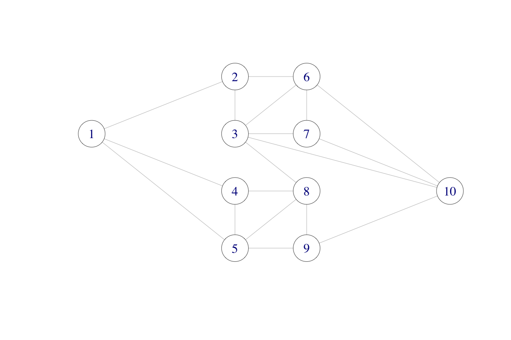

# Monte Carlo integration {#mci}

```{r}
#| label: mc-setup
#| include: false
library(tidyverse)

knitr::opts_chunk$set(
  cache = TRUE
)
```

Suppose that we are interested in numerically computing the integral

\[
\int h_0(x) \mathrm{d} x
\]

for some real valued function $h_0$. How should we then proceed? A classical
approach is to approximate the integral by a sum of the form

\[
\sum_{i=1}^N h_0(x_i) w_i.
\]

Here, the $x_i$-s are some, potentially carefully chosen, points in the
$x$-space and $w_i$ is the magnitude of the $x$-space where the values of $h_0$
are well approximated by the value $h_0(x_i)$. But how should we then in
practice choose the $x_i$-s, and how should we compute the $w_i$-s?

If $h_0(x) = h(x) f(x)$ for a probability density $f$, one possible idea is to
choose the $x_i$-s randomly and simply take $w_i = 1/N$. With $X_1, \ldots, X_N$
i.i.d. with density $f$, the *Monte Carlo* average satisfies that

\[
\hat{\mu}_{\textrm{MC}}   := \frac{1}{N} \sum_{i=1}^N h(X_i)
          \rightarrow \mu := \E(h(X_1))
                           = \int h(x) f(x) \ \mathrm{d}x
\]

for $N \to \infty$ by the law of large numbers
(LLN)\index{Law of Large Numbers}.

Monte Carlo integration is a clever idea, where we use the computer to simulate
i.i.d. random variables and compute an average as an approximation of an
integral. The idea may be applied in a statistical context, but also has
applications outside of statistics and can be a direct competitor to more
standard numerical integration techniques. By increasing $N$ the LLN tells us
that the average will eventually become a good approximation of the integral.
However, the LLN does not quantify how large $N$ should be, and a fundamental
question of Monte Carlo integration is therefore how to quantify the precision
of the average.

In this chapter, we will first deal with the quantification of the
precision---primarily via the asymptotic variance in the central limit theorem.
This will both quantify the precision for any specific Monte Carlo approximation
as well as provide a way to compare different Monte Carlo integration
techniques.

The direct usage of the average above as an approximation of the integral
requires that we can simulate directly from the distribution with density $f$.
This might be difficult, impossible, or might lead to Monte Carlo averages of
poor precision. To remedy these challenges, we will in Section
\@ref(importance-sampling) introduce importance sampling (and variations
thereof), which are techniques that simulate from a different distribution and
use a *weighted* average to obtain the approximation of the integral. First,
however, we will discuss the assessment of the precision of Monte Carlo
integration, which is a fundamental question for all Monte Carlo integration
techniques.

## Assessment

The error analysis of Monte Carlo integration differs from that of ordinary
(deterministic) numerical integration methods. For the latter, error analysis
provides bounds on the error of the computable approximation in terms of
properties of the function to be integrated. Such bounds provide a guarantee on
what the error at most can be. It is generally impossible to provide such a
guarantee when using Monte Carlo integration because the computed approximation
is by construction (pseudo)random. Thus the error analysis and assessment of the
precision of $\hat{\mu}_{\textrm{MC}}$ as an approximation of $\mu$ will be
probabilistic.

There are two main approaches. The first is to use approximations of the
distribution of $\hat{\mu}_{\textrm{MC}}$ to assess the precision by computing a
confidence interval. Alternatively, we can provide finite sample upper bounds,
known as *concentration inequalities*, on the probability that the error of
$\hat{\mu}_{\textrm{MC}}$ is larger than a given $\varepsilon$. A concentration
inequality can either be turned into a confidence interval or used directly to
answer questions such as: if I want the approximation to have an error smaller
than $\varepsilon = 10^{-3}$, how large does $N$ need to be to guarantee this
error bound with probability at least $99.99$%?

Confidence intervals are typically computed using the central limit theorem and
an estimated value of the asymptotic variance. A major deficit of this method is
that the central limit theorem does not provide bounds---only approximations
whose precision for a finite $N$ is often unclear. Thus without further
analysis, we cannot really be certain that the results from the central limit
theorem reflect the accuracy of $\hat{\mu}_{\textrm{MC}}$.

Concentration inequalities provide actual guarantees, albeit probabilistic. On
the other hand, they have various practical deficits: They are typically

1. problem-specific,
2. harder to derive,
3. involve constants that are difficult to compute or bound, and
4. tend to be pessimistic in real applications.

An intermediate approach is to use a simple and universal concentration
inequality, such as Chebyshev's inequality\index{Chebyshev's Inequality}, and
estimate the distribution specific constant (the variance) that enter into the
bound it provides.

We will illustrate the use of both the central limit theorem and Chebyshev's
inequality for computing confidence intervals for Monte Carlo averages, but the
focus in this chapter is on using the central limit theorem. We do, however,
emphasize the example in Section \@ref(hd-int) that shows how potentially
misleading confidence intervals can be when the convergence is slow. The most
notable practical challenge is estimation of the asymptotic variance, which can
be quite poorly estimated for heavy tailed distributions.

### Using the central limit theorem {#CLT-gamma}

The central limit theorem (CLT)\index{Central Limit Theorem} states that

\[
\hat{\mu}_{\textrm{MC}} = \frac{1}{N} \sum_{i=1}^N h(X_i) 
  \overset{\textrm{approx}} \sim \mathcal{N}(\mu, \sigma^2_{\textrm{MC}} / n)
\]

where

\[
\sigma^2_{\textrm{MC}} = \V(h(X_1)) = \int (h(x) - \mu)^2 f(x) \ \mathrm{d}x.
\]

We can estimate $\sigma^2_{\textrm{MC}}$ using the empirical variance

\[
\hat{\sigma}^2_{\textrm{MC}} = \frac{1}{N - 1} \sum_{i=1}^N (h(X_i) - 
    \hat{\mu}_{\textrm{MC}})^2.
\]

Then the variance of $\hat{\mu}_{\textrm{MC}}$ is estimated as
$\hat{\sigma}^2_{\textrm{MC}} / N$ and a standard *nominal* 95% confidence
interval for $\mu$ is

\[
\hat{\mu}_{\textrm{MC}} \pm 1.96 \frac{\hat{\sigma}_{\textrm{MC}}}{\sqrt{N}}.
\]

We illustrate the use of Monte Carlo integration and uncertainty quantification
via the CLT by computing the mean of a Gamma
distribution\index{Gamma Distribution} via Monte Carlo integration.

```{r, dependson="gammasim", echo=-1}
#| label: gammaMCCLT
#| fig-cap: Sample path with pointwise 95% confidence band for Monte Carlo
#|   integration of the mean of a gamma distributed random variable.
set.seed(123)
N <- 1000
x <- rgamma(N, 8) # h(x) = x
mu_hat <- (cumsum(x) / (1:N)) # Cumulative average
sigma_hat <- sd(x)
mu_hat[N] # Theoretical value 8
sigma_hat # Theoretical value sqrt(8) = 2.8284

ggplot(mapping = aes(1:N, mu_hat)) +
  geom_point() +
  geom_ribbon(
    mapping = aes(
      ymin = mu_hat - 1.96 * sigma_hat / sqrt(1:N),
      ymax = mu_hat + 1.96 * sigma_hat / sqrt(1:N)
    ),
    fill = "gray"
  ) +
  coord_cartesian(ylim = c(6, 10)) +
  geom_hline(yintercept = 8, color = "blue") +
  geom_line() +
  geom_point() +
  labs(y = expression(hat(mu)))
```

Figure \@ref(fig:gammaMCCLT) shows the pointwise 95% confidence band for the
Monte Carlo average. In this particular case, the CLT states that

\[
\P\left( \hat{\mu}_{\textrm{MC}} - 1.96 \frac{\hat{\sigma}_{\textrm{MC}}}{\sqrt{N}} 
  \leq 8 \leq 
  \hat{\mu}_{\textrm{MC}} + 1.96 \frac{\hat{\sigma}_{\textrm{MC}}}{\sqrt{N}}
  \right) \to 0.95
\]

for $N \to \infty$. This means that for $N$ sufficiently large (but we do not
know how large), the interval will cover the value $\mu = 8$ of the integral
with probability approximately 0.95. The actual coverage probability, that is,
the probability on the left hand side above, may thus not be exactly 0.95, and
for small $N$ it can sometimes be much smaller.

### Concentration inequalities

Since $h(X_1)$ is a real-valued random variable with finite second moment,
$\mu = \E(h(X_1))$ and $\sigma^2 = \V(h(X_1))$, Chebychev's inequality holds:

\[
\P(|h(X_1) - \mu| > \varepsilon) \leq \frac {\sigma^2}{\varepsilon^2}
\]

for all $\varepsilon > 0$. This inequality implies, for instance, that for the
simple Monte Carlo average we have the inequality

\[
\P(|\hat{\mu}_{\textrm{MC}} - \mu| > \varepsilon)
  \leq \frac{\sigma^2_{\textrm{MC}}}{n\varepsilon^2}.
\]

A common use of this inequality is to prove the *Law of Large
Numbers*:\index{Law of Large Numbers} for any $\varepsilon > 0$

\[
\P(|\hat{\mu}_{\textrm{MC}} - \mu| > \varepsilon) \rightarrow 0
\]

for $N \to \infty$. Or $\hat{\mu}_{\textrm{MC}}$ *converges in probability*
towards $\mu$ as $N$ tends to infinity.

The above convergence statement is a mathematical assurance that the Monte Carlo
average $\hat{\mu}_{\textrm{MC}}$ does, indeed, approximate $\mu$ for $N$ large.
We can interpret this as a proof that Monte Carlo integration is, at least
qualitatively, a sensible approach for numerical computation of an integral.

Chebychev's inequality does, additionally, give a quantitative statement about
how accurate $\hat{\mu}_{\textrm{MC}}$ is as an approximation of $\mu$.
Reorganizing the inequality above, we can write it as

\[
\P\left( \hat{\mu}_{\textrm{MC}} - \varepsilon \frac{\sigma_{\textrm{MC}}}{\sqrt{N}}
  \leq \mu \leq
  \hat{\mu}_{\textrm{MC}} + \varepsilon \frac{\sigma_{\textrm{MC}}}{\sqrt{N}}
  \right) > 1 - \frac{1}{\varepsilon^2}
\]

As an example, solving for $1/\varepsilon^2 = 0.05$ gives
$\epsilon = \sqrt{1 / 0.05} = 4.47$. Therefore, if we knew
$\sigma_{\textrm{MC}}$, the confidence interval

\[
\hat{\mu}_{\textrm{MC}} \pm 4.47 \frac{\sigma_{\textrm{MC}}}{\sqrt{N}}
\]

would have guaranteed coverage larger than 95% for all $N$. In practice, we
would have to estimate $\sigma_{\textrm{MC}}$, e.g., by the empirical standard
deviation $\hat{\sigma}_{\textrm{MC}}$, and we would effectively get the same
confidence interval as obtained by the CLT, except that the $0.975$ quantile
$1.96$ for the normal distribution is replaced by $4.47$. This gives a wider
interval---with some support from theory of having actual finite sample coverage
being at least 95%. However, due to using the plug-in estimate
$\hat{\sigma}_{\textrm{MC}}$ of the standard deviation, any finite sample
guarantees are, in fact, lost.

There are various strategies to obtain other concentration inequalities that do
not contain unknown and distribution-dependent constants, which can give actual
finite sample guarantees of coverage. These are beyond the scope of this book
and we will use confidence intervals based on the CLT throughout. They are easy
to use and practically useful, but just remember that they do not come with
guarantees---and for heavy tailed distributions they can be misleading, as we
show in Section \@ref(hd-int).

## Importance sampling

When we are only interested in Monte Carlo integration, we do, in fact, not need
to sample from the target distribution. We can sample from another distribution
and use reweighting to compute the integral of interest.

We first observe that

\begin{align}
\mu = \int h(x) f(x) \ \mathrm{d}x & = \int h(x) \frac{f(x)}{g(x)} g(x) \ \mathrm{d}x \\
& = \int h(x) w^*(x) g(x) \ \mathrm{d}x
\end{align}

whenever $g$ is a density fulfilling that

\[
g(x) = 0 \Rightarrow f(x) = 0.
\]

We call $g$ the *proposal* (or importance) density. With $X_1, \ldots, X_N$
i.i.d. with density $g$ we define the *weights* as

\[
w^*(X_i) = f(X_i) / g(X_i).
\]

The *importance sampling*\index{importance sampling} estimator is then

\[
\hat{\mu}_{\textrm{IS}}^* := \frac{1}{N} \sum_{i=1}^N h(X_i)w^*(X_i).
\]

It has mean $\mu$, and it follows again by the LLN\index{Law of Large Numbers}
that

\[
\hat{\mu}_{\textrm{IS}}^* \rightarrow \E(h(X_1) w^*(X_1)) = \mu.
\]

We will illustrate the use of importance sampling by computing the mean in the
gamma distribution via simulations from a Gaussian distribution, cf. Section
\@ref(CLT-gamma).

```{r, dependson="gammaMCCLT", echo=-1}
#| label: gamma-sim-IS
set.seed(123)
x <- rnorm(N, 10, 3)
w_star <- dgamma(x, 8) / dnorm(x, 10, 3)
mu_hat_IS <- (cumsum(x * w_star) / (1:N))
mu_hat_IS[N] # Theoretical value 8
```

To assess the precision of the importance sampling estimate via the CLT, we need
the variance of the average just as for plain Monte Carlo integration. By the
CLT, we have that

\[
\hat{\mu}_{\textrm{IS}}^* \overset{\textrm{approx}} \sim 
\mathcal{N}(\mu, \sigma^{*2}_{\textrm{IS}} / n)
\]

where

\[
\sigma^{*2}_{\textrm{IS}} = \V(h(X_1)w^*(X_1)) = \int (h(x) w^*(x) - \mu)^2 g(x) \ \mathrm{d}x.
\]

The importance sampling variance can be estimated similarly as the Monte Carlo
variance:

\[
\hat{\sigma}^{*2}_{\textrm{IS}} = \frac{1}{N - 1} \sum_{i=1}^N (h(X_i)w^*(X_i) - \hat{\mu}_{\textrm{IS}}^*)^2,
\]

and a 95% standard confidence interval is computed as

\[
\hat{\mu}^*_{\textrm{IS}} \pm 1.96 \frac{\hat{\sigma}^*_{\textrm{IS}}}{\sqrt{N}}.
\]

```{r, echo=1:2, dependson="gamma-sim-IS"}
#| label: gamma-IS-fig2
#| fig-cap: "Sample path with confidence band for importance sampling Monte Carlo integration of the mean of a gamma distributed random variable via simulations from a Gaussian distribution."
sigma_hat_IS <- sd(x * w_star)
sigma_hat_IS # Theoretical value ??
ggplot(mapping = aes(1:N, mu_hat_IS)) +
  geom_line() +
  geom_point() +
  coord_cartesian(ylim = c(6, 10)) +
  geom_ribbon(
    mapping = aes(
      ymin = mu_hat_IS - 1.96 * sigma_hat_IS / sqrt(1:N),
      ymax = mu_hat_IS + 1.96 * sigma_hat_IS / sqrt(1:N)
    ),
    fill = "gray"
  ) +
  labs(y = expression(hat(mu)[IS])) +
  geom_hline(yintercept = 8, color = "blue") +
  geom_line() +
  geom_point()
```

It may happen that $\sigma^{*2}_{\textrm{IS}} > \sigma^2_{\textrm{MC}}$ or
$\sigma^{*2}_{\textrm{IS}} < \sigma^2_{\textrm{MC}}$ depending on $h$ and $g$,
but by choosing $g$ cleverly, so that $h(x) w^*(x)$ becomes as constant as
possible, importance sampling can often reduce the variance compared to plain
Monte Carlo integration.

For the mean of the gamma distribution above, $\sigma^{*2}_{\textrm{IS}}$ is
about 50% larger than $\sigma^2_{\textrm{MC}}$, so we loose precision by using
importance sampling this way when compared to plain Monte Carlo integration. In
Section \@ref(network) we consider a different example where we achieve a
considerable variance reduction by using importance sampling.

### Self-normalized importance sampling

A slight modification of the importance sampling estimator consists of
normalizing the weights so that they take values in $[0, 1]$ and sum to $1$.
This can sometimes be beneficial in itself, but it also allows for the use of
importance sampling when the target density is only known up to a normalization
constant.

Suppose that the target density is $f = c^{-1} q$ with $c$ unknown. Then

\[
c = \int q(x) \ \mathrm{d}x = \int \frac{q(x)}{g(x)} g(x) \ d x,
\]

and

\[
\mu = \frac{\int h(x) w^*(x) g(x) \ d x}{\int w^*(x) g(x) \ d x},
\]

where $w^*(x) = q(x) / g(x).$

If $X_1, \ldots, X_N$ are i.i.d. from the distribution with density $g$, the
self-normalized importance sampling estimate of $\mu$ can be computed as

\[
\hat{\mu}_{\textrm{IS}} = \frac{\sum_{i=1}^N h(X_i) w^*(X_i)}{\sum_{i=1}^N w^*(X_i)} = \sum_{i=1}^N h(X_i) w(X_i),
\]

where $w^*(X_i) = q(X_i) / g(X_i)$ and

\[
w(X_i) = \frac{w^*(X_i)}{\sum_{i=1}^N w^*(X_i)}
\]

are the *normalized weights*. This works regardless of the value of the
normalizing constant $c$, and it actually works if also $g$ is not normalized.

Revisiting the mean of the gamma distribution, we can implement importance
sampling via sampling from a Gaussian distribution but using weights computed
without the normalization constants.

```{r, dependson="gamma-sim-IS"}
#| label: gamma-sim-ISw
w_star <- numeric(N)
x_pos <- x[x > 0]
w_star[x > 0] <- exp((x_pos - 10)^2 / 18 - x_pos + 7 * log(x_pos))
mu_hat_IS <- cumsum(x * w_star) / cumsum(w_star)
mu_hat_IS[N] # Theoretical value 8
```

The variance of the IS estimator with normalized weights is a little more
complicated, because the estimator is a ratio of random variables. From the
multivariate CLT

\[
\frac{1}{N} \sum_{i=1}^N \left(\begin{array}{c}
 h(X_i) w^*(X_i) \\
 w^*(X_i) 
\end{array}\right) \overset{\textrm{approx}}{\sim} 
\mathcal{N}\left( c \left(\begin{array}{c} \mu  \\   {1} \end{array}\right),
\frac{1}{N} \left(\begin{array}{cc} \sigma^{*2}_{\textrm{IS}} & \gamma \\ \gamma & \sigma^2_{w^*}
\end{array} \right)\right),
\]

where

\begin{align}
  \sigma^{*2}_{\textrm{IS}} & = \V(h(X_1)w^*(X_1)) \\
  \gamma                    & = \cov(h(X_1)w^*(X_1), w^*(X_1)) \\
  \sigma_{w^*}^2            & = \V (w^*(X_1)).
\end{align}

We can then apply the $\Delta$-method with $t(x, y) = x / y$. Note that
$Dt(x, y) = (1 / y, - x / y^2)$, whence

\[
Dt(c\mu, c)   \left(\begin{array}{cc} \hat{\sigma}^{*2}_{\textrm{IS}} & \gamma \\ \gamma & \sigma^2_{w^*}
\end{array} \right) Dt(c\mu, c)^T = c^{-2} (\sigma^{*2}_{\textrm{IS}} + \mu^2 \sigma_{w^*}^2 - 2 \mu \gamma).
\]

By the $\Delta$-method

\[
\hat{\mu}_{\textrm{IS}} \overset{\textrm{approx}}{\sim} 
\mathcal{N}(\mu, c^{-2} (\sigma^{*2}_{\textrm{IS}} + \mu^2 \sigma_{w^*}^2 - 2 \mu \gamma) / n).
\]

The unknown quantities in the asymptotic variance must be estimated using, e.g.,
their empirical equivalents, and if $c \neq 1$ (we have used unnormalized
densities) it is necessary to estimate $c$ as
$\hat{c} = \frac{1}{N} \sum_{i=1}^N w^*(X_i)$ to compute an estimate of the
variance.

For the example with the mean of the gamma distribution, we find the following
estimate of the variance.

```{r, dependson="gamma-sim-ISw"}
#| label: ISw-emp-estimates
c_hat <- mean(w_star)
sigma_hat_IS <- sd(x * w_star)
sigma_hat_w_star <- sd(w_star)
gamma_hat <- cov(x * w_star, w_star)
sigma_hat_IS_w <- sqrt(
  sigma_hat_IS^2 +
    mu_hat_IS[N]^2 * sigma_hat_w_star^2 -
    2 * mu_hat_IS[N] * gamma_hat
) /
  c_hat
sigma_hat_IS_w
```

```{r, dependson="gamma-sim-ISw"}
#| label: gamma-IS-fig3
#| echo: false
#| fig-cap: Sample path with confidence band for importance sampling Monte Carlo
#|   integration of the mean of a gamma distributed random variable via simulations
#|   from a Gaussian distribution and using normalized weights.
ggplot(mapping = aes(1:N, mu_hat_IS)) +
  geom_line() +
  geom_point() +
  coord_cartesian(ylim = c(6, 10)) +
  geom_ribbon(
    mapping = aes(
      ymin = mu_hat_IS - 1.96 * sigma_hat_IS_w / sqrt(1:N),
      ymax = mu_hat_IS + 1.96 * sigma_hat_IS_w / sqrt(1:N)
    ),
    fill = "gray"
  ) +
  labs(y = expression(hat(mu)[IS])) +
  geom_hline(yintercept = 8, color = "blue") +
  geom_line() +
  geom_point()
```

In this example, the variance when using normalized weights is a little lower
than when using unnormalized weights, but still larger than the variance for the
plain Monte Carlo average.

### Diagnostics

Importance sampling relies on varying weights to compute its average and it is
not uncommon to see some of the weights dominating the estimate. In extreme
cases, a single data point can even be effectively responsible for the
estimator. You might think that we could catch this issue by assessing the
variance of $\hat{\mu}^*_{\textrm{IS}}$ (or $\hat{\mu}_{\textrm{IS}}$).
Unfortunately, the estimate of the variance is *also* based on the weights,
which means that it, too, can be unreliable.

One intuitive and simple alternative to diagnose importance sampling is to
visualize the weights, for instance with a histogram or boxplot. In the next
example, we show an example of how this might work in practice.

::: {.example .boxed #is-weights-histogram}
Suppose that

$$
X \sim \mathcal{N}(0, 1)
$$

and that we want to estimate $\operatorname{E}[f(X)]$ where $f(X)$ is large near
the origin.

Let us assume we use a proposal density $g(x)$ from

$$
\mathcal{N}(\mu, 1)
$$

with large $|\mu|$. Then the proposal weights are given by

$$
w^*(x) = \frac{f(x) \phi(x; 0, 1)}{\phi(x; \mu, 1)},
$$

where $\phi(\cdot; m, \sigma^2)$ is the density of a Gaussian distribution with
mean $m$ and variance $\sigma^2$. Since $f(x)$ is large near the origin, the
weights will be large for samples that are close to the origin and small for
samples that are far from the origin. If $|\mu|$ is large, then most samples
will end up far from the origin (Figure \@ref(poor-is-demo)).

```{r}
#| label: poor-is-demo-setup
#| echo: false
set.seed(1)
n <- 1000
mu <- 2
x <- rnorm(n, mean = mu)

grid <- tibble(x = seq(-5, 8, length.out = 200))
grid$target <- dnorm(grid$x, mean = 0, sd = 1)
grid$proposal <- dnorm(grid$x, mean = mu, sd = 1)
```

```{r}
#| label: poor-is-demo
#| echo: false
#| message: false
#| warning: false
#| fig-cap: Target (blue, dashed) and proposal (orange) densities with samples
#|   from the proposal distribution.
library(patchwork)
library(dplyr)

tibble(
  x = grid$x,
  target = grid$target,
  proposal = grid$proposal
) |>
  pivot_longer(
    c(target, proposal),
    names_to = "density",
    values_to = "value"
  ) |>
  ggplot(aes(x, value, color = density, linetype = density)) +
  geom_line() +
  geom_rug(data = tibble(x = x), aes(x = x), inherit.aes = FALSE, alpha = 0.2) +
  scale_color_manual(
    values = c(target = "black", proposal = "dark orange")
  ) +
  scale_linetype_manual(values = c(target = "dashed", proposal = "solid")) +
  labs(
    x = "x",
    y = "Density",
    color = NULL,
    linetype = NULL
  )

target_density <- function(x) dnorm(x, mean = 0, sd = 1)
proposal_density <- function(x) dnorm(x, mean = mu, sd = 1)
f <- function(x) exp(-(x^2) / 2) # Large near origin

w_star <- target_density(x) / proposal_density(x)
values <- f(x)
estimate <- sum(values * w_star) / sum(w_star)

df <- tibble(w_star = w_star)
```

Since the weights are derived from the ratio of the target and proposal
densities, they will be large for samples close to the origin and
small for samples far from the origin. In this example, most of the
samples will be far from the origin, leading to a situation where a few weights
dominate the estimate. This phenomenon is known as *weight degeneracy*\index{weight degeneracy}.

Visualizing the normalized weights in Figure \@ref(fig:poor-is-weight-plots), we
see that the distribution is skewed and that a few of the weights are
responsible for a major part of the estimate.

```{r}
#| label: poor-is-weight-plots
#| echo: false
#| fig-cap: "Histogram and boxplot of importance weights, showing weight degeneracy."
#| warning: false
#| message: false
p1 <- ggplot(df, aes(w_star)) +
  geom_histogram() +
  lims(x = c(-5, NA)) +
  labs(
    x = "Importance Weights",
    y = "Frequency"
  )

p2 <- ggplot(df, aes(w_star)) +
  geom_boxplot(alpha = 0.5) +
  scale_y_discrete() +
  lims(x = c(-5, NA)) +
  labs(
    x = "Importance Weights"
  )

p1 + p2 + plot_layout(heights = c(2, 1), axes = "collect")
```
:::

Another useful visualization is to plot a weighted histogram, which gives an
indication of where the samples that contribute most to the estimate are
located. See Figure \@ref(fig:weighted-histogram) for an example of a weighted
histogram of the samples from the proposal distribution, where the weights are
given by the importance weights.

```{r}
#| label: weighted-histogram
#| fig-cap: Weighted histogram of samples from the proposal distribution, where
#|   the  weights are given by the importance weights.
df <- data.frame(x = x, w = w_star)
df_grid <- tibble(
  x = seq(-3, 3, length.out = 200),
  integrand = target_density(x) * f(x)
)

ggplot(df, aes(x)) +
  geom_histogram(aes(weight = w, y = after_stat(density)), bins = 30) +
  geom_line(aes(y = integrand), color = "dark orange", data = df_grid) +
  labs(y = "Weighted count")
```

One measure we can use to quantify the weight degeneracy we saw in the example
from the previous section is *effective sample size* (ESS), which is defined as

$$
\mathrm{ESS} = \frac{1}{\sum_{i=1}^n w_i^2} = \frac{\left(\sum_{i=1}^n w^*_i\right)^2}{\sum_{i=1}^n ({w^*_i})^2}.
$$

ESS can be interpreted as the number of samples from the target distribution
that would give us the same variance as our importance sampling estimator. If
all weights are equal, $\mathrm{ESS} = n$. But if one weight dominates, ESS can
be much lower, in the worst case close to one, indicating that the estimate
cannot be trusted.

A measure that's closely related to ESS is the *coefficient of
variation*\index{coefficient of variation} (CV) of the weights, which is defined
as

$$
\mathrm{CV} = \frac{\sqrt{\frac{1}{n} \sum_{i=1}^n (w_i^* - \bar{w}^*)^2}}{\bar{w}^*}
$$

where $\bar{w}^* = n^{-1} \sum_{i=1}^n w_i^*$ is the mean of the weights. It can
also be computed directly from normalized weights via

$$
\mathrm{CV} = \sqrt{n \sum_{i=1}^n w_i^2 - 1}.
$$

The CV is directly related to ESS via the formula

$$
\mathrm{ESS} = \frac{n}{1 + \mathrm{CV}^2}.
$$

CV serves as a unit-less measure of the variability of the weights, and a high
CV indicates that the weights are highly variable, which can lead to weight
degeneracy and unreliable estimates in importance sampling.

Unfortunately, it is hard to give general guidelines for what values of ESS and
CV are acceptable, as it depends on the specific problem at hand. But as a rule
of thumb, an ESS that is much smaller than the number of samples $n$ and a CV
that is much larger than 1 can be signs of weight degeneracy and unreliable
estimates.

In the following code snippet, we compute the ESS and CV for the example above.

```{r}
#| label: ess-computation
w <- w_star / sum(w_star)
ess <- 1 / sum(w^2)
cv <- sqrt(n * sum(w^2) - 1)
```

In our case, the ESS is `r round(ess, 1)` out of $1000$ samples, which is quite
low and suggests that the estimate may be unreliable. The CV is
`r round(cv, 2)`, which is quite high and also suggests that the weights are
highly variable.

ESS and CV do not offer definitive answers as to the quality of our IS estimate.
One reason for that is that they are based on the weights, which depend on the
target and proposal densities---not on the function $h$ that we are integrating.

A third, and final, option that we propose for diagnosing the quality of the
importance sampling estimator is to simply compare with plain Monte Carlo
integration. You may, for instance, run a pilot run of plain Monte Carlo
integration and compare the estimate and confidence interval with the estimate
and confidence interval from importance sampling. If the two are very different,
it may be a sign that the importance sampling estimator is unreliable.

### Picking the proposal distribution

Being able to diagnose the quality of the importance sampling estimator lays the
foundation for picking good proposals. We have already seen that a bad choice of
proposal can lead to weight degeneracy and unreliable estimates. On the other
hand, a good choice of proposal distribution can lead to a significant reduction
in variance compared to plain Monte Carlo integration.

As we have discussed, the optimal proposal is proportional to $|h(x)| f(x)$. But
this fact is only helpful in theory since it depends on the integral we want to
compute (which we do not know). In practice, we need to pick a proposal
distribution based on heuristics and algorithm and in this and the next section
(Section \@ref(is-strategies)) we will discuss how to do this in practice.
First, we will discuss some general principles for picking a good proposal
distribution. These are not hard and fast rules, but they can serve as useful
guidelines when picking a proposal distribution. The principles are to

- ensure support coverage,
- match the shape of the integrand, and
- prefer heavier tails than the target distribution.

#### Cover the support of the target distribution

The first principle for picking a good proposal distribution is to ensure that
the proposal distribution covers the support of the target distribution. If the
proposal distribution does *not*, then the importance sampling estimator might
be biased or have high variance.

For a simple example, suppose that our target distribution is a standard
Gaussian distribution and that we use a uniform distribution on the interval
$[-2, 2]$ as our proposal distribution (Figure
\@ref(fig:support-coverage-demo-setup)).

```{r}
#| label: support-coverage-demo-setup
#| fig-cap: Target (black) and proposal (orange) densities for a demonstration
#|   of the importance of support coverage in importance sampling.
#| fig-height: 2.5
x <- seq(-4, 4, length.out = 1000)

df <- tibble(
  x = x,
  target = dnorm(x),
  proposal = dunif(x, -2, 2)
)

df_long <- df |>
  tidyr::pivot_longer(-x)

ggplot(df_long, aes(x, value, color = name)) +
  geom_line() +
  scale_color_manual(
    values = c(target = "black", proposal = "dark orange")
  ) +
  labs(y = "density", color = NULL, linetype = NULL)
```

If we are looking to just estimate the mean of the target distribution, then
this proposal will actually work reasonably well, but if we are looking to for
instance estimate the tail probability $\P(X > 2.5)$ then the uniform proposal
will fail completely because it will never generate samples in the region.

```{r}
#| label: support-coverage-demo
set.seed(53)
n <- 1e4

# sample from bad proposal
x_bad <- runif(n, -2, 2)

# weights
w_bad <- dnorm(x_bad) / dunif(x_bad, -2, 2)

# estimator
h <- function(x) as.numeric(x > 2.5)

est_bad <- mean(h(x_bad) * w_bad)
est_bad
```

The fix is to use a proposal distribution that covers the entire support of the
target distribution, which, in this case, is a trivial matter. But in more
complex, high-dimensional problems, this issue might be harder to diagnose. The
*opposite* mistake of using a proposal with support larger than needed is
usually safer than missing support, but it can still be inefficient: many draws
fall in low-contribution regions, increasing weight variability and often
estimator variance too.

#### Match the shape of the integrand

Suppose we want to estimate $\mu = \P(X > 2)$ where $X \sim \mathcal{N}(0, 1)$.
The integrand is then $f(x) 1(x > 2)$. If we now pick the proposal distribution
to be a Gaussian distribution with mean $0$ and standard deviation $1$,
then---even though the proposal distribution both covers the support and is in
fact exactly the same as the target distribution---the importance sampling
estimator will still have high variance. The reason for this is that the
proposal distribution fails to match the shape of the integrand, which is zero
for $x \leq 2$ and equal to the target density for $x > 2$.
\@ref(fig:shape-matching-demo) shows the target density, the integrand, and the
proposal distribution for this example.

```{r}
#| label: shape-matching-demo
#| echo: false
#| fig-height: 2.5
#| fig-width: 5
#| fig-cap: Integrand (black) and proposal density
#|   (orange) for a demonstration of the importance of matching the shape of the
#|   integrand in importance sampling.
x <- seq(-3, 6, length.out = 1000)

f <- dnorm(x)
f_h <- f * (x > 2)

df <- tibble(
  x = x,
  integrand = f_h,
  proposal = dnorm(x, 0, 1)
) |>
  pivot_longer(-x)

ggplot(df, aes(x, value, color = name, linetype = name)) +
  geom_line() +
  scale_color_manual(
    values = c(integrand = "black", proposal = "dark orange")
  ) +
  labs(y = "density", color = NULL, linetype = NULL)
```

Later on, we will see that we can use the Laplace approximation to pick a
proposal distribution that better matches the shape of the integrand, which can
lead to a significant reduction in variance compared to plain Monte Carlo
integration.

#### Prefer heavier tails than the target distribution

Consider estimating the tail probability $\P(X) > 4$ where
$X \sim \operatorname{Gamma}(2, 1)$. If we choose a proposal density from
$\mathcal{N}(3, 1)$, then the proposal distribution will have lighter tails than
the target distribution, which means that it will not generate enough samples in
the tail region where the integrand is large. In this case, the importance
sampling estimator will have high variance, and it may even be biased if the
proposal distribution does not generate any samples in the tail region.

```{r}
#| label: tail-matching-demo
#| echo: false
#| fig-height: 2.5
#| fig-width: 5
#| fig-cap: Integrand (solid black) and proposal density (dashed orange) for a
#|   demonstration of the importance of matching the tails of the integrand in
#|   importance sampling.
x <- seq(0, 10, length.out = 1000)
f <- dgamma(x, shape = 2, rate = 1)

f_h <- f * (x > 3)
g <- dnorm(x, mean = 3, sd = 1)

df <- tibble(
  x = x,
  integrand = f_h,
  proposal = g
) |>
  pivot_longer(-x)

ggplot(df, aes(x, value, color = name, linetype = name)) +
  geom_line() +
  scale_color_manual(
    values = c(integrand = "black", proposal = "dark orange")
  ) +
  labs(y = "density", color = NULL, linetype = NULL)
```

If we next try to estimate $\P(X > 4)$ using a Gaussian proposal distribution
with mean $3$, we will find that the importance sampling estimator has high
variance, because the proposal distribution has lighter tails than the target
distribution, which means that it does not generate enough samples in the tail
region where the integrand is large.

```{r}
#| label: tail-matching-demo-IS
#| fig-height: 2
#| fig-width: 5
set.seed(49)

n <- 1e3
x <- rnorm(n, mean = 3, sd = 1)
w <- dgamma(x, shape = 2, rate = 1) / dnorm(x, mean = 3, sd = 1)

ggplot(tibble(w = w), aes(w)) +
  geom_boxplot(alpha = 0.4) +
  scale_y_discrete() +
  labs(x = "Importance Weights")
```

### Strategies for picking a good proposal distribution {#is-strategies}

Having discussed both how to diagnose the quality of the importance sampling
estimator and the principles for picking a good proposal distribution, we can
now turn to some specific strategies for picking a good proposal distribution,
including:

- the Laplace approximation,
- adaptive importance sampling, and
- mixture proposals.

#### The Laplace approximation

It is often the case that we don't know the mode of the integrand, which means
that we cannot efficiently pick a proposal to match its bulk. An alternative is
to use the Laplace approximation: a Gaussian approximation to the integrand that
is centered at the mode and has a covariance matrix given by the inverse of the
Hessian of the negative log of the integrand. The resulting Gaussian
distribution can then be used as the proposal. It proceeds as follows:

1. Find the mode $x^* = \arg\max_x |h(x)|f(x)$.
2. Compute the Hessian $H$ of the first-order Taylor approximation of
   $-\log |h(x)| f(x)$ around $x^*$.
3. Use $\mathcal{N}(x^*, H^{-1})$ as proposal distribution.

To show how this works in practice, we will consider the following example.

::: {.example .boxed #laplace-approximation-example}
Let our target density come from a $\mathrm{Gamma}(3,1)$ distribution, with
$$
f(x) = \frac{1}{2} x^2 e^{-x}, \quad x > 0.
$$

And assume we want to compute the second moment, so that $h(x) = x^2$.
Then the integrand is
$$
|h(x)| f(x) = \tfrac{1}{2} x^4 e^{-x}.
$$

The mode is at $x^* = 4$ and the Hessian of $-\log |h(x)| f(x)$ at $x^*$ is
$$
H = \frac{4}{(x^*)^2} = \frac 1 4.
$$

So the Laplace approximation is $\mathcal{N}(4, 2^2)$. In
Figure \@ref(fig:laplace-approximation-demo) we see the integrand and its
Laplace approximation. The Laplace approximation is a good match near the mode,
but it does not capture the tail behavior of the integrand very well.

```{r}
#| label: laplace-approximation-demo
#| echo: false
#| warning: false
#| fig-height: 2.5
#| fig-width: 5
#| fig-cap: >-
#|   Integrand (solid black) and Laplace approximation (dashed orange)
#|   for a $\operatorname{Gamma}(3,1)$ target with $h(x)=x^2$.
f_density <- function(x) dgamma(x, shape = 3, rate = 1) # Gamma(3,1)
integrand <- function(x) f_density(x) * x^2

x_star <- 4
H <- 4 / (x_star^2)

laplace_approx <- function(x) {
  integrand(x_star) * exp(-0.5 * H * (x - x_star)^2)
}

x_grid <- seq(-5, 15, length.out = 400)

df <- tibble(
  x = x_grid,
  integrand = integrand(x_grid),
  laplace = laplace_approx(x_grid),
) |>
  pivot_longer(
    cols = c(integrand, laplace),
    names_to = "Density",
    values_to = "value"
  ) |>
  filter(value > 0)

# Plot
ggplot(df, aes(x = x, y = value, color = Density, linetype = Density)) +
  geom_line() +
  scale_color_manual(
    values = c(integrand = "black", laplace = "dark orange")
  ) +
  labs(
    y = "Density",
    color = NULL,
    linetype = NULL
  )
```

:::

#### Adaptive importance sampling

The basic idea of adaptive importance sampling is to iteratively update the
proposal distribution based on the samples generated in previous iterations. The
algorithm proceeds as follows:

1. Choose an initial proposal distribution $g_0(x)$.
2. Draw samples from $g_0$ and compute weights.
3. Update the proposal distribution parameters based on weighted samples.
4. Repeat steps 2-3 until convergence.

How you update the proposal distribution can vary, but a common approach is
moment-matching, where you update the parameters of the proposal distribution to
match the weighted mean and covariance of the samples.

At iteration $t$, draw samples $x_1, \ldots, x_n \sim g_t(x)$ and compute
weights
$$
w_i^* = \frac{f(X_i)}{g_t(X_i)}.
$$

In this example we take $h \equiv 1$, so the integrand is proportional to the
target density $f$ and adapting toward $f$ is appropriate.

For a bimodal target, a single Gaussian proposal is often too rigid and may end
up as a compromise between modes. In this example, we instead use a
two-component Gaussian mixture proposal
$$
g_t(x) = \pi_{t,1} \phi(x; \mu_{t,1}, \sigma_{t,1}^2) +
\pi_{t,2} \phi(x; \mu_{t,2}, \sigma_{t,2}^2),
$$
and adapt $(\pi_{t,k}, \mu_{t,k}, \sigma_{t,k})_{k=1}^2$ after each iteration.
The update uses weighted responsibilities, so each component moves toward one
mode and we can better track the target's multimodal shape.

```{r}
#| echo: false
#| label: adaptive-importance-demo
f_density <- function(x) 0.4 * dnorm(x, -2, 1) + 0.6 * dnorm(x, 3, 0.5)

# Mixture density and simulator helpers
dmixnorm <- function(x, pi, mu, sd) {
  pi[1] *
    dnorm(x, mean = mu[1], sd = sd[1]) +
    pi[2] * dnorm(x, mean = mu[2], sd = sd[2])
}

rmixnorm <- function(n, pi, mu, sd) {
  z <- sample.int(2, size = n, replace = TRUE, prob = pi)
  rnorm(n, mean = mu[z], sd = sd[z])
}

# Adaptive importance sampling with a two-component Gaussian mixture proposal
adaptive_is_mixture <- function(
  n = 1000,
  n_iter = 5,
  pi_init = c(0.5, 0.5),
  mu_init = c(-1, 1),
  sd_init = c(1.5, 1.5)
) {
  proposals <- list()
  samples <- list()
  w_norm_list <- list()

  pi_q <- pi_init / sum(pi_init)
  mu_q <- mu_init
  sd_q <- pmax(sd_init, 0.1)

  for (i in 1:n_iter) {
    # Draw from current proposal and compute IS weights
    x <- rmixnorm(n, pi = pi_q, mu = mu_q, sd = sd_q)
    g_x <- dmixnorm(x, pi = pi_q, mu = mu_q, sd = sd_q)
    w_star <- f_density(x) / g_x
    w_norm <- w_star / sum(w_star)

    proposals[[i]] <- list(pi = pi_q, mu = mu_q, sd = sd_q)
    samples[[i]] <- x
    w_norm_list[[i]] <- w_norm

    # Responsibilities under current proposal
    r1 <- pi_q[1] * dnorm(x, mean = mu_q[1], sd = sd_q[1]) / g_x
    r2 <- pi_q[2] * dnorm(x, mean = mu_q[2], sd = sd_q[2]) / g_x

    # Importance-weighted responsibility update
    a1 <- w_norm * r1
    a2 <- w_norm * r2

    n1 <- max(sum(a1), 1e-8)
    n2 <- max(sum(a2), 1e-8)

    mu1_new <- sum(a1 * x) / n1
    mu2_new <- sum(a2 * x) / n2
    sd1_new <- sqrt(sum(a1 * (x - mu1_new)^2) / n1)
    sd2_new <- sqrt(sum(a2 * (x - mu2_new)^2) / n2)

    pi_q <- c(n1, n2)
    pi_q <- pi_q / sum(pi_q)
    mu_q <- c(mu1_new, mu2_new)
    sd_q <- pmax(c(sd1_new, sd2_new), 0.1)
  }

  list(proposals = proposals, samples = samples, weights = w_norm_list)
}

# Run adaptive importance sampling
set.seed(123)
res <- adaptive_is_mixture(n = 1000, n_iter = 5)

# Plotting function for a given iteration
plot_step <- function(iter) {
  proposal <- res$proposals[[iter]]
  x_grid <- seq(-6, 6, length.out = 400)
  df <- tibble(
    x = x_grid,
    target = f_density(x_grid),
    proposal = dmixnorm(
      x_grid,
      pi = proposal$pi,
      mu = proposal$mu,
      sd = proposal$sd
    )
  ) |>
    pivot_longer(
      cols = c(target, proposal),
      names_to = "Density",
      values_to = "value"
    )

  # Calculate ESS and CV for current iteration
  w <- res$weights[[iter]]
  n <- length(w)
  ess <- (sum(w))^2 / sum(w^2)
  cv <- sqrt(mean((w - mean(w))^2)) / mean(w)

  ggplot(df, aes(x = x, y = value, color = Density, linetype = Density)) +
    geom_line() +
    scale_color_manual(
      values = c(target = "black", proposal = "dark orange")
    ) +
    scale_linetype_manual(values = c(target = "solid", proposal = "dashed")) +
    lims(x = c(-6, 6), y = c(0, 0.6)) +
    labs(
      y = "Density",
      linetype = NULL,
      color = NULL,
      title = sprintf("Step %.0f", iter),
      subtitle = bquote(
        "ESS = " *
          .(sprintf("%.0f", ess)) *
          ", CV = " *
          .(sprintf("%.1f", cv)) *
          ", " *
          pi *
          " = " *
          "(" *
          .(sprintf("%.2f", proposal$pi[1])) *
          ", " *
          .(sprintf("%.2f", proposal$pi[2])) *
          ")"
      )
    )
}
```

```{r}
#| label: adaptive-importance
#| echo: false
#| cache: false
#| fig-cap: Adaptive importance sampling with a two-component Gaussian mixture
#|   proposal.
p1 <- plot_step(1)
p2 <- plot_step(2)
p3 <- plot_step(3)
p4 <- plot_step(4)

p1 + p2 + p3 + p4 + plot_layout(ncol = 2, axes = "collect", guides = "collect")
```

Each panel in Figure \@ref(fig:adaptive-importance) shows one adaptation step:
the solid black curve is the target and the dashed blue curve is the current
proposal. A successful adaptation is one where the proposal progressively covers
both modes rather than concentrating between them. We can also track this
numerically: ESS should increase, CV should decrease, and the mixture weights
$(\pi_1, \pi_2)$ should stabilize as the proposal settles.

#### Mixture proposals

Another strategy for picking a good proposal distribution is to use a mixture of
distributions as the proposal distribution. This can be particularly useful when
the target distribution is multimodal or has complex structure that is difficult
to capture with a single distribution.

It is also the basis for *defensive importance sampling* [@hesterberg1995],
where you use a mixture of the target distribution and a more diffuse
distribution as the proposal distribution. This can help to mitigate the issue
of weight degeneracy, because it ensures that the proposal distribution has
heavier tails than the target distribution, which can lead to more stable
estimates.

Recall the earlier Gamma(8,1) importance sampling example in Section
\@ref(importance-sampling), where we estimated the mean using
$g(x) = \mathcal{N}(10, 3^2)$. To make the effect of defensive importance
sampling clearer, we now use a narrower baseline proposal.

Instead we can use a mixture

$$
g_{\mathrm{mix}}(x) = 0.8 \cdot \mathcal{N}(10, 2^2) + 0.2 \cdot \mathcal{N}(10, 10^2)
$$

with heavier tails to ensure coverage.

To see the practical effect, we compare the unnormalized importance weights
$w^*(x) = f(x)/g(x)$ under the narrower Gaussian proposal $\mathcal{N}(10, 2^2)$
and the defensive mixture proposal. If the mixture is helpful, we should see
fewer extreme weights, together with a larger ESS and smaller CV.

```{r}
#| label: gamma-defensive-fig
#| fig-cap: Comparison of weight behavior for a narrow Gaussian proposal and a
#|   defensive mixture proposal. Bottom panels show sampled importance weights
#|   on a log scale; each facet also reports effective sample size (ESS) and the
#|   coefficient of variation (CV) of the weights.
#| echo: false
#| fig-height: 3.5
set.seed(1234)
B <- 1000
n_comp <- rbinom(B, 1, 0.8)
x_norm <- rnorm(B, mean = 10, sd = 2)
x_mix <- rnorm(B, mean = 10, sd = 2)
x_mix[n_comp == 0] <- rnorm(sum(n_comp == 0), mean = 10, sd = 10)

g_norm_x <- dnorm(x_norm, 10, 2)
g_mix_x <- 0.8 * dnorm(x_mix, 10, 2) + 0.2 * dnorm(x_mix, 10, 10)

w_norm <- dgamma(x_norm, 8) / g_norm_x
w_mix <- dgamma(x_mix, 8) / g_mix_x

ess_norm <- (sum(w_norm)^2) / sum(w_norm^2)
ess_mix <- (sum(w_mix)^2) / sum(w_mix^2)
cv_norm <- sd(w_norm) / mean(w_norm)
cv_mix <- sd(w_mix) / mean(w_mix)

label_norm <- sprintf(
  "Normal proposal\nESS = %.0f, CV = %.1f",
  ess_norm,
  cv_norm
)
label_mix <- sprintf("Mixture proposal\nESS = %.0f, CV = %.1f", ess_mix, cv_mix)

z <- seq(-10, 30, length.out = 300)
f_x <- dgamma(z, 8)
g_norm <- dnorm(z, 10, 2)
g_mix <- 0.8 * dnorm(z, 10, 2) + 0.2 * dnorm(z, 10, 10)

p1 <- tibble(x = z, target = f_x, normal = g_norm, mixture = g_mix) |>
  pivot_longer(c(target, normal, mixture)) |>
  ggplot(aes(x, value, color = name, linetype = name)) +
  geom_line() +
  guides(color = guide_legend(position = "inside")) +
  scale_color_manual(
    values = c(target = "black", normal = "steelblue", mixture = "dark orange")
  ) +
  scale_linetype_manual(
    values = c(target = "solid", normal = "dashed", mixture = "solid")
  ) +
  theme(legend.position.inside = c(0.78, 0.8)) +
  labs(y = "Density", color = NULL, linetype = NULL)

p2 <- tibble(
  w = c(w_norm, w_mix),
  proposal = c(rep(label_norm, B), rep(label_mix, B))
) |>
  ggplot(aes(w)) +
  geom_histogram(bins = 30) +
  scale_x_log10() +
  facet_wrap(~proposal, ncol = 1) +
  labs(x = "Importance weights (log scale)", y = "Count")

p1 | p2 + plot_layout(axes = "collect")
```

### Computing a high-dimensional integral {#hd-int}

To further illustrate the usage, but also the limitations, of Monte Carlo
integration and importance sampling, suppose we want to compute the
$p$-dimensional integral

\[
\int h_0(x) \mathrm{d} x
\]

w.r.t. Lebesgue measure in $\mathbb{R}^p$ for some integrable function $h_0$. We
use the same idea as in importance sampling to rewrite the integral as an
expectation w.r.t. a probability distribution. For simplicity, let us focus on
sampling from a standard Gaussian distribution $\mathcal{N}(0, I_p)$, with
density $g(x) = (2\pi)^{-p/2} \exp(-\|x\|_2^2/2)$. Then

\begin{align*}
  \int h_0(x) \mathrm{d} x & = \int h_0(x) \frac{g(x)}{g(x)} \mathrm{d} x \\
  & = (2\pi)^{p/2} \int h(x) g(x) \mathrm{d} x \\
   & =  (2\pi)^{p/2} \E( h(X)),
\end{align*}

where $h(x) = h_0(x) \exp( \|x\|_2^2/2)$ and $X \sim \mathcal{N}(0, I_p)$. Here
we have incorporated the weights $w^*(x) = \exp( \|x\|_2^2/2)$ into the function
$h$.

We now choose the specific function

\[
h_0(x) = \exp\left(-\frac{1}{2}\left(x_1^2 + \sum_{k = 2}^p (x_k - \alpha x_{k-1})^2\right)\right).
\]

Since $x_1^2 + \sum_{k = 2}^p (x_k - \alpha x_{k-1})^2
= \|x\|_2^2 + \sum\_{k =
2}^p (\alpha^2 x_{k-1}^2 - 2\alpha x_k x_{k-1})$, we have

\[
h(x) = \exp\left(- \frac{1}{2} \sum_{k = 2}^p (\alpha^2 x_{k-1}^2 - 2\alpha x_k x_{k-1})\right).
\]

Thus if $X \sim \mathcal{N}(0, I_p)$, we have

\[
\int h_0(x)  \mathrm{d} x =  (2 \pi)^{p/2} \E\left( h(X) \right) 
  = (2 \pi)^{p/2}  \E\left( e^{- \frac{1}{2} \sum_{k = 2}^p (\alpha^2 
X_{k-1}^2 - 2\alpha X_k X_{k-1})} \right).
\]

In the Monte Carlo integration below we ignore the factor $(2 \pi)^{p/2}$ and
compute

\[
\mu = \E\left( \exp\left(- \frac{1}{2} \sum_{k = 2}^p (\alpha^2 
X_{k-1}^2 - 2\alpha X_k X_{k-1}) \right) \right)
\]

by generating \(p\)-dimensional random variables from \(\mathcal{N}(0, I_p)\).
The value of the expectation can actually be computed analytically to be
$\mu = 1$, see Exercise \@ref(exr:mu). See also Exercise \@ref(exr:finvar) for a
justification that the variance is finite for $\alpha < 0.2929$.

First, we implement the function we want to integrate.

```{r}
#| label: MC_hfun
h <- function(x, alpha = 0.1) {
  p <- length(x)
  tmp <- alpha * x[1:(p - 1)]
  exp(-sum((tmp / 2 - x[2:p]) * tmp))
}
```

Then we specify various parameters.

```{r}
#| label: MC_par
N <- 10000 # The number of random variables to generate
p <- 100 # The dimension of each random variable
```

The actual computation is implemented using the `apply` function. We first look
at the case with $\alpha = 0.1$.

```{r, dependson=c("MC_hfun", "MC_par"), echo=-1}
#| label: MC_loop
set.seed(123)
x <- matrix(rnorm(N * p), N, p)
evaluations <- apply(x, 1, h)
mean(evaluations)
```

We plot the cumulative average in Figure \@ref(fig:MC-path-intervals) and
compare it to the actual value of the integral that we know is 1. We add
pointwise 95% confidence intervals to the plot---using either Chebychev's
inequality or the CLT.

```{r, dependson=c("MC_par", "MC_loop")}
#| label: MC-path-intervals
#| echo: false
#| fig-cap: "Sample path for the Monte Carlo average ($\\alpha = 0.1$) and pointwise 95% confidence intervals using either Chebychev's inequality or the CLT."
#| out-width: "100%"
#| fig-height: 3
mu_hat <- cumsum(evaluations) / 1:N
se <- sd(evaluations) / sqrt((1:N))

p1 <- ggplot(mapping = aes(x = 1:N, y = mu_hat)) +
  geom_ribbon(
    mapping = aes(
      ymin = mu_hat - 4.47 * se,
      ymax = mu_hat + 4.47 * se
    ),
    fill = "gray"
  ) +
  geom_hline(yintercept = 1, color = "blue") +
  geom_line() +
  geom_point() +
  labs(y = expression(hat(mu))) +
  coord_cartesian(ylim = c(0, 2)) +
  ggtitle("With Chebychev confidence intervals")

p2 <- ggplot(mapping = aes(x = 1:N, y = mu_hat)) +
  geom_ribbon(
    mapping = aes(
      ymin = mu_hat - 1.96 * se,
      ymax = mu_hat + 1.96 * se
    ),
    fill = "gray"
  ) +
  geom_hline(yintercept = 1, color = "blue") +
  geom_line() +
  geom_point() +
  labs(y = expression(hat(mu))) +
  coord_cartesian(ylim = c(0, 2)) +
  ggtitle("With CLT confidence intervals")

p1 + p2 + plot_layout(ncol = 2, axes = "collect")
```

The confidence bands provided by the CLT are typically more accurate estimates
of the actual uncertainty than the upper bounds provided by Chebychev's
inequality.

To illustrate the limitations of Monte Carlo integration we increase $\alpha$ to
\(\alpha = 0.25.\) Recall that for this choice of $\alpha$, the variance is
still finite.

```{r, dependson=c("MC_hfun", "MC_par"), echo=-(1:2)}
#| label: MC-loop2
set.seed(12345)
x <- matrix(rnorm(N * p), N, p)
alpha <- 0.25
evaluations <- apply(x, 1, h, alpha)
```

```{r, dependson=c("MC_par", "MC_loop2")}
#| label: MC-CLT2
#| echo: false
#| fig-cap: "Histogram of the log-distribution and sample path for the Monte Carlo average $(\\alpha = 0.25)$ with pointwise 95% confidence intervals based on the CLT."
#| out-width: "100%"
#| fig-height: 3
mu_hat <- cumsum(evaluations) / 1:N
se <- sd(evaluations) / sqrt(1:N)

p1 <- ggplot(mapping = aes(x = log(evaluations))) +
  geom_histogram(color = "white", bins = 40) +
  ggtitle("Histogram of log-distribution")

p2 <- ggplot(mapping = aes(x = 1:N, y = mu_hat)) +
  geom_ribbon(
    mapping = aes(
      ymin = mu_hat - 1.96 * se,
      ymax = mu_hat + 1.96 * se
    ),
    fill = "gray"
  ) +
  geom_hline(yintercept = 1, color = "blue") +
  geom_line() +
  geom_point() +
  coord_cartesian(ylim = c(0, 2)) +
  labs(y = expression(hat(mu))) +
  ggtitle("CLT confidence intervals")

p1 + p2
```

The sample path in Figure \@ref(fig:MC-CLT2) is not carefully selected to be
pathological. Due to occasional large values, the typical sample path will show
occasional large jumps, and the variance may easily be grossly over- or
underestimated. The histogram of the log-distribution of the terms that enter
into the Monte Carlo average also shows how there is several orders of magnitude
differences between the typical values and the largest values. Figure
\@ref(fig:MC-CLT3) shows four additional sample paths where the confidence
interval for $N = 1000$ with one of them completely missing the actual value
$\mu = 1$, and one producing an extremely wide confidence band due to a single
large value. In this example the Monte Carlo integration technique does not
perform well for $\alpha = 0.25$ (or larger), and the uncertainty quantification
via the CLT is unreliable, even though the variance is finite.

As a simple diagnostic for this instability, we can look at the normalized
contributions $\tilde{w}_i = h(X_i) / \sum_{j=1}^N h(X_j)$ and compute

$$
\mathrm{ESS}_{\mathrm{contr}} = \frac{1}{\sum_{i=1}^N \tilde{w}_i^2}.
$$

If only a few terms dominate, $\mathrm{ESS}_{\mathrm{contr}}$ becomes much
smaller than $N$, and the largest normalized contribution can be substantial.

```{r, dependson="MC-loop2"}
#| label: MC-contribution-diagnostics
w_contr <- evaluations / sum(evaluations)
ess_contr <- 1 / sum(w_contr^2)
max_w_contr <- max(w_contr)
```

In this run, $\text{ESS}_\text{contr} = `r round(ess_contr, 1)`$ and the maximum
normalized contribution (`max_w_contr`) is `r round(max_w_contr, 3)`, indicating
substantial concentration: a small number of terms contribute disproportionately
to the average, which can lead to instability in the estimate and unreliable
confidence intervals.

```{r, dependson=c("MC_par", "MC_hfun")}
#| label: MC-CLT3
#| echo: false
#| results: "hide"
#| out-width: "100%"
#| fig-cap: Four sample paths for the Monte Carlo average ($\alpha = 0.4$) and
#|   pointwise 95% confidence intervals based on the CLT.
sim <- tibble::tibble(
  x = matrix(rnorm(N * p), N, p),
  evaluations = apply(x, 1, h, alpha = alpha),
  mu_hat = cumsum(evaluations) / 1:N,
  se = sd(evaluations) / sqrt(1:N)
)

p1 <- ggplot(sim, aes(x = 1:N, y = mu_hat)) +
  geom_ribbon(
    mapping = aes(
      ymin = mu_hat - 1.96 * se,
      ymax = mu_hat + 1.96 * se
    ),
    fill = "gray"
  ) +
  geom_hline(yintercept = 1, color = "blue") +
  geom_line() +
  geom_point() +
  labs(y = expression(hat(mu))) +
  coord_cartesian(ylim = c(-1, 3))

sim <- tibble::tibble(
  x = matrix(rnorm(N * p), N, p),
  evaluations = apply(x, 1, h, alpha = alpha),
  mu_hat = cumsum(evaluations) / 1:N,
  se = sd(evaluations) / sqrt(1:N)
)

p2 <- ggplot(sim, aes(x = 1:N, y = mu_hat)) +
  geom_ribbon(
    mapping = aes(
      ymin = mu_hat - 1.96 * se,
      ymax = mu_hat + 1.96 * se
    ),
    fill = "gray"
  ) +
  geom_hline(yintercept = 1, color = "blue") +
  geom_line() +
  geom_point() +
  labs(y = expression(hat(mu))) +
  coord_cartesian(ylim = c(-1, 3))

sim <- tibble::tibble(
  x = matrix(rnorm(N * p), N, p),
  evaluations = apply(x, 1, h, alpha = alpha),
  mu_hat = cumsum(evaluations) / 1:N,
  se = sd(evaluations) / sqrt(1:N)
)

p3 <- ggplot(sim, aes(x = 1:N, y = mu_hat)) +
  geom_ribbon(
    mapping = aes(
      ymin = mu_hat - 1.96 * se,
      ymax = mu_hat + 1.96 * se
    ),
    fill = "gray"
  ) +
  geom_hline(yintercept = 1, color = "blue") +
  labs(y = expression(hat(mu))) +
  geom_line() +
  geom_point() +
  coord_cartesian(ylim = c(-1, 3))

sim <- tibble::tibble(
  x = matrix(rnorm(N * p), N, p),
  evaluations = apply(x, 1, h, alpha = alpha),
  mu_hat = cumsum(evaluations) / 1:N,
  se = sd(evaluations) / sqrt(1:N)
)

p4 <- ggplot(sim, aes(x = 1:N, y = mu_hat)) +
  geom_ribbon(
    mapping = aes(
      ymin = mu_hat - 1.96 * se,
      ymax = mu_hat + 1.96 * se
    ),
    fill = "gray"
  ) +
  geom_hline(yintercept = 1, color = "blue") +
  labs(y = expression(hat(mu))) +
  geom_line() +
  geom_point() +
  coord_cartesian(ylim = c(-1, 3))

p1 + p2 + p3 + p4 + plot_layout(ncol = 2, axes = "collect", guides = "collect")
```

To be fair, it is the choice of a standard multivariate normal distribution as
the reference distribution for large \(\alpha\) that is problematic rather than
Monte Carlo integration and importance sampling as such. However, in high
dimensions it can be difficult to choose a suitable distribution to sample from.

The difficulty for the specific integral is due to the exponent of the
integrand, which can become large and positive if $x_k \approx x_{k-1}$ for
enough coordinates. This happens rarely for independent random variables, but
large values of rare events can, nevertheless, contribute notably to the
integral. The larger $\alpha$ is, the more pronounced is the problem with
occasional large values of the integrand. It is possible to use importance
sampling and instead sample from a distribution where the large values are more
likely. For this particular example we would need to sample from a distribution
where the variables are dependent, a problem we will return to in Section
\@ref(particle).

```{r}
#| label: gaus_weight
#| eval: false
#| echo: false
# Experiments with different proposals, e.g., Gaussian with different variance
# and multivariate t-distributions. The idea was to make the distribution more
# wide, but it turns out not to do much of a difference
w <- function(x, nu, sigma) {
  p <- length(x)
  # sigma^p * exp(sum(x^2) * (1 / sigma^2 - 1) / 2)
  norm_sq <- sum(x^2)
  exp(
    (nu + p) /
      2 *
      log(1 + norm_sq / (nu * sigma^2)) +
      p * log(sigma^2 * nu / 2) / 2 +
      lgamma(nu / 2) -
      lgamma((nu + p) / 2) -
      norm_sq / 2
  )
}
```

```{r, dependson=c("MC_hfun", "MC_par")}
#| label: MC_loop3
#| eval: false
#| echo: false
# set.seed(123)
nu <- 3
sigma <- (nu - 2) / nu
# sigma <- 1.1
x <- matrix(rnorm(N * p, sd = sigma), N, p)
x <- t(apply(x, 1, function(x) x / sqrt(rchisq(1, nu) / nu)))
evaluations <- apply(x, 1, function(x) {
  h(x, alpha = 0.4) * w(x, nu = nu, sigma = sigma)
})
evaluations <- apply(x, 1, function(x) w(x, nu = nu, sigma = sigma))
```

```{r, dependson=c("MC_par", "MC_loop3")}
#| label: MC_CLT3
#| eval: false
#| echo: false
plot(cumsum(evaluations) / 1:N, pch = 20, ylim = c(0, 2), xlab = "N")
me <- cumsum(evaluations) / 1:N
ve <- var(evaluations)
abline(h = 1, col = "red")
lines(1:N, me + 2 * sqrt(ve / (1:N)))
lines(1:N, me - 2 * sqrt(ve / (1:N)))
```

## Network failure {#network}

In this section we consider a more serious application of importance sampling.
Though still a toy example, where we can find an exact solution, the example
illustrates well the type of application where we want to approximate a small
probability using a Monte Carlo average. Importance sampling can then increase
the probability of the rare event and as a result make the variance of the Monte
Carlo average smaller.

We will consider the following network consisting of ten nodes and with some of
the nodes connected.

```{r}
#| label: network_fig
#| echo: false
#| out-width: "85%"

```

The network could be a computer network with ten computers. The different
connections (edges) may "fail" independently with probability $p$, and we ask
the question: what is the probability that node 1 and node 10 are disconnected?

We can answer this question by computing an integral of an indicator function,
that is, by computing the sum

\[
\mu = \sum_{x \in \{0,1\}^{18}} 1_B(x) f_p(x)
\]

where $f_p(x)$ is the point probability of $x$, with $x$ representing which of
the 18 edges in the graph that fail, and $B$ representing the set of edges where
node 1 and node 10 are disconnected. By simulating edge failures we can
approximate the sum as a Monte Carlo average.

The network of nodes can be represented as a graph adjacency matrix $A$ such
that $A_{ij} = 1$ if and only if there is an edge between $i$ and $j$ (and
$A_{ij} = 0$ otherwise).

```{r, echo=12}
#| label: network_adj
A <- matrix(0, 10, 10)
A[1, c(2, 4, 5)] <- 1
A[2, c(1, 3, 6)] <- 1
A[3, c(2, 6, 7, 8, 10)] <- 1
A[4, c(1, 5, 8)] <- 1
A[5, c(1, 4, 8, 9)] <- 1
A[6, c(2, 3, 7, 10)] <- 1
A[7, c(3, 6, 10)] <- 1
A[8, c(3, 4, 5, 9)] <- 1
A[9, c(5, 8, 10)] <- 1
A[10, c(3, 6, 7, 9)] <- 1
A # Graph adjacency matrix
```

To compute the probability that 1 and 10 are disconnected by Monte Carlo
integration, we need to sample (sub)graphs by randomly removing some of the
edges. This is implemented using the upper triangular part of the (symmetric)
adjacency matrix.

```{r}
#| label: network_simNet
sim_net <- function(Aup, p) {
  ones <- which(Aup == 1)
  Aup[ones] <- sample(
    c(0, 1),
    length(ones),
    replace = TRUE,
    prob = c(p, 1 - p)
  )
  Aup
}
```

The core of the implementation above uses the `sample()` function, which can
sample with replacement from the set $\{0, 1\}$. The vector `ones` contains
indices of the (upper triangular part of the) adjacency matrix containing a `1`,
and these positions are replaced by the sampled values before the matrix is
returned.

It is fairly fast to sample even a large number of random graphs this way.

```{r, dependson="network_adj"}
#| label: network_Aup
Aup <- A
Aup[lower.tri(Aup)] <- 0
```

```{r, dependson=c("network_simNet", "network_Aup")}
#| label: network_bench
bench::bench_time(replicate(1e5, {
  sim_net(Aup, 0.5)
  NULL
}))
```

The second function we implement checks network connectivity based on the upper
triangular part of the adjacency matrix. It relies on the fact that there is a
path from node 1 to node 10 consisting of $m$ edges if and only if
$(A^m)_{1,10} > 0$. We see directly that such a path needs to consist of at
least $m = 3$ edges. Also, we do not need to check paths with more than $m = 9$
edges as they will contain at least one node multiple times and can thus be
shortened.

```{r}
#| label: network_connect
discon <- function(Aup) {
  A <- Aup + t(Aup)
  i <- 3
  Apow <- A %*% A %*% A # A%^%3
  while (Apow[1, 10] == 0 && i < 9) {
    Apow <- Apow %*% A
    i <- i + 1
  }
  Apow[1, 10] == 0 # TRUE if nodes 1 and 10 not connected
}
```

We then obtain the following estimate of the probability of nodes 1 and 10 being
disconnected using Monte Carlo integration.

```{r, dependson=c("network_connect", "network_simNet", "network_Aup")}
#| label: network_sim
seed <- 27092016
set.seed(seed)
n <- 1e5
tmp <- replicate(n, discon(sim_net(Aup, 0.05)))
mu_hat <- mean(tmp)
mu_hat
```

As this is a random approximation, we should report not only the Monte Carlo
estimate but also the confidence interval. Since the estimate is an average of
0-1-variables, we can estimate the variance, $\sigma^2$, of the individual terms
using that $\sigma^2 = \mu (1 - \mu)$. We could just as well have used the
empirical variance, which would give almost the same numerical value as
$\hat{\mu} (1 - \hat{\mu})$. We use $\hat{\mu} (1 - \hat{\mu})$ to illustrate
that any (good) estimator of $\sigma^2$ can be used when estimating the
asymptotic variance.

```{r, dependson="network_sim", echo=2}
#| label: network_conf
old_options <- options(digits = 3)
mu_hat + 1.96 * sqrt(mu_hat * (1 - mu_hat) / n) * c(-1, 0, 1)
options(digits = old_options$digits)
```

The estimated probability is low and only in about 1 of 3000 simulated graphs
will node 1 and 10 be disconnected. This suggests that importance sampling can
be useful if we sample from a probability distribution with a larger probability
of edge failure.

To implement importance sampling we note that the point probabilities (the
density w.r.t. counting measure) for sampling the $18$ independent
$0$-$1$-variables $x = (x_1, \ldots, x_{18})$ with $\P(X_k = 0) = p$ is

\[
f_p(x) = p^{18 - s} (1- p)^{s}
\]

where $s = \sum_{k=1}^{18} x_k$. In the implementation, weights are computed
that correspond to using probability $p_0$ (with density $g = f_{p_0}$) instead
of $p$, and the weights are only computed if node 1 and 10 are disconnected.

```{r}
#| label: network_weights
weights <- function(Aup, Aup0, p0, p) {
  w <- discon(Aup0)
  if (w) {
    s <- sum(Aup0)
    w <- (p / p0)^18 * (p0 * (1 - p) / (p * (1 - p0)))^s
  }
  as.numeric(w)
}
```

The implementation uses the formula

\[
w(x) = \frac{f_p(x)}{f_{p_0}(x)} = \frac{p^{18 - s} (1- p)^{s}}{p_0^{18 - s} (1- p_0)^{s}} = 
\left(\frac{p}{p_0}\right)^{18} \left(\frac{p_0 (1- p)}{p (1- p_0)}\right)^s.
\]

The importance sampling estimate of $\mu$ is then computed.

```{r, dependson=c("network_sim", "network_weights", "network_simNet", "network_Aup")}
#| label: network_sim2
set.seed(seed)
tmp <- replicate(n, weights(Aup, sim_net(Aup, 0.2), 0.2, 0.05))
mu_hat_IS <- mean(tmp)
```

And we obtain the following confidence interval using the empirical variance
estimate $\hat{\sigma}^2$.

```{r, dependson="network_sim2", echo=2}
#| label: network_conf2
old_options <- options(digits = 3)
mu_hat_IS + 1.96 * sd(tmp) / sqrt(n) * c(-1, 0, 1)
options(digits = old_options$digits)
```

The ratio of variances for the plain Monte Carlo estimate and the importance
sampling estimate is

```{r, dependson=c("network_sim", "network_sim2")}
#| label: network_varRatio
mu_hat * (1 - mu_hat) / var(tmp)
```

Thus we need around `r round(mu_hat * (1 - mu_hat) / var(tmp))` times more
observations if using plain Monte Carlo integration when compared to importance
sampling to obtain the same precision. A benchmark will show that the extra
computing time for importance sampling is small compared to the reduction of
variance. It is therefore worth the coding effort if used repeatedly, but not if
it is a one-off computation.

The graph is, in fact, small enough for complete enumeration and thus the
computation of an exact solution. There are $2^{18} = 262\, 144$ different
networks with any number of the edges failing. To systematically walk through
all possible combinations of edges failing, we use the function `intToBits` that
converts an integer to its binary representation for integers from $0$ to
$262\, 144$. This is a quick and convenient way of representing all the
different fail and non-fail combinations for the edges.

```{r}
#| label: network_enumeration
ones <- which(Aup == 1)
Atmp <- Aup
p <- 0.05
prob <- numeric(2^18)
for (i in 0:(2^18 - 1)) {
  on <- as.numeric(intToBits(i)[1:18])
  Atmp[ones] <- on
  if (discon(Atmp)) {
    s <- sum(on)
    prob[i + 1] <- p^(18 - s) * (1 - p)^s
  }
}
```

The probability that nodes 1 and 10 are disconnected can then be computed as the
sum of all the probabilities in `prob`.

```{r, dependson="network_enumeration"}
#| label: network_fail_prob
sum(prob)
```

This number should be compared to the estimates computed above. For a more
complete comparison, we have used importance sampling with edge fail probability
ranging from $0.1$ to $0.4$, see Figure \@ref(fig:networkImp). The results show
that a failure probability of $0.2$ is close to optimal in terms of giving an
importance sampling estimate with minimal variance. For smaller values, the
event that 1 and 10 become disconnected is too rare, and for larger values the
importance weights become too variable. A choice of $0.2$ strikes a good
balance.

```{r, dependson=c("network_sim", "network_sim2", "network_enumeration")}
#| label: networkImp
#| echo: false
#| warning: false
#| fig-cap: Confidence intervals for importance sampling estimates of network
#|   nodes 1 and 10 being disconnected under independent edge failures with
#|   probability 0.05 (top), and the corresponding effective sample sizes
#|   (ESS, bottom), for a range of proposal edge-failure probabilities. The red line
#|   is the true probability computed by complete enumeration.
p_grid <- c(0.05, 0.1, 0.15, 0.2, 0.25, 0.3, 0.35, 0.4)
network_stats <- lapply(p_grid, function(p0) {
  if (p0 == 0.05) {
    tmp_loc <- replicate(n, discon(sim_net(Aup, p0)))
  } else {
    tmp_loc <- replicate(n, weights(Aup, sim_net(Aup, p0), p0, 0.05))
  }
  w_norm <- tmp_loc / sum(tmp_loc)
  data.frame(
    p = p0,
    low = mean(tmp_loc) - 1.96 * sd(tmp_loc) / sqrt(n),
    phat = mean(tmp_loc),
    high = mean(tmp_loc) + 1.96 * sd(tmp_loc) / sqrt(n),
    ess = 1 / sum(w_norm^2),
    cv = sd(tmp_loc) / mean(tmp_loc)
  )
})
MC_estimates <- dplyr::bind_rows(network_stats)

p1 <- ggplot(
  MC_estimates,
  aes(x = factor(p), y = phat, ymin = low, ymax = high)
) +
  geom_hline(yintercept = sum(prob), color = "red") +
  geom_point() +
  geom_linerange() +
  ylim(0.0002, 0.0005) +
  labs(
    y = "Probability of 1 and 10 disconnected",
    x = "Importance sampling edge fail probability"
  )

p2 <- ggplot(MC_estimates, aes(x = factor(p), y = 0)) +
  geom_segment(aes(yend = ess)) +
  geom_point(aes(y = ess)) +
  labs(
    x = "Importance sampling edge fail probability",
    y = "ESS"
  )

p1 / p2 + plot_layout(heights = c(2, 1), axes = "collect")
```

The lower panel in Figure \@ref(fig:networkImp) shows the ESS for each proposal
probability $p_0$. It gives a direct diagnostic of weight variability: very low
ESS indicates that only a small fraction of simulations contribute meaningfully
to the estimate.

### Object-oriented implementations

Implementations of algorithms that handle graphs and simulate graphs, as in the
Monte Carlo computations above, can benefit from using an object-oriented
approach. To this end we first implement a so-called *constructor*, which is a
function that takes the adjacency matrix and the edge failure probability as
arguments and returns a list with class label `"network"`.

```{r, dependson="network_Aup"}
#| label: network_constructor
network <- function(A, p) {
  Aup <- A
  Aup[lower.tri(Aup)] <- 0
  ones <- which((Aup == 1))
  structure(
    list(
      A = A,
      Aup = Aup,
      ones = ones,
      p = p
    ),
    class = "network"
  )
}
```

We use the constructor function `network()` to construct and object of class
`network` for our specific adjacency matrix.

```{r, dependson=c("network_constructor", "network_adj")}
#| label: construtor_use
my_net <- network(A, p = 0.05)
str(my_net)
class(my_net)
```

The network object contains, in addition to `A` and `p`, two precomputed
components: the upper triangular part of the adjacency matrix; and the indices
in that matrix containing a `1`.

The intention is then to write two methods for the network class. A method
`sim()` that will simulate a graph where some edges have failed, and a method
`failure()` that will estimate the probability of node 1 and 10 being
disconnected by Monte Carlo integration. To do so we need to define the two
corresponding generic functions.

```{r}
#| label: network_generic
sim <- function(x, ...) {
  UseMethod("sim")
}

failure <- function(x, ...) {
  UseMethod("failure")
}
```

The method for simulation is then implemented as a function with name
`sim.network`.

```{r}
#| label: simnetwork
sim.network <- function(x) {
  Aup <- x$Aup
  Aup[x$ones] <- sample(
    c(0, 1),
    length(x$ones),
    replace = TRUE,
    prob = c(x$p, 1 - x$p)
  )
  Aup
}
```

It is implemented using essentially the same implementation as `sim_net()`
except that `Aup` and `p` are extracted as components from the object `x` 
instead of being arguments, and `ones` is extracted from `x` as well instead 
of being computed. One could argue that the `sim()` method should return an object 
of class network — that would be natural. However, then we need to call the\
constructor with the full adjacency matrix, this will take some time and we do 
not want to do that as a default. Thus we simply return the upper triangular 
part of the adjacency matrix from `sim()`.

The `failure()` method implements plain Monte Carlo integration as well as
importance sampling and returns a vector containing the estimate as well as the
95% confidence interval. This implementation relies on the already implemented
functions `discon()` and `weights()`.

```{r, dependson=c("simnetwork", "network_weights", "network_connect")}
#| label: failure
failure.network <- function(x, n, p0 = NULL) {
  if (is.null(p0)) {
    # Plain Monte Carlo simulation
    tmp <- replicate(n, discon(sim(x)))
    mu_hat <- mean(tmp)
    se <- sqrt(mu_hat * (1 - mu_hat) / n)
  } else {
    # Importance sampling
    p <- x$p
    x$p <- p0
    tmp <- replicate(n, weights(x$Aup, sim(x), p0, p))
    se <- sd(tmp) / sqrt(n)
    mu_hat <- mean(tmp)
  }

  value <- mu_hat + 1.96 * se * c(-1, 0, 1)
  names(value) <- c("low", "estimate", "high")

  value
}
```

We test the implementation against the previously computed results.

```{r, dependson="failure", echo=2:5}
#| label: network_object_MC
old_options <- options(digits = 3)
set.seed(seed) # Resetting seed
failure(my_net, n)
set.seed(seed) # Resetting seed
failure(my_net, n, p0 = 0.2)
options(digits = old_options$digits)
```

We find that these are the same numbers as computed above, thus the object
oriented implementation concurs with the non-object oriented on this example.

We benchmark the object oriented implementation to measure if there is any
runtime loss or improvement due to using objects. One should expect a small
computational overhead due to method dispatching, that is, the procedure that R
uses to look up the appropriate `sim()` method for an object of class `network`.
On the other hand, `sim()` does not recompute `ones` every time.

```{r, echo=2, dependson=c("network_simNet", "simnetwork", "network_bench", "network_constructor")}
#| label: network_bench2
old_options <- options(digits = 3)
bench::mark(
  sim_net = sim_net(Aup, 0.05),
  sim = sim(my_net),
  check = FALSE
)
options(digits = old_options$digits)
```

From the benchmark, the object oriented solution using `sim()` appears to be a
bit slower than `sim_net()` despite the latter recomputing `ones`, and this can
be explained by method dispatching taking of the order of 300 nanoseconds during
these benchmark computations.

```{r}
#| label: test-method-dispatch-time
#| echo: false
#| eval: false
fun1 <- function(x) x
fun2 <- function(x) {
  UseMethod("fun2")
}
fun2.some <- function(x) x
xx <- structure(1:10, class = "some")
fun1(xx)
fun2(xx)
bench::mark(
  fun1(xx),
  fun2(xx)
)
```

Once we have taken an object oriented approach, we can also implement methods
for some standard generic functions, e.g. the `print` function. As this generic
function already exists, we simply need to implement a method for class
`network`.

```{r}
#| label: network_print
print.network <- function(x) {
  cat("#vertices:", nrow(x$A), "\n")
  cat("#edges:", sum(x$Aup), "\n")
  cat("p =", x$p, "\n")
}
```

```{r, dependson="network_constructor"}
#| label: network_printing
my_net # Implicitly calls 'print'
```

Our print method now prints out some summary information about the graph instead
of just the raw list.

If you want to work more seriously with graphs, it is likely that you want to
use an existing R package instead of reimplementing many graph algorithms. One
of these packages is igraph, which also illustrates well an object-oriented
implementation of graph classes in R.

We start by constructing a new graph object from the adjacency matrix.

```{r, dependson="network_adj"}
#| label: network_igraph
#| message: false
net <- graph_from_adjacency_matrix(A, mode = "undirected")
class(net)
net # Illustrates the print method for objects of class 'igraph'
```

The igraph package supports a vast number of graph computation, manipulation and
visualization tools. We will here illustrate how igraph can be used to plot the
graph and how we can implement a simulation method for objects of class igraph.

You can use `plot(net)`, which will call the plot method for objects of class
igraph. But before doing so, we will specify a layout of the graph.

```{r, dependson="network_igraph"}
#| label: network_layout
# You can generate a layout ...
net_layout <- layout_(net, nicely())
# ... or you can specify one yourself
net_layout <- matrix(
  c(-20, 1, -4, 3, -4, 1, -4, -1, -4, -3, 4, 3, 4, 1, 4, -1, 4, -3, 20, -1),
  ncol = 2,
  nrow = 10,
  byrow = TRUE
)
```

The layout we have specified makes it easy to recognize the graph.

```{r, dependson=c("network_layout", "network_igraph")}
#| label: network_plot
#| crop: true
plot(net, layout = net_layout, asp = 0)
```

We then use two functions from the igraph package to implement simulation of a
new graph. We need `gsize()`, which gives the number of edges in the graph, and
we need `delete_edges()`, which removes edges from the graph. Otherwise the
simulation is still based on `sample()`.

```{r}
#| label: network_sim_igraph
sim.igraph <- function(x, p) {
  deledges <- sample(
    c(TRUE, FALSE),
    gsize(x), # 'gsize()' returns the number of edges
    replace = TRUE,
    prob = c(p, 1 - p)
  )
  delete_edges(x, which(deledges))
}
```

Note that this method is also called `sim()`, yet there is no conflict here with
the method for objects of class network because the generic `sim()` function
will delegate the call to the correct method based on the objects class label.

If we combine our new `sim()` method for igraphs with the plot method, we can
plot a simulated graph.

```{r, dependson=c("network_igraph", "network_layout", "network_sim_igraph")}
#| label: network_simulated
plot(sim(net, 0.25), layout = net_layout, asp = 0)
```

The implementation using igraph turns out to be a little slower than using the
matrix representation alone as in `sim_net()`.

```{r, dependson=c("network_igraph", "network_sim_igraph")}
#| label: network_bench3
system.time(replicate(1e5, {
  sim(net, 0.05)
  NULL
}))
```

One could also implement the function for testing if nodes 1 and 10 are
disconnected using the `shortest_paths()` function, but this is not faster than
the simple matrix multiplications used in `discon()` either. However, one should
be careful not to draw any general conclusions from this. Our graph is
admittedly a small toy example, and we implemented our solutions largely to
handle this particular graph.

## Particle filters {#particle}

We encountered some challenges in Section \@ref(hd-int) when using importance
sampling for computing a high-dimensional integral. Because we use a Monte Carlo
average to approximate an integral, the Monte Carlo approximation can be quite
poor if the function we average takes (relatively) large values occasionally.
For importance sampling, this problem is often a consequence of the weights
occasionally being large, and this happens when the proposal distribution
deviates too much from the target distribution. For high-dimensional importance
sampling, it can be quite difficult to find a proposal distribution that is
sufficiently close to the target distribution.

In this section we introduce *particle filters*, which uses a form of
sequentially adaptive proposals to alleviate the problem. Particle filters solve
a collection of integration problems for the specific class of hidden Markov
models, and they can be seen as a generalization of the Kalman filter.

### Hidden Markov models {#HMM}

The hidden Markov model is a model of the random variables
$(Y_1, Z_1), \ldots, (Y_N, Z_N)$ given by the following equations for
$k = 1, \ldots, N$:

\begin{align}
  Z_k &= F_k(Z_{k-1}, U_k) (\#eq:HMM-update)  \\
  Y_k &= G_k(Z_k, V_k),    (\#eq:HMM-observation)
\end{align}

where $U_1, \ldots, U_N$ and $V_1, \ldots, V_N$ are independent and identically
distributed random variables, and where $F_k$ and $G_k$ are some fixed maps. By
convention, we let $Z_0 = z_0$ take some fixed value. The equation
\@ref(eq:HMM-update) is a recursive update equation, which makes the $Z$-s form
a Markov chain. The equation \@ref(eq:HMM-observation) is known as the
observation equation, and we generally suppose that we only observe the $Y$-s.

We introduce the notation $Y_{1:k} = (Y_1, \ldots, Y_k)$ and similarly for
$Z_{1:k}$. Likewise, $y_{1:k}$ and $z_{1:k}$ denote specific observations of
$Y_{1:k}$ and $Z_{1:k}$, respectively. Two standard problems that we want to
solve are the computation of the following conditional expectations:

\begin{align}
 & \E\left( h(Z_k) \mid Y_{1:k} = y_{1:k} \right) (\#eq:HMM-filter) \\
 &  \E\left( h(Z_k) \mid Y_{1:N} = y_{1:N} \right) (\#eq:HMM-smoother)
\end{align}

where $h$ is some real valued function. Computing the first conditional
expectation \@ref(eq:HMM-filter) is known as a *filtering* problem, and the
second \@ref(eq:HMM-smoother) is known as a *smoothing* problem.

We first develop a bit of general theory that will show how the two conditional
expectations can be expressed as (high-dimensional) integrals w.r.t. a
distribution whose density is known up to a normalization constant. This
suggests that we can use importance sampling with normalized weights to
approximate the integrals. We show by example that the high-dimensional nature
of the problem leads to similar problems as we encountered in Section
\@ref(hd-int). That is, weights will occasionally be very large, and the
normalized weights will except for one or a few observations be very small. This
is known as *weight degeneracy*, and it leads to poor performance of importance
sampling. Particle filters are a solution to weight degeneracy.

As in the static importance sampling setting, a useful diagnostic is the
effective sample size at time $k$,

$$
\mathrm{ESS}_k = \frac{1}{\sum_{i=1}^N \big(w_k^{(i)}\big)^2},
$$

computed from normalized particle weights $w_k^{(i)}$. A rapidly decreasing
$\mathrm{ESS}_k$ is a practical warning sign of degeneracy and is commonly used
as a trigger for resampling in particle filters.

### Filtering and sequential importance sampling

We will for simplicity suppose that $Z_k$ and $Y_k$ are real valued random
variables, and that the distributions of $F_k(z, U_k)$ and $G_k(z, V_k)$ have
densities $f_k(\cdot \mid z)$ and $g_k(\cdot \mid z)$, respectively, w.r.t.
Lebesgue measure. That is, the conditional distribution of $Z_k | Z_{k-1} = z$
had density $f_k(\cdot \mid z)$, and the conditional distribution of
$Y_k | Z_k = z$ has density $g_k(\cdot \mid z)$. Then

\begin{align}
f_{1:k}(z_{1:k}) & = f_1(z_1 \mid z_0) \cdot \ldots \cdot f_k(z_k \mid z_{k-1}) \\
& = f_{1:(k-1)}(z_{1:(t-1)}) \cdot f_k(z_k \mid z_{k-1}),
\end{align}

is the density of $Z_{0:k}$ w.r.t. Lebesgue measure in $\mathbb{R}^k$. Likewise,

\[
g_{1:k}(y_{1:t} \mid z_{1:k}) = 
  g_1(y_1 \mid z_1) g_2(y_2 \mid z_2) \ldots g_k(y_k \mid x_k)
\]

is the conditional density of $Y_{1:k}$ given $Z_{1:k} = z_{1:k}$. It follows
that the joint distribution of $(Y_1, Z_1), \ldots, (Y_k, Z_k)$ has density

\[
k_{1:k}(y_{1:k}, z_{1:k}) = g_{1:k}(y_{1:k} \mid z_{1:k}) f_{1:k}(z_{1:k})
\]

w.r.t. Lebesgue measure in $\mathbb{R}^{2k}$. By Bayes' theorem, the conditional
density of $Z_{1:k}$ given $Y_{1:k} = y_{1:k}$ is

\[
f_{1:k}(z_{1:k} \mid y_{1:k}) = \frac{k_{1:k}(y_{1:k}, z_{1:k})}{g_{1:k}(y_{1:k})}
\]

where the denominator is the marginal density of $Y_{1:k}$, that is,

\[
g_{1:k}(y_{1:k}) = \int k_{1:k}(y_{1:k}, z_{1:k}) \mathrm{d}z_{1:k}.
\]

Since

\begin{align*}
  \E\left( h(Z_k) \mid Y_{1:k} = y_{1:k} \right) & = 
  \int h(z_k) f_{1:k}(z_{1:k} \mid y_{1:k}) \mathrm{d}z_{1:k} \\
  & = \frac{\int h(z_k) k_{1:k}(y_{1:k}, z_{1:k}) \mathrm{d}z_{1:k}}
  {g_{1:k}(y_{1:k})} \\
  & = \frac{\int h(z_k) g_{1:k}(y_{1:k} \mid z_{1:k}) f_{1:k}(z_{1:k}) \mathrm{d}z_{1:k}}
  {g_{1:k}(y_{1:k})},
\end{align*}

we see how the conditional expectation in the filtering problem can be expressed
as an integral. The computation of the denomiator $g_{1:k}(y_{1:k})$ is
generally infeasible, thus we only know the target density up to a normalization
constant.

If we use simulations from the Markov Chain itself as proposals, we identify the
(unnormalized) weights from the integral above as

\[
w^*(Z_{1:k}) = g_{1:k}(y_{1:k} \mid Z_{1:k}) = w^*(Z_{1:(k-1)}) \cdot w^*(Z_{k}),
\]

where $w^*(Z_{k}) = g_k(y_k \mid Z_k)$. Since we can sample the Markov chain and
compute the weights sequentially from $Z_1$ to $Z_k$, we call the corresponding
algorithm *sequential importance sampling*.

With $N$ i.i.d. observations $Z_{1:N}^{(1)}, \ldots, Z_{1:N}^{(n)}$ of the
Markov chain, we can approximate the conditional (filtering) expectation for any
$k$ as

\[
\E\left( h(Z_k) \mid Y_{1:k} = y_{1:k} \right) \approx 
  \sum_{i=1}^N  h(Z_k^{(i)}) w(Z_{1:k}^{(i)})
\]

where the normalized weights are

\[
w(Z_{1:k}^{(i)}) = \frac{w^*(Z_{1:k}^{(i)})}{\sum_{j=1}^N w^*(Z_{1:k}^{(j)})}.
\]

Likewise, the conditional smoothing expectation can be approximated by

\[
\E\left( h(Z_k) \mid Y_{1:N} = y_{1:N} \right) \approx 
  \sum_{i=1}^N  h(Z_k^{(i)}) w(Z_{1:N}^{(i)}).
\]

### AR(1) sequential importance sampling {#AR1-importance}

We revisit the AR(1) model from Section \@ref(kalman) with a small 
notational difference. In Section \@ref(kalman) we used $f_k$ to 
denote the $k$-th value of the unobserved Gaussian process, while 
we will use $Z_k$ in this section. Thus the update equation is linear 
and given as\

\[
Z_k = \alpha Z_{k-1} + \tau U_k
\]

where $U_1, \ldots, U_N$ are i.i.d. standard Gaussian random variables, and
$\alpha \in \mathbb{R}$ and $\tau > 0$ are fixed parameters. The observation
equation is likewise linear and given as

\[
Y_k = Z_k + \sigma V_k
\]

where $V_1, \ldots, V_N$ are i.i.d. standard Gaussian random variables. We see
that the AR(1) model is a special case of the general hidden Markov models
considered in this section. In Section \@ref(kalman) we solved filtering and
smoothing problems for the AR(1) model analytically, and we implemented the
solution efficiently. Here we will use the AR(1) to illustrate the
implementation of the sequential importance sampling algorithm, and we can the
compare the results to those obtained by the analytic solution.

Since the conditional density of $Y_k$ given $Z_{k}$ is Gaussian we see that the
unnormalized weights become

\[
w^*(Z_{k}) = \exp\left( - \frac{\left( y_k - Z_k \right)^2}{2 \sigma^2} \right).
\]

### Particle filters for the AR(1) process

```{Rcpp, KalmanFilt}
#include <Rcpp.h>
using namespace Rcpp;

// [[Rcpp::export]]
NumericVector
kalman_filter(NumericVector y, double alpha, double eta)
{
  double tmp, gamma0 = 1 + eta, rho = -eta * alpha, yp;
  double gamma = 1 + eta * (1 + alpha * alpha);
  int N = y.size();
  NumericVector f(N), rhop(N);
  rhop[0] = rho / gamma0;
  yp = y[0] / gamma0;
  f[0] = y[0] / (1 + eta * (1 - alpha * alpha));

  for (int i = 1; i < N; ++i) {
    tmp = (gamma - rho * rhop[i - 1]);
    rhop[i] = rho / tmp;

    // Note differences when compared to smoother
    f[i] = (y[i] - rho * yp) / (gamma0 - rho * rhop[i - 1]);
    yp = (y[i] - rho * yp) / tmp;
  }

  return f;
}
```

## Exercises {#MC-ex}

::: {#mu .exercise}
Use the fact that the univariate Gaussian density integrates to $1$ to show that
for any value of $x_{k-1}$,

\[
\int \exp\left( - \frac{1}{2} (x_k - \alpha x_{k-1})^2 
   \right) \mathrm{d}x_k = (2 \pi)^{1/2}.
\]

Use this to show by induction that

\[
\int \exp\left( - \frac{1}{2} \left( x_1^2 + \sum_{i=1}^p (x_k - \alpha x_{k-1})^2 
   \right) \right) \mathrm{d}x = (2 \pi)^{p/2},
\]

and argue that it implies

\[
\E\left( \exp\left(- \frac{1}{2} \sum_{i = 2}^p \alpha^2 
X_{k-1}^2 - 2\alpha X_k X_{k-1} \right) \right) = 1
\]

if $X \sim \mathcal{N}(0, I_p)$.
:::

::: {#finvar .exercise}
The purpose of this exercise is to show that the variance of $h(X_1)$ in Section
\@ref(hd-int) is finite for $\alpha < 0.2929$.

First use Cauchy-Schwarz's inequality to show that

\[
\sum_{k=2} x_k x_{k-1}  \leq \|x\|^2,
\]

and use this to conclude that

\[
h(x) \leq e^{(\alpha - \alpha^2/2) \|x\|^2}.
\]

Then use that if $X \sim \mathcal{N}(0, I_p)$ then $Z = \|X\| \sim \chi_p^2$ and
show that

\[
\E(h(X)^2) \leq \E\left( e^{(2 \alpha - \alpha^2) Z} \right) < \infty
\]

for $\alpha < 1 - \sqrt{8} / 4 \approx 0.2929$.
:::

::: {#mc-practical .exercise}
Simulate from a proposal \(g\) and use importance sampling to estimate
\(\mu=\Pr(X>4)\) for \(X\sim\mathcal{N}(0,1)\).

(a) Use \(g=\mathcal{N}(0,1)\), \(g=\mathcal{N}(3,1)\), and a mixture
    \(g=0.9\,\mathcal{N}(3,1)+0.1\,\mathcal{N}(0,4^2)\).
(b) For each, compute the estimate, ESS, and CV.
(c) Explain which proposal is best and why.
:::
