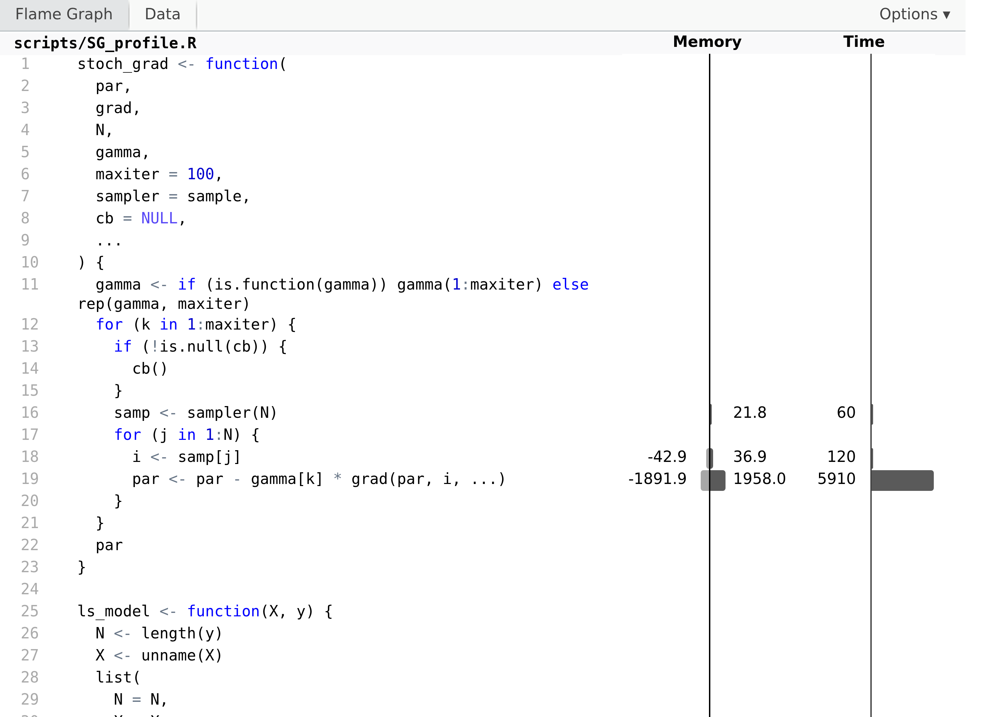

# Stochastic optimization {#stochopt}

Numerical optimization involves different tradeoffs such as an
*exploration-exploitation* tradeoff. On the one hand, the objective
function must be thoroughly explored to build an adequate model of it.
On the other hand, the model should be exploited so as to find the
minimum quickly. Another tradeoff is between the accuracy of the model
and the time it takes to compute with it.

The optimization algorithms considered in Chapters \@ref(numopt) and
\@ref(em) work on all available data and take deterministic steps in
each iteration. The models are based on accurate local computations of
derivatives that can be greedily exploit the local model obtained from
derivatives, but they do little exploration.

By including randomness into optimization algorithms it is possible to
lower the computational costs and make the algorithms more exploratory.
This can be done in various ways. Examples of stochastic optimization
algorithms include simulated annealing and evolutionary algorithms that
incorporate randomness into the iterative steps with the purpose of
exploring the objective function better than a deterministic algorithm
is able to. In particular, to avoid getting stuck in saddle points and
to escape local minima. Stochastic gradient algorithms form another
example, where descent directions are approximated by gradients from
random subsets of the data.

The literature on stochastic optimization is huge, and this chapter will
only cover some examples of particular relevance to statistics and
machine learning. The most prominent applications are to large scale
optimization, where stochastic gradient algorithms have become the
standard solution. When the dimension of the optimization problem
becomes very large, second order methods become prohibitively slow, and
if the number of observations is also large, even one computation of the
gradient for the entire data batch becomes time consuming. In those
cases, stochastic gradient algorithms, that originate from online
learning, can make progress more quickly while still using the entire
batch of data.

## Stochastic gradient algorithms {#sg-alg}

Stochastic gradient algorithms have their origin in an online learning
framework, where data arrives sequentially as a stream of data points
and where the objective function is an expected loss. @Robbins:1951
introduced in their seminal paper a variant of the online stochastic
gradient algorithm that they called the *stochastic approximation
method*, and they established the first convergence result for such
algorithms. To understand what stochastic gradient algorithms are
supposed to optimize, we introduce the general framework of a population
model and give conditions that ensure that the basic online algorithm
converges. Subsequently, the basic online algorithm is turned into an
algorithm for batch data, which is the algorithm of primary interest. In
the following sections, various beneficial extensions of the basic batch
algorithm are explored.

### Population models and loss functions {#Pop-model}

We will consider observations from the sample space $\mathcal{Y}$, and
we will be interested in estimating parameters from the parameter space
$\Theta$. A loss function

\[
  L : \mathcal{Y} \times \Theta \to \mathbb{R}
\]

is fixed throughout, and we want to minimize the expected loss also known as the
*risk*. That is, we want to minimize

\[
  H(\theta) = \E(L(Y, \theta)) = \int L(y, \theta) P(dy)
\]

with $Y \in \mathcal{Y}$ having distribution $P$. Of course, it is
implicitly understood that the expectation has to be well defined for
all $\theta$.

::: {#log-likelihood .example .boxed}
Suppose that $f_{\theta}$ denotes a density on $\mathcal{Y}$
parametrized by $\theta$. Then the log-likelihood loss is

\[
  L(y, \theta) = - \log f_{\theta}(y).
\]

The corresponding risk,

\[
  H(\theta) = - E( \log(f_{\theta}(Y)) ),
\]

is known as the cross-entropy. If the distribution of $Y$ has density $f^0$ then

\begin{align*}
H(\theta) & = - \E( \log(f^0(Y)) ) - \E( \log(f_{\theta}(Y)/f^0(Y)) ) \\
& = H(f^0) + D(f^0 \ || \ f_{\theta})
\end{align*} 

where the first term is the entropy of $f^0$, and the second is the
Kullback-Leibler divergence of $f_{\theta}$ from $f^0$. The entropy does not
depend upon $\theta$ and minimizing the cross-entropy is thus the same as
finding a $\theta$ with $f_{\theta}$ being the optimal approximation of $f^0$ in
a Kullback-Leibler sense.
:::

In many applications the observation is not just a single variable $y$ 
but a pair of variables $(x, y)$, and the objective is often to predict
$y$ from $x$. Thus the loss depends on both $x$ and $y$ and 
reflects how well a prediction model given by the parameter $\theta$ 
performs. 

::: {#least-squares .example .boxed}
Suppose we observed $(X, Y)$ with $Y$ a real valued random variable, and
that $\mu(x, \theta)$ denotes a parametrized mean value of $Y$ conditionally on
$X = x$. With the squared error loss,

\[
  L(y, x, \theta) = \frac{1}{2} (y - \mu(x, \theta))^2,
\]

the risk is the mean squared error

\[
  \mathrm{MSE}(\theta) = \frac{1}{2} \E(Y - \mu(X, \theta))^2.
\]

From the definition of $\mathrm{MSE}(\theta)$ we see that 

\[
2 \mathrm{MSE}(\theta) =  \E(Y - \E(Y \mid X))^2 + \E(\E(Y \mid X) - \mu(X,
\theta))^2,
\]

where the first term does not depend upon $\theta$. Thus
minimizing the mean squared error is the same as finding $\theta_0$ such that
$\mu(x, \theta_0)$ is the optimal approximation of $\E(Y \mid X = x)$ in a
squared error sense.
:::

Note how the link between the distribution of $X$ and the parameter is
defined in the example above by the choice of loss function. There is no
upfront assumption that $\E(Y \mid X = x) = \mu(x, \theta_0)$ for any
$\theta_0 \in \Theta$, but if there is such a $\theta_0$, it will
clearly be a minimizer. In general, the optimal $\theta_0$ is simply the
$\theta$ that minimizes the risk.

An alternative to the squared error loss is the log-likelihood loss,
which can be used when we have a parametrized family of distributions.

::: {#log-likelihood-regress .example .boxed}
We consider now the same regression setup as in Example
\@ref(exm:least-squares) where we observe $(Y, X)$, but we let

\[
  f_{\theta}(y \mid x) = e^{- \mu(x, \theta)} \frac{y^{\mu(x, \theta)}}{y!}
\]

denote the Poisson point probabilities for the Poisson distribution with
mean $\mu(x, \theta)$ conditionally on $X = x$. Then the log-likelihood
loss is

\[ 
  - \log f_{\theta}(y \mid x) = \mu(x, \theta) - y \log(\mu(x, \theta))
\] 

up to an additive constant not depending on $\theta$, and the
cross-entropy is

\[
  H(\theta) = \E\big(\mu(X, \theta) - \E(Y \mid X) \log(\mu(X, \theta))\big),
\]

again up to an additive constant. This risk function quantifies how
$\mu(X, \theta)$ deviates from $\E(Y \mid X)$ in a different way than the
risk based on the squared error loss. However, if
$\E(Y \mid X = x) = \mu(x, \theta_0)$ for some $\theta_0$, it is still
true that $\theta_0$ is a minimizer, cf. Exercise
\@ref(exr:cross-entropy).
:::

The log-likelihood loss is an appropriate loss function if the
parametrized family of distributions fits data well. For a Gaussian
(conditional) mean value model the log-likelihood loss gives the same
risk as the squared error loss---but the squared error loss can also be
suitable even if data is not Gaussian. It is a suitable loss function
whenever we just want to fit a model of the conditional mean of $Y$. If
we want to fit the (conditional) median instead, we can use the absolute
deviation 

\[
  L(y,x, \theta) = |y - \mu(x, \theta)|.
\]

This is a special case of the so-called check loss functions used for [quantile
regression](https://en.wikipedia.org/wiki/Quantile_regression#Quantiles). Thus
by choosing the loss function we decide which aspects of the distribution we
model. The log-likelihood loss leads to a good global fit, the squared error 
loss leads to a good fit of the mean value specifically, and a check loss
leads to a good fit of a particular quantile, such as the median.

### Online stochastic gradient algorithm {#online-sg}

The classical stochastic gradient algorithm is an example of an online
learning algorithm. It is based on the simple observation that if we can
interchange differentiation and expectation then

\[
\nabla H(\theta) = E \left( \nabla_{\theta} L(Y, \theta) \right),
\]

thus if $Y_1, Y_2, \ldots$ form an i.i.d. sequence then
$\nabla_{\theta} L(Y_i, \theta)$ is unbiased as an estimate of the
gradient of $H$ for any $\theta$ and any $i$. With inspiration from
gradient descent algorithms it is natural to suggest stochastic
parameter updates of the form

\[
\theta_{n + 1} = \theta_n - \gamma_n \nabla_{\theta} L(Y_{n+1}, \theta_n)
\]

starting from some initial value $\theta_0$. The direction,
$\nabla_{\theta} L(Y_{n+1}, \theta_n)$, is, however, not guaranteed to
be a descent direction for $H$, and even if it is, $\gamma_n$ is
typically not chosen to guarantee descent.

The sequence of step size parameters $\gamma_n \geq 0$ are known
collectively as the *learning rate*. It can be a deterministic sequence,
but $\gamma_n$ may also depend on $Y_1, \ldots, Y_{n}$ and
$\theta_0, \ldots, \theta_{n}$. For stochastic gradient algorithms,
convergence can be shown under global conditions on the decay of the
learning rate rather than local conditions on the individual step
lengths.

::: {#sg-conv .theorem}
Suppose $H$ is strongly convex and

\[
\E(\|\nabla_{\theta} L(Y, \theta))\|^2) \leq A + B \|\theta\|^2.
\]

If $\theta^*$ is the global minimizer of $H$ then $\theta_n$ converges
almost surely toward $\theta^*$ if 

\begin{equation}
\sum_{n=1}^{\infty} \gamma_n^2 < \infty \quad \text{and} \quad 
\sum_{n=1}^{\infty} \gamma_n = \infty. (\#eq:conv-cond)
\end{equation}
:::

From the above result, convergence of the algorithm is guaranteed if the
learning rate, $\gamma_n$, converges to 0 but does so sufficiently
slowly. Though formulated in a slightly different way, @Robbins:1951
were the first to demonstrate convergence of an online learning
algorithm under conditions as above on the learning rate. Following
their terminology, much has since been written on online learning and
adaptive control theory under the name *stochastic approximation*
[@Lai:2003]. A proof of Theorem \ref{sg-conv} based on martingale 
theory can be found [here](https://nrhstat.org/post/robbins_siegmund/).

A procedure for determining how the learning rate dacays is known as a *decay
schedule*, and a flexible three-parameter power law family of decay
schedules is given by

\[
\gamma_n = \frac{\gamma_0  K}{K + n^a} = \frac{\gamma_0 }{1 + K^{-1} n^{a}}
\]

for some initial learning rate $\gamma_0 > 0$ and constants $K, a > 0$.
If $a \in (0.5, 1]$ the resulting learning rate satisfies the
convergence conditions \@ref(eq:conv-cond).

(ref:decay-fig) Power law decay schedules as a function of $n$ for $\gamma_0 = 1$ and for different choices of $K$ and $a.$ The left figure shows decay schedules with $a$ chosen so that the convergence conditions are fulfilled, whereas the right figure shows decay schedules for which the convergence conditions are not fulfilled.

```{r decay-fig, echo=FALSE, dependson="decay", fig.cap="(ref:decay-fig)", fig.height=4, fig.width=8, out.width="100%"}
grid_par <- expand.grid(
#  n = 2^(seq(0, 20, 1)),
  n = seq(0, 1000, 2),
  K = c(25, 50, 100),
  a = c(0.6, 1),
  gamma0 = 1
)

grid_par <- dplyr::mutate(grid_par, rate = gamma0 * K / (K + n^a))

p1 <- ggplot(grid_par, aes(n, rate, color = factor(K), linetype = factor(a))) + 
  geom_line() +
#  geom_point(size = 2) +
#  scale_x_log10() +
#  scale_y_log10("Learning rate") +
  scale_color_discrete("K:") +
  scale_linetype_discrete("a:") +
  theme(legend.position = "top", legend.box="vertical", legend.margin=margin()) +
  guides(color = guide_legend(order = 1), linetype = guide_legend(order = 2))

grid_par <- expand.grid(
#  n = 2^(seq(0, 20, 1)),
  n = seq(0, 1000, 2),
  K = c(1e4, 1e5, 1e6),
  a = c(2, 2.5),
  gamma0 = 1
)

grid_par <- dplyr::mutate(grid_par, rate = gamma0 * K / (K + n^a))

p2 <- ggplot(grid_par, aes(n, rate, color = factor(K), linetype = factor(a))) + 
  geom_line() +
#  geom_point(size = 2) +
#  scale_x_log10() +
#  scale_y_log10("Learning rate") +
  ylab("") +
  scale_color_discrete("K:", labels = c(quote(10^4), quote(10^5), quote(10^6))) +
  scale_linetype_discrete("a:") +
  theme(legend.position = "top", legend.box="vertical", legend.margin=margin()) +
  guides(color = guide_legend(order = 1), linetype = guide_legend(order = 2))

gridExtra::grid.arrange(p1, p2, ncol = 2)
```

The parameter $\gamma_0$ determines the initial baseline rate, and
Figure \@ref(fig:decay-fig) illustrates the effect of the parameters $K$
and $a$ on the decay. The parameter $a$ is the asymptotic exponent of
$\gamma_n \sim \gamma_0 K n^{-a}$, and $K$ determines how quickly the
rate will turn into a pure power law decay. Moreover, if we have a
target rate, $\gamma_{1}$, that we want to hit after $n_{1}$ iterations,
and we fix the exponent $a$, we can also solve for $K$ to find

\[
  K = \frac{n_1^a \gamma_1}{\gamma_0 - \gamma_1}.
\]

This gives us a
decay schedule that interpolates between $\gamma_0$ and $\gamma_1$ over
the range $0, \ldots, n_1$ of iterations.

We implement `decay_scheduler()` as a function that returns a particular
decay schedule, with the possibility to determine $K$ automatically from
a target rate.

```{r decay}
decay_scheduler <- function(gamma0 = 1, a = 1, K = 1, gamma1, n1) {
  force(a)
  if (!missing(gamma1) && !missing(n1))
    K <- n1^a * gamma1 / (gamma0 - gamma1)
  b <- gamma0 * K
  function(n) b / (K + n^a)
}
```

The following example of online Poisson regression illustrates the
general ideas.

::: {#online-pois-sg .example .boxed}
In this example
$Y_i \mid X_i = x_i \sim \mathrm{Pois}(\varphi(\beta_0 + \beta_1 x_i))$
for $\beta = (\beta_0, \beta_1)^T$ the parameter vector and
$\varphi: \mathbb{R} \to (0,\infty)$ a continuously differentiable
function. We let the $X_i$-s be uniformly distributed in $(-1, 1)$, but
this choice is not particularly important. The conditional mean of $Y_i$
given $X_i = x_i$ is

\[
  \mu(x_i, \beta) = \varphi(\beta_0 + \beta_1 x_i)
\]

and we will first consider the squared error loss. To this end, observe that

\[
  \nabla_{\beta}  \mu(x_i, \beta) =  \varphi'(\beta_0 + \beta_1 x_i) 
\left( \begin{array}{c} 1 \\ x_i \end{array} \right),
\]

which for the squared error loss results in the gradient

\[
\nabla_{\beta} \frac{1}{2} (y_i - \mu(x_i, \beta) )^2 = 
  \varphi'(\beta_0 + \beta_1 x_i) (\mu(x_i, \beta) - y_i) \left( \begin{array}{c} 1 \\ x_i \end{array} \right).
\]
:::

We simulate data and explore the learning algorithm in the special case
with $\varphi = \exp$. To clearly emulate the online nature of the
algorithm, the implementation below generates the observations
sequentially in the loop.

```{r online-poisson-sg-SE, echo=-1}
set.seed(13102020)
N <- 5000
beta_true = c(2, 3)
mu <- function(x, beta) exp(beta[1] + beta[2] * x)
beta <- vector("list", N)

rate <- decay_scheduler(gamma0 = 0.0004, K = 100) 
beta[[1]] <- c(beta0 = 1, beta1 = 1)

for(i in 2:N) {
  # Simulating a new data point
  x <- runif(1, -1, 1)
  y <- rpois(1, mu(x, beta_true))
  # Update via squared error gradient 
  mu_old <- mu(x, beta[[i - 1]])
  beta[[i]] <- beta[[i - 1]]  - rate(i) * mu_old * (mu_old - y) * c(1, x)
}
beta[[N]]  # This is close to beta_true; the algorithm appears to works.
```

For the log-likelihood loss we instead find the gradient

\[
  \nabla_{\beta} \big( \mu(x_i, \beta) - y_i \log(\mu(x_i, \beta)) \big) = 
  \frac{\varphi'(\beta_0 + \beta_1 x_i)}{\mu(x_i, \beta)} (\mu(x_i, \beta) - y_i) 
\left( \begin{array}{c} 1 \\ x_i \end{array} \right),
\]

which leads to a
slightly different but equally valid algorithm. In the special case with
$\varphi = \exp$, the derivative is
$\varphi'(\beta_0 + \beta_1 x_i) = \mu(x_i, \beta)$,

\[
  \nabla_{\beta} \big( \mu(x_i, \beta) - y_i \log(\mu(x_i, \beta)) \big) = 
  (\mu(x_i, \beta) - y_i) 
\left( \begin{array}{c} 1 \\ x_i \end{array} \right),
\]

and the
log-likelihood gradient differs from the squared error gradient by
lacking the factor $\mu(x_i, \beta)$. With $X$ uniformly distributed on
$(-1, 1$), the distribution of $\mu(X, (2, 3))$ has range between
$e^{-1} \approx 0.3679$ and $e^5 \approx 148.4$ and is right skewed, that
is, it is concentrated toward the smaller values but with a long right
tail. Its median is $e^2 \approx 7.389$, while its mean is
$(e^5 - e) / 6 \approx 24.67$.

The squared error gradient is typically longer---and sometimes by a large
factor---than the log-likelihood gradient due to the factor $\mu(x_i,
\beta)$. In the implementation below with the gradient of the log-likelihood we
therefore choose $\gamma_0$ a factor 25 larger than the $\gamma_0 = 0.0004$ that
was used with the squared error gradient.

```{r online-poisson-sg-LL, echo=-c(1, 2), dependson="online-poisson-sg-SE"}
set.seed(13102020)
beta_SE <- cbind(as.data.frame(do.call(rbind, beta)),
                 data.frame(iteration = 1:N, loss = "squared error"))

rate <- decay_scheduler(gamma0 = 0.01, K = 100) 
beta[[1]] <- c(beta0 = 1, beta1 = 1)

for(i in 2:N) {
  # Simulating a new data point
  x <- runif(1, -1, 1)
  y <- rpois(1, mu(x, beta_true))
  # Update via log-likelihood gradient 
  mu_old <- mu(x, beta[[i - 1]])
  beta[[i]] <- beta[[i - 1]]  - rate(i) * (mu_old - y) * c(1, x)
}
beta[[N]]  # This is close to beta_true; this algorithm also appears to works.
```

(ref:pois-sgd) Estimated parameter values for the two parameters $\beta_0$ (true value $2$) and $\beta_1$ (true value $3$) in the Poisson regression model as a function of the number of data points in the online stochastic gradient algorithm.

```{r pois-sgd, echo=FALSE, dependson="online_poisson_sg", fig.cap="(ref:pois-sgd)", warning=FALSE, fig.height=4, fig.width=8, out.width="100%"}
beta_all <- rbind(
  cbind(as.data.frame(do.call(rbind, beta)),
        data.frame(iteration = 1:N, loss = "log-likelihood")),
  beta_SE) |> 
  tidyr::pivot_longer(cols = c("beta0", "beta1"), names_to = "Parameter") |> 
  dplyr::filter(iteration %% 50 == 0)

ggplot(beta_all, aes(iteration, value, color = Parameter)) + 
  geom_hline(yintercept = beta_true[1], color = "blue") + 
  geom_hline(yintercept = beta_true[2], color = "red") + 
  geom_point(alpha = 0.5, shape = 16, size = 2) + 
  ylim(c(1.75, 3.25)) + 
  ylab("Parameter value") +
  xlab("Number of data points") +
  facet_wrap("loss") +
  scale_color_manual(values = c("blue", "red"))
```

Figure \@ref(fig:pois-sgd) shows how the estimates of $\beta_0$ and
$\beta_1$ converge toward the true values for the two different choices
of loss functions. With $\varphi = \exp$ and either loss function, the
risk, $H(\beta)$, is strongly convex and attains its unique minimum in
$\beta^* = (2, 3)^T$. Theorem \@ref(thm:sg-conv) suggests convergence
for appropriate learning rates---except that the growth condition on
the gradient is not fulfilled with $\varphi = \exp$. The growth
condition *is* fulfilled if we replace the exponential function by
softplus, $\varphi(w) = \log(1 + e^w)$, which for small values of $w$
behaves like the exponential function, but grows linearly with $w$ for
$w \to \infty$.

The gradient from the squared error loss resulted in slower convergence
and a more jagged sample path than the gradient from the log-likelihood.
This is explained by the random factor $\mu(x_i, \beta)$ for the squared
error gradient, which makes the step sizes somewhat irregular when data
is from a Poisson distribution. It also makes choosing $\gamma_0$ a
delicate balance. A small increase of $\gamma_0$ will make the algorithm
unstable, while decreasing $\gamma_0$ will make the convergence even
slower, though the fluctuations will also be damped. Making the right
choice---or even a suitable choice---of decay schedule depends heavily
on the problem considered and the gradient used. It is a problem
specific challenge to find a good schedule, e.g., by choosing
the three parameters if we use a power law schedule.

The example illustrates that the loss function not only determines what
we model, but also how well the learning algorithm works. Both loss
functions are appropriate, but since the data is from the Poisson
distribution, the log-likelihood loss leads to faster convergence.
Exercise \@ref(exr:gauss-log-normal) explores the opposite situation
where the data is from a Gaussian distribution.

### Batch stochastic gradient algorithms

The online algorithm does not store data, and once a data point is used
it is forgotten. The online algorithm is working in a context where data
arrives as a stream of data points and the model is updated continually.
In statistics, we more frequently encounter batch algorithms, where an
entire batch of data points is stored and processed by the algorithm,
and where each data point in the batch can be accessed as many times as
we like. However, when the batch is sufficiently large, many standard
batch algorithms are slow, and some ideas from online algorithms can
beneficially be transferred to batch processing of data.

Within the population model framework in Section \@ref(Pop-model) the objective
is to minimize the population risk, $H(\theta)$, defined as the expected loss
w.r.t. the probability distribution $P$. For the online algorithms we imagine
an endless stream of data points from $P$, which can be used to ultimately
minimize $H(\theta)$. Batch algorithms replace the population quantity by an
empirical surrogate---the average loss on the batch

\[
  H_N(\theta) = \frac{1}{N} \sum_{i=1}^N L(y_i, \theta).
\]

Minimizing $H_N$ as a surrogate of minimizing $H$ is known as [empirical risk
minimization](https://en.wikipedia.org/wiki/Empirical_risk_minimization).

If data is i.i.d. the standard deviation of $H_N(\theta)$ decays as $N^{-1/2}$
with $N$, while the runtime of its computation increases as $N$. Thus as we
invest more computation time by using more data we get diminishing returns;
doubling the runtime will only lower the precision of $H_N$ as an approximation
of $H$ by a factor $1 / \sqrt{2} \approx 0.7$. The same is, of course, true if
we look at the gradient, $\nabla H_N(\theta)$, or higher derivatives of $H_N$.

It is not obvious that the computational costs of using the entire dataset to
compute the gradient, say, is worth the effort compared to using only a fraction
of the data. Thus we ask if there is a better tradeoff between runtime and
precision by using a fraction of data points each time we compute the gradient?
Stochastic gradient algorithms are examples of such algorithms that "cycle through the
data" and use only a random fraction of data points for each computation. The 
most basic version of a stochastic gradient algorithm is presented first, 
which uses only a single data point in each
iteration, and it is really the same algorithm as presented in Section
\@ref(online-sg) except that the population risk is replaced by the empirical
risk defined in terms of the batch data.

With $P_N = \frac{1}{N}\sum_{i=1}^N \delta_{y_i}$ denoting the
empirical distribution of the batch dataset, we see that

\[
  H_N(\theta) = \int L(y, \theta) P_N(\mathrm{d}y),
\]

that is, the empirical risk is simply the expected loss with respect to the empirical
distribution. Thus to minimize $H_N$ we can use the online approach by
sampling observations from $P_N$. This leads to the following
basic version of the stochastic gradient algorithm applied to a data
batch.

From an initial parameter value, $\theta_0$, we iteratively compute the
parameters as follows: given $\theta_{n}$

-   sample an index $i$ uniformly from $\{1, \ldots, N\}$
-   compute $\rho_n = \nabla_{\theta} L(y_i, \theta_{n})$
-   update the parameter $\theta_{n+1} = \theta_{n} - \gamma_n \rho_n.$

Note that sampling the index $i$ is equivalent to sampling an
observation from the empirical distribution $P_N$, which in turn is the same as
nonparametric bootstrapping. Just as in the online setting, the
learning rate, $\gamma_n$, is a tuning parameter of the algorithm.

We implement the basic stochastic gradient algorithm below, allowing for
a user defined decay schedule of the learning rate. However, instead of
implementing one long loop, we divide the iterations into *epochs* with
each epoch consisting of $N$ iterations. In the implementation, the
maximum number of iterations is also given in terms of epochs, and the
decay schedule is applied on a per epoch basis.

We also introduce a small twist on the sampling from the empirical
distribution; instead of sampling with replacement (bootstrapping) we
sample without replacement. Sampling $N$ indices from $\{1, \ldots, N\}$
without replacement is the same as sampling a permutation of the
indices.

```{r sg}
stoch_grad <- function(
  par, 
  grad,              # Function of parameter and observation index
  N,                 # Sample size
  gamma,             # Decay schedule or a fixed learning rate
  maxit = 100,       # Max epoch iterations
  sampler = sample,  # Data resampler. Default is random permutation
  cb = NULL, 
  ...
) {
  if (is.function(gamma)) gamma <- gamma(1:maxit) 
  gamma <- rep_len(gamma, maxit) 
  for(n in 1:maxit) {
    if(!is.null(cb)) cb()
    samp <- sampler(N)   
    for(j in 1:N) {
      i <-  samp[j]
      par <- par - gamma[n] * grad(par, i, ...)
    }
  }
  par
}
```

One epoch in the algorithm above is exactly one pass through the entire
batch of data points, but in a random order. The default value of
`sampler = sample` means that resampling is done without replacement. If
we call `stoch_grad()` with `sampler = function(N) sample(N, replace = TRUE)` we
would get sampling with replacement, in which case an epoch would be a
pass through $N$ data points sampled independently from the batch.
Sampling with replacement will feed the stochastic gradient algorithm
with i.i.d. samples from the empirical distribution. Sampling without
replacement introduces some dependence. Curiously, sampling without
replacement has turned out to be empirically superior to sampling with
replacement, and recent theoretical results, @Gurbuzbalaban:2019,
support that it leads to a faster rate of convergence.

We may ask if the sampling actually matters, and whether we could just leave out
that part of the algorithm? In practice, datasets may come in a "bad order",
for instance in an unfortunate ordering according to one or more of its
variables, and cycling through the data points in such an ordering can easily
lead the algorithm astray. *It is therefore important to always randomize the
order of the data points somehow*. A minimal amount of randomization in common
use is to just do one initial random permutation, corresponding to moving the
line `samp <- sampler(N)` outside of the outer for-loop in the implementation of
`stoch_grad()`. This may be enough randomization for the algorithm to work in
some cases, but the link to the convergence result for the online algorithm is
broken.

::: {#batch-pois-sg .example .boxed}
As a continuation of Example \@ref(exm:online-pois-sg) we consider the
batch version of Poisson regression. We will only use the log-likelihood
gradient, and we first simulate a small dataset with $N = 50$ data
points.

```{r pois-gradient, dependson="sg", echo=-1}
set.seed(17102020)
N <- 50
x <- runif(N, -1, 1)
y <- rpois(N, mu(x, beta_true))
grad_pois <- function(par, i) (mu(x[i], par) - y[i]) * c(1, x[i])
```

Using the `grad_pois()` function above, we run the stochastic gradient
algorithm for 1000 epochs with a decay schedule that interpolates
between $\gamma_0 = 0.02$ and $\gamma_1 = 0.001$.

```{r batch-poisson-sg, dependson="pois-gradient"}
pois_sg_tracer <- CSwR::tracer("par", Delta = 0)
stoch_grad(
  c(0, 0), 
  grad_pois, 
  N = N, 
  gamma = decay_scheduler(gamma0 = 0.02, gamma1 = 0.001, n1 = 1000), 
  maxit = 1000, 
  cb = pois_sg_tracer$tracer
)
```

The resulting parameter estimate should be compared to the
maximum-likelihood estimate from an ordinary Poisson regression.

```{r pois-beta-hat, dependson="pois-gradient", echo=1}
beta_hat <- coefficients(glm(y ~ x, family = poisson))
cat("beta_hat:", beta_hat)
```

The batch version of stochastic gradient descent converges toward the
minimizer, $(\hat{\beta}_0, \hat{\beta}_1)$, of the empirical risk. This
is contrary to the online version that converges toward the minimizer of
the theoretical risk, which in this case is
$(\beta_0, \beta_1) = (2, 3)$. With a larger batch size,
$(\hat{\beta}_0, \hat{\beta}_1)$ will come closer to $(2, 3)$. Figure
\@ref(fig:batch-pois-sgd-fig) shows clearly how the algorithms converge
toward a limit that depends on the batch size, and for $N = 500$, this
limit is much closer to the theoretical minimizer.

```{r batch-poisson-sg-2, dependson="pois-gradient", echo=-1}
set.seed(17102020)
N <- 500
x <- runif(N, -1, 1)
y <- rpois(N, mu(x, beta_true))
pois_sg_tracer_2 <- CSwR::tracer("par", Delta = 0)
stoch_grad(
  par = c(0, 0), 
  grad = grad_pois, 
  N = N, 
  gamma = decay_scheduler(gamma0 = 0.02, gamma1 = 0.001, n1 = 100), 
  cb = pois_sg_tracer_2$tracer
)
```

```{r pois-beta-hat-2, dependson="batch-poisson-sg-2", echo=1}
beta_hat_2 <- coefficients(glm(y ~ x, family = poisson))
cat("beta_hat_2:", beta_hat_2)
```

(ref:batch-pois-sgd) Estimated parameter values for the two parameters $\beta_0 =2$ and $\beta_1 = 3$ in the Poisson regression model as a function of the number of iterations in the stochastic gradient algorithm. For batch size $N = 50$, the algorithm converges to a parameter clearly different from the theoretically optimal one (gray dashed lines), while for batch size $N = 500$ the limit is closer to $(2, 3).$

```{r batch-pois-sgd-fig, echo=FALSE, dependson="online_poisson_sg", fig.cap="(ref:batch-pois-sgd)", warning=FALSE, fig.height=4, fig.width=8, out.width="100%"}
hline_data <- data.frame(
  beta0 = c(beta_hat[1], beta_hat_2[1]), 
  beta1 = c(beta_hat[2], beta_hat_2[2]),
  N = c("N = 50", "N = 500")
)

dplyr::bind_rows(
  small = summary(pois_sg_tracer)[seq(10, 1000, 10), ], 
  large = summary(pois_sg_tracer_2), 
  .id = "N"
) |> 
  dplyr::mutate(N = ifelse(N == "small", "N = 50", "N = 500"), n = rep(5 * seq(10, 1000, 10), 2)) |> 
  dplyr::rename(beta0 = par.1, beta1 = par.2) |> 
  tidyr::pivot_longer(cols = c("beta0", "beta1"), names_to = "Parameter") |> 
ggplot(aes(n, value, color = Parameter)) + 
  geom_hline(data = hline_data, aes(yintercept = beta0), color = "blue") + 
  geom_hline(data = hline_data, aes(yintercept = beta1), color = "red") + 
  geom_hline(yintercept = beta_true[1], linetype = 2, alpha = 0.5) + 
  geom_hline(yintercept =  beta_true[2], linetype = 2, alpha = 0.5) + 
  geom_point(alpha = 0.5, shape = 16, size = 2) + 
  ylim(c(1.5, 3.5)) + 
  ylab("Parameter value") +
  facet_wrap("N") +
  scale_color_manual(values = c("blue", "red"))
```
:::


Example \@ref(exm:batch-pois-sg) and Figure
\@ref(fig:batch-pois-sgd-fig), in particular, illustrate that if the
dataset is relatively small, the algorithm quickly attains a precision
smaller than the statistical uncertainty, and further optimization is
therefore futile. However, for larger datasets, optimization to a
greater precision can be beneficial.

### Predicting news article sharing on social media {#news}

In this section we will illustrate the use of the basic stochastic
gradient algorithm for learning a model that predicts how many times a
news article is shared on social media. We will use a simple linear 
model and the squared error loss function. 

The basic stochastic gradient algorithm for the linear model was
introduced to the early machine learning community in 1960 via ADALINE
(Adaptive Linear Neuron) by @Widrow:1960. ADALINE was
[implemented as a physical
device](https://www.youtube.com/watch?v=hc2Zj55j1zU) capable of learning
patterns via stochastic gradient updates. The math is the same today,
but the implementation has fortunately become somewhat easier.

With a linear model and the squared error loss,
$L(y, x, \beta) = \frac{1}{2} (y - \beta^T x)^2$, the gradient becomes

\[
\nabla_{\beta} L(y, x, \beta) = - x (y - \beta^T x) = x (\beta^T x - y),
\]

which results in updates of the form

\[
\beta_{n+1} = \beta_n - \gamma_n x_i (\beta_n^T x_i - y_i).
\]

That is, the parameter moves in the direction of $x_i$ if $\beta_n^T x_i < y_i$
and in the direction of $-x_i$ if $\beta_n^T x_i > y_i$. The amount by
which it moves is controlled partly by the learning rate, $\gamma_n$,
and partly by the size of the residual, $y_i - \beta_n^T x_i$. A larger
residual gives a larger move.

The following function factory for linear models takes a model matrix and a
response vector for the complete data batch as arguments and implements the
squared error loss function on the entire batch as well as the gradient in a
subset of observation. The function factory returns a list containing the loss
and the gradient as well as additional variables including a parameter vector of
the correct dimension, which can be used for initialization of optimization
algorithms.

```{r ls-model}
ls_model <- function(X, y) {
  N <- length(y)
  X <- unname(X) # Strips X of names
  list(
    N = N,
    X = X, 
    y = y, 
    # Initial parameter value
    par0 = rep(0, ncol(X)),
    # Objective function
    H = function(beta)
      drop(crossprod(y - X %*% beta)) / (2 * N),
    # Gradient for the (sub)batch indexed by i
    grad = function(beta, i, ...) {               
      xi <- X[i, , drop = FALSE]
      res <- xi %*% beta - y[i]
      drop(crossprod(xi, res)) / length(res)
    }
  )
}
```

Note that the gradient implementation works for `i` a single index as well 
as for `i` a vector of indices, in which case it returns the  
average gradient over the corresponding data points. Note also that if `i` 
is missing, the subsetting with a missing argument will return the entire 
matrix/vector, and `grad()` returns the gradient of `H()`. It is possible to 
implement a slightly more efficient computation if `i` is always a single 
number, but the more general implementation will be needed in subsequent 
sections. 

We will use the data included in the CSwR package as the data frame `news` with 
39,644 observations and 53 variables. One variable is the
integer valued `shares`, which is the target variable of our
predictions. The data was originally collected by @Fernandes:2015, and is 
also available from the
[UCI Machine Learning
Repository](https://archive.ics.uci.edu/ml/datasets/online+news+popularity)
[@News:2015]. 

We construct a model matrix without an explicit intercept from all
the variables in the dataset but the target variable `shares`. We 
then use it to compute the least squares fit for predicting the 
logarithm of the number of shares.

```{r news-X-y, dependson="news-data"}
X <- model.matrix(shares ~ . - 1, data = CSwR::news)  
lm_news <- lm.fit(X, log(CSwR::news$shares))
```

This dataset is by current standards not a large dataset---the dense
model matrix takes only about 20 MB of memory---and the linear model
(with the target variable `shares` log-transformed) can easily be fitted
by simply solving the least squares problem. It takes about 0.2 seconds
on a standard laptop to compute the solution. The residual plot in
Figure \@ref(fig:fig-res-lm-news) shows that the model is actually not a
poor fit to data, though there is a considerable unexplained residual
variance.

```{r fig-res-lm-news, message = FALSE, warning = FALSE, echo=FALSE, fig.cap="Residual plot for the linear model of the logarithm of news article shares.", dependson="news-X-y"}
ggplot(mapping = aes(x = exp(lm_news$fitted.values), y = lm_news$residuals)) + 
  geom_point(alpha = 0.1) + 
  geom_smooth() +
  xlab("Fitted values (number of shares)") +
  ylab("Residuals (log-scale)") +
  #scale_y_log10(limits = exp(c(-8, 8)), breaks = c(10^(-2), 0, 10^2), labels = c("0.01", "0", "100")) + 
  ylim(-8, 8) + 
  scale_x_log10(limits = exp(c(6, 10)))
```

```{r news-cor, eval=FALSE, echo=FALSE}
cp <- cor(X, method = "spearman")
ord <- rev(hclust(as.dist(1 - abs(cp)))$order)
colPal <- colorRampPalette(c("blue", "yellow"), space = "rgb")(100)
lattice::levelplot(cp[ord, ord], xlab = "",
          ylab = "",
          col.regions = colPal,
          at = seq(-1, 1, length.out = 100),
          colorkey = list(space = "top", labels = list(cex = 1.5)), 
          scales = list(x = list(rot = 45), y = list(draw = FALSE), cex = 0.5) 
)

```

```{r news-cor-order, eval=FALSE, echo=FALSE}
cor_long <- as_tibble(cp) |> 
  dplyr::mutate(var1 = row.names(cp)) |> 
  tidyr::pivot_longer(- var1, names_to = "var2") 
View(cor_long)
svd(X)$d
```

```{r news-cor-scatter, eval=FALSE, echo=FALSE}
cor.print <- function(x, y) { panel.text(mean(range(x)), mean(range(y)),
round(cor(x, y, method = "spearman"), digits = 2))
}

contVar <- c("kw_max_min", "kw_avg_min",  "kw_min_min", "kw_max_max", "kw_avg_max", 
             "kw_min_avg", "kw_max_avg", "kw_avg_avg") 

contVar <- c("kw_max_min", "kw_max_avg",  "kw_max_max", "kw_avg_min", "kw_avg_avg", "kw_avg_max", 
             "kw_min_min", "kw_min_avg") 

splom(log(X[, contVar] + 2), xlab = "",
upper.panel = hexbin::panel.hexbinplot,
pscales = 0, xbins = 20,
lower.panel = cor.print)
```

Optimization of the squared error loss using this dataset will be used
to illustrate a number of stochastic gradient algorithms even though we
can compute the optimizer easily by other means. The real practical
benefit of stochastic gradient algorithms comes when applied to large
scale problems that are difficult to treat as textbook examples. But
using a toy problem makes it easier to investigate the behaviors of the 
different algorithms.

We will standardize all the columns of $X$ to have the same norm.
Specifically to have non-central second moment 1. This does not change
the optimization problem but corresponds to a reparametrization where
all parameters are rescaled. The rescaling brings the parameters on a
comparable scale, which is typically a good idea for optimization
algorithms based on gradients only, see also Exercise
\@ref(exr:news-cond-number). After rescaling we initialize the linear
model with a call to `ls_model()` and refit the model using the new
parametrization.

```{r LS-model, dependson=c("ls-model", "news-X-y")}
# Standardization and log-transforming the target variable
X <- scale(X, center = FALSE)
ls_news <- ls_model(X, log(CSwR::news$shares))
lm_news <- lm.fit(ls_news$X, ls_news$y)
```

We first run the stochastic gradient algorithm with a fixed learning
rate of $\gamma = 10^{-5}$ for 50 epochs with a tracer that computes and
stores the value of the objective function at each epoch.

```{r sg-tracer, results="hide", dependson="LS-model"}
expr <- quote(value <- ls_news$H(par))
sg_tracer <- CSwR::tracer("value", expr = expr)
stoch_grad(
  par = ls_news$par0, 
  grad = ls_news$grad, 
  N = ls_news$N, 
  gamma = 1e-5, 
  maxit = 50, 
  cb = sg_tracer$tracer
)
```

Using the trace from the last epochs, we can compare the objective
function values to the minimum found using `lm.fit()` above. The minimum
was not reached completely after the 50 epochs that also took some time to
compute.

```{r sg-tracer-sum, dependson="sg-tracer"}
sg_trace_low <- summary(sg_tracer)
tail(sg_trace_low)
ls_news$H(lm_news$coefficients)
```

We will use profiling to investigate what most of the time was spent on
in the stochastic gradient algorithm.

```{r sg-profiling, echo = 3, dependson="LS-model"}
source("scripts/SG_profile.R", keep.source = TRUE)
ls_news <- ls_model(ls_news$X, ls_news$y)
p <- profvis::profvis(
  stoch_grad(
    par = ls_news$par0, 
    grad = ls_news$grad, 
    N = ls_news$N, 
    gamma = 1e-5, 
    maxit = 50, 
  )
)
setwd("./figures/") # Hack to make saveWidget() clean up
htmlwidgets::saveWidget(p, "sg_profile.html")
setwd("..")
```

```{r sg-profivis-image, out.width="100%", echo=FALSE, dependson="sg-profiling"}
pagedown::chrome_print(
  "./figures/sg_profile.html", 
  format = "png",
  wait = 10,
  options = list(clip = list(x = 0L, y=0L, width = 725L, height = 520L, scale = 4)),
  extra_args = c("--window-size=700,1150")
)

```

The [profiling result](figures/sg_profile.html) shows, unsurprisingly,
that the computation of the gradient and the update of the parameter
vector takes up most of the runtime. But if we look closer at the
implementation of the gradient, we see that the innocuously looking
subsetting `X[i, , drop = FALSE]` to the $i$-th row in line 25 is 
actually responsible for a large
fraction of the runtime. We also see a substantial allocation and
deallocation of memory associated with this line. It is a bottleneck of
the R implementation that slicing out rows from a bigger matrix cannot
be done without creating a copy of those rows, and this is why this
particular line takes up so much time.

A possible objection to the implementation by slicing out rows is that 
R stores matrices in [column-major order](https://en.wikipedia.org/wiki/Row-_and_column-major_order), so 
slicing out rows is not as efficient as slicing out columns. This is true, 
and we could rewrite the gradient computation in `ls_model()` to 
use a transposed model matrix. Exercise \@ref(exr:grad-transpose) 
explores the runtime benefits of this approach. For the basic stochastic
gradient algorithm above, the benefits are minor, but for the mini-batch 
algorithms in Section \@ref(beyond) the transposition can lead to 
some reduction of runtime. Slicing in R will, however, always result in a copy 
of data, irrespectively of whether we slice out rows or columns.

To further investigate the convergence of the basic stochastic gradient
algorithm we run it with a larger learning rate of
$\gamma = 5 \times 10^{-5}$ and then with a power law decay schedule,
which interpolates from an initial learning rate of $10^{-3}$ to a
learning rate of $10^{-5}$ after 50 epochs.

```{r sg-tracer-2, results="hide", dependson=c("sg-tracer", "LS-model")}
sg_tracer$clear()
stoch_grad(
  par = ls_news$par0, 
  grad = ls_news$grad, 
  N = ls_news$N, 
  gamma = 5e-5, 
  maxit= 50, 
  cb = sg_tracer$tracer
)
sg_trace_high <- summary(sg_tracer)
sg_tracer$clear()
stoch_grad(
  par = ls_news$par0, 
  grad = ls_news$grad, 
  N = ls_news$N,
  gamma = decay_scheduler(gamma0 = 7e-5, gamma1 = 4e-5, a = 0.5, n1 = 50), 
  maxit= 50, 
  cb = sg_tracer$tracer
)
sg_trace_decay <- summary(sg_tracer)
```

We will compare the convergence of the three stochastic gradient
algorithms with the convergence of gradient descent with backtracking.
For gradient descent we choose $\gamma = 8 \times 10^{-2}$, which
results in only a few initial backtracking steps and then all subsequent
steps will use the step length $\gamma = 8 \times 10^{-2}$. Choosing a
larger $\gamma$ for this particular optimization resulted in
backtracking until a step length around $8 \times 10^{-2}$ was reached,
thus this choice of $\gamma$ will use a minimal amount of time on the
backtracking step of the algorithm.

```{r news-gd, warning=FALSE, results='hide', dependson="LS-model"}
gd_tracer <- CSwR::tracer("value", Delta = 10)
grad_desc(
  par = ls_news$par0, 
  H = ls_news$H, 
  gr = ls_news$grad, 
  gamma = 8e-2, 
  maxit = 800, 
  cb = gd_tracer$tracer
)
gd_trace <- summary(gd_tracer)
```

Figure \@ref(fig:news-trace-plot) shows how the four algorithms
converge. The gradient descent algorithm converges faster than the
stochastic gradient algorithm with the low learning rate
$\gamma = 10^{-5}$, but with the high learning rate
$\gamma = 5 \times 10^{-5}$ and the power law decay schedule the
stochastic gradient algorithm converges about as fast as gradient
descent. For this particular run, the power law decay schedule shows
marginally faster convergence than the fixed high learning rate, and
this was ensured after some tuning of the decay schedule parameters.
Despite theoretical guarantees of convergence with the power law decay schedule,
the practical choice of a suitable learning rate or decay schedule is
really an empirical art. With very large data, the tuning of learning
rate parameters can be done on a small subset of data before the
algorithms are run using the full dataset.

```{r news-trace-plot, echo=FALSE, dependson=c("news-gd", "sg-tracer-2", "sg-tracer-sum"), fig.cap="Convergence of squared error loss on the news article dataset for four algorithms: gradient descent (gd) and three basic stochastic gradient algorithms with a low learning rate, a high learning rate and a power law decay schedule.", fig.width=8, fig.height=4, out.width="100%"}
dplyr::bind_rows(
  low = sg_trace_low, 
  high = sg_trace_high, 
  decay = sg_trace_decay,
  gd = gd_trace[seq(1, 800, 20), ], 
  .id = "Algorithm"
) |> 
  dplyr::filter(.time < 5) |> 
autoplot(y = value - ls_news$H(lm_news$coefficients )) + 
  ylab(expression(H(theta[n]) - H(theta[infinity]))) +
  aes(color = Algorithm, shape = Algorithm) + 
  geom_line() +
  scale_color_brewer(limits = c("low", "high", "decay", "gd", "mini", "moment", "adam", "adam_decay"), 
                     breaks = c("low", "high", "decay", "gd"),
                     type = "qual", palette = 2) +
  scale_shape_manual(limits = c("low", "high", "decay", "gd", "mini", "moment", "adam", "adam_decay"), 
                     breaks = c("low", "high", "decay", "gd"),
                     values = c(0, 1, 2, 5, 15, 16, 17, 19))
```

For comparison purposes it is typically better to monitor convergence of
optimization algorithms as a function of real time than iterations, but
when comparing algorithms in terms of real time we are admittedly
comparing their specific implementations. The R implementation of the
stochastic gradient algorithm has some shortcomings that are not shared
by the gradient descent algorithm. One epoch of the stochastic gradient
algorithm should be about as computationally demanding as one iteration
of gradient descent as both will compute the gradient in each data point
exactly once and add them up. The vectorized batch gradient computation
is fairly efficient in R, but the iterative looping over data in the
stochastic gradient algorithm is not, and this inefficiency is
compounded by the inefficiency of matrix slicing that results in data
copying as the profiling revealed. Thus the comparisons in Figure
\@ref(fig:news-trace-plot) are arguably not entirely fair to the
stochastic gradient algorithm---only the specific R implementation.

In the subsequent section we will see alternatives to the basic
stochastic gradient algorithm, which will diminish the shortcomings of a
pure R implementation somewhat. Another way to potentially circumvent some 
shortcomings of the R implementation is to rewrite the algorithm using
Rcpp. We will pursue Rcpp implementations in Section \@ref(sg-Rcpp), but
we will first consider some beneficial modifications of the basic
algorithm.

## Beyond basic stochastic gradient algorithms {#beyond}

The gradient $\nabla_{\theta} L(y_i, x_i, \theta)$ for a single random data
point is quickly computed, and though unbiased as an estimate of
$\nabla_{\theta} H_N(\theta)$ it has a large variance. This affects the
basic stochastic gradient algorithm negatively as the directions of each
update can oscillate quite wildly from iteration to iteration. This
section covers some techniques that yield a better tradeoff between
runtime and variability.

The most obvious technique is to use more than one observation per
computation of the gradient, which gives us *mini-batch* stochastic
gradient algorithms. A second technique is to incorporate some memory
about previous directions into the movements of the algorithms---in
the same spirit as how the conjugate gradient algorithm uses the
previous gradient to modify the descent direction.

The literature on deep learning has recently exploded with variations on
the stochastic gradient algorithm. Performance is mostly studied
empirically and applied in practice to the highly non-convex
optimization problem of learning a neural network. A comprehensive
coverage of all the different ideas will not be attempted, and only
three of the most solidified variations will be treated. The use of
mini-batches is ubiquitous, and momentum is a simple 
illustration of an algorithm with memory. Finally, the Adam algorithm uses
memory in combination with adaptive learning rates to achieve both speed
and robustness.

### Mini-batches

The three steps of the mini-batch stochastic gradient algorithm with
mini-batch size $m$ are: given $\theta_{n}$

-   sample $m$ indices, $I_n = \{i_1, \ldots, i_m\}$, from
    $\{1, \ldots, N\}$
-   compute
    $\rho_n = \frac{1}{m} \sum_{i\in I_n} \nabla_{\theta} L(y_i, x_i, \theta_{n})$
-   update the parameter $\theta_{n+1} = \theta_{n} - \gamma_n \rho_n.$

Of course, the mini-batch algorithm with $m = 1$ is the basic stochastic
gradient algorithm. As for the basic algorithm, we implement the
variation where we sample a *partition*

\[
  I_1 \cup \ldots \cup I_M \subseteq \{1, \ldots, N\}
\]

for $M = \lfloor N / m \rfloor$ and in one epoch loop through the
mini-batches $I_1, \ldots, I_M$.

In the following sections we will develop a couple of modifications to
the basic stochastic gradient algorithm, and we will therefore implement
a more generic version of the algorithm. What is common to all the
modifications is that they differ in the details of the epoch loop, thus
we take out that loop as a separate function.

```{r sg-mini-batch}
stoch_grad <- function(
  par, 
  N,                 # Sample size
  gamma,             # Decay schedule or a fixed learning rate
  epoch = batch,     # Epoch update function
  ...,               # Other arguments passed to epoch updates
  maxit = 100,       # Max epoch iterations
  sampler = sample,  # Data resampler. Default is random permutation
  cb = NULL
) {
  if (is.function(gamma)) gamma <- gamma(1:maxit) 
  gamma <- rep_len(gamma, maxit) 
  for(n in 1:maxit) {
    if(!is.null(cb)) cb()
    samp <- sampler(N)
    par <- epoch(par, samp, gamma[n], ...)
  }
  par
}
```

The implementation uses `batch()` as the default epoch update function, and we
implement this function below. It uses the random permutation to
generate the $M$ mini-batches, and it contains a loop through the
mini-batches containing a call of `grad()` for the computation of the
average gradient for each mini-batch in the loop. Note that the `grad`
argument to `batch()` will be captured by and passed on from a call of
`stoch_grad()` via the `...` argument.

```{r batch}
batch <- function(
    par, 
    samp,
    gamma,  
    grad,              # Function of parameter and observation index
    m = 50,            # Mini-batch size
    ...
  ) {
    M <- floor(length(samp) / m)
    for(j in 0:(M - 1)) {
      i <- samp[(j * m + 1):(j * m + m)]
      par <- par - gamma * grad(par, i, ...)
    }
    par
}
```

The `grad()` function implemented in `ls_model()` in Section \@ref(news)
anticipated that we need to compute gradients for mini-batches, and it
can thus be used directly with the `batch()` function. 

With increased flexibility of the algorithms comes more tuning
parameters, and making a good choice of all of them becomes increasingly
difficult. When introducing mini-batches we need to choose the
mini-batch size in addition to the learning rate, and a good choice of
learning rate or decay schedule will depend on the size of the
mini-batch. To simplify matters, a mini-batch size of 1000 and a fixed
learning rate are used in the subsequent applications. The learning rate
will generally be chosen as large as possible without making the
algorithms diverge, and with a mini-batch size of 1000 it is possible to
run the algorithm with a learning rate of $\gamma = 0.05$.

```{r sg-mini-batch-run, echo = -c(1, 4), results='hide', dependson=c("sg-tracer", "batch", "sg-mini-batch", "ls-grad-update")}
set.seed(20241110)
sg_tracer$clear()
stoch_grad(
  par = ls_news$par0, 
  N = ls_news$N, 
  gamma = 5e-2, 
  grad = ls_news$grad, 
  m = 1000, 
  maxit = 200, 
  cb = sg_tracer$tracer
)
sg_trace_mini <- summary(sg_tracer)
```

```{r news-trace-plot-2, echo=FALSE, dependson=c("sg-mini-batch-run", "news-gd", "sg-tracer-2"), fig.width=8, fig.height=4, out.width="100%", fig.cap="Convergence of squared error loss on the news article dataset for three algorithms: basic stochastic gradient with a power law decay schedule (decay), gradient descent (gd), and mini-batch stochastic gradient with a batch size of 1000 and a fixed learning rate (mini)."}
dplyr::bind_rows(
  mini = sg_trace_mini[seq(1, 200, 3), ], 
  decay = sg_trace_decay,
  gd = gd_trace[seq(1, 800, 10), ], 
  .id = "Algorithm"
) |> 
  dplyr::filter(.time < 2) |> 
autoplot(y = value - ls_news$H(lm_news$coefficients )) + 
  ylab(expression(H(theta[n]) - H(theta[infinity]))) +
  aes(color = Algorithm, shape = Algorithm) + 
  geom_line() +
  scale_color_brewer(limits = c("low", "high", "decay", "gd", "mini", "moment", "adam", "adam_decay"), 
                     breaks = c("decay", "gd", "mini"), type = "qual", palette = 2) +
  scale_shape_manual(limits = c("low", "high", "decay", "gd", "mini", "moment", "adam", "adam_decay"), 
                     breaks = c("decay", "gd", "mini"),
                     values = c(0, 1, 2, 5, 15, 16, 17, 19))
```

Figure \@ref(fig:news-trace-plot-2) shows that this implementation of
the mini-batch stochastic gradient algorithm converges faster than the
basic stochastic gradient algorithm with a power law decay schedule as
well as the gradient descent algorithm. Eventually, it begins to
fluctuate due to the fixed learning rate, but it quickly gets close to
the minimum. We should not jump to conclusions from this assessment. It
only really shows the improvement to the specific R implementation of
using a mini-batch algorithm, and this implementation clearly benefits
from the more vectorized computations with mini-batches of size 1000. We
will return to this discussion in Section \@ref(Rcpp-grad-epoch).

### Momentum

Mini-batches stabilize the gradients, and so does momentum. Both
techniques can be used in combination, and the momentum update of a
mini-batch stochastic gradient algorithm is as follows: Given
$\theta_{n}$ and a batch $I_n \subseteq \{1, \ldots, N\}$ with
$|I_n| = m$

-   compute
    $g_n = \frac{1}{m} \sum_{i\in I_n} \nabla_{\theta} L(y_i, x_i, \theta_{n})$
-   compute $\rho_n = \beta \rho_{n-1} + (1-\beta) g_n$
-   update the parameter $\theta_{n+1} = \theta_{n} - \gamma_n \rho_n.$

The memory of the algorithm is in the second step, where the direction,
$\rho_{n}$, is updated using a convex combination of the previous
direction, $\rho_{n-1}$, and the mini-batch gradient, $g_n$. Usually,
the initial direction is chosen as $\rho_0 = 0$. The parameter
$\beta \in [0,1)$ is a tuning parameter determining how long the memory
is. A value like $\beta = 0.9$ or $\beta = 0.95$ is often recommended --
otherwise the memory in the algorithm will be rather short, and the
effect of using momentum will be small. A choice of $\beta = 0$
corresponds to the mini-batch algorithm without memory.

Contrary to the batch epoch function, the momentum epoch function needs
to store the previous direction between updates. It is not immediately
clear how to achieve this between two epochs using the generic `stoch_grad()`
implementation, but by implementing momentum epochs using a function
factory, we can easily use an enclosing environment of the epoch
function for storage.

```{r momentum}
momentum <- function() {
  rho <- 0
  function(
    par, 
    samp,
    gamma,  
    grad,
    m = 50,             # Mini-batch size
    beta = 0.95,        # Momentum memory 
    ...
  ) {
    M <- floor(length(samp) / m)
    for(j in 0:(M - 1)) {
      i <- samp[(j * m + 1):(j * m + m)]
      # Using '<<-' assigns the value to rho in the enclosing environment
      rho <<- beta * rho + (1 - beta) * grad(par, i, ...)  
      par <- par - gamma * rho
    }
    par
  }
}
```

When calling `stoch_grad()` below with `epoch = momentum()`, the evaluation of
the function factory `momentum()` returns the momentum epoch function
with is own local environment used to store $\rho$. With momentum, we
can increase the learning rate to $\gamma = 7 \times 10^{-2}$.

```{r sg-7, results='hide', echo=-c(1, 4), dependson=c("sg-tracer", "momentum", "ls-grad-update")}
set.seed(20241110)
sg_tracer$clear()
stoch_grad(
  par = ls_news$par0, 
  N = ls_news$N, 
  gamma = 7e-2, 
  epoch = momentum(), 
  grad = ls_news$grad,
  m = 1000, 
  maxit = 150, 
  cb = sg_tracer$tracer
)
sg_trace_moment <- summary(sg_tracer)
```

```{r sg-fig-2, echo=FALSE, dependson=c("sg-mini-batch-run", "news-gd", "sg-tracer-2", "sg-7"), fig.height=4, fig.width=8, out.width="100%", fig.cap="Convergence of squared error loss on the news article dataset for four algorithms: gradient descent (gd), basic stochastic gradient with a power law decay schedule (decay), and mini-batch stochastic gradient with a batch size of 1000 and a fixed learning rate either without momentum (mini) or with momentum (moment)."}
dplyr::bind_rows(
  mini = sg_trace_mini[seq(1, 150, 3), ], 
  decay = sg_trace_decay,
  gd = gd_trace[seq(1, 800, 10), ], 
  moment = sg_trace_moment[seq(1, 150, 3), ],
  .id = "Algorithm"
) |> 
  dplyr::filter(.time < 2) |> 
autoplot(y = value - ls_news$H(lm_news$coefficients )) + 
  ylab(expression(H(theta[n]) - H(theta[infinity]))) +
  aes(color = Algorithm, shape = Algorithm) + 
  geom_line() + 
  scale_color_brewer(limits = c("low", "high", "decay", "gd", "mini", "moment", "adam", "adam_decay"), 
                       breaks = c("decay", "gd", "mini", "moment"), type = "qual", palette = 2) +
  scale_shape_manual(limits = c("low", "high", "decay", "gd", "mini", "moment", "adam", "adam_decay"), 
                     breaks = c("decay", "gd", "mini", "moment"),
                     values = c(0, 1, 2, 5, 15, 16, 17, 19))
```

Figure \@ref(fig:sg-fig-2) shows that the momentum algorithm converges a little
faster than the mini-batch algorithm without momentum. This can be explained by
the slightly larger learning rate made possible by the use of momentum. With
enough memory, momentum dampens rapid fluctuations, which allows for a larger
choice of learning rate and a speedier convergence. However, too much memory
results in low frequency oscillations and slow convergence. The excellent
article [Why Momentum Really Works](https://distill.pub/2017/momentum/),
[@Goh:2017], contains many more details about momentum algorithms and beautiful
illustrations.

### Adaptive learning rates

One difficulty with optimization algorithms based only on gradients is
that gradients are not invariant to reparametrizations. In fact, using
gradients implicitly assumes that all parameters are on comparable
scales. For our news article example, we standardized the model matrix
to achieve this, but for many other optimization problems it is not so
easy to choose a parametrization with all parameters on comparable
scales. And even when we can reparametrize so that all parameters are on
a common scale, this common scale can change from problem to problem
making it impossible to recommend a good default choice of learning
rate. One implication is that when the algorithms are 
applied, a considerable amount of tuning is necessary.

Algorithms that implement adaptive learning rates are alternatives to
extensive tuning. They include schemes for adjusting the learning rate
to the specific optimization problem. Adapting the learning rate is
equivalent to scaling the gradient adaptively, and to achieve a form of
automatic standardization of parameter scales, we will consider
algorithms that adaptively scale each coordinate of the gradient
separately.

To gain some intuition on how to sensibly adapt the scales of the
gradient, we will analyze the typical scale of the mini-batch gradient
for the linear model. Introduce first the normalized squared column
norms

\[
  \zeta_j = \frac{1}{N} \sum_{i=1}^N x_{ij}^2 = \frac{1}{N} \| x_{\cdot j}\|^2_2,
\]  

and note that with a standardized $X$, all the $\zeta_j$-s are equal.
With $\hat{\beta}$ the least squares estimate we also have that

\[
  \frac{1}{N} \sum_{i=1}^N x_{ij} (y_i - \hat{\beta}{}^Tx_i) = 0
\]
  
for $j = 1, \ldots, p$. Thus if we sample a random index, $J$, 
from $\{1, \ldots, N\}$ it holds that 
$\E(x_{J j} (y_{J} - \hat{\beta}{}^Tx_{J})) = 0$, 
where the expectation is w.r.t. $J$. With

\[ 
  \hat{\sigma}^2 = \frac{1}{N} \sum_{i=1}^N (y_i - \hat{\beta}{}^Tx_i)^2
\]

denoting the residual variance, we also have that

\[
\V(x_{J j} (y_{J} - \hat{\beta}{}^Tx_{J})) = 
\E(x_{J j}^2 (y_{J} - \hat{\beta}{}^Tx_{J})^2) 
\approx \zeta_j \hat{\sigma}^2.
\]

For the above approximation to hold, the squared residual,
$(y_{J} - \hat{\beta}{}^Tx_{J})^2$, must be roughly independent
of $x_{J}$, which is not guaranteed by the least squares fit alone,
but holds approximately if data is from a population with homogeneous
residual variance.

If $I \subseteq \{1,\ldots,N\}$ is a random subset of size $m$ sampled
*with* replacement, the averaged gradient

\[
  g = - \frac{1}{m} \sum_{i \in I} x_{i} (y_i - \hat{\beta}{}^T x_i)
\]

is an average of $m$ i.i.d. random variables with mean 0, thus

\[
  \E(g_j^2) = \V(g_j) \approx \zeta_j \frac{\hat{\sigma}^2}{m}.
\]

If $\odot$ denotes the coordinate wise product of vectors (aka the Hadamard
product), this can also be written as

\[
  \E(g \odot g) \approx  \zeta \frac{\hat{\sigma}^2}{m}.
\]

The computations suggest that by estimating $v = \E(g \odot g)$ for a
mini-batch gradient evaluated in $\beta = \hat{\beta},$ we are in fact
estimating $\zeta$ up to a scale factor. We extrapolate this insight to
the general case and standardize the $j$-th coordinate of the descent
direction by an estimate of $1 / \sqrt{v_j}$ to bring the coordinates on
a (more) common scale. We will implement adaptive estimation of $v$
using a similar update scheme as for momentum, where the estimate in
iteration $n$ is updated as a convex combination of the current value of
$g_n \odot g_n$ and the previous estimate of $v$.

Given $\theta_{n}$ and a batch $I_n \subseteq \{1, \ldots, N\}$ with
$|I_n| = m$ the update consists of the following steps

-   compute
    $g_n = \frac{1}{m} \sum_{i\in I_n} \nabla_{\theta} L(y_i, x_i, \theta_{n})$
-   compute $\rho_n = \beta_1 \rho_{n-1} + (1-\beta_1) g_n$
-   compute $v_n = \beta_2 v_{n-1} + (1-\beta_2) g_n \odot g_n$
-   update the parameter
    $\theta_{n+1} = \theta_{n} - \gamma_n \rho_n / (\sqrt{v_n} + 10^{-8}).$

The vectors $\rho_0$ and $v_0$ are usually initialized to be $0$. The
tuning parameters $\beta_1, \beta_2 \in [0, 1)$ control the memory of
the first and second moments, respectively. The $\sqrt{v_n}$ and the
division in the last step are coordinate wise. The constant $10^{-8}$
could, of course, be chosen differently, but is just a safeguard against
division-by-zero.

The algorithm above is known as *Adam* (adaptive moment estimation), and
was introduced and analyzed by @kingma2014adam. They include so-called
bias-correction steps that upscale $\rho_n$ and $v_n$ by the factors
$1 / (1 - \beta_1^n)$ and $1 / (1 - \beta_2^n)$, respectively. These
steps are not difficult to implement but are left out in the
implementation below for simplicity. It is also possible to replace the
$\sqrt{v_n}$ by other powers $v_n^q$. The choice of $q = 1$ instead of
$q = 1/2$ makes the algorithm (more) invariant to scale changes. Again,
for simplicity we will only implement the algorithm with $q = 1/2$.

The `adam()` function below is a function factory just as `momentum()`,
which returns a function doing the Adam epoch update loop with an
enclosing environment used for storage of `rho` and `v`.

```{r Adam}
adam <- function() {
  rho <- v <- 0
  function(
    par, 
    samp,
    gamma,   
    grad,
    m = 50,          # Mini-batch size
    beta1 = 0.9,     # Momentum memory     
    beta2 = 0.9,     # Second moment memory 
    ...
  ) {
    M <- floor(length(samp) / m)
    for(j in 0:(M - 1)) {
      i <- samp[(j * m + 1):(j * m + m)]
      gr <- grad(par, i, ...) 
      rho <<- beta1 * rho + (1 - beta1) * gr 
      v <<- beta2 * v + (1 - beta2) * gr^2 
      par <- par - gamma * (rho / (sqrt(v) + 1e-8))  
    }
    par
  }
}
```

We run the stochastic gradient algorithm with Adam epochs and
mini-batches of size 1000 with a fixed learning rate of $0.01$ and a
power law decay schedule interpolating between a learning rate of $0.5$
and $0.002$. The theoretical results by @kingma2014adam support a decay
schedule proportional to $1/\sqrt{n}$, thus we take $a = 0.5$ below.

```{r sg-8, results='hide', dependson=c("sg-tracer", "Adam", "ls-grad-update")}
sg_tracer$clear()
stoch_grad(
  par = ls_news$par0, 
  N = ls_news$N, 
  gamma = 1e-2, 
  epoch = adam(), 
  grad = ls_news$grad,
  m = 1000, 
  maxit = 150, 
  cb = sg_tracer$tracer
)
sg_trace_adam <- summary(sg_tracer)
sg_tracer$clear()
stoch_grad(
  par = ls_news$par0, 
  N =  ls_news$N, 
  gamma = decay_scheduler(0.5, 0.5, gamma1 = 2e-3, n = 150), 
  epoch = adam(), 
  grad = ls_news$grad,
  m = 1000, 
  maxit = 150, 
  cb = sg_tracer$tracer
)
sg_trace_adam_decay <- summary(sg_tracer)
```

```{r sg-fig-3, echo=FALSE, dependson=c("sg-mini-batch-run", "news-gd", "sg-tracer-2", "sg-7", "sg-8"), fig.height=4, fig.width=8, out.width="100%", fig.cap="Convergence of squared error loss on the news article dataset for six algorithms: basic stochastic gradient with a power law decay schedule (decay), gradient descent (gd), mini-batch stochastic gradient with a batch size of 1000 and a fixed learning rate either without momentum (mini) or with momentum (moment), and the Adam algorithm either with a fixed learning rate (adam) or a power law decay schedule (adam\\_decay)."}
dplyr::bind_rows(
  mini = sg_trace_mini[seq(1, 200, 3), ], 
  decay = sg_trace_decay,
  gd = gd_trace[seq(1, 800, 10), ], 
  moment = sg_trace_moment[seq(1, 200, 3), ],
  adam = sg_trace_adam[seq(1, 150, 2), ],
  adam_decay = sg_trace_adam_decay[seq(1, 150, 2), ],
  .id = "Algorithm"
) |> 
  dplyr::filter(.time < 2) |> 
autoplot(y = value - ls_news$H(lm_news$coefficients )) + 
  ylab(expression(H(theta[n]) - H(theta[infinity]))) +
  aes(color = Algorithm, shape = Algorithm) + 
  geom_line() +
  scale_color_brewer(limits = c("low", "high", "decay", "gd", "mini", "moment", "adam", "adam_decay"), 
                       breaks = c("decay" ,"gd", "mini", "moment", "adam", "adam_decay"), type = "qual", palette = 2) +
  scale_shape_manual(limits = c("low", "high", "decay", "gd", "mini", "moment", "adam", "adam_decay"), 
                     breaks = c("decay", "gd", "mini", "moment", "adam", "adam_decay"),
                     values = c(0, 1, 2, 5, 15, 16, 17, 19))
```

Figure \@ref(fig:sg-fig-3) shows that both runs of the Adam
implementation converge faster initially than any of the other
algorithms. Eventually they both level off when the error is around
$10^{-3}$ and from this point on they fluctuate randomly. What is not
shown is that Adam is also somewhat more robust to changes of the
learning rate and rescaling of the parameters. Though Adam has more
tuning parameters, it is easier to find good values of those parameters
that will lead to fast convergence.

## Stochastic gradient algorithms with Rcpp {#sg-Rcpp}

As pointed out toward the end of Section \@ref(news), the
implementations of stochastic gradient algorithms in R suffer from some
shortcomings. In this section we will explore how parts of the
algorithms or entire algorithms can be moved to C++ via Rcpp.

The modularity of the `stoch_grad()` implementation makes it easy to replace the
implementation of either the gradient computation or the entire epoch
loop by a C++ implementation, while retaining the overall control of the
algorithm and the resampling in R. This is explored first and consists
mostly of translating the numerical linear algebra of the gradient
computations into C++ code. We can then easily test, compare and
benchmark the implementations using the R implementation as a reference.

In the second part of this section the entire mini-batch stochastic
gradient algorithm is translated into C++. This has a couple of notable
consequences. First, we need access to a sampler in C++ that can do the
randomization. While there are various C++ interfaces to an equivalent
of `sample()`, some considerations need to go into an appropriate
choice. Second, we have to give up on tracing as otherwise implemented.
Though it is possible to implement callback of an R function from a C++
function, a tracer will not have the same access to the calling
environment as in the R implementation. Thus for performance assessment
we will rely on benchmarking of the entire algorithm.

For the C++ implementations we need to give up on some of the
abstractions that R provides, though we will benefit from Rcpp data
types like `NumericVector` and `NumericMatrix`. In a final
implementation we will use
[RcppArmadillo](http://dirk.eddelbuettel.com/code/rcpp.armadillo.html)
to regain an abstract approach to numerical linear algebra via the C++
library [Armadillo](http://arma.sourceforge.net/).

### Gradients and epochs in Rcpp {#Rcpp-grad-epoch}

```{Rcpp compile-sg, ref.label=c("compile-sg", "grad-Rcpp", "epoch-Rcpp", "sg-Rcpp", "sg-Armadillo"), include=FALSE}
#include <RcppArmadillo.h>
#include <dqrng.h>
using namespace Rcpp;
using namespace arma;
```

We first implement the computation of the mini-batch gradient in Rcpp
for the linear model, thus replacing the R implementation of the
gradient in `ls_model()`. The implemented function takes the model
matrix $X$ and the target variable $y$ as arguments in addition to the
parameter vector and the subset of indices representing the mini-batch. The
matrix-vector multiplications for computing predicted values, residuals
and ultimately the gradient are replaced by two double for-loops.

```{Rcpp grad-Rcpp, eval=FALSE}
// [[Rcpp::export]]
NumericVector grad_cpp(
    NumericVector beta, 
    IntegerVector ii, 
    NumericMatrix X, 
    NumericVector y
) {
  int m = ii.length(), p = beta.length();
  NumericVector grad(p), yhat(m);
  // Shift indices one down due to zero-indexing in C++
  IntegerVector iii = clone(ii) - 1;  
  
  for(int i = 0; i < m; ++i) {
    for(int j = 0; j < p; ++j) {
      yhat[i] += X(iii[i], j) * beta[j];
    }
  }
  for(int i = 0; i < m; ++i) {
    for(int j = 0; j < p; ++j) {
      grad[j] += X(iii[i], j) * (yhat[i]- y[iii[i]]);
    }
  }
  return grad / m;
}
```

Note how `clone(ii)` is used to create a copy of the index vector `ii` before it
is shifted by one. When R objects like vectors and matrices are passed as
arguments to a C++ function, only a pointer to the data in the object is
actually passed. A modification of the resulting Rcpp object within the body
of the C++ function will be reflected in R---most likely as an unwanted side
effect. To prevent this we can create a copy using `clone()` of all data in the
object---a so-called deep copy.

Since only a pointer to a matrix is passed when calling a C++ function, no
notable cost is associated with passing the entire model matrix as argument. On
the contrary, if we were to pass a subset of the model matrix to the C++
function from R, data would inevitably be copied. And since the C++ implementation
never creates a submatrix corresponding to the slicing, the implementation of 
`grad_cpp()` avoids the data copying incurred by matrix slicing in R.

We can test `grad_cpp()` by comparing it to `ls_news$grad()` for different choices
of parameter vectors and indices. A simple way to achieve this is to run the
mini-batch stochastic gradient algorithm with either implementation of the
gradient for one epoch and compare the results. Note that we make sure the
algorithms use the same mini-batches by setting the seed.

```{r test_grad_cpp, dependson=c("LS-model", "grad-Rcpp", "ls-grad-update", "LS-model", "sg-mini-batch", "batch"), eval=TRUE}
set.seed(10)
par_R <- stoch_grad(
  par = ls_news$par0,
  grad = ls_news$grad,
  N = ls_news$N,
  gamma = 5e-2,
  m = 1000,
  maxit = 1
)
set.seed(10)
par_grad_cpp <- stoch_grad(
  par = ls_news$par0, 
  grad = grad_cpp,
  N = ls_news$N,
  gamma = 5e-2,
  m = 1000,
  maxit = 1, 
  X = ls_news$X,
  y = ls_news$y
)
range(par_R - par_grad_cpp)
```

The differences are all 0, thus the test suggests that `grad_cpp()`
implements the same computation as `ls_news$grad()`.

We can also move the entire epoch loop to C++, thus replacing the
`batch()` R function by the Rcpp function `batch_cpp()` below. This is
achieved by implementing the outer batch loop in C++ and calling
the `grad_cpp()` function from within. 

```{Rcpp epoch-Rcpp, eval=FALSE}
// [[Rcpp::export]]
NumericVector batch_cpp(
    NumericVector par, 
    IntegerVector ii, 
    double gamma, 
    NumericMatrix X, 
    NumericVector y, 
    int m = 50
) {
  int M = floor(ii.length() / m);
  NumericVector grad(par.length()), beta = clone(par);

  for(int j = 0; j < M; ++j) {
      grad = grad_cpp(beta, ii[Range(j * m, (j + 1) * m - 1)], X, y);
      beta = beta - gamma * grad;
  }
  return beta;
}
```

We can test the implementation of `batch_cpp()` just as `grad_cpp()` by
running the stochastic gradient algorithm for one epoch. We note that
the `batch_cpp()` function should be passed to `stoch_grad()` as the `epoch`
argument, and that no `grad` argument is required. The gradient
computations are hard coded into the implementation of this epoch
function.

```{r test_batch_cpp, dependson=c("LS-model", "epoch-Rcpp", "ls-grad-update", "LS-model", "sg-mini-batch", "batch"), eval=TRUE}
set.seed(10)
par_batch_cpp <- stoch_grad(
  par = ls_news$par0, 
  epoch = batch_cpp,   
  N = ls_news$N,
  gamma = 5e-2,
  m = 1000,
  maxit = 1, 
  X = ls_news$X,
  y = ls_news$y
)
range(par_R - par_batch_cpp)
```

We see that these differences are also zero, and the test suggests that
`batch_cpp()` implements the same computation as `batch()` with either
of the two implementations of the gradient.

To investigate the effect of the C++ implementation, the mini-batch
stochastic gradient algorithm is run with the Rcpp implementations of
either the gradient or the entire epoch using a mini-batch size of 1000
and a constant learning rate $\gamma = 0.05$, which can be compared to
the pure R implementation. 

```{r sg-6, results='hide', echo=FALSE, dependson=c("compile-sg", "sg")}
set.seed(20241110)
sg_tracer$clear()
stoch_grad(
  par = ls_news$par0, 
  N = ls_news$N, 
  gamma = 5e-2, 
  grad = grad_cpp, 
  X = ls_news$X, 
  y = ls_news$y, 
  m = 1000,
  maxit = 200, 
  cb = sg_tracer$tracer
)
sg_trace_Rcpp_grad <- summary(sg_tracer)
#sg_tracer$clear()
#stoch_grad(
#  par = ls_news$par0, 
#  N = ls_news$N, 
#  gamma = 5e-5, 
#  epoch = batch_cpp,   
#  X = ls_news$X, 
#  y = ls_news$y, 
#  m = 1, 
#  maxit = 200, 
#  cb = sg_tracer$tracer
#)
#sg_trace_Rcpp_epoch <- summary(sg_tracer)
set.seed(20241110)
sg_tracer$clear()
stoch_grad(
  par = ls_news$par0, 
  N = ls_news$N, 
  gamma = 5e-2, 
  epoch = batch_cpp,   
  X = ls_news$X, 
  y = ls_news$y, 
  m = 1000, 
  maxit = 200, 
  cb = sg_tracer$tracer
)
sg_trace_Rcpp_epoch_mini <- summary(sg_tracer)

```

(ref:Rcpp-fig) Convergence of squared error loss on the news article dataset for three algorithms: the R implementation of mini-batch stochastic gradient with a batch size of 1000 and a fixed learning rate (`mini`), the same mini-batch algorithm but with the gradient implemented in Rcpp (`Rcpp_grad_mini`) and with the entire epoch implemented in Rcpp (`Rcpp_epoch_mini`).

```{r sg-fig-4, echo=FALSE, dependson=c("sg-basic", "sg-4", "sg-5", "sg-6", "sg-7", "sg-8"), fig.height=4, fig.width=8, out.width="100%", fig.cap='(ref:Rcpp-fig)'}
dplyr::bind_rows(
  Rcpp_grad_mini = sg_trace_Rcpp_grad[seq(1, 200, 3), ],
#  Rcpp_epoch = sg_trace_Rcpp_epoch[seq(1, 200, 3), ],
  Rcpp_epoch_mini = sg_trace_Rcpp_epoch_mini[seq(1, 200, 3), ],
  mini = sg_trace_mini[seq(1, 150, 2), ], 
#  high = sg_trace_high,
  .id = "Algorithm"
) |> 
  dplyr::filter(.time < 2) |> 
autoplot(y = value - ls_news$H(lm_news$coefficients )) + 
  ylab(expression(H(theta[n]) - H(theta[infinity]))) +
  aes(color = Algorithm, shape = Algorithm) + 
  geom_line() +
  scale_color_brewer(limits = c("Rcpp_grad_mini", "high", "Rcpp_epoch_mini", "Rcpp_epoch", "mini", "Rcpp4", "adam", "adam_decay"), 
                     breaks = c("mini", "Rcpp_grad_mini", "Rcpp_epoch_mini"), type = "qual", palette = 2) +
  scale_shape_manual(limits = c("Rcpp_grad_mini", "high", "Rcpp_epoch_mini", "Rcpp_epoch", "mini", "Rcpp4", "adam", "adam_decay"), 
                     breaks = c("mini", "Rcpp_grad_mini", "Rcpp_epoch_mini"),
                     values = c(0, 1, 2, 5, 15, 16, 17, 19))
```

Figure \@ref(fig:sg-fig-4) shows that there is virtually no differences 
in the convergence of the C++ implementations and the pure R implementation.
The relatively large mini-batch size of 1000 is one reason that the R 
implementation, which relies on BLAS for the matrix operations, is not slower 
than the C++ implementations. Exercise \@ref(exr:mini-batch-size) explores 
the effect of the mini-batch size on the runtime of the algorithm
in greater detail.

### Full Rcpp implementations {#full-Rcpp}

In this section we convert the entire stochastic gradient algorithm for
the linear model into a C++ function. Two considerations come up when
doing so:

-   How do we sample with or without replacement in C++?
-   Is it possible in C++ to implement the gradient computations using
    numerical linear algebra instead of two double for-loops?

We deal with the first question first, that is, how to sample from a
finite set of size $d$ in C++ such as `sample()` does in R. Though it
may seem like a rather trivial problem, it is not entirely trivial to
implement sampling from a general distribution on a finite set of size
$d$ that is both correct and efficient as a function of $d$. A
non-exhaustive list of ways to sample from discrete sets using Rcpp is:

-   The R function `sample()` can be retrieved via
    `Function sample("sample");` in Rcpp, which makes the function
    callable from C++ code. There is, however, an overhead associated
    with calling R functions from C++, which we prefer to avoid.
-   There is an [Rcpp
    sugar](https://dirk.eddelbuettel.com/code/rcpp/html/sample_8h_source.html)
    implementation of `sample()`. It generates different samples than
    the R function `sample()`.
-   There is an
    [RcppArmadilloExtension](https://gallery.rcpp.org/articles/using-the-Rcpp-based-sample-implementation/)
    implementation of `sample()`. See also the blog post [Sampling
    Integers](https://barumpark.com/blog/2019/Sampling-Integers/). It
    requires the R package RcppArmadillo, and it also generates
    different samples than the R function `sample()`.
-   There is the function `dqsample.int()` from the [dqrng
    package](https://www.daqana.org/dqrng/) dealt with in Section
    \@ref(rng-packages). It requires the R package dqrng and runs on a
    stream of pseudo random numbers independent from R's base 
    random number generator.

The Rcpp sugar and the Rcpp Armadillo versions of `sample()` are touched
on in the [Rcpp introduction
vignette](https://cran.r-project.org/web/packages/Rcpp/vignettes/Rcpp-introduction.pdf),
but they are not documented in detail. Both use R's stream of pseudo
random numbers, but they nevertheless generate sequences that differ
from each other and from `sample()`. To reproduce results in R, we would
have to write an interface to those C++ functions if we were to use
them. Since the dqrng package provides an interface to `dqsample.int()`
from R as well as from C++, we will use that sampler in our
implementations.

If we only want to generate random permutations, there are a couple of
additional alternatives. There is `randperm()` from the [Armadillo
library](http://arma.sourceforge.net/docs.html#randperm), and there is
also `std::random_shuffle()` from the [C++ Standard
Library](https://en.cppreference.com/w/cpp/algorithm/random_shuffle).
The implementation of `std::random_shuffle()` is, however, not specified
by the standard and can be compiler dependent. Both of these
alternatives will also run on a stream of pseudo random numbers 
independent from base R's random number generator, and they will not be 
considered any further.

The full Rcpp implementation of the stochastic gradient algorithm is 
a simple outer loop over the epochs, and with each epoch consisting of 
a call of `dqsample_int()` and then a call of `batch_cpp()`. Note that 
to use our previous `batch_cpp()` implementation, the indices sampled need to 
be 1-based, which is achieved by setting the offset argument of 
`dqsample_int()` to 1.

```{Rcpp sg-Rcpp, eval=FALSE}
// [[Rcpp::depends(dqrng)]]
// [[Rcpp::export]]
NumericVector sg_cpp(
    NumericVector par, 
    int N, 
    NumericVector gamma,
    NumericMatrix X, 
    NumericVector y,
    int m = 50, 
    int maxit = 100
) {
  int p = par.length(), M = floor(N / m);
  NumericVector grad(p), yhat(N), beta = clone(par);
  IntegerVector ii;
  
  for(int l = 0; l < maxit; ++l) {
    // dqsample_int samples from {0, 1, ..., N - 1} by default. Setting 
    // the fifth argument (offset) to 1 gives samples from {1, 2, ..., N}.
    ii = dqrng::dqsample_int(N, N, false, R_NilValue, 1); 
    beta = batch_cpp(beta, ii, gamma[l], X, y, m);
  }
  return beta;
}
```

We test the implementation by comparing it to the pure R implementation,
using `dqsample.int()` to sample the same permutations as in C++.

```{r test_full_Rcpp, dependson=c("sg-Rcpp", "grad-Rcpp", "ls-grad-update", "LS-model", "sg-mini-batch", "batch"), eval=TRUE}
dqrng::dqset.seed(10) 
par_R <- stoch_grad(
  par = ls_news$par0, 
  grad = ls_news$grad,
  N = ls_news$N, 
  gamma = 1e-3, 
  maxit = 10,
  sampler = dqrng::dqsample.int
)
dqrng::dqset.seed(10) 
par_sg_cpp <- sg_cpp(
  par = ls_news$par0, 
  N = ls_news$N,
  gamma = rep(1e-3, 10),
  X = ls_news$X, 
  y = ls_news$y,
  maxit = 10
)
range(par_R - par_sg_cpp)
```

The two main differences between `stoch_grad()` and `sg_cpp()`
is that `sg_cpp()` is low level and problem specific, while `stoch_grad()`
is high level and generic. It is definitely possible to write more generic C++
code that would allow for different gradient computations for other models. 
The `grad_cpp()` and `batch_cpp()` functions would then have to be reimplemented
to support this. We will not pursue this any further. 

To achieve a more high level implementation, we can use the
RcppArmadillo package, which provides an interface to numerical linear
algebra from the C++ library [Armadillo](http://arma.sourceforge.net).
In this way we can use a matrix-vector style implementation similar to
the R implementation but without excessive data copying. It is, however,
necessary to use various data types from the Armadillo library, e.g.
matrices and column vectors, and it is also necessary to type cast the
sequence of integers from `dqsample_int()` as a `uvec` data type.

```{Rcpp sg-Armadillo, eval=FALSE}
// [[Rcpp::depends(RcppArmadillo)]]
// [[Rcpp::export]]
arma::colvec sg_arma(
    NumericVector par, 
    int N, 
    NumericVector gamma,
    const arma::mat& X, 
    const arma::colvec& y, 
    int m = 50, 
    int maxit = 100
) {
  int p = par.length(), M = floor(N / m);
  arma::colvec grad(p), res(N), yhat(N), beta = clone(par);
  uvec ii, iii;

  for(int l = 0; l < maxit; ++l) {
    ii = as<arma::uvec>(dqrng::dqsample_int(N, N));
    for(int j = 0; j < M; ++j) {
      iii = ii.subvec(j * m, (j + 1) * m - 1);
      res = X.rows(iii) * beta - y(iii);
      beta = beta - gamma[l] * (X.rows(iii).t() * res / m); 
    }
  }
  return beta;
}
```

The function returns a column vector, which R represents as a
$p \times 1$ matrix, whereas all the other implementations return a
vector. But besides this difference, a test will show that `sg_cpp()`
computes the same updates as all other implementations when
`dqsample_int()` is used.

```{r test_Armadillo, dependson=c("sg-Armadillo", "grad-Rcpp", "ls-grad-update", "LS-model", "sg-mini-batch", "batch"), eval = FALSE, echo=FALSE}
dqrng::dqset.seed(10) 
par_sg_arma <- sg_arma(
  par = ls_news$par0, 
  N = ls_news$N,
  gamma = rep(1e-3, 10),
  X = ls_news$X, 
  y = ls_news$y,
  maxit = 10
)
range(par_R - par_sg_arma)
```

We benchmark and compare all five implementations of the mini-batch
stochastic gradient algorithm by running them for 10 epoch iterations
with a fixed learning rate of $\gamma = 10^{-4}$ and the default
mini-batch size $m = 50$. 

```{r mark-sg-batch, warning=FALSE, dependson=c("sg-Armadillo", "sg-Rcpp", "epoch-Rcpp", "grad-Rcpp", "ls-grad-update", "LS-model", "sg-mini-batch", "batch")}
sg_bench <- function(sg = stoch_grad, ...) {
    sg(
      par = ls_news$par0,
      N = ls_news$N,
      gamma = rep(1e-4, 10),
      X = ls_news$X, 
      y = ls_news$y,
      ...,
      maxit = 10 
    )
}
bench::mark(
  sg = sg_bench(grad = ls_news$grad),
  grad_cpp = sg_bench(grad = grad_cpp),
  batch_cpp = sg_bench(epoch = batch_cpp),
  sg_cpp =  sg_bench(sg_cpp),
  sg_arma = sg_bench(sg_arma), 
  check = FALSE, iterations = 5
)
```

The pure R implementation (`sg`) and the three different Rcpp-based implementations 
(`grad_cpp`, `batch_cpp` and `sg_cpp`) have about the same runtime. The 
pure R implementation uses by far the most memory though.
The Armadillo based implementation is about twice as fast and also more memory efficient 
than either of the other implementations. 

We rerun all algorithms, but this time with the mini-batch size $m = 1$.
Because `stoch_grad()` allocates a lot of memory, the default memory tracking of
`mark()` will become prohibitively slow, thus memory tracking is
disabled.

```{r mark-sg-basic, warning=FALSE, dependson=c("sg-Armadillo", "sg-Rcpp", "epoch-Rcpp", "grad-Rcpp", "ls-grad-update", "LS-model", "sg-mini-batch", "batch")}
bench::mark(
  sg = sg_bench(grad = ls_news$grad, m = 1),
  grad_cpp = sg_bench(grad = grad_cpp, m = 1),
  batch_cpp = sg_bench(epoch = batch_cpp, m = 1),
  sg_cpp =  sg_bench(sg_cpp, m = 1),
  sg_arma = sg_bench(sg_arma, m = 1), 
  check = FALSE, memory = FALSE, iterations = 5
)
```

This reveals some bigger differences. When changing the mini-batch size 
from 50 to 1, the runtime of `stoch_grad()` increases by roughly a factor 
10. The runtimes of the other implementations also increase, but not as much,
and the Armadillo based implementation is still the fastest, and now by a 
factor 3-4 compared to the full Rcpp implementation. 

Beware that the above benchmark results and conclusions are for the 
specific implementations on a machine with a specific configuration. 
We should thus be cautious and not draw general conclusions from 
these specific results, see also Section \@ref(perils).

## Exercises {#stochopt:ex}

::: {#cross-entropy .exercise}
Consider the loss

\[
  L(y, x, \theta) = \mu(x, \theta) - y \log (\mu(x, \theta))
\]

for a model, $\mu(x, \theta)$, of the conditional mean, $\E(Y \mid X = x)$, of
$Y$ given $X = x$. See also Example \@ref(exm:log-likelihood).

Show that the function 

\[
  a \mapsto a - b \log(a)
\]

for fixed $b$ attains it unique minimum in $(0, \infty)$ for $a = b$.

Then show the lower bound on the risk

\[
  H(\theta) = \E(L(Y, X, \theta)) \geq E\Big( \E(Y \mid X)  - \E(Y \mid X) \log (\E(Y \mid X))\Big),
\]

and conclude that if $\E(Y \mid X = x) = \mu(x, \theta_0)$ for some
$\theta_0$, then $\theta_0$ is a global minimizer of the risk.
:::

::: {#gauss-log-normal .exercise}
Consider the same online setup as in Example \@ref(exm:online-pois-sg)
but with

\[
  Y_i \mid X_i = x_i \sim \mathcal{N}(e^{\beta_0 + \beta_1 x_i}, 5)
\]

instead. That is, the conditional mean value model is still log-linear,
but the distribution is Gaussian instead of Poisson.

Replicate the online learning simulation as in Example
\@ref(exm:online-pois-sg) using the Poisson log-likelihood gradient and
the squared error gradient. You may want to experiment with different
learning rates. How does the change of the distribution affect the
convergence of the algorithms?
:::

::: {#news-cond-number .exercise}
Show that for the linear model and the squared error loss, the hessian
of the objective function is 

\[
  D^2 H_N(\beta) = X^T X
\]

where $X$ is the model matrix. Compute the eigenvalues of this matrix using the news data
from Section \@ref(news) before and after standardization. What are the
conditioning numbers of the matrices, and how do their values relate to
convergence of gradient based methods? See also Section
\@ref(grad-descent).
:::


::: {#grad-transpose .exercise}
Rewrite the function `ls_model()` so that it stores the transposed 
model matrix instead of the model matrix, and so that the gradient 
computations are done by slicing out columns of the transposed model matrix.
Benchmark the new mini-batch gradient computations against the old ones for 
different values of the mini-batch size $m$.
:::

::: {#mini-batch-size .exercise}
Make sure that you have a working implementation of the mini-batch
stochastic gradient algorithm for the news data from Section \@ref(news)
with the `batch_cpp()` Rcpp implementation of the epoch updates. Set up
an experiment where you run the algorithm over a grid of mini-batch
sizes and learning rates. Run the algorithm until the absolute deviation
from the minimum of the empirical squared error loss is less than 0.01
and determine the optimal choice of the tuning parameters.
:::
