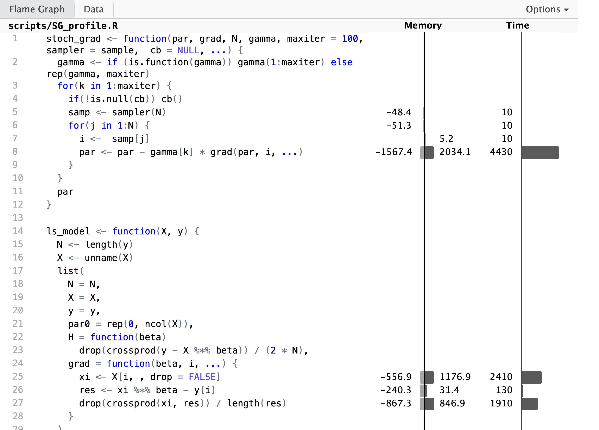

# Stochastic Optimization {#StochOpt}

Numerical optimization involves different tradeoffs such as
an *exploration-exploitation* tradeoff. 
On the one hand, the objective function must be thoroughly explored
to build an adequate model of it. On the other hand, the model should be 
exploited so as to find the minimum quickly. Another tradeoff is between 
the accuracy of the model and the time it takes to compute with it. 

The optimization algorithms considered in Chapters \@ref(numopt) and \@ref(em)
work on all available data and take deterministic steps in each iteration. 
The models are based on accurate local computations of derivatives that can be 
demanding to compute for large data sets. Moreover, the algorithms 
greedily exploit the local model obtained from derivatives, but they do 
little exploration.

By including randomness into optimization algorithms it is 
possible to lower the computational costs and make the algorithms more 
exploratory. This can be done in various ways. Examples of stochastic 
optimization algorithms include simulated annealing and evolutionary algorithms that 
incorporate randomness into the iterative steps with the purpose of exploring 
the objective function better than a deterministic algorithm is able to. In 
particular, to avoid getting stuck in saddle points and to escape local minima. 
Stochastic gradient algorithms form another example, where descent 
directions are approximated by gradients from random subsets of the data. 

The literature on stochastic optimization is huge, and this chapter will 
only cover some examples of particular relevance to statistics and machine 
learning. The most prominent applications are to large scale optimization, 
where stochastic gradient algorithms have 
become the standard solution. When the dimension of the optimization problem becomes
very large, second order methods become prohibitively slow, and if the 
number of observations is also large, even one computation of the gradient 
for the entire data batch becomes time consuming. In those cases, 
stochastic gradient algorithms, that originate from online learning, can make 
progress more quickly while still using the entire batch of data. 


## Stochastic gradient algorithms {#SG-alg}

The stochastic gradient algorithms have their origin in an online learning 
framework, where the objective function is an expected loss and data arrives 
sequentially as a stream of data points. @Robbins:1951 introduced in their 
seminal paper a variant of the online stochastic gradient algorithm that they 
called the *stochastic approximation method*, and they established the first 
convergence result for such algorithms. To understand what the stochastic gradient 
algorithms generally are supposed to optimize, we will introduce the 
general framework of a population model below and give conditions that ensure 
that the basic online algorithm converges. Subsequently, the basic online algorithm
is turned into an algorithm for batch data, which is the algorithm of 
primary interest. In the following sections, various beneficial extensions of 
the basic batch algorithm are explored.


### Population models {#Pop-model}

We will consider observations from the sample 
space $\mathcal{X}$, and we will be interested in estimating parameters 
from the parameter space $\Theta$. A loss function 
$$L : \mathcal{X} \times \Theta \to \mathbb{R}$$
is fixed throughout, and we will be interested in minimizing the expected 
loss also known as the *risk*. That is, we want to minimize
$$H(\theta) = E(L(X, \theta)) = \int L(x, \theta) \mathrm{\mu}(dx)$$
with $X \in \mathcal{X}$ having distribution $\mu$. 
Of course, it is implicitly understood that the expectation has to be well
defined for all $\theta$. 

```{example, least-squares}
Suppose that $X = (Y, Z)$ with $Y$ a real valued random variable, and 
that $\mu(z, \theta)$ denotes a parametrized mean value conditionally on $Z = z$. 
Then the mean squared error is defined in terms of the squared error loss as
$$\mathrm{MSE}(\theta) = \frac{1}{2} E (Y - \mu(Z, \theta))^2.$$
That is, the loss function is the squared error loss 
$L((y,z), \theta) = \frac{1}{2} (y - \mu(z, \theta))^2$. 
From the definition it follows that 
$$2 \mathrm{MSE}(\theta) =  E(Y - E(Y \mid Z))^2 + E (E(Y\mid Z) - \mu(Z, \theta))^2,$$
where the first term does not depend upon $\theta$. Thus minimizing the 
mean squared error is the same as finding $\theta_0$ such that $\mu(z, \theta_0)$
is the optimal approximation of $E(Y \mid Z = z)$ in a squared error sense.


```

Note how the link between the distribution of $X$ and the parameter is defined 
in the example above by the choice of loss function. There is no upfront 
assumption that $E(Y\mid Z = z) = \mu(z, \theta_0)$ for some "true" $\theta_0$, but 
if there is such a $\theta_0$, it will clearly be a minimizer. In general, the 
optimal $\theta_0$ is simply the $\theta$ that minimizes the risk.

The mean squared error is suitable when we model the conditional mean of $Y$. 
Other loss functions include the check loss functions used for 
[quantile regression](https://en.wikipedia.org/wiki/Quantile_regression#Quantiles).
The absolute value is a special case suitable for modeling the conditional
median. The following example will introduce the log-likelihood loss that is 
suitable for a parametrized family of distributions.

```{example, log-likelihood}
Suppose that $f_{\theta}$ denotes a density on $\mathcal{X}$ parametrized by $\theta$. 
Then the cross-entropy is defined in terms of the log-likelihood loss as 
$$H(\theta) = - E \log(f_{\theta}(X)).$$
Thus the loss function is $L(x, \theta) = - \log f_{\theta}(x)$. 
If the distribution of $X$ has density $f^0$ then 
\begin{align*}
H(\theta) & = - E \log(f^0(X)) - E \log(f_{\theta}(X)/f^0(X)) \\
& = H(f^0) + D(f_0 \ || \ f_{\theta})
\end{align*}
where the first term is the entropy of $f^0$, and the second is the 
Kullback-Leibler divergence of $f_{\theta}$ from $f^0$. 
Note that the entropy does not depend upon $\theta$ and minimizing
the cross-entropy is thus the same as finding a $\theta$ with $f_{\theta}$ 
being the optimal approximation of $f^0$ in a Kullback-Leibler sense. 


```


### Online stochastic gradient algorithm

The classical stochastic gradient algorithm is an example of an online 
learning algorithm.
It is based on the simple observation that if we can 
interchange differentiation and expectation then
$$\nabla H(\theta) = E \left( \nabla_{\theta} L(X, \theta) \right),$$
thus if $X_1, X_2, \ldots$ form an i.i.d. sequence then $\nabla_{\theta} L(X_i, \theta)$ 
is unbiased as an estimate of the gradient of $H$ for any $\theta$ and any $i$. 
With inspiration from gradient descent algorithms it is natural to suggest 
stochastic parameter updates of the form 
$$\theta_{n + 1} = \theta_n - \gamma_n \nabla_{\theta} L(X_{n+1}, \theta_n)$$
starting from some initial value $\theta_0$. The sequence of 
step size parameters $\gamma_n \geq 0$ are known collectively 
as the *learning rate*. It can be a deterministic sequence, but $\gamma_n$ may 
also be allowed to depend on $X_1, \ldots, X_{n}$ and $\theta_0, \ldots, \theta_{n}$.

```{theorem, SG-conv} 
Suppose $H$ is strongly convex and 
$E(\|\nabla_{\theta} L(X, \theta))\|^2) \leq A + B \|\theta\|^2$. If 
$\theta^*$ is the global minimizer of $H$ then $\theta_n$ converges almost surely 
toward $\theta^*$ if 
\begin{equation}
\sum_{n=1}^{\infty} \gamma_n^2 < \infty \quad \text{and} \quad 
\sum_{n=1}^{\infty} \gamma_n = \infty. (\#eq:conv-cond)
\end{equation}
```

From the above result, convergence of the algorithm 
is guaranteed if the learning rate, $\gamma_n$, converges to 0 but 
does so sufficiently slowly. Though formulated in a slightly different way,
@Robbins:1951 were the first to demonstrate convergence of an online 
learning algorithm under conditions as above on the learning rate. 
Following their terminology, much has since been written on online 
learning and adaptive control theory under the name *stochastic approximation*, 
@Lai:2003.

The precise way that the learning 
rate decays is known as the *decay schedule*, and a flexible
three-parameter power law family of decay schedules is given by 
$$\gamma_n = \frac{\gamma_0  K}{K + n^a} = \frac{\gamma_0 }{1 + K^{-1} n^{a}}$$
for some initial learning rate $\gamma_0 > 0$ and constants $K, a > 0$. If 
$a \in (0.5, 1]$ the resulting learning rate satisfies the convergence conditions
\@ref(eq:conv-cond).

(ref:decay-fig) Power law decay schedules as a function of $n$ for $\gamma_0 = 1$ and for different choices of $K$ and $a.$ The left figure shows decay schedules with $a$ chosen so that the convergence conditions are fulfilled, whereas the right figure shows decay schedules for which the convergence conditions are not fulfilled.

```{r decay-fig, echo=FALSE, dependson="decay", fig.cap="(ref:decay-fig)", fig.height=4, fig.width=8, out.width="100%"}
grid_par <- expand.grid(
#  n = 2^(seq(0, 20, 1)),
  n = seq(0, 1000, 2),
  K = c(25, 50, 100),
  a = c(0.6, 1),
  gamma0 = 1
)

grid_par <- mutate(grid_par, rate = gamma0 * K / (K + n^a))

p1 <- ggplot(grid_par, aes(n, rate, color = factor(K), linetype = factor(a))) + 
  geom_line() +
#  geom_point(size = 2) +
#  scale_x_log10() +
#  scale_y_log10("Learning rate") +
  scale_color_discrete("K:") +
  scale_linetype_discrete("a:") +
  theme(legend.position = "top", legend.box="vertical", legend.margin=margin()) +
  guides(color = guide_legend(order = 1), linetype = guide_legend(order = 2))

grid_par <- expand.grid(
#  n = 2^(seq(0, 20, 1)),
  n = seq(0, 1000, 2),
  K = c(1e4, 1e5, 1e6),
  a = c(2, 2.5),
  gamma0 = 1
)

grid_par <- mutate(grid_par, rate = gamma0 * K / (K + n^a))

p2 <- ggplot(grid_par, aes(n, rate, color = factor(K), linetype = factor(a))) + 
  geom_line() +
#  geom_point(size = 2) +
#  scale_x_log10() +
#  scale_y_log10("Learning rate") +
  ylab("") +
  scale_color_discrete("K:", labels = c(quote(10^4), quote(10^5), quote(10^6))) +
  scale_linetype_discrete("a:") +
  theme(legend.position = "top", legend.box="vertical", legend.margin=margin()) +
  guides(color = guide_legend(order = 1), linetype = guide_legend(order = 2))

gridExtra::grid.arrange(p1, p2, ncol = 2)
```

The parameter $\gamma_0$ determines the initial baseline rate, and Figure \@ref(fig:decay-fig) 
illustrates the effect of the parameters $K$ and $a$ on the decay. The parameter 
$a$ is the asymptotic exponent of $\gamma_n \sim \gamma_0 K n^{-a}$, and $K$ 
determines how quickly the rate will turn into a pure power law decay. Moreover, 
if we have a target rate, $\gamma_{1}$, that we want to hit after $n_{1}$
iterations, and we fix the exponent $a$, we can also solve for $K$ to find 
$$K = \frac{n_1^a \gamma_1}{\gamma_0 - \gamma_1}.$$
This gives us a decay schedule that interpolates between $\gamma_0$ 
and $\gamma_1$ over the range $0, \ldots, n_1$ of iterations. 

We implement `decay_scheduler()` as a function that returns a particular 
decay schedule, with the possibility to determine $K$ automatically from a
target rate.

```{r decay}
decay_scheduler <- function(gamma0 = 1, a = 1, K = 1, gamma1, n1) {
  force(a)
  if (!missing(gamma1) && !missing(n1))
    K <- n1^a * gamma1 / (gamma0 - gamma1)
  b <- gamma0 * K
  function(n) b / (K + n^a)
}
```

The following example of online Poisson regression illustrates the general ideas.

```{example, online-pois-SG}
In this example $Y_i \mid Z_i = z_i \sim \mathrm{Pois(e^{\beta_0 + \beta_1 z_i})}$ 
for $\beta = (\beta_0, \beta_1)^T$ the parameter vector. 
We let the $Z_i$-s be uniformly distributed in $(-1, 1)$, but this choice is not
particularly important. The conditional mean of $Y_i$ given $Z_i = z_i$ is 
$$\mu(z_i, \beta) = e^{\beta_0 + \beta_1 z_i}$$
and we will first consider the squared error loss. To this end, we observe that 
$$\nabla_{\beta}  \mu(z_i, \beta) =  \mu(z_i, \beta) 
\left( \begin{array}{c} 1 \\ z_i \end{array} \right),$$
  which for the squared error loss gives the gradient 
$$\nabla_{\beta} \frac{1}{2} (y_i - \mu(z_i, \beta) )^2 = 
  \mu(z_i, \beta) (\mu(z_i, \beta) - y_i) \left( \begin{array}{c} 1 \\ z_i \end{array} \right).$$ 

```
  
To clearly emulate the online nature of the algorithm, the implementation below
generates the observations sequentially in the loop. 

```{r online-poisson-SG-SE, echo=-1}
set.seed(13102020)
N <- 5000
beta_true = c(2, 3)
mu <- function(z, beta) exp(beta[1] + beta[2] * z)
beta <- vector("list", N)

rate <- decay_scheduler(gamma0 = 0.0004, K = 100) 
beta[[1]] <- c(beta0 = 1, beta1 = 1)

for(i in 2:N) {
  # Simulating a new data point
  z <- runif(1, -1, 1)
  y <- rpois(1, mu(z, beta_true))
  # Update via squared error gradient 
  mu_old <- mu(z, beta[[i - 1]])
  beta[[i]] <- beta[[i - 1]]  - rate(i) * mu_old * (mu_old - y) * c(1, z)
}
beta[[N]]  # Compare this to beta_true
```

For the log-likelihood loss we instead find the gradient 
$$\nabla_{\beta} \big( \mu(z_i, \beta) - y_i \log(\mu(z_i, \beta)) \big) = 
  (\mu(z_i, \beta) - y_i) 
\left( \begin{array}{c} 1 \\ z_i \end{array} \right),$$
which leads to a slightly different but equally valid algorithm. We see that the
gradient only differs from the squared error gradient by lacking the factor $\mu(z_i, \beta)$.
The distribution of this factor has range between $e^{-1} \simeq 0.3679$ 
and $e^5 \simeq 148.4$ and is right skewed, that is, it is concentrated toward the 
smaller values but with a long right tail. Its median is $e^2 \simeq 7.389$,
while its mean is $(e^5 - e) / 6 \simeq  24.67$. Due to the factor $\mu(z_i, \beta)$, 
the squared error gradient is typically longer than the log-likelihood 
gradient — sometimes by a large factor. In the implementation below with the 
gradient of the log-likelihood we therefore choose $\gamma_0$
a factor 25 larger than the $\gamma_0 = 0.0004$ used with the squared error gradient.

```{r online-poisson-SG-LL, echo=-c(1, 2), dependson="online-poisson-SG-SE"}
set.seed(13102020)
beta_SE <- cbind(as.data.frame(do.call(rbind, beta)),
                 data.frame(iteration = 1:N, loss = "squared error"))

rate <- decay_scheduler(gamma0 = 0.01, K = 100) 
beta[[1]] <- c(beta0 = 1, beta1 = 1)

for(i in 2:N) {
  # Simulating a new data point
  z <- runif(1, -1, 1)
  y <- rpois(1, mu(z, beta_true))
  # Update via log-likelihood gradient 
  mu_old <- mu(z, beta[[i - 1]])
  beta[[i]] <- beta[[i - 1]]  - rate(i) * (mu_old - y) * c(1, z)
}
beta[[N]]  # Compare this to beta_true
```

(ref:pois-sgd) Estimated parameter values for the two parameters $\beta_0$ (true value $2$) and $\beta_1$ (true value $3$) in the Poisson regression model as a function of the number of data points in the online stochastic gradient algorithm.

```{r pois-sgd, echo=FALSE, dependson="online_poisson_SG", fig.cap="(ref:pois-sgd)", warning=FALSE, fig.height=4, fig.width=8, out.width="100%"}
beta_all <- rbind(
  cbind(as.data.frame(do.call(rbind, beta)),
        data.frame(iteration = 1:N, loss = "log-likelihood")),
  beta_SE) %>% 
  pivot_longer(cols = c("beta0", "beta1"), names_to = "Parameter") %>% 
  filter(iteration %% 50 == 0)

ggplot(beta_all, aes(iteration, value, color = Parameter)) + 
  geom_hline(yintercept = beta_true[1], color = "blue") + 
  geom_hline(yintercept = beta_true[2], color = "red") + 
  geom_point(alpha = 0.5, shape = 16, size = 2) + 
  ylim(c(1.75, 3.25)) + 
  ylab("Parameter value") +
  xlab("Number of data points") +
  facet_wrap("loss") +
  scale_color_manual(values = c("blue", "red"))
```

Figure \@ref(fig:pois-sgd) shows how the estimates of $\beta_0$ and $\beta_1$
converge toward the true values for the two different choices of loss functions. 
The gradient from the squared error loss resulted in slower convergence and 
a more jagged sample path than the gradient from the log-likelihood. This is 
explained by the random factor $\mu(z_i, \beta)$ for the squared error gradient, 
which also makes the algorithm unstable if $\gamma_0$ is chosen much larger than in
the implementation. Thus 
we cannot simply increase $\gamma_0$ to make the convergence faster when using 
the squared error gradient. If we attempt to dampen the fluctuations by 
lowering $\gamma_0$, the convergence will be even slower. 

The example illustrates that a suitable choice of decay schedule — and even just 
the choice of the three parameters in our power law schedule — depends heavily 
on the problem considered and the gradient used, and it is a
problem specific challenge to find a good schedule. 

### Batch stochastic gradient algorithms

The online algorithm does not store data, and once a data point is used it is
forgotten. The online algorithm is working in a context where data arrives as
a stream of data points and the model is updated continually. In statistics, 
we more frequently encounter batch algorithms, where an entire batch of 
data points is stored and processed by the algorithm, and where each data point 
in the batch can be accessed as many times as we like. However, when the batch 
is sufficiently large, many standard batch algorithms are slow, and 
some ideas from online algorithms can beneficially be transferred to batch 
processing of data.

Within the population model framework in Section \@ref(Pop-model) 
the objective is to minimize a theoretical objective function defined 
in terms of the probability distribution $\mu$. For the online
algorithms we imagine an endless stream of data points from $\mu$, which can be used to ultimately
minimize the expected loss $H(\theta)$. Batch algorithms replace 
the population quantity by an empirical surrogate — the average loss on the batch 
$$H_N(\theta) = \frac{1}{N} \sum_{i=1}^N L(x_i, \theta).$$
Minimizing $H_N$ as a surrogate of minimizing $H$ is known as 
[empirical risk minimization](https://en.wikipedia.org/wiki/Empirical_risk_minimization).

If data is i.i.d. the standard deviation of $H_N(\theta)$ decays as $N^{-1/2}$ with $N$, 
while the run time of its computation
increases as $N$. Thus as we invest more computation time by using more
data we get diminishing returns; doubling the run time will only lower the 
precision of $H_N$ as an approximation of $H$ by a factor $1 / \sqrt{2} \simeq 0.7$. 
The same is, of course, 
true if we look at the gradient, $\nabla H_N(\theta)$, or higher derivatives 
of $H_N$. Could we get away with using a fraction of data points each time we compute the 
gradient, and then somehow cycle through the entire data set as the optimization 
algorithm progresses? The answer is yes, and the stochastic gradient
algorithm gives a (randomized) procedure for "cycling through the data". 

With $\hat{\mu}_N = \frac{1}{N}\sum_{i=1}^N \delta_{x_i}$ denoting the 
empirical distribution of the batch data set, we see that 
$$H_N(\theta) = \int L(x, \theta) \mathrm{\mu}_N(dx),$$
that is, the empirical risk is simply the expected loss with respect to the 
empirical distribution. Thus to minimize $H_N$ be can use the online 
approach by sampling observations from $\hat{\mu}_N$. This leads to the 
following basic version of the stochastic gradient algorithm applied to 
a data batch.

From an initial parameter value, $\theta_0$, we iteratively compute 
the parameters as follows: given $\theta_{n}$

* sample an index $i$ uniformly from $\{1, \ldots, N\}$
* compute $\rho_n = \nabla_{\theta} L(x_i, \theta_{n})$
* update the parameter $\theta_{n+1} = \theta_{n} - \gamma_n \rho_n.$

Note that sampling the index $i$ is equivalent to sampling an observation
from $\hat{\mu}_N$, which in turn is the same as nonparametric bootstrapping.
Just as in the online setting, the sequence of learning rates, $\gamma_n$, 
is a tuning parameter of the algorithm.

We implement the basic stochastic gradient algorithm below, 
allowing for a user defined decay schedule of the learning rate. However, 
instead of implementing one long loop, we divide the iterations into 
*epochs* with each epoch consisting of $N$ iterations. In the implementation, 
the maximal number of iterations is also given in terms of epochs, and 
the decay schedule is applied on a per epoch basis.

We also introduce a small twist on the sampling from the empirical distribution;
instead of sampling with replacement (bootstrapping) we sample without 
replacement. Sampling $N$ indices from $\{1, \ldots, N\}$ without replacement
is the same as sampling a permutation of the indices. 

```{r SG}
SG <- function(
  par, 
  grad,              # Function of parameter and observation index
  N,                 # Sample size
  gamma,             # Decay schedule or a fixed learning rate
  maxiter = 100,     # Max epoch iterations
  sampler = sample,  # How data is resampled. Default is a random permutation
  cb = NULL, 
  ...
) {
  gamma <- if (is.function(gamma)) gamma(1:maxiter) else rep(gamma, maxiter) 
  for(k in 1:maxiter) {
    if(!is.null(cb)) cb()
    samp <- sampler(N)   
    for(j in 1:N) {
      i <-  samp[j]
      par <- par - gamma[k] * grad(par, i, ...)
    }
  }
  par
}
```

One epoch in the algorithm above is exactly one pass through the entire batch of 
data points, but in a random order. Changing the default value of the `sampler`
argument to `function(N) sample(N, replace = TRUE)` would result in sampling with replacement, 
in which case an epoch would be a pass through 
$N$ data points sampled independently from the batch. Doing so, some data points would
be repeated while other data points from the 
batch would be missing. Sampling with replacement will feed the stochastic gradient 
algorithm with i.i.d. samples from the empirical distribution. Sampling without 
replacement introduces some dependence. Curiously, sampling without 
replacement has turned out to be empirically superior to sampling 
with replacement, and recent theoretical 
results, @Gurbuzbalaban:2019, support that it leads to a faster rate of convergence.

We may ask if the sampling actually matters, and whether we could just leave out that
part of the algorithm? In practice, data sets may come in a "bad order", 
for instance in an unfortunate ordering according to
one or more of its variables, and cycling through the data points in such an 
ordering can easily lead the algorithm astray. *It is therefore important to 
always randomize the order of the data points somehow*. A minimal amount of randomization
in common use is to just do one initial random permutation, corresponding
to moving `samp <- sampler(N)` outside of the outer for-loop above. This may 
be enough randomization for the algorithm to work in practice, but the link 
to the convergence result for the online algorithm is lost.

```{example, batch-pois-SG} 
As a continuation of Example \@ref(exm:online-pois-SG) we consider the batch version
of Poisson regression. We will only use the log-likelihood gradient, and we 
first simulate a small data set with $N = 50$ data points. 

```

```{r pois-gradient, dependson="SG", echo=-1}
set.seed(17102020)
N <- 50
z <- runif(N, -1, 1)
y <- rpois(N, mu(z, beta_true))
grad_pois <- function(par, i) (mu(z[i], par) - y[i]) * c(1, z[i])
```

Using the `grad_pois()` function above, we run the stochastic gradient
algorithm for 1000 epochs with a decay schedule that 
interpolates between $\gamma_0 = 0.02$ and $\gamma_1 = 0.001$.

```{r batch-poisson-SG, dependson="pois-gradient"}
pois_SG_tracer <- tracer("par", N = 0)
rate <- decay_scheduler(gamma0 = 0.02, gamma1 = 0.001, n1 = 1000) 
SG(c(0, 0), grad_pois, N = N, gamma = rate, maxiter = 1000, cb = pois_SG_tracer$tracer)
```

The resulting parameter estimate should be compared to the maximum-likelihood 
estimate from an ordinary Poisson regression.

```{r pois-beta-hat, dependson="pois-gradient", echo=1}
beta_hat <- coefficients(glm(y ~ z, family = poisson))
cat("beta_hat:", beta_hat)
```

The batch version of stochastic gradient 
descent converges toward the minimizer, $(\hat{\beta}_0, \hat{\beta}_1)$,
of the empirical risk. This is contrary to 
the online version that converges toward the minimizer of the 
theoretical risk, which in this case is $(\beta_0, \beta_1) = (2, 3)$.
With a larger batch size, $(\hat{\beta}_0, \hat{\beta}_1)$ will come closer 
to $(2, 3)$. Figure \@ref(fig:batch-pois-sgd-fig)
shows clearly how the algorithms converge toward a limit that depends on the 
batch size, and for $N = 500$, this limit is much closer to the theoretical
minimizer. 

```{r batch-poisson-SG-2, dependson="pois-gradient", echo=-1}
set.seed(17102020)
N <- 500
z <- runif(N, -1, 1)
y <- rpois(N, mu(z, beta_true))
pois_SG_tracer_2 <- tracer("par", N = 0)
rate <- decay_scheduler(gamma0 = 0.02, gamma1 = 0.001, n1 = 100) 
SG(c(0, 0), grad_pois, N = N, gamma = rate, cb = pois_SG_tracer_2$tracer)
```

```{r pois-beta-hat-2, dependson="batch-poisson-SG-2", echo=1}
beta_hat_2 <- coefficients(glm(y ~ z, family = poisson))
cat("beta_hat_2:", beta_hat_2)
```


(ref:batch-pois-sgd) Estimated parameter values for the two parameters $\beta_0$ (true value $2$) and $\beta_1$ (true value $3$) in the Poisson regression model as a function of the number of iterations in the stochastic gradient algorithm. For batch size $N = 50$, the algorithm converges to a parameter clearly different from the theoretically optimal one (gray dashed lines), while for batch size $N = 500$ the limit is closer to $(2, 3).$  

```{r batch-pois-sgd-fig, echo=FALSE, dependson="online_poisson_SG", fig.cap="(ref:batch-pois-sgd)", warning=FALSE, fig.height=4, fig.width=8, out.width="100%"}
hline_data <- data.frame(
  beta0 = c(beta_hat[1], beta_hat_2[1]), 
  beta1 = c(beta_hat[2], beta_hat_2[2]),
  N = c("N = 50", "N = 500")
)

bind_rows(
  small = summary(pois_SG_tracer)[seq(10, 1000, 10), ], 
  large = summary(pois_SG_tracer_2), 
  .id = "N"
) %>% 
  mutate(N = ifelse(N == "small", "N = 50", "N = 500"), n = rep(50 * seq(10, 1000, 10), 2)) %>% 
  rename(beta0 = par.1, beta1 = par.2) %>% 
  pivot_longer(cols = c("beta0", "beta1"), names_to = "Parameter") %>% 
ggplot(aes(n, value, color = Parameter)) + 
  geom_hline(data = hline_data, aes(yintercept = beta0), color = "blue") + 
  geom_hline(data = hline_data, aes(yintercept = beta1), color = "red") + 
  geom_hline(yintercept = beta_true[1], linetype = 2, alpha = 0.5) + 
  geom_hline(yintercept =  beta_true[2], linetype = 2, alpha = 0.5) + 
  geom_point(alpha = 0.5, shape = 16, size = 2) + 
  ylim(c(1.5, 3.5)) + 
  ylab("Parameter value") +
  facet_wrap("N") +
  scale_color_manual(values = c("blue", "red"))
```

Example \@ref(exm:batch-pois-SG) and Figure \@ref(fig:batch-pois-sgd-fig), in 
particular, illustrate that if the data set is relatively small, the algorithm quickly 
attains a precision smaller than the statistical uncertainty, and further 
optimization is therefore futile. However, for larger data sets, optimization 
to a greater precision can be beneficial.

### Predicting news article sharing on social media {#news}

In this section we will illustrate the use of the basic stochastic gradient 
algorithm for learning a model that predicts how 
many times a news article is shared on social media. The data will be subjected to 
transformations and normalizations to make the use of a linear model and 
the squared error loss reasonable.

The basic stochastic gradient algorithm for the linear model was introduced 
to the early machine learning community in 1960 via ADALINE (Adaptive Linear Neuron)
by Bernard Widrow and Ted Hoff. ADALINE was 
[implemented as a physical device](https://www.youtube.com/watch?v=hc2Zj55j1zU) 
capable of learning patterns
via stochastic gradient updates. The math is the same today, though the implementation
has fortunately become somewhat easier.

With a linear model and the squared error loss, 
$L((y, x), \beta) = \frac{1}{2} (y - \beta^T x)^2$,
the gradient becomes 
$$\nabla_{\beta} L((y, x), \beta) = - x (y - \beta^T x) = x (\beta^T x - y),$$
which results in updates of the form
$$\beta_{n+1} = \beta_n - \gamma_n x_i (\beta_n^T x_i - y_i).$$
That is, the parameter moves in the direction of $x_i$ if $\beta_n^T x_i < y_i$
and in the direction of $-x_i$ if $\beta_n^T x_i > y_i$. The amount by which 
it moves is controlled partly by the learning rate, $\gamma_n$, and partly by
the size of the residual, $y_i - \beta_n^T x_i$. A larger residual gives 
a larger move. 

The following function factory for linear models takes a model 
matrix and a response vector for the complete data batch as arguments and implements the squared error 
loss function on the entire batch as well as the gradient in a single 
observation. The returned list also contains a parameter vector of 
the correct dimension, which can be used for initialization of optimization
algorithms. 

```{r ls-model}
ls_model <- function(X, y) {
  N <- length(y)
  X <- unname(X) # Strips X of names
  list(
    # Initial parameter value
    par0 = rep(0, ncol(X)),
    # Objective function
    H = function(beta) 
      drop(crossprod(y - X %*% beta)) / (2 * N),
    # Gradient in a single observation
    grad = function(beta, i) {  
      xi <- X[i, ]
      xi * drop(xi %*% beta - y[i])
    }
  )
}
```

The data, originally collected by @Fernandes:2015, was obtained from the 
[UCI Machine Learning Repository](https://archive.ics.uci.edu/ml/datasets/online+news+popularity)
and contains 39,644 observations on 61 variables. One variable is the integer
valued `shares`, which will be the target variable of our predictions. 

```{r news-data, message=FALSE}
News <- readr::read_csv("data/OnlineNewsPopularity.csv")
```

Two of the variables, `timedelta` and `url`, are not relevant predictors, and 
`is_weekend` is redundant given the other weekday variables, so we exclude 
those three variables. Some of the predictors are also highly correlated, 
and we exclude four additional predictors before the model matrix is constructed.
The `shares` target variable is, in addition, log-transformed.

```{r news-X-y, dependson="news-data"}
News <- dplyr::select(
  News,
  - url, 
  - timedelta,
  - is_weekend,
  - n_non_stop_words,
  - n_non_stop_unique_tokens,
  - self_reference_max_shares,
  - kw_min_max
)
# The model matrix without an explicit intercept is constructed using 
# all variables reamining in the data set but the target variable 'shares' 
X <- model.matrix(shares ~ . - 1, data = News)  
y <- log(News$shares)
```

This data set is by current standards not a large data set -- the dense model 
matrix takes only about 20 MB of memory -- and the 
linear model can easily be fitted by simply solving the least squares problem.
It takes about 0.2 seconds on a standard laptop to compute the solution.

```{r lm-News, dependson="news-X-y"}
lm_News <- lm.fit(X, y)
```

The residual plot in Figure \@ref(fig:fig-res-lm-News) shows that the 
model is actually not a poor fit to data, though there is a considerable 
unexplained residual variance.

```{r fig-res-lm-News, message = FALSE, warning = FALSE, echo=FALSE, fig.cap="Residual plot for the linear model of the logarithm of news article shares."}
ggplot(mapping = aes(x = exp(lm_News$fitted.values), y = lm_News$residuals)) + 
  geom_point(alpha = 0.1) + 
  geom_smooth() +
  xlab("Fitted values (number of shares)") +
  ylab("Residuals (log-scale)") +
  #scale_y_log10(limits = exp(c(-8, 8)), breaks = c(10^(-2), 0, 10^2), labels = c("0.01", "0", "100")) + 
  ylim(-8, 8) + 
  scale_x_log10(limits = exp(c(6, 10)))
```

```{r News-cor, eval=FALSE, echo=FALSE}
cp <- cor(X, method = "spearman")
ord <- rev(hclust(as.dist(1 - abs(cp)))$order)
colPal <- colorRampPalette(c("blue", "yellow"), space = "rgb")(100)
lattice::levelplot(cp[ord, ord], xlab = "",
          ylab = "",
          col.regions = colPal,
          at = seq(-1, 1, length.out = 100),
          colorkey = list(space = "top", labels = list(cex = 1.5)), 
          scales = list(x = list(rot = 45), y = list(draw = FALSE), cex = 0.5) 
)

```

```{r News-cor-order, eval=FALSE, echo=FALSE}
cor_long <- as_tibble(cp) %>% 
  mutate(var1 = row.names(cp)) %>% 
  pivot_longer(- var1, names_to = "var2") 
View(cor_long)
svd(X)$d
```

```{r News-cor-scatter, eval=FALSE, echo=FALSE}
cor.print <- function(x, y) { panel.text(mean(range(x)), mean(range(y)),
round(cor(x, y, method = "spearman"), digits = 2))
}

contVar <- c("kw_max_min", "kw_avg_min",  "kw_min_min", "kw_max_max", "kw_avg_max", 
             "kw_min_avg", "kw_max_avg", "kw_avg_avg") 

contVar <- c("kw_max_min", "kw_max_avg",  "kw_max_max", "kw_avg_min", "kw_avg_avg", "kw_avg_max", 
             "kw_min_min", "kw_min_avg") 

splom(log(X[, contVar] + 2), xlab = "",
upper.panel = hexbin::panel.hexbinplot,
pscales = 0, xbins = 20,
lower.panel = cor.print)
```

Optimization of the squared error loss using this data set will be used to 
illustrate a number of stochastic gradient algorithms even though we can 
compute the optimizer easily by other means. The real practical benefit of 
stochastic gradient algorithms comes when applied to large scale problems that are difficult to 
treat as textbook examples. And using a toy problem makes it easier to 
understand in detail how the different algorithms behave. 

The very first thing we will do is to standardize all the columns of $X$ to have 
the same norm. Specifically in this case to have non-central second moment 1.
This does not change the optimization problem, but corresponds to a 
reparametrization where all parameters are rescaled. The rescaling brings 
the parameters on a comparable scale, which is typically a good idea for 
optimization algorithms based on gradients only. After rescaling we
initialize the linear model with a call to `ls_model()` and refit the 
model using the new parametrization.

```{r LS-model, dependson=c("ls-model", "news-X-y")}
X_raw <- X
# Standardization
X <- scale(X, center = FALSE)
# The '%<-%' destructure assignment operator is from the zeallot package
c(par0, H, grad_obs) %<-% ls_model(X, y)

lm_News <- lm.fit(X, y)
par_hat <- lm_News$coefficients  # Will be used below for comparisons

```

We first run the stochastic gradient algorithm with a fixed learning rate of 
$\gamma = 10^{-5}$ for 50 epochs with a tracer that computes and 
stores the value of the objective function at each epoch.

```{r SG-tracer, results="hide"}
SG_tracer <- tracer("value", expr = quote(value <- H(par)))
SG(par0, grad = grad_obs, N = nrow(X), gamma = 1e-5, maxiter = 50, cb = SG_tracer$tracer)
```

Using the trace from the last epochs, we can compare the objective function
values to the minimum found using `lm.fit()` above. The minimum was 
not reached completely after the 50 epochs that took a little more than 17 
seconds.

```{r SG-tracer-sum, dependson="SG-tracer"}
SG_trace_low <- summary(SG_tracer)
tail(SG_trace_low)
H(par_hat)
```

We will use profiling to investigate what most of the 17 seconds were spent
on in the stochastic gradient algorithm.

```{r SG-profiling, eval=FALSE}
profvis(SG(par0, grad_obs, N = nrow(X), gamma = 1e-5, maxiter = 50))
```


```{r SG-profivis-image, out.width="90%", echo=FALSE}

```

The [profiling result](figures/SG_profile.html) shows, unsurprisingly, that the
computation of the gradient and the update of the parameter vector takes up most
of the run time. But if we look closer at the implementation of the gradient, we see
that the innocuously looking subsetting `X[i, ]` to the $i$-th row is actually 
responsible for about half of the run time. We also see a substantial 
allocation and deallocation of memory associated with this line. It is a 
bottleneck of the R implementation that slicing out a row from a bigger 
matrix cannot be done without creating a copy of that row, and this is why 
this particular line takes up so much time.

To further investigate the convergence of the basic stochastic gradient algorithm
we run it with a larger 
learning rate of $\gamma = 5 \times 10^{-5}$ and then with a power law decay 
schedule, which interpolates from an initial learning rate of $10^{-3}$ to
a learning rate of $10^{-5}$ after 50 epochs. 

```{r SG-tracer-2, results="hide"}
SG_tracer$clear()
SG(par0, grad_obs, N = nrow(X), gamma = 5e-5, maxiter= 50, cb = SG_tracer$tracer)
SG_trace_high <- summary(SG_tracer)
SG_tracer$clear()
rate <- decay_scheduler(gamma0 = 1e-3, gamma1 = 1e-5, a = 0.6, n1 = 50)
SG(par0, grad_obs, N = nrow(X), gamma = rate, maxiter= 50, cb = SG_tracer$tracer)
SG_trace_decay <- summary(SG_tracer)
```

We will compare the convergence of the three stochastic gradient algorithms with 
the convergence of gradient descent with backtracking. For gradient descent we choose 
$\gamma = 8 \times 10^{-2}$, which results in only a few initial backtracking 
steps and then all subsequent steps will use the step length 
$\gamma = 8 \times 10^{-2}$. Choosing a larger $\gamma$ for this particular
optimization resulted in backtracking until a step length around $8 \times 10^{-2}$ was 
reached, thus this choice of $\gamma$ will use a minimal amount of time on 
the backtracking step of the algorithm.

```{r News-GD, warning=FALSE, results='hide'}
grad_H <- function(beta) crossprod(X, X %*% beta - y) / nrow(X)
GD_tracer <- tracer("value", N = 10)
GD(par0, H, grad_H, gamma = 8e-2, maxiter = 800, cb = GD_tracer$tracer)
GD_trace <- summary(GD_tracer)
```

Figure \@ref(fig:news-trace-plot) shows how the four algorithms converge. 
The stochastic gradient algorithm with the high learning rate 
$\gamma = 5 \times 10^{-5}$ decays about as fast as the gradient descent 
algorithm, and both are somewhat faster than stochastic gradient with 
the low learning rate $\gamma = 10^{-5}$. Using the power law decay schedule
is initially a little faster than the high learning 
rate, but eventually the decay becomes slower. Even though there is some theoretical guarantee 
of convergence with the power law decay schedule, the choice of a 
suitable learning rate or decay schedule in practice is just as much 
an empirical art.

```{r news-trace-plot, echo=FALSE, dependson=c("News-GD", "SG-tracer-2", "SG-tracer-sum"), fig.cap="Convergence of squared error loss on the news article data set for four algorithms: gradient descent (gd) and three basic stochastic gradient algorithms with a low learning rate, a high learning rate and a power law decay schedule.", fig.width=8, fig.height=4, out.width="100%"}
bind_rows(
  low = SG_trace_low, 
  high = SG_trace_high, 
  decay = SG_trace_decay,
  gd = GD_trace[seq(1, 800, 20), ], 
  .id = "Algorithm"
) %>% 
  filter(.time < 10) %>% 
autoplot(y = value - H(par_hat)) + 
  aes(color = Algorithm, shape = Algorithm) + 
  geom_line() +
  scale_color_brewer(limits = c("low", "high", "decay", "gd", "mini", "moment", "adam", "adam_decay"), 
                     breaks = c("low", "high", "decay", "gd"),
                     type = "qual", palette = 2) +
  scale_shape_manual(limits = c("low", "high", "decay", "gd", "mini", "moment", "adam", "adam_decay"), 
                     breaks = c("low", "high", "decay", "gd"),
                     values = c(0, 1, 2, 5, 15, 16, 17, 19))
```

Comparisons of optimization algorithms should generally be done by 
monitoring their convergence as a function of real time and not iterations,
but the comparisons in Figure \@ref(fig:news-trace-plot) are arguably not 
entirely fair to the stochastic gradient algorithm.
The figure indicates that stochastic gradient and gradient descent 
are about equally fast, but when comparing algorithms in terms of 
real time we are admittedly comparing 
their specific implementations, and the R implementation of the 
stochastic gradient algorithm has some shortcomings. One 
epoch of the stochastic gradient algorithm should be about as computationally
demanding as one iteration of gradient descent as both will 
compute the gradient in each data point exactly once and add them up.
The vectorized batch gradient computation is fairly efficient in R, but the iterative 
looping over data in the stochastic gradient algorithm is not, and this 
inefficiency is compounded by the fact that slicing 
of matrices in R unavoidably copies data as the profiling showed. 
One way to circumvent these shortcomings of the implementation
is to rewrite the inner loop of an epoch using Rcpp. 

In the subsequent section we will see alternatives to the 
basic stochastic gradient algorithm, which will diminish the shortcomings 
of a pure R implementation somewhat. Thus we will not pursue the Rcpp implementation
here but return to it in Section \@ref(SG-Rcpp).

## Beyond basic stochastic gradient algorithms

The gradient $\nabla_{\theta} L(x_i, \theta)$ for a single random data point is quickly 
computed, and though unbiased as an estimate of $\nabla_{\theta} H_N(\theta)$
it has a large variance.
This affects the basic stochastic gradient algorithm negatively as the directions 
suggested can oscillate quite wildly from iteration to iteration. This section
covers some techniques that yield a better tradeoff between
run time and variability. 

The most obvious technique is to use more than one observation per computation
of the gradient, which gives us *mini-batch* stochastic gradient algorithms. 
A second technique is to incorporate some memory about previous directions into 
the movements of the algorithms — in the same spirit as how the conjugate gradient
algorithm uses the previous gradient to modify the descent direction.

The literature on deep learning has recently exploded with variations 
on the stochastic gradient algorithm. Performance is mostly 
studied empirically and applied in practice to the highly non-convex 
optimization problem of learning a neural network. A comprehensive coverage
of all the different ideas will not be attempted, and only three of the most 
solidified variations will be treated. The use of mini-batches is ubiquitous, 
and momentum will be introduced to illustrate a variation with memory. Finally,
the popular Adam algorithm is introduced as an example with adaptive learning 
rates. 

### Mini-batches

The three steps of the mini-batch stochastic gradient algorithm
with mini-batch size $m$ are: given $\theta_{n}$

* sample $m$ indices, $I_n$, from $1, \ldots, N$
* compute $\rho_n = \frac{1}{m} \sum_{i\in I_n} \nabla_{\theta} L(x_i, \theta_{n})$
* update the parameter $\theta_{n+1} = \theta_{n} - \gamma_n \rho_n.$

Of course, the mini-batch algorithm with $m = 1$ is the basic stochastic gradient 
algorithm. As for the basic algorithm, we implement the variation of the sampling,
where we sample a *partition* 
$$I_1 \cup \ldots \cup I_M \subseteq \{1, \ldots, N\}$$
for $M = \lfloor N / m \rfloor$ and in one epoch loop through the mini-batches 
$I_1, \ldots, I_M$. 

In the following sections we will develop a couple of modifications to the basic
stochastic gradient algorithm, and we will therefore implement a more generic
version of the algorithm. What is common to all the modifications is that they 
differ in the details of the epoch loop, thus we take out that loop as a separate
function.


```{r SG-mini-batch}
SG <- function(
  par, 
  N,                 # Sample size
  gamma,             # Decay schedule or a fixed learning rate
  epoch = batch,     # Epoch update function
  ...,               # Other arguments passed to epoch updates
  maxiter = 100,     # Max epoch iterations
  sampler = sample,  # How data is resampled. Default is a random permutation
  cb = NULL
) {
  gamma <- if (is.function(gamma)) gamma(1:maxiter) else rep(gamma, maxiter) 
  for(k in 1:maxiter) {
    if(!is.null(cb)) cb()
    samp <- sampler(N)
    par <- epoch(par, samp, gamma[k], ...)
  }
  par
}
```

The implementation uses `batch()` as the default update function,
and we implement this function below. It uses the 
random permutation to generate the $M$ mini-batches, and looping through the 
mini-batches it calls `grad()` for the computation of the average
gradient for each mini-batch and then updates the parameter accordingly.
Note that the `grad` argument to `batch()` will be captured by and passed on from 
a call of `SG()` via the `...` argument. 

```{r batch}
batch <- function(
    par, 
    samp,
    gamma,  
    grad,              # Function of parameter and observation index
    m = 50,            # Mini-batch size
    ...
  ) {
    M <- floor(length(samp) / m)
    for(j in 0:(M - 1)) {
      i <- samp[(j * m + 1):(j * m + m)]
      par <- par - gamma * grad(par, i, ...)
    }
    par
}
```

The `grad()` function implemented in `ls_model()` above assumes that the 
index argument $i$ is a single number and not a vector. As it is implemented, 
it computes for a vector $i$ a matrix containing the 
different gradients as columns. We therefore reimplement 
`ls_model()` so that `grad()` computes the average of the gradients
as it is supposed to for a mini-batch.

```{r ls-model-update}
ls_model <- function(X, y) {
  N <- length(y)
  X <- unname(X)
  list(
    par0 = rep(0, ncol(X)),
    # Objective function
    H = function(beta)
      drop(crossprod(y - X %*% beta)) / (2 * N),
    # Gradient 
    grad = function(beta, i) {               
      xi <- X[i, , drop = FALSE]
      drop(crossprod(xi, xi %*% beta - y[i])) / length(i)
    }
  )
}
```

We initialize the linear model using the new implementation of `ls_model()`. 

```{r grad-obs-update, dependson=c("LS-model", "ls-model-update")}
c(par0, H, grad_obs) %<-% ls_model(X, y)
```

With increased flexibility of the algorithms comes more tuning parameters, 
and making a good choice of all of them becomes increasingly difficult. When 
introducing mini-batches we need to choose the mini-batch size in 
addition to the learning rate, and a good choice of learning rate or decay schedule 
will depend on the size of the mini-batch. To simplify matters, a mini-batch 
size of 1000 and a fixed learning rate are used in the subsequent applications. 
The learning rate will generally be chosen as large as 
possible without making the algorithms diverge, and with a mini-batch size of 1000
it is possible to run the algorithm with a learning rate of $\gamma = 5 \times 10^{-2}$.

```{r SG-mini-batch-run, results='hide', dependson=c("batch", "SG-mini-batch", "grad-obs-update")}
SG_tracer$clear()
SG(
  par0, N = nrow(X), gamma = 5e-2, grad = grad_obs, 
  m = 1000, maxiter = 200, cb = SG_tracer$tracer
)
SG_trace_mini <- summary(SG_tracer)
```


```{r news-trace-plot-2, echo=FALSE, dependson=c("SG-mini-batch-run", "News-GD", "SG-tracer-2"), fig.width=8, fig.height=4, out.width="100%", fig.cap="Convergence of squared error loss on the news article data set for three algorithms: gradient descent (gd), basic stochastic gradient with a power law decay schedule (decay), and mini-batch stochastic gradient with a batch size of 1000 and a fixed learning rate (mini)."}
bind_rows(
  mini = SG_trace_mini[seq(1, 200, 3), ], 
  decay = SG_trace_decay,
  gd = GD_trace[seq(1, 800, 20), ], 
  .id = "Algorithm"
) %>% 
  filter(.time < 10) %>% 
autoplot(y = value - H(par_hat)) + 
  aes(color = Algorithm) + 
  geom_line() +
  scale_color_brewer(limits = c("low", "high", "decay", "gd", "mini", "moment", "adam", "adam_decay"), 
                       breaks = c("decay", "gd", "mini"), type = "qual", palette = 2) +
  scale_shape_manual(limits = c("low", "high", "decay", "gd", "mini", "moment", "adam", "adam_decay"), 
                     breaks = c("decay", "gd", "mini"),
                     values = c(0, 1, 2, 5, 15, 16, 17, 19))
```

Figure \@ref(fig:news-trace-plot-2) shows that this implementation of 
the mini-batch stochastic gradient 
algorithm converges faster than the basic stochastic gradient algorithm with 
a power law decay schedule 
as well as the gradient descent algorithm. Eventually, it begins to 
fluctuate due to the fixed learning rate, but it quickly gets close to
the minimum.

### Momentum

Mini-batches stabilize the gradients, and so does momentum. Both techniques 
can be used in combination, and the momentum update of a 
mini-batch stochastic gradient algorithm is as follows: Given $\theta_{n}$ 
and a batch $I_n \subseteq \{1, \ldots, N\}$ with $|I_n| = m$

* compute $g_n = \frac{1}{m} \sum_{i\in I_n} \nabla_{\theta} L(x_i, \theta_{n})$
* compute $\rho_n = \beta \rho_{n-1} +  (1-\beta) g_n$
* update the parameter $\theta_{n+1} = \theta_{n} - \gamma_n \rho_n.$

The memory of the algorithm is in the second step, where the direction, $\rho_{n}$, is 
updated using a convex combination of the previous direction, $\rho_{n-1}$,
and the mini-batch gradient, $g_n$. Usually, the initial direction is chosen 
as $\rho_0 = 0$. The parameter $\beta \in [0,1)$ is a tuning parameter determining 
how long the memory is. A value like $\beta = 0.9$ or $\beta = 0.95$ is 
often recommended -- otherwise the memory in the algorithm will be rather short, 
and the effect of using momentum will be small. A choice of $\beta = 0$ 
corresponds to the mini-batch algorithm without memory.

Contrary to the batch epoch function, the momentum epoch function
needs to store the previous direction between updates. It is not immediately 
clear how to achieve this between two epochs using the generic `SG()` 
implementation, but by implementing momentum epochs using a function factory, 
we can easily use an enclosing environment of the epoch function 
for storage.

```{r momentum}
momentum <- function() {
  rho <- 0
  function(
    par, 
    samp,
    gamma,  
    grad,
    m = 50,             # Mini-batch size
    beta = 0.95,        # Momentum memory 
    ...
  ) {
    M <- floor(length(samp) / m)
    for(j in 0:(M - 1)) {
      i <- samp[(j * m + 1):(j * m + m)]
      # Using '<<-' assigns the value to rho in the enclosing environment
      rho <<- beta * rho + (1 - beta) * grad(par, i, ...)  
      par <- par - gamma * rho
    }
    par
  }
}
```

When calling `SG()` below with `epoch = momentum()`, the evaluation
of the function factory `momentum()` returns the momentum epoch function 
with is own local environment used to store $\rho$. With momentum, we can 
increase the learning rate to $\gamma = 7 \times 10^{-2}$.

```{r SG-7, results='hide', echo=3:4, dependson=c("momentum", "grad-obs-update")}
SG_tracer$clear()
SG(
  par0, N = nrow(X), gamma = 7e-2, epoch = momentum(), grad = grad_obs,
  m = 1000, maxiter = 150, cb = SG_tracer$tracer
)
SG_trace_moment <- summary(SG_tracer)
```

```{r SG-fig-2, echo=FALSE, dependson=c("SG-mini-batch-run", "News-GD", "SG-7"), fig.height=4, fig.width=8, out.width="100%", fig.cap="Convergence of squared error loss on the news article data set for four algorithms: gradient descent (gd), basic stochastic gradient with a power law decay schedule (decay), and mini-batch stochastic gradient with a batch size of 1000 and a fixed learning rate either without momentum (mini) or with momentum (moment)."}
bind_rows(
  mini = SG_trace_mini[seq(1, 150, 3), ], 
  decay = SG_trace_decay,
  gd = GD_trace[seq(1, 800, 20), ], 
  moment = SG_trace_moment[seq(1, 150, 3), ],
  .id = "Algorithm"
) %>% 
  filter(.time < 10) %>% 
autoplot(y = value - H(par_hat)) + 
  aes(color = Algorithm) + 
  geom_line() + 
  scale_color_brewer(limits = c("low", "high", "decay", "gd", "mini", "moment", "adam", "adam_decay"), 
                       breaks = c("decay", "gd", "mini", "moment"), type = "qual", palette = 2) +
  scale_shape_manual(limits = c("low", "high", "decay", "gd", "mini", "moment", "adam", "adam_decay"), 
                     breaks = c("decay", "gd", "mini", "moment"),
                     values = c(0, 1, 2, 5, 15, 16, 17, 19))
```

Figure \@ref(fig:SG-fig-2) shows that due to the increased learning rate of the momentum
algorithm it decays a little faster than the mini-batch algorithm without 
momentum. 

### Adaptive learning rates

One difficulty with optimization algorithms based only on gradients 
is that gradients are not invariant to reparametrizations. In fact, using gradients
implicitly assumes that all parameters are on comparable scales. For our news article
example, we standardized the $X$-matrix to achieve this, but for many other
optimization problems it is not so easy to choose a parametrization with all
parameters on comparable scales. And even when we can do so, the common scale 
can change from problem to problem making it impossible to recommend a good 
generic choice of a learning rate. The practical implication is that a considerable
amount of tuning is necessary, when the algorithms are applied in practice.

Algorithms that implement adaptive learning rates are alternatives to extensive 
tuning. They include schemes for adjusting the learning rate to the specific 
optimization problem. Adapting the learning rate is equivalent to scaling 
the gradient adaptively, and to achieve a form of automatic standardization 
of parameter scales, we will consider algorithms that adaptively scale each 
coordinate of the gradient separately. 

To gain some intuition on how to sensibly adapt the scales of the gradient,
we will analyze the typical scale of the mini-batch gradient for the linear 
model. Introduce first the normalized squared column norms
$$\zeta_j = \frac{1}{N} \sum_{i=1}^N x_{ij}^2 = \frac{1}{N} \| x_{\cdot j}\|^2_2$$ 
and note that with a standardized $X$, all the $\zeta_j$-s are equal. With 
$\hat{\beta}$ the least squares estimate we also have that 
$$\frac{1}{N} \sum_{i=1}^N x_{ij} (y_i - \hat{\beta}{}^Tx_i) = 0$$
for $j = 1, \ldots, p$. Thus if we sample a random index, $\iota$, from 
$\{1, \ldots, N\}$ it holds that 
$E(x_{\iota j} (y_{\iota} - \hat{\beta}{}^Tx_{\iota})) = 0$, where the expectation is w.r.t. $\iota$.
With 
$$\hat{\sigma}^2 = \frac{1}{N} \sum_{i=1}^N (y_i - \hat{\beta}{}^Tx_i)^2$$
denoting the residual variance, we also have that

$$
V(x_{\iota j} (y_{\iota} - \hat{\beta}{}^Tx_{\iota})) = 
E(x_{\iota j}^2 (y_{\iota} - \hat{\beta}{}^Tx_{\iota})^2) 
\simeq \zeta_j \hat{\sigma}^2
$$

For the above approximation to hold, the squared residual, $(y_{\iota} - \hat{\beta}{}^Tx_{\iota})^2$,
must be roughly independent of $x_{\iota}$, which is not guaranteed by the least
squares fit alone, but holds approximately if data is from a population with 
homogeneous residual variance. 

If $I \subseteq \{1,\ldots,N\}$ is a random subset of size $m$ sampled *with* 
replacement, the averaged gradient 
$$g = - \frac{1}{m} \sum_{i \in I} x_{i} (y_i - \hat{\beta}{}^T x_i)$$
is an average of $m$ i.i.d. random variables with mean 0, thus
$$E(g_j^2) = V(g_j) \simeq \zeta_j \frac{\hat{\sigma}^2}{m}.$$
If $\odot$ denotes the coordinate wise product of vectors (aka the Hadamard product),
this can also be written as 
$$E(g \odot g) \simeq  \zeta \frac{\hat{\sigma}^2}{m}.$$

The computations suggest that by estimating $v = E(g \odot g)$ for a mini-batch 
gradient evaluated in $\beta = \hat{\beta},$ we are in fact estimating 
$\zeta$ up to a scale factor. We extrapolate this insight to the general case 
and standardize the $j$-th coordinate of the descent direction by an 
estimate of $1 / \sqrt{v_j}$ 
to bring the coordinates on a (more) common scale. We will implement adaptive 
estimation of $v$ using a similar update scheme as for momentum, where 
the estimate in iteration $n$ is updated as a convex combination of the current 
value of $g_n \odot g_n$ and the previous estimate of $v$. 

Given $\theta_{n}$ and a batch $I_n \subseteq \{1, \ldots, N\}$ with $|I_n| = m$
the update consists of the following steps

* compute $g_n = \frac{1}{m} \sum_{i\in I_n} \nabla_{\theta} L(x_i, \theta_{n})$
* compute $\rho_n = \beta_1 \rho_{n-1} +  (1-\beta_1) g_n$
* compute $v_n = \beta_2 v_{n-1} +  (1-\beta_2) g_n \odot g_n$
* update the parameter $\theta_{n+1} = \theta_{n} - \gamma_n \rho_n / (\sqrt{v_n} + 10^{-8}).$

The vectors $\rho_0$ and $v_0$ are usually initialized to be $0$. The tuning 
parameters $\beta_1, \beta_2 \in [0, 1)$ control the memory of the first and 
second moments, respectively. The $\sqrt{v_n}$ and the division in the last step 
are coordinate wise. The constant $10^{-8}$ could, of course, be chosen differently, 
but is just a safeguard against division-by-zero. 

The algorithm above is known as *Adam* (adaptive moment estimation),
and was introduced and analyzed by @kingma2014adam. They include so-called
bias-correction steps that upscale $\rho_n$ and $v_n$ by the factors $1 / (1 - \beta_1^n)$
and $1 / (1 - \beta_2^n)$, respectively. These steps are not difficult 
to implement but are left out in the implementation below for simplicity.
It is also possible to replace the $\sqrt{v_n}$ by other powers $v_n^q$. 
The choice of $q = 1$ instead of $q = 1/2$ makes the algorithm (more) 
invariant to scale changes. Again, for simplicity we will only implement 
the algorithm with $q = 1/2$. 

The `adam()` function below is a function factory just as `momentum()`, which 
returns a function doing the Adam epoch update loop with an enclosing 
environment used for storage of `rho` and `v`.


```{r Adam}
adam <- function() {
  rho <- v <- 0
  function(
    par, 
    samp,
    gamma,   
    grad,
    m = 50,          # Mini-batch size
    beta1 = 0.9,     # Momentum memory     
    beta2 = 0.9,     # Second moment memory 
    ...
  ) {
    M <- floor(length(samp) / m)
   
    for(j in 0:(M - 1)) {
      i <- samp[(j * m + 1):(j * m + m)]
      gr <- grad(par, i, ...) 
      rho <<- beta1 * rho + (1 - beta1) * gr 
      v <<- beta2 * v + (1 - beta2) * gr^2 
      par <- par - gamma * (rho / (sqrt(v) + 1e-8))  
    }
    par
  }
}
```

We run the stochastic gradient algorithm with adam updates and mini-batches of 
size 1000 with a fixed learning rate of $10^{-2}$ and a power law decay 
schedule interpolating between a learning rate of $0.5$ and $2 \times 10^{-3}$.
The theoretical results by @kingma2014adam support a decay schedule proportional
to $1/\sqrt{n}$, thus we take $a = 0.5$ below. 

```{r SG-8, results='hide', dependson=c("Adam", "grad-obs-update")}
SG_tracer$clear()
SG(
  par0, N = nrow(X), gamma = 1e-2, epoch = adam(), grad = grad_obs,
  m = 1000, maxiter = 150, cb = SG_tracer$tracer
)
SG_trace_adam <- summary(SG_tracer)
rate <- decay_scheduler(gamma0 = 0.5, gamma1 = 2e-3, a = 0.5, n1 = 150) 
SG_tracer$clear()
SG(
  par0, N = nrow(X), gamma = rate, epoch = adam(), grad = grad_obs,
  m = 1000, maxiter = 150, cb = SG_tracer$tracer
)
SG_trace_adam_decay <- summary(SG_tracer)
```

```{r SG-fig-3, echo=FALSE, dependson=c("SG-mini-batch-run", "News-GD", "SG-7", "SG-8"), fig.height=4, fig.width=8, out.width="100%", fig.cap="Convergence of squared error loss on the news article data set for six algorithms: gradient descent (gd), basic stochastic gradient with a power law decay schedule (decay), mini-batch stochastic gradient with a batch size of 1000 and a fixed learning rate either without momentum (mini) or with momentum (moment), and the Adam algorithm either with a fixed learning rate (adam) or a power law decay schedule (adam_decay)."}
bind_rows(
  mini = SG_trace_mini[seq(1, 200, 3), ], 
  decay = SG_trace_decay,
  gd = GD_trace[seq(1, 800, 20), ], 
  moment = SG_trace_moment[seq(1, 200, 3), ],
  adam = SG_trace_adam[seq(1, 150, 3), ],
  adam_decay = SG_trace_adam_decay[seq(1, 150, 3), ],
  .id = "Algorithm"
) %>% 
  filter(.time < 10) %>% 
autoplot(y = value - H(par_hat)) + 
  aes(color = Algorithm) + 
  geom_line() +
  scale_color_brewer(limits = c("low", "high", "decay", "gd", "mini", "moment", "adam", "adam_decay"), 
                       breaks = c("decay" ,"gd", "mini", "moment", "adam", "adam_decay"), type = "qual", palette = 2) +
  scale_shape_manual(limits = c("low", "high", "decay", "gd", "mini", "moment", "adam", "adam_decay"), 
                     breaks = c("decay", "high", "gd", "mini", "moment", "adam", "adam_decay"),
                     values = c(0, 1, 2, 5, 15, 16, 17, 19))
```

Figure \@ref(fig:SG-fig-3) shows that both runs of the Adam implementation 
decay faster initially than any of the other algorithms. Eventually they 
both level off when the error is around $10^{-3}$ and from this point on 
they fluctuate randomly. What is not shown is that Adam is also somewhat 
more robust to changes of the learning rate and rescaling of the parameters.

## Stochastic gradient algorithms with Rcpp {#SG-Rcpp}

As pointed out toward the end of Section \@ref(news), the implementations of 
stochastic gradient algorithms in R suffer from some shortcomings. In this
section we will explore how either parts of the algorithms or entire 
algorithms can be moved to C++ via Rcpp. 

The modularity of the `SG()` implementation makes it easy to replace the 
implementation of either the gradient computation or the entire epoch 
loop in C++, while retaining the overall control of the algorithm and the 
resampling in R. This is explored first and consists mostly of translating
the numerical linear algebra of the gradient computations into C++ code.
We can then easily test, compare and benchmark the implementations using the R 
implementation as a reference.

In the second part of this section the entire mini-batch stochastic gradient
algorithm is translated into C++. This has a couple of notable consequences. First,
we need access to a sampler in C++ that can do the randomization. While 
there are various C++ interfaces to an equivalent of `sample()`, some 
considerations need to go into an appropriate choice. Second, we have to 
give up on tracing as otherwise implemented. Though it is possible to implement 
callback of an R function from a C++ functions, a tracer will not have
the same access to the calling environment as in the R implementation. 
Thus for performance assessment we will rely on benchmarking
of the entire algorithm. 

For the C++ implementations we need to give up on some of the abstractions 
that R provides, though we will benefit from Rcpp data types like
`NumericVector` and `NumericMatrix`. In a final implementation 
we will use [RcppArmadillo](http://dirk.eddelbuettel.com/code/rcpp.armadillo.html) 
to regain an abstract approach to numerical linear 
algebra via the C++ library [Armadillo](http://arma.sourceforge.net/).

### Gradients and epochs in Rcpp

```{Rcpp compile-SG, ref.label=c("compile-SG", "grad-Rcpp", "epoch-Rcpp", "SG-Rcpp", "SG-Armadillo"), include=FALSE}
#include <RcppArmadillo.h>
#include <dqrng.h>
using namespace Rcpp;
using namespace arma;
```


```{Rcpp grad-Rcpp, eval=FALSE}
// [[Rcpp::export]]
NumericVector lin_grad(NumericVector beta, IntegerVector ii, 
                       NumericMatrix X, NumericVector y) {
  int m = ii.length(), p = beta.length();
  NumericVector grad(p), yhat(m);
  // Shift indices one down due to zero-indexing in C++
  IntegerVector iii = clone(ii) - 1;  
  
  for(int i = 0; i < m; ++i) {
    for(int j = 0; j < p; ++j) {
      yhat[i] += X(iii[i], j) * beta[j];
    }
  }
  for(int i = 0; i < m; ++i) {
    for(int j = 0; j < p; ++j) {
      grad[j] += X(iii[i], j) * (yhat[i]- y[iii[i]]);
    }
  }
  return grad / m;
}
```


```{Rcpp epoch-Rcpp, eval=FALSE}
// [[Rcpp::export]]
NumericVector lin_epoch(NumericVector par, IntegerVector ii, 
                        double gamma, NumericMatrix X, NumericVector y, int m = 50) {
  int p = par.length(), N = ii.length();
  int M = floor(N / m);
  NumericVector grad(p), yhat(N), beta = clone(par);
  IntegerVector iii = clone(ii) - 1;  
  
  for(int j = 0; j < M; ++j) {
    for(int i = j * m; i < (j + 1) * m; ++i) {
      for(int k = 0; k < p; ++k) {
        yhat[i] += X(iii[i], k) * beta[k];
      }
    }
    for(int k = 0; k < p; ++k) {
      grad[k] = 0;
      for(int i = j * m; i < (j + 1) * m; ++i) {
        grad[k] += X(iii[i], k) * (yhat[i] - y[iii[i]]);
      }
    }
    beta = beta - gamma * grad / m;
  }
  return beta;
}
```

A mini-batch run with Rcpp gradients

```{r SG-6, results='hide', dependson=c("compile-SG", "SG")}
SG_tracer$clear()
SG(
  par0, N = nrow(X), gamma = 5e-5, grad = lin_grad, 
  X = X, y = y, m = 1, maxiter = 100, cb = SG_tracer$tracer
)
SG_trace_Rcpp_grad <- summary(SG_tracer)
SG_tracer$clear()
SG(
  par0, N = nrow(X), gamma = 5e-5, epoch = lin_epoch,   
  X = X, y = y, m = 1, maxiter = 200, cb = SG_tracer$tracer
)
SG_trace_Rcpp_epoch <- summary(SG_tracer)
SG_tracer$clear()
SG(
  par0, N = nrow(X), gamma = 5e-2, epoch = lin_epoch,   
  X = X, y = y, m = 1000, maxiter = 200, cb = SG_tracer$tracer
)
SG_trace_Rcpp_epoch_mini <- summary(SG_tracer)
```

```{r SG-fig-4, echo=FALSE, dependson=c("SG-basic", "SG-4", "SG-5", "SG-6", "SG-7", "SG-8"), fig.height=4, fig.width=8, out.width="100%", fig.cap="Convergence of squared error loss on the news article data set for six algorithms: gradient descent (gd), basic stochastic gradient with a power law decay schedule (decay), mini-batch stochastic gradient with a batch size of 1000 and a fixed learning rate either without momentum (mini) or with momentum (moment), and the ADAM algorithm either with a fixed learning rate (adam) or a power law decay schedule (adam_decay)."}
bind_rows(
  Rcpp_grad = SG_trace_Rcpp_grad,
  Rcpp_epoch = SG_trace_Rcpp_epoch[seq(1, 200, 3), ],
  Rcpp_mini = SG_trace_Rcpp_epoch_mini[seq(1, 200, 3), ],
  mini = SG_trace_mini[seq(1, 150, 2), ], 
  high = SG_trace_high,
  .id = "Algorithm"
) %>% 
  filter(.time < 5) %>% 
autoplot(y = value - H(par_hat)) + 
  aes(color = Algorithm) + 
  geom_line() +
  scale_color_brewer(limits = c("Rcpp_grad", "high", "Rcpp_epoch", "Rcpp_mini", "mini", "Rcpp4", "adam", "adam_decay"), 
                     breaks = c("high", "mini", "Rcpp_grad", "Rcpp_epoch", "Rcpp_mini"), type = "qual", palette = 2) +
  scale_shape_manual(limits = c("Rcpp_grad", "high", "Rcpp_epoch", "Rcpp3", "mini", "Rcpp4", "adam", "adam_decay"), 
                     breaks = c("high", "mini", "Rcpp_grad", "Rcpp_epoch", "Rcpp_mini"),
                     values = c(0, 1, 2, 5, 15, 16, 17, 19))
```


### Full Rcpp implementations


```{Rcpp SG-Rcpp, eval=FALSE}
// [[Rcpp::depends(dqrng)]]
// [[Rcpp::export]]
NumericVector SG_Rcpp(NumericVector par, int N, NumericVector gamma,
                      NumericMatrix X, NumericVector y,
                      int m = 50, int maxiter = 100) {
  int p = par.length(), M = floor(N / m);
  NumericVector grad(p), yhat(N), beta = clone(par);
  IntegerVector ii;
  
  for(int l = 0; l < maxiter; ++l) {
    // Note that dqsample_int samples from {0, 1, ..., N - 1}
    ii = dqrng::dqsample_int(N, N); 
    for(int j = 0; j < M; ++j) {
      for(int i = j * m; i < (j + 1) * m; ++i) {
        yhat[i] = 0;
        for(int k = 0; k < p; ++k) {
          yhat[i] += X(ii[i], k) * beta[k];
        }
      }
      for(int k = 0; k < p; ++k) {
        grad[k] = 0;
        for(int i = j * m; i < (j + 1) * m; ++i) {
          grad[k] += X(ii[i], k) * (yhat[i] - y[ii[i]]);
        }
      }
      beta = beta - gamma[l] * grad / m;
    }
  }
  return beta;
}
```


```{Rcpp SG-Armadillo, eval=FALSE}
// [[Rcpp::depends(RcppArmadillo)]]
// [[Rcpp::export]]
arma::colvec SG_arma(NumericVector par, int N, NumericVector gamma,
                      const arma::mat& X, const arma::colvec& y, 
                      int m = 50, int maxiter = 100) {
  int p = par.length(), M = floor(N / m);
  arma::colvec grad(p), yhat(N), beta = clone(par);
  uvec ii, iii;
  gamma = gamma / m;
  
  for(int l = 0; l < maxiter; ++l) {
    ii = as<arma::uvec>(dqrng::dqsample_int(N, N));
    for(int j = 0; j < M; ++j) {
      iii = ii.subvec(j * m, (j + 1) * m - 1);
      beta = beta - gamma[l] * X.rows(iii).t() * (X.rows(iii) * beta - y(iii)); 
    }
  }
  return beta;
}
```


