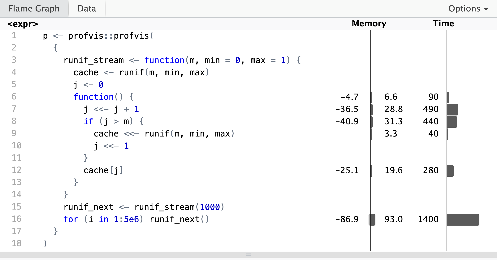
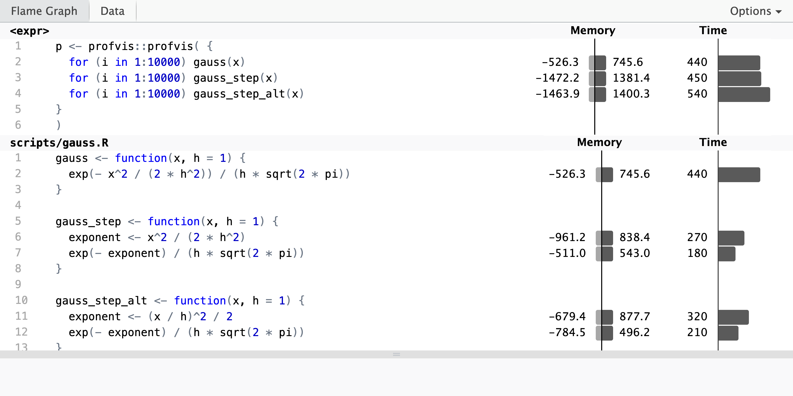

# R programming {#app-R}

This appendix on R programming is a brief overview of important programming
constructs and concepts in R that are used in the book. For a more extensive
coverage of R as a programming language the reader is referred to the book
[Advanced R](https://adv-r.hadley.nz/) [@Wickham:2019].

Depending on your background, the appendix can serve different purposes. If you
already have experience with programming in R, this appendix can serve as a
brush up on some basic aspects of the R language that are used throughout the
book. If you have experience with programming in other languages than R, it can
serve as an introduction to typical R programming techniques, where some may
differ from what you know from other languages. If you have little prior
experience with programming, this appendix can teach you the most important
things for getting started with the book, but you are encouraged to follow up
with additional and more detailed material like the book [Advanced
R](https://adv-r.hadley.nz/).

Irrespective of your background, this appendix covers topics of greatest
relevance for understanding how to implement correct and efficient numerical
algorithms used in statistics. These topics are

-   data types, comparisons and numerical precision
-   functions and vectorized computations
-   environments and function factories
-   performance assessment and improvement
-   S3 objects and methods

Several other topics of importance for R programming more broadly, such as
[S4](https://adv-r.hadley.nz/s4.html) and [R6](https://adv-r.hadley.nz/r6.html)
objects, [expressions](https://adv-r.hadley.nz/expressions.html), and [data
wrangling](https://r4ds.hadley.nz/transform), are not used much in the book and
are not covered in any detail in this appendix. The reader is
referred to the book [R for Data Science (2e)](https://r4ds.hadley.nz/)
[@Wickham:2023] for the use of R and Tidyverse as a framework for handling and
visualizing data.

The book will not delve into questions regarding coding style either, but all
code presented adheres to [the tidyverse style
guide](https://style.tidyverse.org/) unless there are specific reasons to
deviate from it. The reader is encourage to adopt this style guide for their own
code, or at least to make conscious and consistent decisions regarding any
deviations.

## Data structures {#app-data-structures}

The fundamental data structure in R is a vector. Even variables that look and
behave like single numbers are vectors of length one. Vectors come in two
flavors: *atomic vectors* and *lists*.

An atomic vector is an indexed collection of data elements that are all of the
same type, e.g.,

-   integers
-   floating-point numbers
-   logical values
-   character strings

A list is an indexed collection of elements without any type restrictions on the
individual elements. An element in a list can, for instance, be a list itself.

### Atomic vectors

You can construct a vector in R by simply typing in its elements, e.g.,

```{r first_vector}
first_vector <- c(1, 2, 3)  # Note the 'c'
first_vector
```

The constructed vector contains the numbers 1, 2 and 3. We use the classical
assignment operator `<-` throughout, but R supports using the equal sign, `=`,
as the assignment operator if you prefer. The `c()` used on the right hand side
of the assignment is short for *combine* (or concatenate), and it is also used
if you combine two vectors into one.

```{r second_vector, dependson="first_vector"}
second_vector <- c(4, 5, 6)
c(first_vector, second_vector)  # Combining two vectors
```

There are several convenient techniques in R for constructing vectors of various
regular nature, e.g., sequences. The following example shows how to construct a
vector containing the integers from 1 to 10 using the colon operator. The type
of the resulting vector is `integer` indicating that the elements of the vector
are stored as integers.

```{r integer_vector}
integer_vector <- 1:10
integer_vector
typeof(integer_vector)  # 'typeof()' gives the internal storage mode
```

We can access the individual elements as well as subsets of a vector by indices
using square brackets.

```{r subscripting}
integer_vector[3]
integer_vector[c(3, 4, 7)]  # The 3rd, 4th and 7th elements
```

The function `seq()` generalizes the colon operator as a way to generate regular
sequences. The following example shows how to generate a sequence,
`double_vector`, from 0.1 to 1.0 with increments of size 0.1. 

```{r double_vector}
double_vector <- seq(0.1, 1, by = 0.1)
double_vector
typeof(double_vector)
```

The type of the
resulting vector is `double`, which indicates that the elements of
`double_vector` are stored as doubles. That is, the numbers are stored as
floating-point numbers using 64 bits of storage for each number 
corresponding to a precision of just about 16 digits.

Integers are often stored as or coerced into doubles automatically. The vector\
`first_vector` appears to be an integer vector, but it is actually of type
`double`.

```{r num_int_example}
typeof(first_vector)
```

In R, numerical data of either type integer or double is collectively referred
to as *numerics* and have mode (and class) `numeric`. This may be confusing, in
particular because "numeric" is used also as pseudonym of the *type* double, but
it is rarely a practical problem. Doubles can be mixed with integers in any
computation, in which case the integers are automatically coerced to doubles. A
vector of numbers is therefore often said to by a `numeric` vector, irrespective
of whether the type is integer or double. Moreover, the function `is.numeric()`
tests if a vector is a `numeric` vector, and it returns `TRUE` for vectors of
type either double or integer.

It is possible to insist that integers are actually stored as integers by
appending `L` (capital l) to each integer, e.g.,

```{r num_int_example_int}
typeof(c(1L, 2L, 3L))
```

Apparent integers are usually---and silently---converted into doubles if they
are not explicitly marked as integers by `L`. One exception is when sequences
are generated using the colon operator with the endpoints being integers. The
result will then be a vector of type integer as was shown above with `1:10`.

Vectors of any length can be created by the generic function `vector()`, or by
type specific functions such as `numeric()` that creates vectors of type double.

```{r}
vector("numeric", length = 10)
numeric(10)
```

Both vectors above are of type double and of length 10 and initialized with all
elements being 0.

A *logical vector* is another example of a useful atomic vector. The default
type of a vector created by `vector()` is logical, with all elements being
`FALSE`.

```{r}
vector(length = 10)
```

Logical vectors are encountered when we compare the elements of one vector to another vector or to a number.

```{r logical_vector, dependson = "integer_vector"}
logical_vector <- integer_vector > 4
logical_vector
typeof(logical_vector)
```

Note how the comparison above is *vectorized*, that is, each element in the
vector `integer_vector` is compared to the number 4 and the result is a vector
of logical values.

While a logical vector has its own type and is stored efficiently as such, it
behaves in many ways as a numeric vector with `FALSE` equivalent to 0 and `TRUE`
equivalent to 1. If we want to compute the relative frequency of elements in
`integer_vector` that are (strictly) larger than 4, say, we can simply take the
mean of `logical_vector`.

```{r logcial_vector_mean, dependson = "logical_vector"}
mean(logical_vector)
```

Computing the mean of a logical vector works as if the logical values are
coerced into zeros and ones before the mean is computed.

A final example of an atomic vector is a *character vector*. In this example,
the vector is combined from 6 individual strings to form a vector of length 6.
Combining strings into a vector does not paste the strings together---it forms a
vector, whose elements are the individual strings.

```{r character_vector}
character_vector <- c("A", "vector", "of", "length", 6, ".")
character_vector
typeof(character_vector)
```

The type of the vector is character. Elements of a vector of type character are
strings. Note how the numeric value `6` in the construction of the vector was
automatically coerced into the string `"6"`.

It is possible to paste together the strings in a character vector.

```{r string_paste, dependson="character_vector"}
# Now a character vector of length 1
paste(character_vector, collapse = " ")
```

It is likewise possible to split a string according to a pattern. For instance
into its individual characters.

```{r string_split, dependson="character_vector"}
# Split the string "vector" into characters
strsplit(character_vector[2], split = "")
```

Various additional string operations are available---see `?character` for more
information.

In summary, atomic vectors are the primitive data structures used in R, with
elements being accessible via indices (random access). Typical vectors contain
numbers, logical values or strings. There is no declarations of data
types---they are inferred from data or computations. This is a flexible type
system with many operations in R silently coercing elements in a vector from one
type to another.

### Comparisons and numerical precision

We can compare vectors using the equality operator `==`, which compares two
vectors element-by-element.

```{r double_vector_comparison, dependson = "double_vector"}
double_vector[2:3] == c(0.2, 0.3)
```

The result of the comparison above is a vector of length 2 containing the
logical values `TRUE FALSE`. If we recall the numbers contained in
`double_vector` the result might be surprising at first sight.

```{r double_vector_subset, dependson = "double_vector"}
double_vector[2:3]
```

The vector `double_vector[2:3]` appears to be equal to `c(0.2, 0.3)`. The
difference shows up if we increase the number of printed digits from the default
(which is 7) to 20.

```{r double_vector_precision, dependson = "double_vector", echo=2:3}
options(digits = 20)
c(0.2, 0.3)
double_vector[2:3]
options(digits = 7)
```

The 0.3 produced by `seq` is computed as `0.1 + 0.1 + 0.1`, while the 0.3 in the
vector `c(0.2, 0.3)` is converted directly into a double precision number. The
difference arises because neither 0.1 nor 0.3 are exactly representable in the
binary numeral system, and the arithmetic operations induce rounding errors. The
function `numToBits` can reveal the exact difference in the three least
significant bits.

```{r bits}
numToBits(0.3)[1:3]  # The three least significant bits
numToBits(0.1 + 0.1 + 0.1)[1:3]
```

Differences in the least significant bits are tolerable when we do numerical
computations but can be a nuisance for equality testing. When comparing vectors
containing doubles we are therefore often interested in testing for approximate
equality instead as illustrated by the following example.

```{r approx_test, dependson="double_vector"}
test_vector <- c(0.1, 0.2, 0.3, 0.4, 0.5, 0.6, 0.7, 0.8, 0.9, 1.0)
all.equal(double_vector, test_vector)
```

The function `all.equal()` has a tolerance argument controlling if numerical
differences will be regarded as actual differences. Another way of comparing
numerical vectors is by computing the range of their difference

```{r range, dependson="double_vector"}
range(double_vector - test_vector)
```

This shows the largest positive and negative difference. Usually, the sizes of
the differences should be assessed relative to the magnitudes of the numbers
compared. For numbers approximately of magnitude 1, differences of the order
$2^{-52} \approx 2.22 \times 10^{-16}$ (the "machine epsilon") can safely be
regarded as rounding errors. The default (relative) tolerance of `all.equal()`
is the more permissive number $\sqrt{2^{-52}} \approx 1.5 \times 10^{-8}$. This
number, the square root of the machine epsilon, is an *ad hoc* but commonly 
used tolerance. See `?all.equal` for details.

### Lists

Recall that `strsplit()` with argument `split = ""` splits a string into its
individual characters. In fact, `strsplit()` returns a list with one entry for
each string in its first argument.

```{r string_split_list, dependson="character_vector"}
char_list <- strsplit(character_vector[2:4], split = "")
char_list
```

The list `char_list` has length 3, with the first entry being a character vector
of length 6, the second entry a character vector of length 2 and the third entry
a character vector of length 6. A list is an indexed collection of
data entries, just as a vector is, but a characteristic feature of a list is that the different
entries need not be of the same size or even the same type. In fact, each entry
of a list can be anything---even another list.

```{r list_combined, dependson="string_split_list"}
mixed_list <- list(c(1, 2), c(TRUE, FALSE))
combined_list <- list(mixed_list, char_list)
combined_list
```

The list `combined_list` contains two lists, with the first list containing a
numeric and a logical vector, and with the second list containing character
vectors.

The different entries of a list can be accessed using indices in two different
ways---using either single brackets `[]` or double brackets `[[]]`.

```{r mixed_list_subset, dependson="list_combined"}
mixed_list[2]
mixed_list[[2]]
```

Using only a single bracket will return a list containing the indexed elements
of the full list, while the double bracket with a single index will return the
element in the list with that index. The following demonstrates how to extract a
specific entry in one of the vectors in the combined list.

```{r combined_list_subset, dependson="list_combined"}
combined_list[[2]][[1]][3] # Why does this return "c"?
```

Entries of atomic vectors as well as lists can be named, and an entry can be
accessed via its name instead of its index. This may occasionally be useful for
atomic vectors but is even more useful when working with lists. We reconstruct
the combined list but with some descriptive names of its two entries.

```{r list_combined_names, dependson=c("string_split_list", "list_combined")}
combined_list <- list(mixed_bag = mixed_list, chars = char_list)
```

We can then extract an entry of a list by its name---either via double brackets
or via the `$` operator.

```{r list_combined_named_access, dependson="list_combined_names"}
combined_list[["mixed_bag"]]
combined_list$chars
```

One benefit of using names over numerical indices is that we do not need to keep
track on the precise location of an entry within a list. This can make the code
easier to read for humans, and code that uses names is robust to changes in the
implementation of the precise location of the entry in the list.

The primary use of lists in this book is as a data structure for storing a small
set of atomic vectors. We often need such a data structure when we write a
function that needs to return more than just a single atomic vector. Thus lists
are used as containers for function return values that are more complex than an
atomic vector.

Lists can also be used as associative arrays that store key-value pairs, and
where we can look up the value using the key. The key can then be of type
character while the value can be anything. The lookup time is, however, linear
in the length of the list. This can become a computational bottleneck for large
lists, in which case it might be better to implement the associative array using
environments. Environments can store key-value pairs just as lists, but they
support faster lookup via a hash table, see Section \@ref(environments). They
do, on the other hand, not support lookup via indices.

### Other data structures

In addition to atomic vectors and lists any R programmer should know about the
following three data structures:

-   Factors
-   Data frames
-   Matrices and arrays

A *factor* is a special type of vector, whose entries are all from a fixed set
of values (represented as strings) known as the factor *levels*. It is
implemented as an integer vector with an attribute containing the factor
levels---with the integers acting as pointers to the actual values stored in the
attribute.

```{r factors}
high_low <- factor(c("high", "low", "low", "low", "high", "high"))
high_low
typeof(high_low)
```

The factor above is initialized by a character vector, which is then converted
into a factor. If the set of levels is small, a factor is more memory efficient
than a naive implementation of a character vector. However, R actually stores
character vectors via references to unique strings in a global string pool, so
memory efficiency is not an argument for using a factor. Moreover, certain
operations, such as concatenation, are more cumbersome for factors than for
character vectors, and there is thus no reason to use factors unless some of
their unique features are needed.

The main purpose of a factor is that it includes a specification of an ordering
of the levels, which can differ from the alphabetic ordering. A number of R
functions require factors, and in most cases it is because an ordering of the
levels is needed. Factors should thus be used whenever we need the ordering or
rely on other R functions that require us to use factors.

A *data frame* is R's data structure for storing and handling tabular data. You
can think of a data frame as a 2-dimensional table with rows and columns. All
columns must be of the same length, and all entries in a single column are of
the same type. A column is in practice often an atomic vector, but it does not
need to.

```{r data_frame, dependson=c("integer_vector", "double_vector", "logical_vector")}
combined_df <- data.frame(
  doubles = double_vector,
  integers = integer_vector,
  logicals = logical_vector
)
combined_df
```

The data frame constructed above has 10 rows and 3 columns. We can extract
individual entries, rows, columns or rectangular parts of a data frame via
brackets and indices.

```{r data_frame_subset, dependson="data_frame"}
combined_df[2, 2]
# Second row
combined_df[2, ]
# Second column
combined_df[, 2]
# Second and third row of columns two and three
combined_df[2:3, 2:3]
```

The columns of a data frame have names, and we can extract a column by name in
the same way as we can extract an entry in a list by name.

```{r data_frame_columns, dependson="data_frame"}
combined_df$logicals
```

A data frame is, in fact, implemented as a list with each entry of the list
storing one column of the data frame. It means that you can do everything with a
data frame that you can do with a list.

Data frames play a very central role whenever we do data analysis or work with
data in general---which is what statistics is ultimately about in practice. That
aspect of statistics is, however, not very central to this book, and data frames
only appear occasionally and are never part of the numerical algorithms that are
otherwise in focus.

The last data structure covered in this section is arrays. A $k$-dimensional
*array* can be thought of as a $k$-dimensional box of data, where we can access
the entries of the box using $k$ indices. If the dimensions of the array are
$n_1, n_2, \ldots, n_k$ the array is, in fact, just a length $n_1 n_2 \cdots
n_k$ vector with additional dimensionality attributes.

A matrix of dimensions $n_1$ and $n_2$ is a 2-dimensional array with $n_1$ rows
and $n_2$ columns. We can access the entries of an array or a matrix using
brackets with one index for each dimension of the array.

```{r matrix}
mat <- matrix(c(1, 2, 3, 4), nrow = 2, ncol = 2)
mat
mat[1, 2]
attributes(mat)
```

A matrix and a data frame appear similar. Both can be thought of as
2-dimensional arrays of data---but the similarity is superficial. We can extract
entries and rectangular parts of matrices using brackets and indices, just as
for data frames, but data frames allow for different data types in the different
columns, and matrices do not. In fact, the intended usages of matrices and data
frames are mostly different.

In contrast to data frames, matrices are used a lot in this book. For once,
because a range of efficient numerical linear algebra algorithms are available
for matrices and vectors, and many statistical computations can be reduced to
numerical linear algebra.

## Functions {#functions}

When you write an R script and source it, the different R expressions in the
script are evaluated sequentially. Intermediate results may be stored in
variables and used further down in the script. It may not be obvious, but all
the expressions in the script are, in fact, function calls. Your script relies
on functions implemented in either core R packages or in other installed
packages.

It is possible to use R as a scripting language without ever writing your own
functions, but writing new R functions is how you extend the language, and it is
how you modularize and reuse your code in an efficient way. As a first example,
we implement the Gaussian kernel with bandwidth $h$ (see also Section
\@ref(kernel-density)). The mathematical expression for this function is

\[
K_h(x) = \frac{1}{h \sqrt{2 \pi}} e^{- \frac{x^2}{2h^2}},
\]

which we usually think of as a collection of functions $K_h : \mathbb{R} \to
[0,\infty)$ parametrized by $h > 0$. Though $x$ and $h$ in this way play
different roles, they are treated equivalently in the implementation below,
where they are both arguments to the R function. We call the implemented
function `gauss()` to remind us that this is the Gaussian kernel.

```{r gauss-kernel}
gauss <- function(x, h = 1) {
  exp(- x^2 / (2 * h^2)) / (h * sqrt(2 * pi))
}
```

The *body* of the function is the R expression

`exp(- x^2 / (2 * h^2)) / (h * sqrt(2 * pi))`

When the function is called with specific numeric values of its two *formal
arguments* `x` and `h`, the body is evaluated with the formal arguments replaced
by their values. The value of the (last) evaluated expression in the body is
returned by the function. The bandwidth argument `h` has a default value of 1,
so if `h` is not specified when the function is called, it gets the
value 1.

The Gaussian kernel with bandwidth $h$ equals the density for the Gaussian
distribution with mean $0$ and standard deviation $h$. The `dnorm()` function
in R computes the Gaussian density, and we can thus compare
`gauss()` with `dnorm()`.

```{r gauss-kernel-test, dependson="gauss-kernel"}
c(gauss(1), dnorm(1))
# Bandwidth changed to 0.1
c(gauss(0.1, 0.1), dnorm(0.1, sd = 0.1))
```

For those two cases the functions appear to compute the same (at least, up to
the printed precision).

Note how the formal argument `sd` is given the value `0.1` in the second call of
`dnorm()`. The argument `sd` is, in fact, the third argument of `dnorm()`, but
we do not need to specify the second, as in `dnorm(0.1, 0, 0.1)`, to specify the
third. We can use its name instead, in which case the second argument in
`dnorm()` gets its default value `0`.

There are several alternative ways to implement the Gaussian kernel that
illustrate how functions can be written in R.

```{r gauss-kernel-alt}
# A one-liner without curly brackets
gauss_one_liner <- function(x, h = 1)
  exp(- x^2 / (2 * h^2)) / (h * sqrt(2 * pi))

# A stepwise implementation computing the exponent first
gauss_step <- function(x, h = 1) {
  exponent <- x^2 / (2 * h^2) 
  exp(- exponent) / (h * sqrt(2 * pi))
}

# A stepwise implementation with an explicit return statement
gauss_step_return <- function(x, h = 1) {
  exponent <- x^2 / (2 * h^2) 
  value <- exp(- exponent) / (h * sqrt(2 * pi))
  return(value)
}
```

The following small test shows two cases where all implementations compute the same.

```{r gauss-kernel-alt-test, dependson=c("gauss-kernel", "gauss-kernel-alt")}
c(gauss(1), gauss_one_liner(1), gauss_step(1), gauss_step_return(1))
c(
  gauss(0.1, 0.1),
  gauss_one_liner(0.1, 0.1),
  gauss_step(0.1, 0.1),
  gauss_step_return(0.1, 0.1)
)
```

A function should always be tested. A test is a comparison of the return values
of the function with the expected values for some specific arguments. An
expected value can either be computed by hand or by another implementation--- as
in the comparisons of `gauss()` and `dnorm()`. Such tests cannot prove that the
implementation is correct, but discrepancies can help you to catch and correct
bugs. Remember that when testing numerical computations that use floating-point
numbers we cannot expect exact equality. Thus tests should reveal if return
values are within an acceptable tolerance of the expected results.

Note that though the implementations of `gauss_one_liner()` and
`gauss_step_return()` are correct, they both violate the style guide. According
to the guide, curly braces should always be used when the function spans multiple
lines, and `return()` should only be used for early returns---not when the
function returns the last evaluated expression in the body. Whether we should
break (complicated) expressions into simpler pieces, as in `gauss_step()`, is a
judgment call, but see Section \@ref(performance) for how such a decision 
affects the results from line profiling.

Larger pieces of software---such as an entire R package---should include a
number of tests of each function it implements. This is known as *unit testing*
(each unit, that is, each function, is tested), and there are [packages
supporting](https://r-pkgs.org/tests.html) the systematic development of unit
tests for R package development. A comprehensive set of unit tests also helps
when functions are rewritten to, e.g., improve performance or extend
functionality. If the rewritten function passes all tests, chances are that we
did not break anything by rewriting the function.

It is good practice to write functions that do one well defined computation and
to keep the body of a function relatively small. Then it is easier to reason
about what the function does and it is easier to comprehensively test it.
Complex behavior is achieved by composing small and well tested functions.

The overall aspects to writing an R function can be summarized as follows:

-   A function has a name, it takes a number of arguments (possibly zero), 
and when called it evaluates its body and returns a value.
-   The body is enclosed by curly brackets `{}`, which may be left out if the 
body is only one line.
-   The function returns the value of the last expression in the body except 
when the body contains an explicit return statement.
-   Formal arguments can be given default values when the function is 
implemented, and arguments can be passed to the function by position as well 
as by name.
-   Functions should do a single well defined computation and be well tested.

### Vectorization {#vectorization}

In Section \@ref(app-data-structures) it was shown how comparison operators work
in a vectorized way. In R, comparing a vector to another vector or a number
leads to element-by-element comparisons with a logical vector as the result.
This is one example of how many operations and function evaluations in R are
natively vectorized, which means that when the function is evaluated with a
vector argument the function body is effectively evaluated for each entry in the
vector.

The `gauss()` function is another example of a function that automatically works
as a vectorized function.

```{r gauss-vector}
gauss(c(1, 0.1), c(1, 0.1))
```

It works as expected with vector arguments because all the functions in the body
of `gauss()` are vectorized, that is, the arithmetic operators are vectorized,
squaring is vectorized and the exponential function is vectorized.

It is good practice to write R programs that use vectorized computations
whenever possible. The alternative is an explicit loop, which can be much
slower. Several examples in the book illustrate the computational benefits of
vectorized implementations. It may, however, not always be obvious how to
implement a function so that it is correctly vectorized in all its arguments.

Suppose we want to implement the following function

\[
\overline{f}_h(x) =  \frac{1}{N} \sum_{j=1}^N K_h(x - x_j)
\]

for a dataset $x_1, \ldots, x_N$ and with $K_h$ the Gaussian kernel. This is the
Gaussian kernel density estimator considered in Section \@ref(likelihood). A
straight forward implementation is

```{r gauss-estimator}
xs <- rnorm(10)  # A dataset with 10 observations
f_bar <- function(x, h) {
  mean(gauss(x - xs, h))
}
```

This implementation works correctly when `x` and `h` are single numbers but
when, e.g., `x = c(0, 1)` is a vector, the function does not return a vector but
a number apparently unrelated to $\overline{f}_h(0)$ and $\overline{f}_h(1)$.

```{r gauss-estimator-x-test, dependson="gauss-estimator"}
c(f_bar(0, 1), f_bar(1, 1))
f_bar(c(0, 1), 1)  # Computation is not vectorized, what happened?
```

We leave it as an exercise for the reader to figure out which computation is
actually carried out when `f_bar(c(0, 1), 1)` is evaluated. A quick fix to make
any function correctly vectorized is the following explicit vectorization.

```{r f-bar-vec, dependson="gauss-estimator"}
f_bar_vec <- Vectorize(f_bar)
```

The R function `Vectorize()` \index{Vectorize()} takes a function as argument
and returns a vectorized version of it. That is, `f_bar_vec()` can be applied to
a vector, which results in applying `f_bar()` to each element of the vector. We
test that `f_bar_vec()` works correctly---both when the first and the second
argument is a vector.

```{r gauss-estimator-x-test2, dependson=c("gauss-estimator", "f-bar-vec")}
f_bar_vec(c(0, 1), 1)
# Same result if we vectorize-by-hand
c(f_bar(0, 1), f_bar(1, 1))
```

```{r gauss-estimator-h-test, dependson=c("gauss-estimator", "f-bar-vec")}
f_bar_vec(1, c(1, 0.1))
# Same result if we vectorize-by-hand
c(f_bar(1, 1), f_bar(1, 0.1))
```

The function `Vectorize()` is an example of a [function
operator](https://adv-r.hadley.nz/function-operators.html), which is a function
that takes a function as argument and returns a function. The function
`Vectorize()` basically wraps the computations of its argument function into a
loop, which applies the function to each element in the vector argument(s). For
prototyping and quick implementations it can be very convenient, but it is *not*
a shortcut to efficient vectorized computations.

`Vectorize()` is used in Section \@ref(likelihood) to implement $\overline{f}_h$
based on `dnorm()`. The purpose of that implementation is to be able to compute
$\overline{f}_h(x)$ for arbitrary $x$ in a vectorized way. This is needed when
the function is plotted using `curve()` and in the likelihood computations of
that section. The implementations in Section \@ref(dens-implement) differ by
computing and returning

\[
\overline{f}_h(\tilde{x}_1), \ldots, \overline{f}_h(\tilde{x}_m)
\]

for an equidistant grid $\tilde{x}_1, \ldots, \tilde{x}_m$. That is, those
implementations return the evaluations of $\overline{f}_h$ in the grid and not
the function $\overline{f}_h$ itself.

### Environments

Recall that in the implementation of `f_bar()` above, the body made use of the
variable `xs`, which is neither an argument to the function nor a variable
defined within the body. It may appear obvious that `xs` is supposed to refer to
the short data vector created just before the function implementation but
outside of the function. How does R know that?

Whenever the body of `f_bar()` is evaluated, R needs a procedure for looking up
the variable `xs` that appears in its body. Two possible procedures are:

-   The variable is looked up as a local variable from wherever `f_bar()` is 
called.
-   The variable is looked up as a local variable from wherever `f_bar()` is 
defined.

To the user that *calls* `f_bar()` it might appear simpler if `xs` were looked
up from where the function is called. To the programmer that *implements*
`f_bar()` such a procedure will, however, make reasoning about the behavior of
`f_bar()` extremely difficult. The function `f_bar()` could be called from
anywhere or within any other function---even within a function that itself has a
variable called `xs`. So this is not how R works.

Computations implemented in the body of a function take place in a so-called
*evaluation environment*, which is populated by variables defined in the body
together with the arguments of the function (due to lazy evaluation of
arguments, see Section \@ref(function-factories), this is technically a little imprecise).
Whenever a variable is
needed, which is not in the evaluation environment, it is looked up in the
*enclosing environment* of the function. The default enclosing environment of
any function is the environment where the function is defined.

```{r env, dependson="gauss-estimator"}
environment(f_bar)
```

The function `environment()` returns the enclosing environment of `f_bar()`,
which in this case has a name and is R's global environment---the place you
start in whenever you open R.

*Environment* is the technical term for a well defined "place" containing a
collection of objects. When we write a computer program, environments constitute
organizational components that allow different objects to have the same
name---as long as they belong to different environments. When learning R we
often start out by always implementing functions within the global environment
and then we call functions from the global environment as well. For that reason
it is easy to mistakenly believe that variables are looked up in the calling
environment when, in fact, they are not. Or we might believe, equally wrongly,
that variables are always looked up in the global environment. As described
above, variables are always looked up in the enclosing environment of the
function being evaluated, which just happens to be the global environment if the
function is implemented in the global environment.

It is one thing to know the environment where a variable is looked up and
another to know the value of the variable. The following example demonstrates
that it is perfectly possible to change `xs` in the global environment between
calls of `f_bar()`, which will lead to different results.

```{r changing-xs, dependson="gauss-estimator"}
f_bar(1, 1)
xs <- rnorm(10)
f_bar(1, 1)
```

Such behavior---that two calls of the same function with identical arguments
give different results---is often frowned upon, because it makes it difficult to
reason about what the function will do. When implementing a function in R it is
good practice to **not** rely on global variables like `xs` defined in the
global environment.

It is possible to construct and manipulate environments and, for instance,
change the enclosing environment of a function.

```{r change-env, dependson="gauss-estimator"}
environment(f_bar) <- new.env()
environment(f_bar)
```

The new environment is empty and its name is some obscure hexadecimal address.
Since it does not contain `xs` (yet) it is a good exercise to think about what
will happen if we call `f_bar(1, 1)` now? We leave the exercise to the reader
and populate the new environment with `xs`, evaluate `f_bar(1, 1)` and then we
change `xs` again in the global environment.

```{r changing-xs-again, dependson=c("change-env", "changing-xs", "gauss-estimator")}
environment(f_bar)$xs <- xs
f_bar(1, 1)
xs <- rnorm(10)
f_bar(1, 1)
```

Now `f_bar()` does not depend on the value of the global variable `xs` anymore.
It depends instead on its more private version of `xs` in its own enclosing
environment. In Section \@ref(function-factories) we will systematize the
construction of functions having a private enclosing environment via *function
factories*. This is a good way of bundling a function with additional data
without relying on global variables.

The infrastructure of R also relies heavily on environments---it is environments
that control how anything is found, variables as well as functions. Environments
are, for instance, used to implement namespaces\index{namespace} of packages
that make it possible to load many packages without substantial conflicts due to
functions having the same name in several packages. The stats namespace is an
example of the environment containing all the functions implemented in the stats
package.

```{r stats-namespace}
asNamespace("stats")
```

Despite the use of namespaces it happens occasionally that a function from one
package is masked by a function from another package. The package dplyr masks,
among other functions, the stats function `filter()`. When this happens we can
retrieve the function from the stats package's namespace via
`asNamespace("stats")$filter()`, but the more convenient syntax for getting a
specific function from a namespace is `stats::filter()`. We can use the
double colon operator, `::`, even when calling a function that is not masked. We
do so when the function is not implemented in a core R package to emphasize
which package actually implements the function---as a service to the reader.

As demonstrated in this section, environments are everywhere present when
defining and calling functions and looking up variables. Moreover, if you need a
hashed associative array,\index{hashed associative array}
environments can do that for you, and they can thus be used as a data structure 
much like lists. It is, however, fairly uncommon to
write R code as above that explicitly creates and assigns new environments let
alone move data around between different environments. Most R programmers
therefore rarely manipulate environments in your own code, but it is important
to understand environments to be able to understand how R works and to reason
correctly about how R functions look up other R functions and variables.

### Function factories {#function-factories}

The function `Vectorize()` introduced in Section \@ref(vectorization) is an
example of a function that returns a function. It is a general feature of the R
programming language that functions are just another data structure, which can
be defined and returned from within other functions. We can exploit this to
write *constructor functions*, whose purposes are to construct other functions
with private enclosing environments. We will refer to any such constructor
function as a 
[function factory](https://adv-r.hadley.nz/function-factories.html). To 
illustrate the idea we write a function factory that takes a dataset as argument 
and returns the kernel density estimator as a function.

```{r dens-fact, dependson="gauss-estimator"}
gauss_kernel_factory <- function(xs) {
  force(xs) # See explanation of this line below
  f_bar <- function(x, h) {
    mean(gauss(x - xs, h))
  }
  Vectorize(f_bar)
}
```

The function factory `gauss_factory()` defines the function `f_bar()` in its
body, which depends on the variable `xs`, and then returns a vectorized version
of `f_bar()`. The first line, `force(xs)`, ensures that the value of the
argument `xs` is computed and stored when `gauss_kernel_factory()` is called.
When a function is called in R, its arguments are evaluated according to a
mechanism called *lazy evaluation*,\index{lazy evaluation} which means that they
are not evaluated before they are actually needed. In the function factory
above, `xs` is not needed before the returned function is called, and unless we
force evaluation of `xs` we could be in for a surprise. The value of `xs` could
then change between the call of `gauss_kernel_factory()` and before its first
use, which is not desirable. Inserting the line `force(xs)` explicates that we
bypass the lazy evaluation to ensure that `xs` is what it was when
`gauss_kernel_factory()` was called.

Calling `gauss_kernel_factory()` with a specific data vector as argument will
construct an `f_bar()` for that data vector. We can compare with the previously
implemented vectorized `f_bar_vec()`, which relies on the global variable `xs`.

```{r dens-fact-use, dependson=c("dens-fact", "f-bar-vec") }
f_bar <- gauss_kernel_factory(xs)
f_bar(c(1, 0.1), c(1, 0.1))
f_bar_vec(c(1, 0.1), c(1, 0.1))
```

Since the global `xs` and the local `xs` in the environment of `f_bar()` are
identical, we get the same above whether we call `f_bar()` or `f_bar_vec()`.
Changing the value of the global variable will not affect `f_bar()`, since it
contains a private copy of the data in its enclosing environment, while it does
affect `f_bar_vec()`.

```{r dens-fact-comparison, dependson=c("dens-fact-use", "f-bar-vec")}
xs <- rnorm(10)
f_bar(c(1, 0.1), c(1, 0.1))
f_bar_vec(c(1, 0.1), c(1, 0.1))
```

The function factory `gauss_kernel_factory()` illustrates a generally useful
idea in computational statistics. Oftentimes an R function will need both a
dataset and a number of additional arguments, but in a specific application the
dataset is fixed while the other arguments change. A kernel density estimator is
a prototypical example, while the likelihood function is another important
example. Alternatives to using a function factory is to either rely on a global
variable containing the data or to include data as an argument to the function.
The former is not recommended, and the latter makes the code more cluttered and
can be less efficient. Instead we can write a function factory that takes the
dataset as argument and returns a function of the other arguments. The function
factory can then include any preprocessing and transformations of the data that
might be needed, and these computations will only be carried out once when the
function factory is called.

A different usage of function factories is as a way to construct a cache for the
function that the factory returns. If a function has a private enclosing
environment we can safely use it to store values computed in one function call
so that they can be retrieved in a subsequent call. We will illustrate caching
by trying to solve an efficiency problem with generating random numbers
sequentially in R.

Section \@ref(vMsim) gives an implementation of a rejection sampler for the von
Mises distribution called `vMsim_loop()`, which relies on sequential generation
of two uniformly distributed random variables within a loop. In each iteration
there is a call of `runif(1)`, which generates a single number from the uniform
distribution on $(0,1)$. As discussed in that section, this is slow. It is much
more efficient to call `runif(1000)` once than to call `runif(1)` a thousand
times, but the challenge is that in the rejection sampler we do not know upfront
how many uniform variables we need.

We solve this problem by implementing a function factory that returns a
function, from which we can extract random numbers sequentially, but where the
random number generator is called in a vectorized way and where the results are
stored in the function's enclosing environment, which then works as a cache.

```{r RNG-stream}
runif_stream <- function(m, min = 0, max = 1) {
  cache <- runif(m, min, max)
  j <- 0
  function() {
    j <<- j + 1
    if (j > m) {
      cache <<- runif(m, min, max)
      j <<- 1
    }
    cache[j]
  }
}
```

The function factory above first initializes the cache to contain `m` observations
from the uniform distribution. It then returns a function for extracting random
numbers sequentially, which contains the cached values in its enclosing
environment. The function generates a new vector of observations whenever
the entire cache has been used. Note the use of the double headed assignment
operator `<<-`, which assigns to variables in the enclosing environment of the
function. Such assignments should usually only be done when the enclosing
environment is private to the function, e.g., when the function is constructed
by a function factory.

We will refer to the function returned by `runif_stream()` as a stream of
uniform random numbers, and we run a small test to check that a stream generates
observations from the uniform distribution in exactly the same way as if we generate
them sequentially using `runif(1)`.

```{r}
set.seed(3012)
replicate(10, runif(1))
# Reset the seed and construct the stream with a cache of size 5
set.seed(3012)
runif_next <- runif_stream(5)
# The stream generates the same values
replicate(10, runif_next())
```

It appears that the stream performs correctly, but it remains unclear if there
is any point to using the stream. The next section will explore how to measure
runtime and memory usage of small pieces of R code, which can be used for
comparisons of different implementations.

## Performance {#performance}

Whenever we evaluate an R function it carries out some computations, which take
a certain amount of time and require a certain amount of memory. The efficiency
of an implementation is often assessed by its runtime and memory usage, and we
need tools to be able to measure these quantities.

Ideally an implementation should be both fast and use as little memory as
possible. There is, however, a tradeoff between time and memory consumption in
the sense that we may be able to reduce runtime of an implementation at the
price of increasing its memory usage or vice versa. It can be complicated to
fully understand this tradeoff in practice, and it can also be problem specific
whether memory usage or runtime is the most critical quantity to minimize. In
this section we focus on how to measure these quantities in practice when we use
R.

### Benchmarking

One way to measure performance is via *benchmarking*, which means that we run a
piece of code multiple times and measure its runtime and memory usage of each
run. 

We will use the package bench, which contains several useful functions for high
resolution measurements of time and for measuring memory usage of R
computations. To measure memory usage, R needs to be compiled to support memory
profiling, which is currently the case for the binary distributions for macOS
and Windows.

The example below uses the `mark()` function from the bench package to collect
benchmark information on using either `runif(1)` or a uniform stream in a loop.

```{r}
bench::mark(
  runif = for (i in 1:10000) runif(1),
  stream = {
    runif_next <- runif_stream(1000)
    for (i in 1:10000) runif_next()
  },
  check = FALSE,     # See explanation below
  filter_gc = FALSE  # See explanation below
)
```

The results of the benchmark above shows that the median runtime for sequential
sampling is slightly smaller when using the stream than when using `runif()`, but 
the speedup apears insignificant. 
The table also provides additional information, e.g., the total amount of memory
allocated.

The last column of output from the benchmark shows the number of garbage
collections per second during the benchmark. The `gc` refers to calls of the
*garbage collector*\index{garbage collector}, which does the automatic memory
deallocation. That is, it is a function that detects memory allocated by R but
no longer in use and sets it free. You can call `gc()` to trigger garbage
collection and obtain information about memory allocated by R, but we usually
let R do this automatically. Even if the amount of memory used by an algorithm
is insignificant compared to the memory available, memory allocation and
deallocation take time and affect the runtime negatively. Implementations that
use little memory rarely trigger garbage collection and are therefore often
preferable.

Benchmarks are used throughout the book for measuring runtime (and memory
usage) of various implementations, and using `bench::mark()` to do so has
several advantages. First, it checks by default if the results from each
expression that we benchmark are equal. This is a good default since we should
only compare expressions that solve the same problem. This check does, however,
not make sense when simulating random numbers, and that is why the check was
disabled above. Second, `bench::mark()` randomizes and repeats the evaluations
of each expression, and the results are averages over the repeats. These
averages exclude by default iterations with garbage collection (set `filter_gc =
FALSE` to change this). This is done to better separate time used on the actual
computations and time used on memory deallocation---but remember that both
matter in practice.

The bench package offers a few additional tools, e.g., automatic plotting of
benchmark results. For running benchmarks across a grid of parameter values, the
`press()` function is extremely useful. The package also includes
`hires_time()`, which returns high-resolution real time. We have used that
function in the package CSwR for implementing the tracer functionality covered
in Section \@ref(tracing).

### Profiling

While benchmarks can be useful for comparing the overall runtime of different
implementations, they do not provide information about what goes on within the
implementations. In particular, they do not tell us where the bottlenecks are in
slow code. We need another tool for that, which is known as *profiling*.
\index{profiling} The R package profvis supports line profiling, which measures
how much time was spent on each line of code during evaluation.

Running the following code will profile the implementation of the random number
stream and store the result as an interactive HTML widget. The widget can be
shown either in RStudio or in the system browser.

```{r stream-profile}
p <- profvis::profvis(
  {
    runif_stream <- function(m, min = 0, max = 1) {
      cache <- runif(m, min, max)
      j <- 0
      function() {
        j <<- j + 1
        if (j > m) {
          cache <<- runif(m, min, max)
          j <<- 1
        }
        cache[j]
      }
    }
    runif_next <- runif_stream(1000)
    for (i in 1:5e6) runif_next()
  }
)
```

A screenshot of the HTML widget is shown below. From this we see that obtaining
five million uniformly distributed numbers generated in batches of 1000 took
about 1500 ms in total, and we see how the time is distributed among the
different lines of code. The actual generation of the random numbers takes up 
only a small fraction of the total runtime---the rest of the time was spent on 
incrementing the counter, `j <<- j + 1`, on inequality testing `j > m`, or on extracting 
the $j$-th entry from the cache, `cache[j]`.

```{r stream-profile-results, echo=FALSE, dependson="stream-profile", out.width="100%"}
setwd("./figures/")
htmlwidgets::saveWidget(p, "rng_stream_profile.html")
setwd("..")
pagedown::chrome_print(
  "figures/rng_stream_profile.html",
  format = "png",
  options = list(
    clip = list(x = 0L, y = 0L, width = 650L, height = 340L, scale = 4)
  ),
  extra_args = c("--window-size=650,750")
)

```

In addition to the visual summary above, the 
[interactive HTML](figures/rng_stream_profile.html) widget shows the
data in the form of a flame graph,\index{flame graph} and it includes an alternative
summarized view of the profiling data. The profiling data itself is collected by
`profvis()`\index{profvis()} via the the `Rprof()` function from the utils
package. The main advantage of using `profvis()` is the way it processes and
formats the data---see `?Rprof` to understand how the profiler actually works.

For `profvis()` to connect the profiling data to lines of code it must have
access to the source code. In the example above the source code of
`runif_stream()` was passed on to `profvis()` within a single R expression, but
it is also possible to profile the evaluation of a function without passing the
entire source code of that function as part of the expression. If the source code
of `runif_stream()` is in a file, which is read into R via the
`source()` function (with option `keep.source = TRUE`), then calling
`profvis(for(i in 1:1e6) runif_next())` will give us the same profiling data as
shown above. Note that the code has to be read from the file using `source()` and
not copy-pasted! Note also that for the profiler to provide meaningful data, the
total evaluation time has to be long enough. That is why we do a million
evaluations of `runif_next()` in a loop instead of just a single one.

To illustrate the use of the profiler with sourced code, we reconsider the 
different implementations of the Gaussian kernel from Section \@ref(functions). 

```{r gauss-kern-script, results='hide'}
source("scripts/gauss.R", keep.source = TRUE)
x <- rnorm(10000) # Test data
# Forcing JIT, see explanation below
gauss(x) 
gauss_step(x)
gauss_step_alt(x)
```

The script `gauss.R` contains the implementation of three functions. The 
`gauss()` and `gauss_step()` as in Section \@ref(functions) and then 
`gauss_step_alt()`, which is similar to `gauss_step()` but with a small 
reorganization of some arithmetic operations. After sourcing the script, 
but before running the profiler, all functions are evaluated once. This is 
done to trigger the just-in-time (JIT) compilation of the functions to byte code, 
see `?compiler::enableJIT`, and thus to avoid that this compilation step is 
included in the profiling. We then run the profiler, in this case with 
a large number of repeated calls of each function. This will make the execution 
time long enough for the profiler to be able to sample enough data.

```{r profvis_gauss-kern, dependson="gauss-kern-script"}
p <- profvis::profvis( {
  for (i in 1:10000) gauss(x)
  for (i in 1:10000) gauss_step(x)
  for (i in 1:10000) gauss_step_alt(x)
}
)
```

```{r profvis_gauss-kern-save, echo=FALSE, dependson="profvis_gauss-kern"}
setwd("./figures/") # Hack to make saveWidget() clean up
htmlwidgets::saveWidget(p, "gauss-kern_profile.html")
setwd("..")
```

```{r profvis-gauss-kern-image, out.width="100%", echo=FALSE, dependson="profvis-gauss-kern"}
pagedown::chrome_print(
  "figures/gauss-kern_profile.html",
  format = "png",
  options = list(
    clip = list(x = 0L, y = 0L, width = 800L, height = 390L, scale = 4)
  ),
  extra_args = c("--window-size=800,850")
)

```

The [profiling result](figures/gauss-kern_profile.html) shows that there is 
little difference between the three implementations in terms of runtime. 
The one-liner is a bit faster, probably because the step-wise solutions 
allocate and deallocate more memory due to the use of an extra temporary 
variable. From the perspective of line profiling, it is noteworthy that
the two step-wise solutions give us more information about the runtime 
of the individual computations. Thus if you want to profile a complicated 
computation to understand how smaller parts of the computation affect 
runtime, you need to have each part of the computation on a separate 
line to get this information from line profiling tools. 

### Tracing {#tracing}

When R executes code, e.g., by evaluating a function we implemented ourselves,
we would often like to peek into the interior of the function during evaluation
and investigate what is going on. Besides curiosity there are two main reasons
for why we want to do that. First, we might want to fix a bug. That is, when
evaluating the function we get an error or a warning, or the function
returns a value we know or suspect to be wrong. In those cases we need to debug the
code to localize and fix the mistake(s). Second, we might want to track how a
variable defined inside the body of the function evolves during the evaluation.

One pedestrian solution to the problem of peeking into a function while it is
evaluated is to insert some additional code into the body of the function that
can either print or store values of variables. That is, however, not a very
efficient solution, and we need to remember to revert any changes we made,
which can be a tedious and error-prone process.

Fortunately there are several good tools and techniques available for *browsing
and tracing* what is going on during a function evaluation. For once, R includes
debugging tools via the functions `browser()`, `debug()` and `trace()`, and
RStudio uses these to support debugging via visual breakpoints in the code and
it provides an interactive GUI session with access to the interior of a function
once a breakpoint is reached. We will not cover how these standard tools are used,
but they are highly recommended as much better alternatives to
debugging-by-print-statements.

What we will cover in some detail is a technique for tracing what is going on
during the evaluation of a function call, which can then be used for subsequent
analysis of the performance of an algorithm and its implementation. The
objective is to be able to store values of variables from inside a
function during normal function evaluation without altering the implementation
of the function. We present a solution based on tracer objects,\index{tracer}
created by the `tracer()` function, from the CSwR package. Using these 
tracer objects we can 
experiment with collecting any type of data during the function evaluation
without touching the implementation of the function or affecting its performance
when we are not tracing its behavior.

Using tracer objects with a function requires that we can call the object's 
tracer function inside the body of the function. It is possible to inject 
such an function call into any function using the base R function `trace()`, 
and to remove it again with the `untrace()` function. This can be done 
programmatically, but it may be impossible to position the tracer call 
at the right place this way, in which case we need to manually edit 
the code. This is fine for interactive usage, but in this book we have taken a slightly different approach. All functions we need to trace are equipped with 
a single so-called callback argument,\index{callback} 
which effectively allows us to inject
and evaluate the tracer call at a particular position in the body of 
the function. 

To illustrate the use of tracer objects we implement a function 
computing the mean by a loop, which includes a callback argument.

```{r mean-by-loop}
mean_loop <- function(x, cb) {
  n <- length(x)
  x_sum <- 0
  for (i in seq_along(x)) {
    if (!missing(cb)) cb() # Callback
    x_sum <- x_sum + x[i]
  }
  x_sum / n
}
```

If any callback function is passed to `mean_loop()` via the `cb` argument 
it is called in each iteration of the loop. 

We proceed by constructing a tracer object with the `tracer()` function 
from the CSwR package. 
Its first argument is a vector of strings specifying the names of 
the variables we want to trace. Below we will trace the cumulative sum 
stored in `x_sum`. Its second argument, `Delta`, specifies how often the 
tracer function prints trace information during evaluation. 
Setting `Delta = 0` means never. Finally, when calling `mean_loop()` we 
pass the function `mean_tracer$tracer()` as the callback function. 

```{r mean-loop-tracer, dependson="mean-by-loop"}
mean_tracer <- CSwR::tracer("x_sum", Delta = 100)
x <- rnorm(1000)
x_bar <- mean_loop(x, cb = mean_tracer$tracer)
```

With `Delta = 100` the tracer prints out an iteration counter and the values of 
the variables being traced every 100 iteration. The complete trace is stored 
in the tracer object, and it can be inspected and analyzed by converting it to 
a data frame using `summary()`.

```{r summary-mean-loop-tracer, dependson="mean-loop-tracer"}
summary(mean_tracer) |> 
  head()
```

Included in the summary is the column `.time`, which contains the cumulative time 
in seconds of each iteration. Some effort has gone into implementing the 
timing of each iteration as accurately as possible. Time used by the tracer 
itself is not included, and time spend on garbage collection is also excluded. 

It is also possible to compute and trace additional variables not already in 
the body of the function. This is done via the `expr` argument, which is given 
a quoted expression. This expression is then evaluated in the context of the 
functions body every time the tracer is called. 

```{r mean-loop-tracer-2, dependson="mean-by-loop"}
mean_tracer <- tracer(
  c("x_sum", "cum_mean"), 
  Delta = 100, 
  expr = quote(cum_mean <- x_sum / i)
)
x <- rnorm(1000)
x_bar <- mean_loop(x, cb = mean_tracer$tracer)
```

```{r summary-mean-tracer-2, dependson="mean-loop-tracer-2"}
summary(mean_tracer) |> 
  head()
```

The summary above shows that we have now also traced the cumulative 
mean of the $x$-s. It is possible to plot the traced variables 
against runtime with the `autoplot()` function. The default is to 
log-transform the time-axis, which is not what we want in this case.
The `autoplot()` function returns a standard ggplot object, which can 
be modified as any other ggplot object. Here we add a horizontal 
line at the total mean (`x_bar`). 

```{r plot-mean-trace, dependson="mean-loop-tracer-2", fig.cap="Cumulative mean as a function of runtime plotted using the `autoplot()` method for the summary of the tracer object."}
autoplot(mean_tracer, cum_mean, log = FALSE) +
  geom_hline(yintercept = x_bar, color = "blue")
```

We can continue using the `mean_tracer` object for additional tracing, but the 
information collected from earlier runs persists, and the new trace information 
is just added to the object. We can, however, erase previous trace information 
by calling a `clear()` function.

```{r trace-clear, dependson="mean-loop-tracer-2"}
new_x <- rnorm(200) 
# New trace information is added to any existing information. 
x_bar <- mean_loop(new_x, cb = mean_tracer$tracer)
# Clearing the trace object makes it behave as if it was just created. 
mean_tracer$clear()
x_bar <- mean_loop(new_x, cb = mean_tracer$tracer)
```

For more information on using `tracer()` and tracer objects see `?CSwR::tracer`.
Tracing is used throughout the book, but in particular in the chapters on
optimization. In Section \@ref(objects) we touch on the implementation of
`tracer()` as it relies on the S3 object system in R, and the implementation of
`tracer()` also uses environments extensively. The interested reader is
encouraged to study how `tracer()` is implemented for more insights on how
environments and function evaluation actually work in R.

### Optimization of code

@Knuth:1974 is famous for the quote "Premature optimization is the root of 
all evil"---with the keyword being *premature*. The point is that a 
programmer should not in the early development process worry about all sorts 
of possible but minor efficiency gains. In particularly not if such premature 
optimization leads to code that is more difficult to understand. Optimization 
is not premature once we have a working implementation and have identified 
the time or memory *critical parts* of the implementation. These are 
often minor parts of the implementation that are responsible for the majority of 
the runtime or memory usage. Once we have identified these parts using tools 
for benchmarking, profiling and tracing our code, we can begin to optimize 
the implementation of the critical parts. 


-   Dealt with throughout the book
-   Mention parallel computations

### Rcpp

Use the mean_numeric and mean_complex examples.

### The perils and pitfalls of benchmarking {#perils}

The use of benchmarking, profiling and tracing is highly encouraged for 
obtaining insights about the performance of any particular implementation. The
results can, however, depend on the specific configuration of the system running
the code, which makes it difficult to draw general conclusions from the results.

Modern hardware and operating systems are highly complicated systems, and 
they continue to evolve. The same is true for the R language and any compilers 
used for compiling, e.g., C++ code. This means that the performance of a
given implementation can vary between different hardware, operating systems,
versions of R and compilers. The issue is not that the absolute 
runtime of one implementation changes between different configurations,
but that the relative performance of two implementations can change. This 
means that it can be difficult to draw general conclusions about the relative 
performance of an R implementation vs. a C++ implementation, say, across 
different configurations. 

The difficulties are further compounded by a possible usage of additional and optimized libraries and the use of multiple CPU cores. The R language itself is
single-threaded, but hardware optimized libraries, such as BLAS and LAPACK 
for numerical linear algebra, can be multi-threaded, and they could thus use 
multiple CPU cores. A comparison of an R implementation that effectively 
relegates computations to a multi-threaded BLAS, say, with a hand-coded C++ implementation that
runs on a single core is arguably a comparison of apples and oranges. 

All computations, and thus all performance measurements, in the present book
were done on a MacBook Pro with an M2 Max chip, running `r R.Version()$version.string`. The reference BLAS implementation shipped with 
R was also used. Some of the comparisons could come out differently 
if run with a different configuration, e.g., using Apple's BLAS 
implementation from the Accelerate framework. A simple reproducibility 
test across platforms 
was done by also compiling the book on a Linux system with xx chip 
running Ubuntu xx, again using the reference BLAS implementation. 
TODO: conclusion?

With the above considerations in mind, the reader is therefore asked *not* to 
draw general conclusions from any of the specific performance comparisons. 
These comparisons are for the specific implementations on a specific system. 
They are intended to be illustrative of the process of benchmarking, profiling
and tracing, and they cannot necessarily be extrapolated into general statements about the performance of R vs. C++, say. 

## Objects and methods {#objects}

Something

## Exercises {#app-ex}

### Functions {.unnumbered}

```{exercise, numerics}
Explain the result of evaluating the following R expression. 
```

```{r ex-numerics}
(0.1 + 0.1 + 0.1) > 0.3

```

```{exercise, filter-function}
Write a function that takes a numeric vector `x` and a threshold value `h` 
as arguments and returns the vector of all values in `x` greater than `h`.
Test the function on `seq(0, 1, 0.1)` with threshold 0.3. Have the example 
from Exercise \@ref(exr:numerics) in mind.

```

```{exercise, special-values}
Investigate how your function from Exercise \@ref(exr:filter-function) 
treats missing values (`NA`), infinite values
(`Inf` and `-Inf`) and the special value "Not a Number" (`NaN`). Rewrite your
function (if necessary) to exclude all or some of such values from `x`.

*Hint: The functions `is.na`, `is.nan` and `is.finite` are useful.* 

```

### Histograms with non-equidistant breaks {.unnumbered}

The following three exercises will use a dataset consisting of measurements of infrared emissions from objects outside of our galaxy. We will focus on the variable F12, which is the total 12 micron band flux density.

```{r infrared-read}
infrared <- read.table("data/infrared.txt", header = TRUE)
F12 <- infrared$F12
```

The purpose of this exercise is two-fold. First, you will get familiar with the data and see how different choices of visualizations using histograms can affect your interpretation of the data. Second, you will learn more about how to write functions in R and gain a better understanding of how they work.

```{exercise, plotHist}
Plot a histogram of `log(F12)` using the default value of the argument `breaks`. Experiment with alternative values of `breaks`. 

```

```{exercise, my-breaks}
Write your own function, called `my_breaks`, which takes two arguments, `x` (a vector) and `h` (a positive integer). Let `h` have default value `5`. The function should first sort
`x` into increasing order and then return the vector that: starts with the smallest entry in `x`;
contains every $h$th unique entry from the sorted `x`; ends with the largest entry in `x`.  

For example, if `h = 2` and `x = c(1, 3, 2, 5, 10, 11, 1, 1, 3)` the function should return `c(1, 3, 10, 11)`. To see this, first sort `x`, which gives the vector `c(1, 1, 1, 2, 3, 3, 5, 10, 11)`, whose unique 
values are `c(1, 2, 3, 5, 10, 11)`. Every second unique entry is `c(1, 3, 10)`, and then the largest entry `11` is concatenated.

*Hint: The functions `sort` and `unique` can be useful.* 
  
Use your function to construct *breakpoints* for the histogram for different values of `h`, and compare with the histograms obtained in Exercise \@ref(exr:plotHist).  

```

```{exercise, my-breaks-advanced}
If there are no ties in the dataset, the function above will produce breakpoints 
with `h` observations in the interval between two consecutive breakpoints 
(except the last two perhaps). If there are ties, the function will by construction 
return unique breakpoints, but there may be 
more than `h` observations in some intervals. 

*The intention is now to rewrite `my_breaks` so that if possible each interval 
contains `h` observations.*

Modify the `my_breaks` function with this intention and so that is has the 
following properties:

* All breakpoints must be unique.
* The range of the breakpoints must cover the range of `x`.
* For two subsequent breakpoints, $a$ and $b$, there must be at least `h` observations in the interval $(a,b],$ provided `h < length(x)`. (With the exception that for the first two breakpoints, the interval is $[a,b].$)

```

### Functions and objects {.unnumbered}

The following exercises build on having implemented a function that computes breakpoints for a histogram either as in Exercise \@ref(exr:my-breaks) or as in Exercise \@ref(exr:my-breaks-advanced).

```{exercise, my-hist}
Write a function called `my_hist`, which takes a single argument `h` and plots a 
histogram of `log(F12)`. Extend 
the implementation so that any additional argument specified when calling `my_hist` 
is passed on to `hist`. Investigate and explain what happens when executing 
the following function calls.
```

```{r, eval = FALSE}
my_hist()
my_hist(h = 5, freq = TRUE)
my_hist(h = 0)
```

```{exercise, my-hist-mod}
Modify your `my_hist` function so that it returns an object of class `my_histogram`, 
which is not plotted. Write a print method for objects of this class, 
which prints just the number of cells. 

*Hint: It can be useful to know about the function `cat`.*

How can you assign a class label to the returned object so that it is printed using your new print method, but it is still plotted as a histogram when given as argument to `plot`?
  
```

```{exercise, my-hist-summary}
Write a `summary` method that returns a data frame with two columns containing the midpoints of the cells and the counts. 
```

```{exercise, my-hist-ggplot2}
Write a new `plot` method for objects of class `my_histogram` that uses `ggplot2` for plotting the histogram.
```

### Functions and environments {.unnumbered}

The following exercises assume that you have implemented a `my_hist` function as in Exercise \@ref(exr:my-hist).

```{exercise, my-hist-env}
What happens if you remove that data and call `my_hist` subsequently? 
What is the environment of `my_hist`? Change it to a new environment, and assign 
(using the function `assign`) the data to a 
variable with an appropriate name in that environment. Once this is done, 
check what now happens when calling `my_hist` after
the data is removed from the global environment. 

```

```{exercise, my-hist-funfact}
Write a function that takes an argument `x` (the data) and 
returns a function, where the returned function 
takes an argument `h` (just as `my_hist`) and plots a histogram (just as `my_hist`). 
Because the return value is a function, we may refer to the function 
as a [function factory](https://adv-r.hadley.nz/function-factories.html). 

What is the environment of the function created by the function factory? What 
is in the environment? 
Does it have any effect when calling the function whether the data is altered 
or removed from the global environment? 

```

```{exercise, }
Evaluate the following function call:

```

```{r, eval = FALSE}
tmp <- my_hist(10, plot = FALSE)
```

What is the type and class of `tmp`? What happens when `plot(tmp, col = "red")`
is executed? How can you find help on what `plot()` does with an object of this
class? Specifically, how do you find the documentation for the argument `col`,
which is not an argument of `plot()`?
